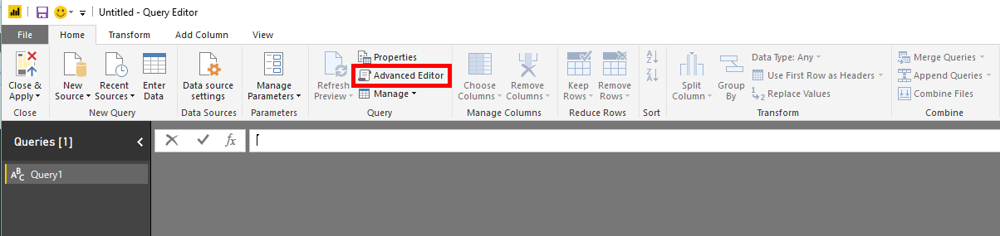

# <a name="create-custom-reports-using-power-bi"></a>Crear informes personalizados con Power BI

[!INCLUDE [Microsoft 365 Defender rebranding](../../includes/microsoft-defender.md)]

**Se aplica a:**
- [Microsoft Defender para punto de conexión](https://go.microsoft.com/fwlink/p/?linkid=2154037)
- [Microsoft 365 Defender](https://go.microsoft.com/fwlink/?linkid=2118804)


- ¿Desea experimentar Microsoft Defender para endpoint? [Regístrate para obtener una versión de prueba gratuita.](https://www.microsoft.com/microsoft-365/windows/microsoft-defender-atp?ocid=docs-wdatp-exposedapis-abovefoldlink) 

[!include[Microsoft Defender for Endpoint API URIs for US Government](../../includes/microsoft-defender-api-usgov.md)]

[!include[Improve request performance](../../includes/improve-request-performance.md)]

En esta sección aprenderá a crear un informe de Power BI sobre las API de Defender for Endpoint.

El primer ejemplo muestra cómo conectar Power BI a la API de búsqueda avanzada y el segundo ejemplo muestra una conexión a nuestras API de OData, como acciones de máquina o alertas.

## <a name="connect-power-bi-to-advanced-hunting-api"></a>Conectar Power BI a la API de búsqueda avanzada

- Abrir Microsoft Power BI

- Haga **clic en Obtener consulta en** blanco de  >  **datos**

    

- Haga **clic en Editor avanzado**

    

- Copie lo siguiente y péguelo en el editor:

```
    let 
        AdvancedHuntingQuery = "DeviceEvents | where ActionType contains 'Anti' | limit 20",

        HuntingUrl = "https://api.securitycenter.microsoft.com/api/advancedqueries",

        Response = Json.Document(Web.Contents(HuntingUrl, [Query=[key=AdvancedHuntingQuery]])),

        TypeMap = #table(
            { "Type", "PowerBiType" },
            {
                { "Double",   Double.Type },
                { "Int64",    Int64.Type },
                { "Int32",    Int32.Type },
                { "Int16",    Int16.Type },
                { "UInt64",   Number.Type },
                { "UInt32",   Number.Type },
                { "UInt16",   Number.Type },
                { "Byte",     Byte.Type },
                { "Single",   Single.Type },
                { "Decimal",  Decimal.Type },
                { "TimeSpan", Duration.Type },
                { "DateTime", DateTimeZone.Type },
                { "String",   Text.Type },
                { "Boolean",  Logical.Type },
                { "SByte",    Logical.Type },
                { "Guid",     Text.Type }
            }),

        Schema = Table.FromRecords(Response[Schema]),
        TypedSchema = Table.Join(Table.SelectColumns(Schema, {"Name", "Type"}), {"Type"}, TypeMap , {"Type"}),
        Results = Response[Results],
        Rows = Table.FromRecords(Results, Schema[Name]),
        Table = Table.TransformColumnTypes(Rows, Table.ToList(TypedSchema, (c) => {c{0}, c{2}}))

    in Table

```

- Haga clic **en Listo**

- Haga clic **en Editar credenciales**

    

- Seleccionar **Inicio de sesión de cuenta**  >  **organizativa**

    

- Escriba sus credenciales y espere a que se haya iniciado sesión

- Haga clic **en Conectar**

    

- Ahora los resultados de la consulta aparecerán como tabla y puedes empezar a crear visualizaciones encima de ella.

- Puedes duplicar esta tabla, cambiar el nombre y editar la consulta de búsqueda avanzada dentro para obtener los datos que quieras.

## <a name="connect-power-bi-to-odata-apis"></a>Conectar Power BI a las API de OData

- La única diferencia con respecto al ejemplo anterior es la consulta dentro del editor. 

- Copie lo siguiente y péguelo en el editor para extraer todas las **acciones de máquina** de su organización:

```
    let

        Query = "MachineActions",

        Source = OData.Feed("https://api.securitycenter.microsoft.com/api/" & Query, null, [Implementation="2.0", MoreColumns=true])
    in
        Source

```

- Puede hacer lo mismo para **Alerts** and **Machines**.

- También puede usar consultas OData para filtros de consultas, vea [Using OData Queries](exposed-apis-odata-samples.md)


## <a name="power-bi-dashboard-samples-in-github"></a>Ejemplos de panel de Power BI en GitHub
Para obtener más información, vea las plantillas [de informe de Power BI](https://github.com/microsoft/MicrosoftDefenderATP-PowerBI).

## <a name="sample-reports"></a>Informes de ejemplo
Vea los ejemplos de informes de Power BI de ATP de Microsoft Defender. Para obtener más información, vea [Examinar ejemplos de código](https://docs.microsoft.com/samples/browse/?products=mdatp).


## <a name="related-topic"></a>Tema relacionado
- [Defender para api de extremo](apis-intro.md)
- [API de Búsqueda avanzada de amenazas](run-advanced-query-api.md)
- [Uso de consultas de OData](exposed-apis-odata-samples.md)
