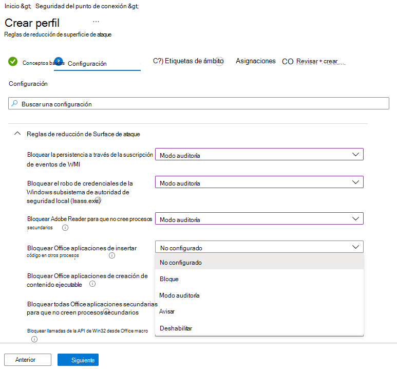
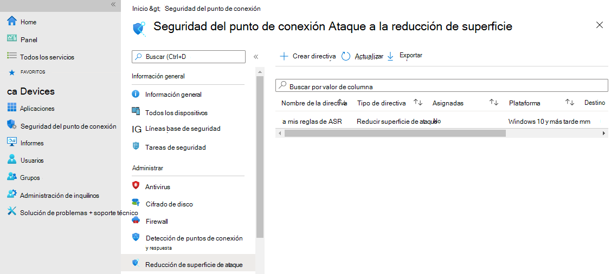
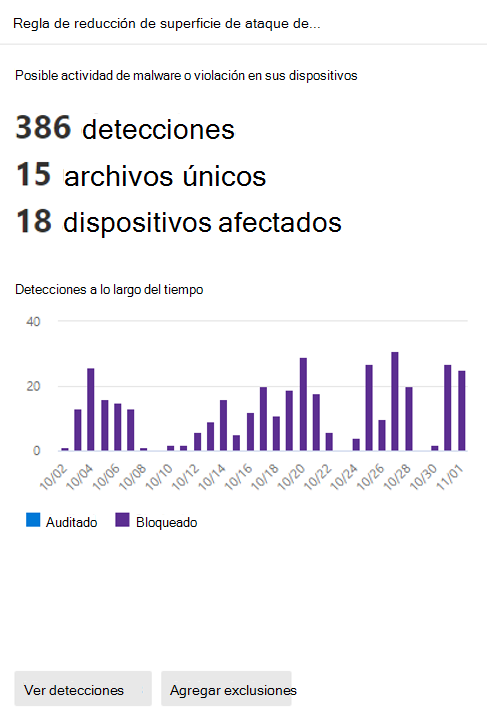
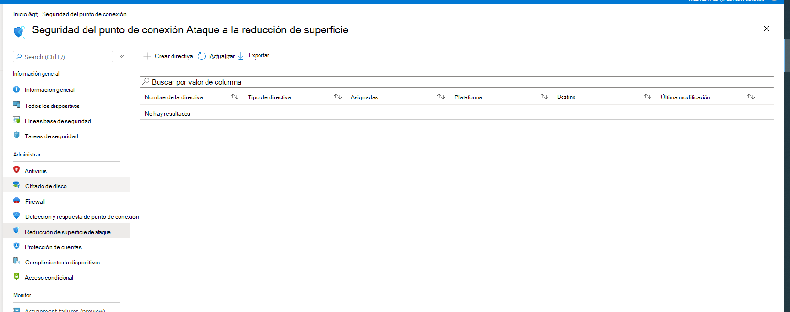

# <a name="step-2-test-asr-rules"></a>Paso 2: Probar reglas ASR

Probar las reglas de reducción de superficie de ataque (ASR) te ayuda a determinar si las reglas impedirán las operaciones de línea de negocio antes de habilitar cualquier regla. Al comenzar con un grupo pequeño y controlado, puede limitar las posibles interrupciones de trabajo a medida que expande la implementación en toda la organización.

Comienza la implementación de las reglas de reducción de superficie de ataque (ASR) con el anillo 1.

> [!div class="mx-imgBorder"]
> 

## <a name="step-1-test-asr-rules-using-audit"></a>Paso 1: Probar reglas ASR con Auditoría

Para comenzar la fase de prueba, activar las reglas ASR con las reglas establecidas en Auditar, empezando por los usuarios o dispositivos campeones en el anillo 1. Normalmente, la recomendación es habilitar todas las reglas (en Auditoría) para que pueda determinar qué reglas se desencadenan durante la fase de prueba. Tenga en cuenta que las reglas establecidas en Audit no suelen afectar a la funcionalidad de la entidad o entidades a las que se aplica la regla, pero sí generan eventos registrados para la evaluación; no hay ningún efecto en los usuarios finales.

### <a name="configure-asr-rules-using-mem"></a>Configurar reglas ASR con MEM

Puede usar Microsoft Endpoint Manager (MEM) Endpoint Security para configurar reglas ASR personalizadas.

1. Abrir [Microsoft Endpoint Manager de administración](https://endpoint.microsoft.com/#home)
2. Vaya a **Endpoint SecurityAttack** >  **surface reduction**.
3. Seleccione **Crear directiva**.
4. En **Plataforma**, selecciona **Windows 10 y posteriores**, y en **Perfil**, selecciona **Reglas de reducción de superficie de ataque**.
  
    > [!div class="mx-imgBorder"]
    > 

5. Haga clic en **Crear**.
6. En la **pestaña Conceptos básicos** del **panel Crear perfil** , en **Nombre** , agregue un nombre para la directiva. En **Descripción** , agregue una descripción para la directiva de reglas de ASR.
7. En la **pestaña Configuración,** en **Reglas de** reducción de superficie de ataque, establece todas las reglas en **Modo auditoría**.

    > [!div class="mx-imgBorder"]
    > 

    >[!Note]
    >Hay variaciones en algunas listas de modo de reglas ASR; _Blocked_ y _Enabled_ proporcionan la misma funcionalidad.

8. [Opcional] En el **panel Etiquetas de ámbito** , puede agregar información de etiquetas a dispositivos específicos. También puede usar etiquetas de ámbito y control de acceso basado en roles para asegurarse de que los administradores adecuados tienen el acceso y la visibilidad adecuados para los objetos de Intune adecuados. Más información: [Use el control de acceso basado en roles (RBAC) y las etiquetas de ámbito para la TI distribuida en Intune](/mem/intune/fundamentals/scope-tags).
9. En el **panel Asignaciones** , puedes implementar o "asignar" el perfil a los grupos de usuarios o dispositivos. Más información: [Asignar perfiles de dispositivo en Microsoft Intune](/mem/intune/configuration/device-profile-assign#exclude-groups-from-a-profile-assignment)
10. Revise la configuración en el **panel Revisar y** crear. Haga **clic en** Crear para aplicar las reglas.

   > [!div class="mx-imgBorder"]
   > 

La nueva directiva de reducción de superficie de ataque para reglas ASR se muestra en **Endpoint security | Reducción de superficie de ataque**.

   > [!div class="mx-imgBorder"]
   > 

## <a name="step-2-understand-the-attack-surface-reduction-rules-reporting-page-in-the-microsoft-365-defender-portal"></a>Paso 2: Comprender la página de informes de reglas de reducción de superficie de ataque en el portal de Microsoft 365 Defender ataque

La página de informes de reglas ASR se encuentra **en Microsoft 365 Defender de reducción** de superficie **portalReportsAttack** >  > . Esta página tiene tres pestañas:

- Detections
- Configuración
- Agregar exclusiones

### <a name="detections-tab"></a>Ficha Detecciones

Proporciona una escala de tiempo de 30 días de eventos bloqueados y de auditoría detectados.

> [!div class="mx-imgBorder"]
> 

El panel Reglas de reducción de Superficie de ataque proporciona información general sobre los eventos detectados por regla.

>[!Note]
>Hay algunas variaciones en los informes de reglas ASR. Microsoft está en el proceso de actualizar el comportamiento de los informes de reglas ASR para proporcionar una experiencia coherente.

> [!div class="mx-imgBorder"]
> 

Haga **clic en Ver detecciones** para abrir la **pestaña Detecciones** .

> [!div class="mx-imgBorder"]
> 

El **panel GroupBy** **y Filter** proporcionan las siguientes opciones:

**GroupBy devuelve** los resultados establecidos en los siguientes grupos:

- Sin agrupación
- Archivo detectado
- Auditoría o bloqueo
- Rule
- Aplicación de origen
- Device
- Usuario
- Publisher

> [!div class="mx-imgBorder"]
> 

**Filter** abre la **página Filter on rules** , que permite seleccionar los resultados solo en las reglas ASR seleccionadas:

> [!div class="mx-imgBorder"]
> 

>[!Note]
>Si tienes una licencia de Microsoft Microsoft 365 Security E5 o A5, Windows E5 o A5, el siguiente vínculo abre la pestaña Detecciones de superficie de [> > informes](https://security.microsoft.com/asr?viewid=detections) de Microsoft Defender 365.

### <a name="configuration-tab"></a>Ficha Configuración

Enumera, por equipo, el estado agregado de las reglas ASR: Off, Audit, Block.

> [!div class="mx-imgBorder"]
> 

En la pestaña Configuraciones, puedes comprobar , por dispositivo, qué reglas ASR están habilitadas y en qué modo, seleccionando el dispositivo para el que quieres revisar las reglas de ASR.

> [!div class="mx-imgBorder"]
> 

El **vínculo Introducción** abre el centro Microsoft Endpoint Manager administración, donde puede crear o modificar una directiva de protección de puntos de conexión para ASR:

> [!div class="mx-imgBorder"]
> 

En Endpoint security | Información general, seleccione **Reducción de superficie de ataque**:

> [!div class="mx-imgBorder"]
> 

El | Se abre el panel de reducción de superficie de ataque:

> [!div class="mx-imgBorder"]
> 

>[!Note]
>Si tienes una licencia de Microsoft Defender 365 E5 (o Windows E5?), este vínculo abrirá la pestaña Microsoft Defender 365 Reports > Attack surface reductions > [Configurations](https://security.microsoft.com/asr?viewid=configuration).

### <a name="add-exclusions"></a>Agregar exclusiones

Esta pestaña proporciona un método para seleccionar entidades detectadas (por ejemplo, falsos positivos) para la exclusión. Cuando se agregan exclusiones, el informe proporciona un resumen del impacto esperado.

>[!Note]
> Antivirus de Microsoft Defender las exclusiones de ANTIVIRUS se respetan con las reglas de ASR.  Consulte [Configurar y validar exclusiones en función de la extensión, el nombre o la ubicación](configure-extension-file-exclusions-microsoft-defender-antivirus.md).

> [!div class="mx-imgBorder"]
> 

> [!Note]
>Si tienes una licencia de Microsoft Defender 365 E5 (o Windows E5?), este vínculo abrirá la pestaña Reducciones de superficie de ataques > informes de Microsoft Defender 365 > [exclusiones](https://security.microsoft.com/asr?viewid=exclusions).

### <a name="use-powershell-as-an-alternative-method-to-enable-asr-rules"></a>Usar PowerShell como método alternativo para habilitar reglas ASR

Puede usar PowerShell (como alternativa a MEM) para habilitar las reglas ASR en modo auditoría para ver un registro de aplicaciones que se habrían bloqueado si la característica estaba totalmente habilitada. También puedes obtener una idea de la frecuencia con la que se dispararán las reglas durante el uso normal.

Para habilitar una regla de reducción de superficie de ataque en modo auditoría, use el siguiente cmdlet de PowerShell:

```PowerShell
Add-MpPreference -AttackSurfaceReductionRules_Ids <rule ID> -AttackSurfaceReductionRules_Actions AuditMode
```

Donde `<rule ID>` es un [valor GUID de la regla de reducción de superficie de ataque](attack-surface-reduction-rules-reference.md).

Para habilitar todas las reglas de reducción de superficie de ataque agregadas en modo auditoría, use el siguiente cmdlet de PowerShell:

```PowerShell
(Get-MpPreference).AttackSurfaceReductionRules_Ids | Foreach {Add-MpPreference -AttackSurfaceReductionRules_Ids $_ -AttackSurfaceReductionRules_Actions AuditMode}
```

> [!TIP]
> Si quieres auditar completamente cómo funcionarán las reglas de reducción de superficie de ataque en tu organización, tendrás que usar una herramienta de administración para implementar esta configuración en dispositivos de tus redes.

También puedes usar la directiva de grupo, Intune o los proveedores de servicios de configuración (CSP) de administración de dispositivos móviles (MDM) para configurar e implementar la configuración. Obtenga más información en el artículo [principal Reglas de reducción de superficie de](attack-surface-reduction.md) ataque.

## <a name="use-windows-event-viewer-review-as-an-alternative-to-the-attack-surface-reduction-rules-reporting-page-in-the-microsoft-365-defender-portal"></a>Usar Windows de visor de eventos como alternativa a la página de informes de reglas de reducción de superficie de ataque en el portal Microsoft 365 Defender eventos

Para revisar las aplicaciones que se habrían bloqueado, abra el Visor de eventos y filtre el identificador de evento 1121 en el registro de Microsoft-Windows-Windows Defender/Operativo. En la tabla siguiente se enumeran todos los eventos de protección de red.

Id. de evento | Descripción
-|-
 5007 | Evento cuando se cambia la configuración
 1121 | Evento cuando una regla de reducción de superficie de ataque se dispara en modo de bloqueo
 1122 | Evento cuando se desangre una regla de reducción de superficie de ataque en modo auditoría

## <a name="additional-topics-in-this-deployment-collection"></a>Temas adicionales de esta colección de implementación

[Requisitos previos de implementación de reglas ASR](attack-surface-reduction-rules-deployment.md)

[Paso 1: Planear la implementación de reglas ASR](attack-surface-reduction-rules-deployment-plan.md)

[Paso 3: Implementar reglas ASR](attack-surface-reduction-rules-deployment-implement.md)

[Paso 4: Operacionalizar reglas ASR](attack-surface-reduction-rules-deployment-operationalize.md)
