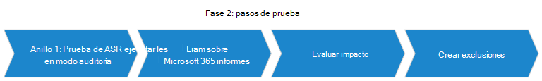
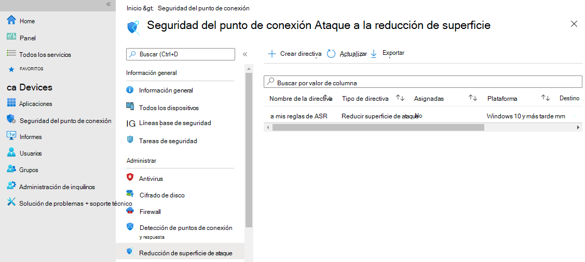
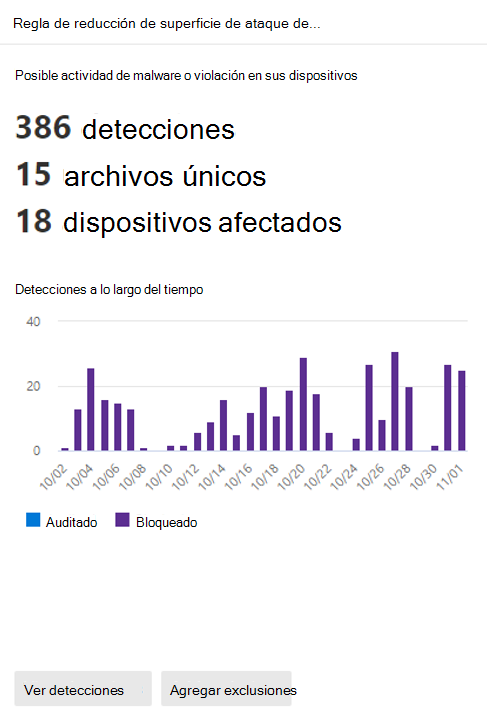
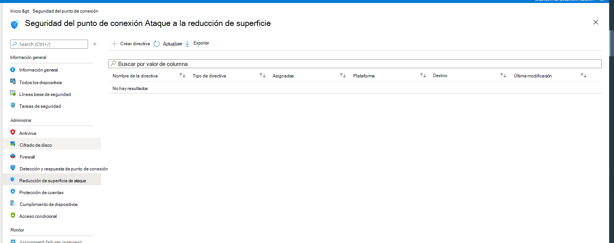

# Guía de implementación de reglas de reducción de superficie de ataque

## Antes de empezar

Las superficies de ataque son todos los lugares donde su organización es vulnerable a ciberamenazas y ataques. Las superficies de ataque de la organización incluyen todos los lugares donde un atacante podría poner en peligro los dispositivos o redes de la organización. Reducir la superficie de ataque significa proteger los dispositivos y la red de la organización, lo que deja a los atacantes con menos formas de atacar. La configuración de reglas de reducción de superficie de ataque (ASR), una de las muchas características de seguridad que se encuentran en Microsoft Defender para endpoint, puede ser útil.

Las reglas ASR se aplican a determinados comportamientos de software, como:

- Iniciar archivos ejecutables y scripts que intenten descargar o ejecutar archivos
- Ejecución de scripts ofuscados o sospechosos
- Comportamientos que las aplicaciones normalmente no se producen durante el trabajo diario normal

Al reducir las distintas superficies de ataque, puedes ayudar a evitar que los ataques se sucedan en primer lugar.

Durante la preparación inicial, es fundamental que comprenda las capacidades de los sistemas que va a poner en marcha. Comprender las capacidades le ayudará a determinar qué reglas de ASR son más importantes para proteger su organización.

>[!IMPORTANT]
>En esta guía se proporcionan imágenes y ejemplos que le ayudarán a decidir cómo configurar reglas ASR; es posible que estas imágenes y ejemplos no reflejen las mejores opciones de configuración para el entorno.

Antes de empezar, revisa [Información](overview-attack-surface-reduction.md)general sobre la reducción de superficie de ataque y Desmitificando las reglas de reducción de superficie de ataque: parte [1](https://techcommunity.microsoft.com/t5/microsoft-defender-for-endpoint/demystifying-attack-surface-reduction-rules-part-1/ba-p/1306420) para obtener información básica. Para comprender las áreas de cobertura y posible impacto, familiarícese con el conjunto actual de reglas ASR; vea [Reglas de reducción de superficie de ataque](attack-surface-reduction-rules.md).

Las reglas ASR son solo una funcionalidad de las capacidades de reducción de superficie de ataque dentro de Microsoft Defender para endpoint. En este documento se detallarán más detalles sobre cómo implementar las reglas ASR de forma eficaz para detener amenazas avanzadas como ransomware operado por humanos y otras amenazas.  

### Reglas por categoría

Como se describe en Usar reglas de reducción de superficie de ataque para evitar infecciones de [malware,](attack-surface-reduction.md)hay varias reglas de reducción de superficie de ataque dentro de MDE que puedes habilitar para proteger tu organización. A continuación se descompuestos las reglas por categoría:

 

| Amenazas polimórficas | Movimiento lateral & robo de credenciales | Reglas de aplicaciones de productividad |  Reglas de correo electrónico | Reglas de script | Reglas misc |
|:---|:---|:---|:---|:---|:---|
| Bloquear la ejecución de archivos ejecutables a menos que cumplan con una prevalencia (1000 máquinas), la antigüedad (24 horas) o los criterios de lista de confianza | Bloquear creaciones de proceso que se originen en comandos PSExec y WMI | Bloquear Office aplicaciones de creación de contenido ejecutable | Bloquear el contenido ejecutable del cliente de correo electrónico y el correo web | Bloquear código de JS/VBS/PS/macro ofuscado | Bloquear el uso indebido de controladores firmados vulnerables  explotados [[1](#fn1)]  |
| Bloquear procesos que no son de confianza y sin firma que se ejecutan desde USB | Bloquear el robo de credenciales del subsistema Windows autoridad de seguridad local (lsass.exe)  [[2](#fn1)]   | Bloquear Office aplicaciones para crear procesos secundarios |  Bloquear solo Office aplicaciones de comunicación para que no creen procesos secundarios | Bloquear JS/VBS para que no inicie contenido ejecutable descargado | |
| Usar protección avanzada contra ransomware | Bloquear la persistencia a través de la suscripción de eventos WMI | Bloquear Office aplicaciones para que no inyecten código en otros procesos | Bloquear Office aplicaciones de comunicación para que no creen procesos secundarios | | |
| | | Impedir que Adobe Reader cree procesos secundarios | | | |

(<a id="fn1">1</a>) Bloquear el uso indebido de controladores firmados _vulnerables_ explotados no está disponible actualmente en la seguridad de extremo de MEM. Puede configurar esta regla con [MEM OMA-URI](enable-attack-surface-reduction.md#mem).

(<a id="fn1">2</a>) Algunas reglas ASR generan un ruido considerable, pero no bloquean la funcionalidad. Por ejemplo, si estás actualizando Chrome; Chrome accederá a lsass.exe; las contraseñas se almacenan en lsass en el dispositivo. Sin embargo, Chrome no debe tener acceso a los dispositivos lsass.exe. Si habilita la regla para bloquear el acceso a lsass, generará una gran cantidad de eventos. Estos eventos son buenos eventos porque el proceso de actualización de software no debe tener acceso a lsass.exe. Habilitar esta regla impedirá que las actualizaciones de Chrome tengan acceso a lsass, pero no impedirá que Chrome se actualice; esto también ocurre con otras aplicaciones que hacen llamadas innecesarias a lsass.exe. La regla bloquear el acceso a _lsass_ bloqueará las llamadas innecesarias a lsass, pero no bloqueará la ejecución de la aplicación.

### Requisitos de infraestructura

Aunque son posibles varios métodos de implementación de reglas ASR, esta guía se basa en una infraestructura que consta de:

- Azure Active Directory
- Microsoft Endpoint Management (MEM)
- Windows 10 y Windows 11 dispositivos
- Microsoft Defender para endpoint E5 o Windows licencias de E5

Para aprovechar al máximo las reglas e informes de ASR, se recomienda usar una Microsoft 365 Defender E5 o Windows de E5 y A5. Más información: [Requisitos mínimos para Microsoft Defender para endpoint](minimum-requirements.md).

>[!Note]
>Existen varios métodos para configurar reglas ASR. Las reglas ASR se pueden configurar mediante: Microsoft Endpoint Manager (MEM), PowerShell, directiva de grupo, Microsoft System Center Configuration Manager (SCCM), MEM OMA-URI.
>Si usa una configuración de infraestructura diferente  a la que se muestra para los requisitos de infraestructura (arriba), puede obtener más información sobre cómo implementar reglas de reducción de superficie de ataque con otras configuraciones aquí: Habilitar reglas de reducción de superficie de [ataque](enable-attack-surface-reduction.md).  

### Dependencias de reglas ASR

Antivirus de Microsoft Defender debe estar habilitado y configurado como solución antivirus principal y debe estar en el siguiente modo:

- Solución antivirus/antimalware principal  
- Estado: modo activo

Antivirus de Microsoft Defender no debe estar en ninguno de los siguientes modos:

- Pasivo
- Modo pasivo con detección y respuesta de extremo (EDR) en modo de bloqueo
- Examen periódico limitado (LPS)
- Desactivado

Vea: [Protección entregada en la nube y Antivirus de Microsoft Defender](cloud-protection-microsoft-defender-antivirus.md).

### La protección en la nube (MAPS) debe estar habilitada

Antivirus de Microsoft Defender funciona sin problemas con los servicios en la nube de Microsoft. Estos servicios de protección en la nube, también denominados Servicio de protección avanzada de Microsoft (MAPS), mejoran la protección estándar en tiempo real, lo que podría proporcionar la mejor defensa antivirus. La protección en la nube es fundamental para evitar infracciones de malware y un componente crítico de las reglas ASR.
[Active la protección entregada en la nube en Antivirus de Microsoft Defender](enable-cloud-protection-microsoft-defender-antivirus.md).

### Antivirus de Microsoft Defender componentes deben ser versiones actuales

Las siguientes Antivirus de Microsoft Defender componentes no deben tener más de dos versiones anteriores a la versión más disponible actualmente:

- **Antivirus de Microsoft Defender versión de actualización de** la plataforma: Antivirus de Microsoft Defender se actualiza mensualmente.
- **Antivirus de Microsoft Defender versión del motor:** Antivirus de Microsoft Defender motor se actualiza mensualmente.
- **Antivirus de Microsoft Defender** inteligencia de seguridad: Microsoft actualiza continuamente la inteligencia de seguridad de Microsoft Defender (también conocida como, definición y firma) para abordar las amenazas más recientes y para refinar la lógica de detección.

Mantener Antivirus de Microsoft Defender versiones actuales ayuda a reducir las reglas ASR falsos resultados positivos y mejora las Antivirus de Microsoft Defender de detección. Para obtener más información sobre las versiones actuales y cómo actualizar los diferentes componentes de Antivirus de Microsoft Defender, [visite Antivirus de Microsoft Defender compatibilidad con la plataforma](manage-updates-baselines-microsoft-defender-antivirus.md).

## Fases de implementación de reglas ASR

Al igual que con cualquier implementación nueva a gran escala que podría afectar potencialmente a las operaciones de línea de negocio, es importante ser metódico en la planeación y la implementación. Debido a las potentes capacidades de las reglas ASR para evitar malware, es necesario planear e implementar cuidadosamente estas reglas para garantizar que funcionen mejor para los flujos de trabajo de clientes únicos. Para trabajar en su entorno, debe planear, probar, implementar y poner en funcionamiento cuidadosamente las reglas ASR.  

> [!div class="mx-imgBorder"]
> 

>[!Note]
>Para los clientes que usan un HIPS que no es de Microsoft y están haciendo la transición a Microsoft Defender para las reglas de reducción de superficie de ataque de extremo: Microsoft aconseja a los clientes que ejecuten su solución DE HIPS en paralelo con la implementación de reglas ASR hasta el momento en que cambies del modo Auditoría al modo de bloqueo. Ten en cuenta que debes contactar con el proveedor de antivirus de terceros para obtener recomendaciones de exclusión.  

## Fase 1: Planear

Empezar a probar las reglas asr implica empezar con la unidad de negocio adecuada. Querrá empezar con un pequeño grupo de personas en una unidad de negocio específica. Puede identificar algunos campeones de ASR dentro de una unidad de negocio determinada que puedan proporcionar un impacto real a las reglas de ASR y ayudarle a ajustar su implementación.

> [!div class="mx-imgBorder"]
> 

### Comience con la unidad de negocio adecuada

La forma de seleccionar la unidad de negocio para implementar la implementación de reglas ASR dependerá de factores como:

- Tamaño de la unidad de negocio
- Disponibilidad de campeones de reglas ASR  
- Distribución y uso de:
  - Software
  - Carpetas compartidas
  - Uso de scripts
  - Office macros
  - Otras entidades afectadas por reglas ASR

Según las necesidades de su empresa, puede decidir incluir varias unidades de negocio para obtener un amplio muestreo de software, carpetas compartidas, scripts, macros, etc. Por el contrario, puede decidir limitar el ámbito de la primera implementación de reglas ASR a una sola unidad de negocio y, a continuación, repetir todo el proceso de implementación de reglas ASR a las demás unidades de negocio, de una en una.

### Identificar campeones de reglas ASR

Los campeones de reglas ASR son miembros de la organización que ayudarán con el lanzamiento de las reglas ASR iniciales durante las fases preliminares de prueba e implementación. Los campeones suelen ser empleados que son más expertos técnicamente y que no se descarrila por interrupciones intermitentes del flujo de trabajo. La participación de los campeones continuará a lo largo de la expansión más amplia de la implementación de reglas ASR en su organización. Los campeones de reglas ASR serán los primeros en experimentar cada nivel del lanzamiento de reglas ASR.

Es importante proporcionar un canal de comentarios y respuesta para que los campeones de reglas ASR le alerte sobre las interrupciones de trabajo relacionadas con las reglas asr y reciba comunicaciones relacionadas con la implementación de reglas asr.

### Obtener inventario de aplicaciones de línea de negocio y comprender los procesos de la unidad de negocio

Tener una comprensión completa de las aplicaciones y los procesos por unidad empresarial que se usan en toda la organización es fundamental para una implementación correcta de reglas ASR. Además, es imperativo que comprenda cómo se usan esas aplicaciones en las distintas unidades de negocio de su organización.
Para empezar, debes obtener un inventario de las aplicaciones aprobadas para su uso en toda la organización. Puede usar herramientas como el Centro de administración Aplicaciones Microsoft 365 para ayudarle a realizar el inventario de aplicaciones de software. Vea: [Información general sobre el inventario en el centro Aplicaciones Microsoft 365 administración.](/deployoffice/admincenter/inventory)

### Definir responsabilidades y roles de equipo de informes y respuesta

La función y responsabilidades claramente articuladas de las personas responsables de supervisar y comunicar el estado y la actividad de las reglas ASR es una actividad principal del mantenimiento de ASR. Por lo tanto, es importante determinar:

- La persona o el equipo responsable de recopilar informes
- Cómo y con quién se comparten los informes
- Cómo se aborda la escalación para amenazas recién identificadas o bloqueos no deseados causados por reglas ASR

Los roles y responsabilidades típicos incluyen:

- Administradores de TI: implementar reglas ASR y administrar exclusiones. Trabajar con diferentes unidades de negocio en aplicaciones y procesos. Ensamblar y compartir informes a las partes interesadas
- Analista del Centro de operaciones de seguridad certificado (CSOC): responsable de invertir procesos bloqueados y de alta prioridad, para determinar si la amenaza es válida o no.
- Director de seguridad de la información (CISO): responsable de la posición general de seguridad y el estado de la organización

### Implantación de anillos

Para las grandes empresas, Microsoft recomienda implementar reglas ASR en "anillos". Los anillos son grupos de dispositivos que se representan visualmente como círculos concéntricos que se radian hacia fuera como anillos de árbol no superpuestos. Cuando el anillo más interno se implementa correctamente, puede pasar el siguiente anillo a la fase de prueba. Una evaluación exhaustiva de las unidades de negocio, los campeones de reglas de ASR, las aplicaciones y los procesos es imprescindible para definir los anillos.
En la mayoría de los casos, la organización habrá diseñado anillos de implementación para implementaciones por fases de Windows actualizaciones. Puede usar el diseño de anillo existente para implementar reglas ASR.
Vea: [Crear un plan de implementación para Windows](/windows/deployment/update/create-deployment-plan)

## Fase 2: Prueba

Comience la implementación de reglas ASR con el anillo 1.

> [!div class="mx-imgBorder"]
> 

### Paso 1: Probar reglas ASR con Auditoría

Para comenzar la fase de prueba, activar las reglas ASR con las reglas establecidas en Auditar, empezando por los usuarios o dispositivos campeones en el anillo 1. Normalmente, la recomendación es habilitar todas las reglas (en Auditoría) para que pueda determinar qué reglas se desencadenan durante la fase de prueba. Tenga en cuenta que las reglas establecidas en Audit no suelen afectar a la funcionalidad de la entidad o entidades a las que se aplica la regla, pero sí generan eventos registrados para la evaluación; no hay ningún efecto en los usuarios finales.

#### Configurar reglas ASR con MEM

Puede usar Microsoft Endpoint Manager (MEM) Endpoint Security para configurar reglas ASR personalizadas.

1. Abrir [Microsoft Endpoint Manager de administración](https://endpoint.microsoft.com/#home)
2. Vaya a **Endpoint Security** Attack  >  **surface reduction**.
3. Seleccione **Crear directiva**.
4. En **Plataforma**, seleccione **Windows 10 y posteriores** y, en **Perfil,** seleccione **Reglas de reducción de superficie de ataque.**
  
    > [!div class="mx-imgBorder"]
    > 

5. Haga clic en **Crear**.
6. En la **pestaña Conceptos básicos** del **panel Crear perfil,** en **Nombre,** agregue un nombre para la directiva. En **Descripción,** agregue una descripción para la directiva de reglas de ASR.
7. En la **pestaña Configuración,** en Reglas de reducción de **superficie** de ataque, establezca todas las reglas en **modo auditoría**.

    > [!div class="mx-imgBorder"]
    > 

    >[!Note]
    >Hay variaciones en algunas listas de modo de reglas ASR; _Blocked_ y _Enabled_ proporcionan la misma funcionalidad.

8. [Opcional] En el **panel Etiquetas de ámbito,** puede agregar información de etiquetas a dispositivos específicos. También puede usar etiquetas de ámbito y control de acceso basado en roles para asegurarse de que los administradores adecuados tienen el acceso y la visibilidad adecuados para los objetos de Intune adecuados. Más información: [Use el control de acceso basado en roles (RBAC)](/mem/intune/fundamentals/scope-tags)y las etiquetas de ámbito para ti distribuida en Intune .
9. En el **panel Asignaciones,** puedes implementar o "asignar" el perfil a los grupos de usuarios o dispositivos. Más información: [Asignar perfiles de dispositivo en Microsoft Intune](/mem/intune/configuration/device-profile-assign#exclude-groups-from-a-profile-assignment)
10. Revise la configuración en el **panel Revisar y** crear. Haga **clic en** Crear para aplicar las reglas.

   > [!div class="mx-imgBorder"]
   > 

La nueva directiva de reducción de superficie de ataque para reglas ASR se muestra en **Endpoint security | Reducción de superficie de ataque**.

   > [!div class="mx-imgBorder"]
   > 

### Paso 2: Comprender la página de informes de reglas de reducción de superficie de ataque en el portal de Microsoft 365 Defender ataque

La página de informes de reglas ASR se encuentra **en Microsoft 365 Defender portal**  >  **Reports**  >  **Attack surface reduction rules**. Esta página tiene tres pestañas:

- Detections
- Configuración
- Agregar exclusiones

#### Ficha Detecciones

Proporciona una escala de tiempo de 30 días de eventos bloqueados y de auditoría detectados.

> [!div class="mx-imgBorder"]
> 

El panel Reglas de reducción de Superficie de ataque proporciona información general sobre los eventos detectados por regla.

>[!Note]
>Hay algunas variaciones en los informes de reglas ASR. Microsoft está en el proceso de actualizar el comportamiento de los informes de reglas ASR para proporcionar una experiencia coherente.

> [!div class="mx-imgBorder"]
> 

Haga **clic en Ver detecciones** para abrir la pestaña **Detecciones.**

> [!div class="mx-imgBorder"]
> 

El **panel GroupBy** **y Filter** proporcionan las siguientes opciones:

GroupBy **devuelve** los resultados establecidos en los siguientes grupos:

- Sin agrupación
- Archivo detectado
- Auditoría o bloqueo
- Rule
- Aplicación de origen
- Device
- Usuario
- Publisher

> [!div class="mx-imgBorder"]
> 

**Filter** abre la **página Filter on rules,** que permite seleccionar los resultados solo en las reglas ASR seleccionadas:

> [!div class="mx-imgBorder"]
> 

>[!Note]
>Si tienes una licencia de Microsoft Microsoft 365 Security E5 o A5, Windows E5 o A5, el siguiente vínculo abre la pestaña Detecciones de superficie de > [>](https://security.microsoft.com/asr?viewid=detections) informes de Microsoft Defender 365.

#### Ficha Configuración

Enumera, por equipo, el estado agregado de las reglas ASR: Off, Audit, Block.

> [!div class="mx-imgBorder"]
> 

En la pestaña Configuraciones, puedes comprobar , por dispositivo, qué reglas ASR están habilitadas y en qué modo, seleccionando el dispositivo para el que quieres revisar las reglas de ASR.

> [!div class="mx-imgBorder"]
> 

El **vínculo Introducción** abre el centro Microsoft Endpoint Manager administración, donde puede crear o modificar una directiva de protección de puntos de conexión para ASR:

> [!div class="mx-imgBorder"]
> 

En Endpoint security | Información general, seleccione **Reducción de superficie de ataque:**

> [!div class="mx-imgBorder"]
> 

El | Se abre el panel de reducción de superficie de ataque:

> [!div class="mx-imgBorder"]
> 

>[!Note]
>Si tienes una licencia de Microsoft Defender 365 E5 (o Windows E5?), este vínculo abrirá la pestaña Microsoft Defender 365 Reports > Attack surface reductions > [Configurations.](https://security.microsoft.com/asr?viewid=configuration)

#### Agregar exclusiones

Esta pestaña proporciona un método para seleccionar entidades detectadas (por ejemplo, falsos positivos) para la exclusión. Cuando se agregan exclusiones, el informe proporciona un resumen del impacto esperado.

>[!Note]
> Antivirus de Microsoft Defender las exclusiones de ANTIVIRUS se respetan con las reglas de ASR.  Vea [Configure and validate exclusions based on extension, name, or location](configure-extension-file-exclusions-microsoft-defender-antivirus.md).

> [!div class="mx-imgBorder"]
> 

> [!Note]
>Si tienes una licencia de Microsoft Defender 365 E5 (o Windows E5?), este vínculo abrirá la pestaña Reducciones de superficie de > informes de Microsoft Defender 365 > [exclusiones.](https://security.microsoft.com/asr?viewid=exclusions)

### Paso 3: Evaluar impacto

#### Revisar

Use la página de informes en el portal de Microsoft 365 Defender para ver qué reglas ASR han afectado al proceso de unidad de negocio. Incluye comentarios de los campeones de ASR como parte de este proceso. Revise el informe de auditoría para determinar qué reglas tienen más eventos desencadenados o desencadenados y cuáles son los que tienen menos.

Dado que las reglas ASR tienen como destino una amplia variedad de componentes y se llamará a esos componentes a intervalos variables, es difícil predecir cuánto tiempo se llevará obtener un muestreo útil de eventos desencadenados por reglas ASR en los anillos de las organizaciones; Sin embargo, Microsoft sugiere un mínimo de cuatro semanas. Por ejemplo, algunas reglas ASR para aplicaciones Microsoft Office pueden desencadenarse antes y con más frecuencia que la regla ASR para "Usar protección avanzada contra ransomware". Del mismo modo, es probable que cada anillo use aplicaciones y otros componentes que estén sujetos a reglas ASR de forma diferente y con una frecuencia diferente. Debe determinar cuándo se completan las pruebas en función de los resultados de la organización. Para obtener una mejor comprensión, vea ¿Cuánto tiempo debo probar una regla ASR en modo [auditoría antes de habilitarla?](attack-surface-reduction-faq.yml#how-long-should-i-test-an-asr-rule-in-audit-mode-before-enabling-it-).

#### Crear exclusiones

En muchos casos, una organización tiene archivos o carpetas de archivos, por ejemplo, que se sabe que son seguros y que pueden contener aspectos que desencadenarían una regla ASR; el modo de auditoría revelará dichos archivos y carpetas. Por ejemplo, la organización puede tener una colección de documentos de Word o Excel que tienen macros habilitadas para fines específicos; estas macros pueden desencadenar una regla ASR. En tales casos, si el modo de auditoría identifica estos archivos, desea excluir estos archivos o carpetas para evitar que se capturan mediante reglas ASR. Vea [Excluir archivos y carpetas](enable-attack-surface-reduction.md#exclude-files-and-folders-from-asr-rules)

>[!Note]
>Tenga en cuenta que Antivirus de Microsoft Defender las exclusiones de ANTIVIRUS se respetan con las reglas de ASR. Vea [Configure and validate exclusions based on extension, name, or location](configure-extension-file-exclusions-microsoft-defender-antivirus.md).

Si determina que una regla afectará ampliamente a las operaciones de línea de negocio de forma perjudicial, puede dejar la regla en auditoría para que pueda seguir capturando o puede deshabilitarla por completo. Las exclusiones se habilitan fácilmente **en Microsoft 365 Defender**  >  **de reducción** de superficie de ataque de  >  **informes.** Simplemente seleccione la entidad o entidades para las que desea crear una exclusión.

Las exclusiones se habilitan fácilmente **en Microsoft 365 Defender**  >  **de reducción** de superficie de ataque de  >  **informes.** Simplemente seleccione la entidad o entidades para las que desea crear una exclusión.

> [!div class="mx-imgBorder"]
> [ de ASR ](images/asr-defender365-06d.png#lightbox)

#### Crear exclusiones después de la revisión

En muchos casos, una organización tiene archivos o carpetas de archivos, por ejemplo, que se sabe que son seguros y que pueden contener aspectos que desencadenarían una regla ASR; el modo de auditoría revelará dichos archivos y carpetas. Por ejemplo, la organización puede tener una colección de documentos de Word o Excel que tienen macros habilitadas para fines específicos; estas macros pueden desencadenar una regla ASR. En tales casos, si el modo de auditoría identifica estos archivos, desea excluir estos archivos o carpetas para evitar que se capturan mediante reglas ASR. Consulte [Excluir archivos y carpetas](enable-attack-surface-reduction.md#exclude-files-and-folders-from-asr-rules).

>[!Note]
>Tenga en cuenta que Antivirus de Microsoft Defender las exclusiones de ANTIVIRUS se respetan con las reglas de ASR. Vea [Configure and validate exclusions based on extension, name, or location](configure-extension-file-exclusions-microsoft-defender-antivirus.md).

## Fase 3: Implementar

La fase de implementación mueve el anillo de las pruebas al estado funcional.

> [!div class="mx-imgBorder"]
> 

### Paso 1: Transición de reglas ASR de auditoría a bloqueo

1. Una vez determinadas todas las exclusiones durante el modo de auditoría, empieza a establecer algunas reglas ASR en modo "bloquear", empezando por la regla que tiene el menor número de eventos desencadenados. Vea " [Habilitar reglas de reducción de superficie de ataque](enable-attack-surface-reduction.md).
2. Revise la página de informes en el portal de Microsoft 365 Defender web; vea Informe de protección contra amenazas [en Microsoft Defender para endpoint](threat-protection-reports.md). Revisa también los comentarios de tus campeones de ASR.
3. Refine las exclusiones o cree nuevas exclusiones según se determine necesario.
4. Vuelva a cambiar las reglas problemáticas a Auditoría.

  >[!Note]
  >Para las reglas problemáticas (reglas que crean demasiado ruido), es mejor crear exclusiones que desactivar las reglas o volver a auditar. Tendrá que determinar qué es lo mejor para su entorno.

  >[!Tip]
  >Cuando esté disponible, aproveche la configuración del modo de advertencia en las reglas para limitar las interrupciones. Habilitar reglas ASR en modo de advertencia permite capturar eventos desencadenados y ver sus posibles interrupciones, sin bloquear realmente el acceso del usuario final. Más información: [Modo de advertencia para usuarios.](attack-surface-reduction.md#warn-mode-for-users)

#### ¿Cómo funciona el modo de advertencia?

El modo de advertencia es efectivamente una instrucción Block, pero con la opción de que el usuario "desbloquee" las ejecuciones posteriores del flujo o aplicación dados. El modo de advertencia desbloquea en una combinación de dispositivo, usuario, archivo y proceso. La información del modo de advertencia se almacena localmente y tiene una duración de 24 horas.

### Paso 2: Expandir la implementación para que suene n + 1

Cuando esté seguro de haber configurado correctamente las reglas de ASR para el anillo 1, puede ampliar el ámbito de la implementación al siguiente anillo (anillo n + 1).

El proceso de implementación, pasos del 1 al 3, es esencialmente el mismo para cada anillo posterior:

1. Reglas de prueba en Auditoría
2. Revisar eventos de auditoría desencadenados por ASR en el portal de Microsoft 365 Defender web
3. Crear exclusiones
4. Revisión: refinar, agregar o quitar exclusiones según sea necesario
5. Establecer reglas en "bloquear"
6. Revise la página de informes en el Microsoft 365 Defender web.
7. Crear exclusiones.
8. Deshabilite las reglas problemáticas o vuelva a cambiarlas a Auditoría.

## Fase 4: Operationalize

Una vez que haya implementado completamente las reglas de ASR en su organización, es fundamental que su organización tenga procesos para supervisar y responder a las actividades relacionadas con ASR.

### Administrar falsos positivos

Los falsos positivos o negativos pueden producirse con cualquier solución de protección contra amenazas, incluido Microsoft Defender para endpoint. En las soluciones de protección de puntos de conexión, los falsos positivos son casos en los que una entidad (como un archivo o proceso) se detecta e identifica como malintencionada, aunque la entidad no es realmente una amenaza. En cambio, un falso negativo es una entidad que no se detectó como una amenaza, pero que en realidad es malintencionada.
Para obtener información adicional sobre cómo atender a falsos positivos y falsos negativos, vea: [Address false positives/negatives in Microsoft Defender for Endpoint](defender-endpoint-false-positives-negatives.md)

### Mantenerse al día con los informes

La revisión periódica y coherente de los informes es un aspecto esencial para mantener la implementación de reglas ASR y mantenerse al tanto de las amenazas recién emergentes. Su organización debe tener revisiones programadas de los eventos de reglas ASR en una cadencia que se mantenga actualizada con los eventos notificados por reglas ASR. Según el tamaño de la organización, puede ser una supervisión diaria, por horas o continua.

### Búsqueda

Una de las características más eficaces y más interesantes de [Microsoft 365 Defender](https://securitycenter.microsoft.com) es la búsqueda avanzada. Si no está familiarizado con la búsqueda avanzada, consulte la documentación: Búsqueda proactiva de [amenazas con búsqueda avanzada.](/windows/security/threat-protection/microsoft-defender-atp/advanced-hunting-overview)

> [!div class="mx-imgBorder"]
> 

La búsqueda avanzada es una herramienta de búsqueda de amenazas basada en consultas (Kusto Query Language) que permite explorar hasta 30 días de los datos capturados (sin procesar), que Microsoft Defender ATP Endpoint Detection and Response (EDR) recopila de todas las máquinas. A través de la búsqueda avanzada, puede inspeccionar de forma proactiva los eventos con el fin de localizar indicadores y entidades interesantes. El acceso flexible a los datos facilita la búsqueda sin restricciones de las amenazas conocidas y potenciales.

Mediante la búsqueda avanzada, es posible extraer información de reglas ASR, crear informes y obtener información detallada sobre el contexto de un evento de bloqueo o auditoría de regla ASR determinado.

Puede consultar eventos de reglas ASR desde la tabla DeviceEvents en la sección de búsqueda avanzada del portal Microsoft 365 Defender web. Por ejemplo, una consulta sencilla, como la siguiente, puede informar de todos los eventos que tienen reglas ASR como origen de datos durante los últimos 30 días y los resumirá mediante el recuento ActionType, que en este caso será el nombre de código real de la regla ASR.

> [!div class="mx-imgBorder"]
> 

> [!div class="mx-imgBorder"]
> 

Lo anterior muestra que se registraron 187 eventos para AsrLsassCredentialTheft (102 para Bloqueados y 85 para Auditados), 2 eventos para AsrOfficeChildProcess (1 para Auditados y 1 para Block) y 8 para AsrPsexecWmiChildProcessAudited.

Si desea centrarse en la regla AsrOfficeChildProcess y obtener detalles sobre los archivos y procesos reales implicados, cambie el filtro de ActionType y reemplace la línea de resumen por una proyección de los campos deseados (en este caso son DeviceName, FileName, FolderPath, etc.).

> [!div class="mx-imgBorder"]
> 

> [!div class="mx-imgBorder"]
> 

La verdadera ventaja de la búsqueda avanzada es que puede dar forma a las consultas a su gusto, de modo que pueda ver la historia exacta de lo que estaba sucediendo, independientemente de si desea identificar algo en una máquina individual o si desea extraer información de todo el entorno.

Para obtener información adicional acerca de las opciones de búsqueda adicionales, vea [Desmitificando](https://techcommunity.microsoft.com/t5/microsoft-defender-for-endpoint/demystifying-attack-surface-reduction-rules-part-3/ba-p/1360968)reglas de reducción de superficie de ataque - Parte 3 .

## Referencia

### Blogs

[Reglas de reducción de superficie de ataque desmitificantes: parte 1](https://techcommunity.microsoft.com/t5/microsoft-defender-for-endpoint/demystifying-attack-surface-reduction-rules-part-1/ba-p/1306420)

[Desmitificando reglas de reducción de superficie de ataque- Parte 2](https://techcommunity.microsoft.com/t5/microsoft-defender-for-endpoint/demystifying-attack-surface-reduction-rules-part-2/ba-p/1326565)

[Desmitificando reglas de reducción de superficie de ataque- Parte 3](https://techcommunity.microsoft.com/t5/microsoft-defender-for-endpoint/demystifying-attack-surface-reduction-rules-part-3/ba-p/1360968)

[Desmitificando reglas de reducción de superficie de ataque- Parte 4](https://techcommunity.microsoft.com/t5/microsoft-defender-for-endpoint/demystifying-attack-surface-reduction-rules-part-4/ba-p/1384425)

### Colección ASR

[Introducción a la reducción de la superficie expuesta a ataques](overview-attack-surface-reduction.md)

[Usar reglas de reducción de la superficie expuesta a ataques para evitar la infección de malware](attack-surface-reduction.md)

[Habilitar las reglas de la reducción de superficie expuesta a ataques](enable-attack-surface-reduction.md)

[Reglas de la reducción de la superficie expuesta a ataques](attack-surface-reduction-rules.md)

[Preguntas más frecuentes sobre la reducción de la superficie expuesta a ataques](attack-surface-reduction-faq.yml)

### Microsoft Defender

[Abordar falsos positivos/negativos en Microsoft Defender para punto de conexión](defender-endpoint-false-positives-negatives.md)

[Protección proporcionada en la nube y Antivirus de Windows Defender](cloud-protection-microsoft-defender-antivirus.md)

[Activar la protección entregada en la nube en Antivirus de Microsoft Defender](enable-cloud-protection-microsoft-defender-antivirus.md)

[Configurar y validar exclusiones en función de la extensión, el nombre o la ubicación](configure-extension-file-exclusions-microsoft-defender-antivirus.md)

[Antivirus de Microsoft Defender de plataforma](manage-updates-baselines-microsoft-defender-antivirus.md)

[Información general sobre el inventario en el centro Aplicaciones Microsoft 365 administración](/deployoffice/admincenter/inventory)

[Crear un plan de implementación para Windows](/windows/deployment/update/create-deployment-plan)

[Usar el control de acceso basado en roles (RBAC) y las etiquetas de ámbito para la TI distribuida en Intune](/mem/intune/fundamentals/scope-tags)

[Asignar perfiles de dispositivo en Microsoft Intune](/mem/intune/configuration/device-profile-assign#exclude-groups-from-a-profile-assignment)

### Sitios de administración

[Centro de administración de Microsoft Endpoint Manager](https://endpoint.microsoft.com/#home)

[Reducción de la superficie expuesta a ataques](https://security.microsoft.com/asr?viewid=detections)

[Reglas de ASR Configuraciones](https://security.microsoft.com/asr?viewid=configuration)

[Exclusiones de reglas ASR](https://security.microsoft.com/asr?viewid=exclusions)
