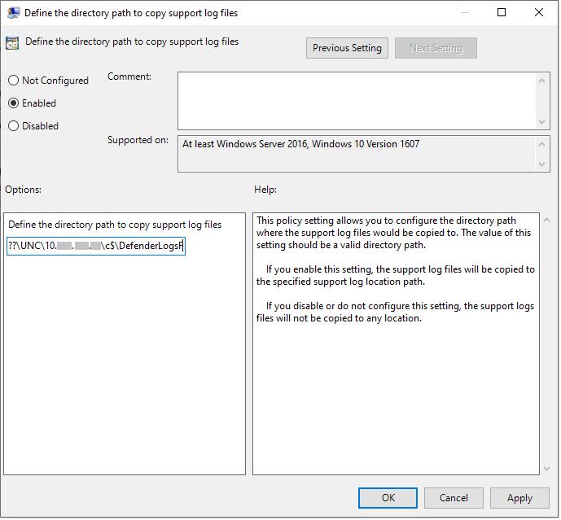

# <a name="collect-microsoft-defender-av-diagnostic-data"></a>Recopilar datos de diagnóstico antivirus de Microsoft Defender

[!INCLUDE [Microsoft 365 Defender rebranding](../../includes/microsoft-defender.md)]


**Se aplica a:**

- [Microsoft Defender para punto de conexión](/microsoft-365/security/defender-endpoint/)

En este artículo se describe cómo recopilar datos de diagnóstico que pueden usar los equipos de soporte técnico e ingeniería de Microsoft para ayudar a solucionar problemas que puedan surgir al usar el antivirus de Microsoft Defender.

> [!NOTE]
> Como parte del proceso de investigación o respuesta, puedes recopilar un paquete de investigación desde un dispositivo. Este es el modo: [Recopilar paquete de investigación de dispositivos](/windows/security/threat-protection/microsoft-defender-atp/respond-machine-alerts#collect-investigation-package-from-devices).

En al menos dos dispositivos que están experimentando el mismo problema, obtenga el archivo de diagnóstico .cab siguiendo los pasos siguientes:

1. Abra una versión de nivel de administrador del símbolo del sistema de la siguiente manera:

    a. Abra el **menú** Inicio.

    b. Escriba **cmd**. Haga clic con el botón secundario en **el símbolo del sistema** y haga clic en Ejecutar como **administrador.**

    c. Escriba las credenciales de administrador o apruebe el mensaje.

2. Vaya al directorio de Microsoft Defender. El valor predeterminado es `C:\Program Files\Windows Defender`

> [!NOTE]
> Si está ejecutando una versión actualizada [de Microsoft Defender Platform,](https://support.microsoft.com/help/4052623/update-for-microsoft-defender-antimalware-platform)ejecute `MpCmdRun` desde la siguiente ubicación: `C:\ProgramData\Microsoft\Windows Defender\Platform\<version>` .

3. Escriba el siguiente comando y, a continuación, presione **ENTRAR**  

    ```Dos
    mpcmdrun.exe -GetFiles
    ```
  
4. Se generará un archivo .cab que contenga varios registros de diagnóstico. La ubicación del archivo se especificará en la salida del símbolo del sistema. De forma predeterminada, la ubicación es `C:\ProgramData\Microsoft\Microsoft Defender\Support\MpSupportFiles.cab` .

> [!NOTE]
> Para redirigir el archivo cab a una ruta de acceso o recurso compartido UNC diferente, use el siguiente comando: `mpcmdrun.exe -GetFiles -SupportLogLocation <path>`  <br/>Para obtener más información, vea [Redirect diagnostic data to a UNC share](#redirect-diagnostic-data-to-a-unc-share).

5. Copie estos archivos .cab en una ubicación a la que pueda tener acceso el soporte técnico de Microsoft. Un ejemplo podría ser una carpeta de OneDrive protegida con contraseña que puede compartir con nosotros.

> [!NOTE]
>Si tiene un problema con el cumplimiento <a href="mailto:ucsupport@microsoft.com?subject=WDAV assessment issue&body=I%20am%20encountering%20the%20following%20issue%20when%20using%20Windows%20Defender%20AV%20in%20Update%20Compliance%3a%20%0d%0aI%20have%20provided%20at%20least%202%20support%20.cab%20files%20at%20the%20following%20location%3a%20%3Caccessible%20share%2c%20including%20access%20details%20such%20as%20password%3E%0d%0aMy%20OMS%20workspace%20ID%20is%3a%20%0d%0aPlease%20contact%20me%20at%3a"></a>de la actualización, envíe un correo electrónico con la plantilla de correo electrónico de soporte técnico actualizar cumplimiento y rellene la plantilla con la siguiente información:
>```
> I am encountering the following issue when using Microsoft Defender Antivirus in Update Compliance:
> I have provided at least 2 support .cab files at the following location:  
> <accessible share, including access details such as password>
>
>    My OMS workspace ID is:
>
>    Please contact me at:

## <a name="redirect-diagnostic-data-to-a-unc-share"></a>Redirigir datos de diagnóstico a un recurso compartido UNC
Para recopilar datos de diagnóstico en un repositorio central, puede especificar el parámetro SupportLogLocation.

```Dos
mpcmdrun.exe -GetFiles -SupportLogLocation <path>
```

Copia los datos de diagnóstico en la ruta de acceso especificada. Si no se especifica la ruta de acceso, los datos de diagnóstico se copiarán en la ubicación especificada en la configuración de ubicación del registro de soporte técnico.

Cuando se usa el parámetro SupportLogLocation, se creará una estructura de carpetas como la siguiente en la ruta de destino:

```Dos
<path>\<MMDD>\MpSupport-<hostname>-<HHMM>.cab
```

| campo  | Descripción   |
|:----|:----|
| path | Ruta de acceso especificada en la línea de comandos o recuperada de la configuración
| MMDD | Mes y día en que se recopilaron los datos de diagnóstico (por ejemplo, 0530)
| nombre de host | Nombre de host del dispositivo en el que se recopilaron los datos de diagnóstico
| HHMM | Horas y minutos cuando se recopilaron los datos de diagnóstico (por ejemplo, 1422)

> [!NOTE]
> Al usar un recurso compartido de archivos, asegúrese de que la cuenta usada para recopilar el paquete de diagnóstico tenga acceso de escritura al recurso compartido.  

## <a name="specify-location-where-diagnostic-data-is-created"></a>Especificar la ubicación donde se crean los datos de diagnóstico

También puede especificar dónde se creará el archivo .cab de diagnóstico mediante un objeto de directiva de grupo (GPO). 

1. Abra el Editor de directivas de grupo local y busque el GPO SupportLogLocation en: `HKEY_LOCAL_MACHINE\SOFTWARE\Policies\Microsoft\Windows Defender\SupportLogLocation`
   
1. Seleccione **Definir la ruta de acceso del directorio para copiar los archivos de registro de soporte técnico.**

      
        
       
3. Dentro del editor de directivas, seleccione **Habilitado**.
       
4. Especifique la ruta de acceso del directorio en la que desea copiar los archivos de registro de soporte técnico en el **campo** Opciones.
      
5. Seleccione **Aceptar** o **Aplicar**.

## <a name="see-also"></a>Vea también

- [Solucionar problemas de informes de Antivirus de Microsoft Defender](troubleshoot-reporting.md)