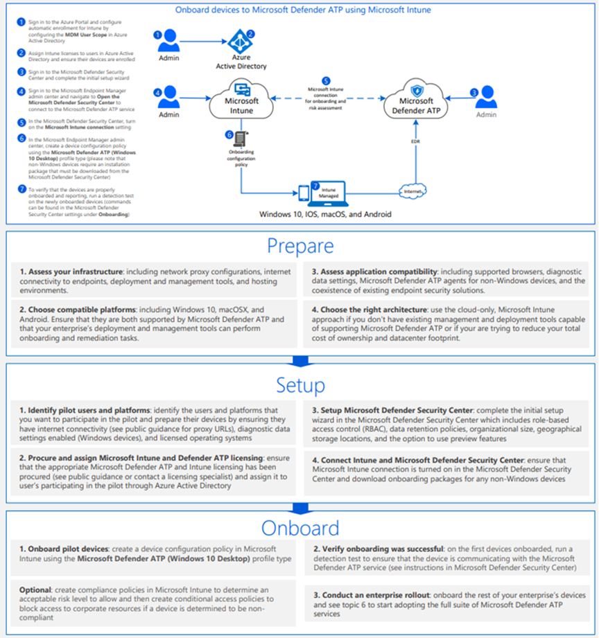

# Incorporar los dispositivos Windows 10 con las herramientas de administración de dispositivos móviles

[!INCLUDE [Microsoft 365 Defender rebranding](../../includes/microsoft-defender.md)]

**Se aplica a:**
- [Microsoft Defender para punto de conexión](https://go.microsoft.com/fwlink/p/?linkid=2154037)
- [Microsoft 365 Defender](https://go.microsoft.com/fwlink/?linkid=2118804)

>¿Desea experimentar Defender for Endpoint? [Regístrate para obtener una versión de prueba gratuita.](https://www.microsoft.com/microsoft-365/windows/microsoft-defender-atp?ocid=docs-wdatp-configureendpointsmdm-abovefoldlink)

Puedes usar soluciones de administración de dispositivos móviles (MDM) para configurar dispositivos. Defender for Endpoint admite MDM proporcionando OMA-URIs para crear directivas para administrar dispositivos.

Para obtener más información sobre cómo usar Defender para CSP de extremo, consulta [WindowsAdvancedThreatProtection CSP](https://msdn.microsoft.com/library/windows/hardware/mt723296(v=vs.85).aspx) y [WindowsAdvancedThreatProtection DDF file](https://msdn.microsoft.com/library/windows/hardware/mt723297(v=vs.85).aspx).

## Antes de empezar
Si estás usando Microsoft Intune, debes tener el dispositivo MDM inscrito. De lo contrario, la configuración no se aplicará correctamente. 

Para obtener más información sobre cómo habilitar MDM con Microsoft Intune, consulta [Inscripción de dispositivos (Microsoft Intune).](/mem/intune/enrollment/device-enrollment)

## Incorporar dispositivos con Microsoft Intune

Consulte el [ARCHIVO PDF](https://github.com/MicrosoftDocs/microsoft-365-docs/raw/public/microsoft-365/security/defender-endpoint/downloads/mdatp-deployment-strategy.pdf) [Visio](https://github.com/MicrosoftDocs/microsoft-365-docs/raw/public/microsoft-365/security/defender-endpoint/downloads/mdatp-deployment-strategy.vsdx) para ver las distintas rutas de acceso en la implementación de Defender para endpoint. 

Siga las instrucciones de [Intune](/intune/advanced-threat-protection).

Para obtener más información sobre cómo usar Defender para CSP de extremo, consulta [WindowsAdvancedThreatProtection CSP](https://msdn.microsoft.com/library/windows/hardware/mt723296(v=vs.85).aspx) y [WindowsAdvancedThreatProtection DDF file](https://msdn.microsoft.com/library/windows/hardware/mt723297(v=vs.85).aspx).

> [!NOTE]
> - La **directiva Estado de mantenimiento para dispositivos incorporados** usa propiedades de solo lectura y no se puede corregir.
> - La configuración de la frecuencia de informes de datos de diagnóstico solo está disponible para dispositivos Windows 10, versión 1703.

>[!TIP]
> Después de incorporar el dispositivo, puedes elegir ejecutar una prueba de detección para comprobar que un dispositivo está correctamente incorporado al servicio. Para obtener más información, consulta [Ejecutar una prueba de detección en un dispositivo de Microsoft Defender para endpoint](run-detection-test.md)recién incorporado.

Consulte el [PDF](https://github.com/MicrosoftDocs/microsoft-365-docs/raw/public/microsoft-365/security/defender-endpoint/downloads/mdatp-deployment-strategy.pdf) o [Visio](https://github.com/MicrosoftDocs/microsoft-365-docs/raw/public/microsoft-365/security/defender-endpoint/downloads/mdatp-deployment-strategy.vsdx) para ver las distintas rutas de acceso para implementar Microsoft Defender para endpoint.

## Offboard y supervisar dispositivos con herramientas de administración de dispositivos móviles
Por motivos de seguridad, el paquete usado para dispositivos offboard expirará 30 días después de la fecha en que se descargó. Se rechazarán los paquetes de offboarding expirados enviados a un dispositivo. Al descargar un paquete de offboarding, se le notificará la fecha de expiración de los paquetes y también se incluirá en el nombre del paquete.

> [!NOTE]
> Las directivas de incorporación y de incorporación no deben implementarse en el mismo dispositivo al mismo tiempo, de lo contrario esto provocará colisiones impredecibles.

1. Obtener el paquete de offboarding desde [Microsoft 365 Defender portal](https://security.microsoft.com/):

   1. En el panel de navegación, **seleccione Configuración**  >  **Endpoints** Administración  >  **de dispositivos**  >  **Offboarding**.

   1. Seleccione Windows 10 como sistema operativo.

   1. En el **campo Método de** implementación, seleccione Administración de **dispositivos móviles / Microsoft Intune**.
    
   1. Haga **clic en Descargar paquete** y guarde el .zip archivo.

2. Extraiga el contenido del archivo .zip a una ubicación compartida de solo lectura a la que puedan tener acceso los administradores de red que implementarán el paquete. Debe tener un archivo denominado *WindowsDefenderATP_valid_until_YYYY-MM-DD.offboarding*.

3. Use la Microsoft Intune de configuración personalizada para implementar la siguiente configuración de OMA-URI compatible.

      OMA-URI: ./Device/Vendor/MSFT/WindowsAdvancedThreatProtection/Offboarding 
      Tipo de fecha: String 
      Valor: [Copiar y pegar el valor del contenido del archivo WindowsDefenderATP_valid_until_YYYY-MM-DD.offboarding]

Para obtener más información sobre Microsoft Intune configuración de directiva, [consulte Windows 10 configuración de directiva en Microsoft Intune](/intune/deploy-use/windows-10-policy-settings-in-microsoft-intune).

> [!NOTE]
> La **directiva Estado de mantenimiento para dispositivos fuera deborde** usa propiedades de solo lectura y no se puede corregir.

> [!IMPORTANT]
> Offboarding hace que el dispositivo deje de enviar datos del sensor al portal, pero los datos del dispositivo, incluida la referencia a las alertas que ha tenido, se conservarán durante un máximo de 6 meses.

## Temas relacionados
- [Incorporación Windows 10 dispositivos con directiva de grupo](configure-endpoints-gp.md)
- [Incorporar Windows 10 dispositivos con Microsoft Endpoint Configuration Manager](configure-endpoints-sccm.md)
- [Incorporar dispositivos Windows 10 mediante un script local](configure-endpoints-script.md)
- [Incorporar dispositivos de infraestructura de escritorio virtual (VDI) no persistente](configure-endpoints-vdi.md)
- [Ejecutar una prueba de detección en un dispositivo de Microsoft Defender para endpoint recién incorporado](run-detection-test.md)
- [Solucionar problemas de incorporación de puntos de conexión de Microsoft Defender](troubleshoot-onboarding.md)
