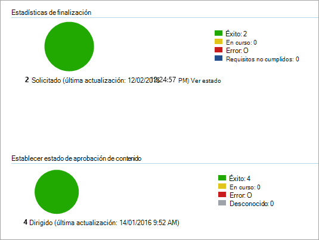

# <a name="onboard-windows-10-devices-using-configuration-manager"></a>Incorporar dispositivos Windows 10 con Configuration Manager

[!INCLUDE [Microsoft 365 Defender rebranding](../../includes/microsoft-defender.md)]

**Se aplica a:**

- [Microsoft Defender para punto de conexión](https://go.microsoft.com/fwlink/p/?linkid=2154037)
- [Microsoft 365 Defender](https://go.microsoft.com/fwlink/?linkid=2118804)
- Rama actual de Microsoft Endpoint Configuration Manager
- Administrador de configuración de System Center 2012 R2

>¿Desea experimentar Defender for Endpoint? [Regístrate para obtener una versión de prueba gratuita.](https://www.microsoft.com/microsoft-365/windows/microsoft-defender-atp?ocid=docs-wdatp-configureendpointssccm-abovefoldlink)

## <a name="supported-client-operating-systems"></a>Sistemas operativos cliente compatibles

En función de la versión de Configuration Manager que esté ejecutando, se pueden incorporar los siguientes sistemas operativos cliente:

#### <a name="configuration-manager-version-1910-and-prior"></a>Configuration Manager versión 1910 y anterior

- Equipos clientes que ejecutan Windows 10 

#### <a name="configuration-manager-version-2002-and-later"></a>Configuration Manager versión 2002 y versiones posteriores

A partir de la versión 2002 de Configuration Manager, puede incorporar los siguientes sistemas operativos:

- Windows 8.1
- Windows 10
- Windows Server 2012 R2
- Windows Server 2016
- Windows Server 2016, versión 1803 o posterior
- Windows Server 2019

>[!NOTE]
>Para obtener más información sobre cómo incorporar Windows Server 2012 R2, Windows Server 2016 y Windows Server 2019, consulte [Onboard Windows servers](configure-server-endpoints.md).


### <a name="onboard-devices-using-system-center-configuration-manager"></a>Incorporar dispositivos con System Center Configuration Manager


[](images/onboard-config-mgr.png#lightbox)


Consulte el [PDF](https://github.com/MicrosoftDocs/microsoft-365-docs/raw/public/microsoft-365/security/defender-endpoint/downloads/mdatp-deployment-strategy.pdf)  o  [Visio para](https://github.com/MicrosoftDocs/microsoft-365-docs/raw/public/microsoft-365/security/defender-endpoint/downloads/mdatp-deployment-strategy.vsdx) ver las distintas rutas de acceso en la implementación de Microsoft Defender para endpoint. 


1. Abra el archivo .zip del paquete de configuración de Configuration Manager (*WindowsDefenderATPOnboardingPackage.zip*) que descargó del Asistente para incorporación de servicios. También puede obtener el paquete del Centro de seguridad [de Microsoft Defender:](https://securitycenter.windows.com/)

    1. En el panel de navegación, seleccione **Configuración**  >  **incorporación**.
    
    1. Selecciona Windows 10 como sistema operativo.

    1. En el **campo Método de** implementación, seleccione System Center Configuration Manager **2012/2012 R2/1511/1602**.
    
    1. Seleccione **Descargar paquete** y guarde el archivo .zip.

2. Extraiga el contenido del archivo .zip en una ubicación compartida de solo lectura a la que puedan tener acceso los administradores de red que implementarán el paquete. Debe tener un archivo denominado *WindowsDefenderATPOnboardingScript.cmd*.

3. Implemente el paquete siguiendo los pasos descritos en el artículo Paquetes y programas [en System Center 2012 de Configuration Manager de R2.](https://docs.microsoft.com/previous-versions/system-center/system-center-2012-R2/gg699369\(v=technet.10\))

    a. Elija una colección de dispositivos predefinida en la que implementar el paquete.

> [!NOTE]
> Defender for Endpoint no admite la incorporación durante la fase de la experiencia de implementación [(OOBE).](https://answers.microsoft.com/en-us/windows/wiki/windows_10/how-to-complete-the-windows-10-out-of-box/47e3f943-f000-45e3-8c5c-9d85a1a0cf87) Asegúrate de que los usuarios completen OOBE después de ejecutar la instalación o actualización de Windows.

>[!TIP]
> Después de incorporar el dispositivo, puedes elegir ejecutar una prueba de detección para comprobar que un dispositivo está correctamente incorporado al servicio. Para obtener más información, consulta [Ejecutar una prueba de detección en un dispositivo defender para endpoint](run-detection-test.md)recién incorporado.
>
> Ten en cuenta que es posible crear una regla de detección en una aplicación de Configuration Manager para comprobar continuamente si se ha incorporado un dispositivo. Una aplicación es un tipo diferente de objeto que un paquete y un programa.
> Si un dispositivo aún no está incorporado (debido a la finalización de OOBE pendiente o a cualquier otro motivo), Configuration Manager volverá a intentar incorporar el dispositivo hasta que la regla detecte el cambio de estado.
> 
> Este comportamiento se puede lograr mediante la creación de una regla de detección que comprueba si el valor del Registro "OnboardingState" (de tipo REG_DWORD) = 1.
> Este valor del Registro se encuentra en "HKLM\SOFTWARE\Microsoft\Windows Advanced Threat Protection\Status".
Para obtener más información, vea [Configure Detection Methods in System Center 2012 R2 Configuration Manager](https://docs.microsoft.com/previous-versions/system-center/system-center-2012-R2/gg682159\(v=technet.10\)#step-4-configure-detection-methods-to-indicate-the-presence-of-the-deployment-type).

### <a name="configure-sample-collection-settings"></a>Configuración de la colección de ejemplo

Para cada dispositivo, puedes establecer un valor de configuración para especificar si se pueden recopilar muestras del dispositivo cuando se realiza una solicitud a través del Centro de seguridad de Microsoft Defender para enviar un archivo para un análisis profundo.

>[!NOTE]
>Estas opciones de configuración normalmente se realizan a través de Configuration Manager. 

Puedes establecer una regla de cumplimiento para el elemento de configuración en Configuration Manager para cambiar la configuración de recurso compartido de ejemplo en un dispositivo.

Esta regla debe ser un elemento de *configuración* de regla de cumplimiento corrector que establece el valor de una clave del Registro en dispositivos dirigidos para asegurarse de que son quejas.

La configuración se establece mediante la siguiente entrada de clave del Registro:

```console
Path: "HKLM\SOFTWARE\Policies\Microsoft\Windows Advanced Threat Protection"
Name: "AllowSampleCollection"
Value: 0 or 1
```

Donde:<br>
El tipo de clave es un D-WORD. <br>
Los valores posibles son:
- 0: no permite el uso compartido de muestras desde este dispositivo
- 1: permite compartir todos los tipos de archivo desde este dispositivo

El valor predeterminado en caso de que la clave del Registro no exista es 1.

Para obtener más información sobre el cumplimiento de System Center Configuration Manager, vea Introducción a la [configuración de cumplimiento en System Center 2012 R2 Configuration Manager](https://docs.microsoft.com/previous-versions/system-center/system-center-2012-R2/gg682139\(v=technet.10\)).


## <a name="other-recommended-configuration-settings"></a>Otras opciones de configuración recomendadas
Después de incorporar dispositivos al servicio, es importante aprovechar las capacidades de protección contra amenazas incluidas al habilitarlos con las siguientes opciones de configuración recomendadas.

### <a name="device-collection-configuration"></a>Configuración de la colección de dispositivos
Si usa Endpoint Configuration Manager, versión 2002 o posterior, puede ampliar la implementación para incluir servidores o clientes de nivel inferior.


### <a name="next-generation-protection-configuration"></a>Configuración de protección de próxima generación
Se recomiendan las siguientes opciones de configuración:

**Escanear** <br>
- Examinar dispositivos de almacenamiento extraíbles, como unidades USB: Sí

**Protección en tiempo real** <br>
- Habilitar supervisión de comportamiento: Sí
- Habilitar la protección contra aplicaciones potencialmente no deseadas en la descarga y antes de la instalación: Sí

**Servicio de protección en la nube**
- Tipo de pertenencia al Servicio de protección en la nube: pertenencia avanzada

**Reducción de superficie de ataque** Configure todas las reglas disponibles en Auditar.

>[!NOTE]
> El bloqueo de estas actividades puede interrumpir procesos empresariales legítimos. El mejor enfoque es establecer todo para auditar, identificar cuáles son seguros para activarse y, a continuación, habilitar esa configuración en puntos de conexión que no tienen detecciones de falsos positivos.


**Protección de red** <br>
Antes de habilitar la protección de red en modo de auditoría o bloqueo, asegúrese de que ha instalado la actualización de la plataforma antimalware, que se puede obtener desde la [página de soporte técnico](https://support.microsoft.com/en-us/help/4560203/windows-defender-anti-malware-platform-binaries-are-missing).


**Acceso controlado a carpetas**<br>
Habilite la característica en modo auditoría durante al menos 30 días. Después de este período, revise las detecciones y cree una lista de aplicaciones que puedan escribir en directorios protegidos.

Para obtener más información, vea [Evaluate controlled folder access](evaluate-controlled-folder-access.md).


## <a name="offboard-devices-using-configuration-manager"></a>Dispositivos offboard con Configuration Manager

Por motivos de seguridad, el paquete usado para dispositivos offboard expirará 30 días después de la fecha en que se descargó. Se rechazarán los paquetes de offboarding expirados enviados a un dispositivo. Al descargar un paquete de offboarding, se le notificará la fecha de expiración de los paquetes y también se incluirá en el nombre del paquete.

> [!NOTE]
> Las directivas de incorporación y de incorporación no deben implementarse en el mismo dispositivo al mismo tiempo, de lo contrario esto provocará colisiones impredecibles.

### <a name="offboard-devices-using-microsoft-endpoint-manager-current-branch"></a>Dispositivos offboard con la rama actual de Microsoft Endpoint Manager

Si usa la rama actual de Microsoft Endpoint Manager, vea [Create an offboarding configuration file](https://docs.microsoft.com/configmgr/protect/deploy-use/windows-defender-advanced-threat-protection#create-an-offboarding-configuration-file).

### <a name="offboard-devices-using-system-center-2012-r2-configuration-manager"></a>Dispositivos offboard con System Center 2012 Configuration Manager de R2

1. Obtener el paquete de offboarding del Centro de [seguridad de Microsoft Defender:](https://securitycenter.windows.com/)

    1. En el panel de navegación, seleccione **Configuración**  >   **de offboarding**.

    1. Selecciona Windows 10 como sistema operativo.

    1. En el **campo Método de** implementación, seleccione System Center Configuration Manager **2012/2012 R2/1511/1602**.
    
    1. Seleccione **Descargar paquete** y guarde el archivo .zip.

2. Extraiga el contenido del archivo .zip en una ubicación compartida de solo lectura a la que puedan tener acceso los administradores de red que implementarán el paquete. Debe tener un archivo denominado *WindowsDefenderATPOffboardingScript_valid_until_YYYY-MM-DD.cmd*.

3. Implemente el paquete siguiendo los pasos descritos en el artículo Paquetes y programas [en System Center 2012 de Configuration Manager de R2.](https://docs.microsoft.com/previous-versions/system-center/system-center-2012-R2/gg699369\(v=technet.10\))

    a. Elija una colección de dispositivos predefinida en la que implementar el paquete.

> [!IMPORTANT]
> Offboarding hace que el dispositivo deje de enviar datos del sensor al portal, pero los datos del dispositivo, incluida la referencia a las alertas que ha tenido, se conservarán durante un máximo de 6 meses.


## <a name="monitor-device-configuration"></a>Supervisar la configuración del dispositivo

Si usa la rama actual de Microsoft Endpoint Manager, use el panel integrado de Defender para endpoint en la consola de Configuration Manager. Para obtener más información, [vea Defender for Endpoint - Monitor](https://docs.microsoft.com/configmgr/protect/deploy-use/windows-defender-advanced-threat-protection#monitor).

Si usa System Center 2012 Configuration Manager de R2, la supervisión consta de dos partes:

1. Confirmar que el paquete de configuración se ha implementado correctamente y se está ejecutando (o se ha ejecutado correctamente) en los dispositivos de la red.

2. Comprobar que los dispositivos son compatibles con el servicio Defender for Endpoint (esto garantiza que el dispositivo pueda completar el proceso de incorporación y pueda seguir informando de los datos al servicio).

### <a name="confirm-the-configuration-package-has-been-correctly-deployed"></a>Confirmar que el paquete de configuración se ha implementado correctamente

1. En la consola de Configuration Manager, haga clic **en Supervisión** en la parte inferior del panel de navegación.

2. Seleccione **Información** general y, a continuación, **Implementaciones**.

3. Seleccione en la implementación con el nombre del paquete.

4. Revise los indicadores de estado en **Estadísticas de finalización** y **Estado de contenido**.

    Si hay implementaciones con errores (dispositivos con **errores,** requisitos no cumplidos o estados **con errores),** es posible que deba solucionar los problemas de los dispositivos. Para obtener más información, vea [Troubleshoot Microsoft Defender for Endpoint onboarding issues](troubleshoot-onboarding.md).

    

### <a name="check-that-the-devices-are-compliant-with-the-microsoft-defender-for-endpoint-service"></a>Comprobar que los dispositivos son compatibles con el servicio de Microsoft Defender para endpoints

Puede establecer una regla de cumplimiento para el elemento de configuración en System Center 2012 Configuration Manager de R2 para supervisar la implementación.

Esta regla debe ser un elemento de configuración de regla de cumplimiento no *correctivo* que supervisa el valor de una clave del Registro en dispositivos de destino.

Supervise la siguiente entrada de clave del Registro:

```console
Path: "HKLM\SOFTWARE\Microsoft\Windows Advanced Threat Protection\Status"
Name: "OnboardingState"
Value: "1"
```

Para obtener más información, vea [Introduction to compliance settings in System Center 2012 R2 Configuration Manager](https://docs.microsoft.com/previous-versions/system-center/system-center-2012-R2/gg682139\(v=technet.10\)).

## <a name="related-topics"></a>Temas relacionados
- [Incorporación de dispositivos Windows 10 con la directiva de grupo](configure-endpoints-gp.md)
- [Incorporar dispositivos Windows 10 con herramientas de Administración de dispositivos móviles](configure-endpoints-mdm.md)
- [Incorporar dispositivos Windows 10 mediante un script local](configure-endpoints-script.md)
- [Incorporar dispositivos de infraestructura de escritorio virtual (VDI) no persistente](configure-endpoints-vdi.md)
- [Ejecutar una prueba de detección en un dispositivo de Microsoft Defender para endpoint recién incorporado](run-detection-test.md)
- [Solucionar problemas de incorporación de puntos de conexión de Microsoft Defender](troubleshoot-onboarding.md)
