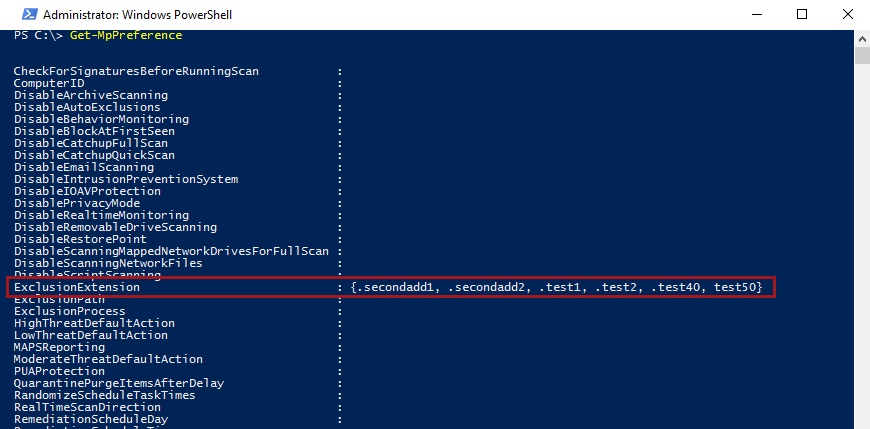
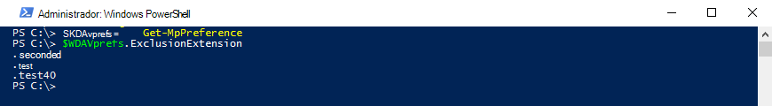

# <a name="configure-and-validate-exclusions-based-on-file-extension-and-folder-location"></a><span data-ttu-id="e870d-104">Configurar y validar exclusiones en función de la extensión de archivo y la ubicación de la carpeta</span><span class="sxs-lookup"><span data-stu-id="e870d-104">Configure and validate exclusions based on file extension and folder location</span></span>

[!INCLUDE [Microsoft 365 Defender rebranding](../../includes/microsoft-defender.md)]


<span data-ttu-id="e870d-105">**Se aplica a:**</span><span class="sxs-lookup"><span data-stu-id="e870d-105">**Applies to:**</span></span>

- [<span data-ttu-id="e870d-106">Microsoft Defender para punto de conexión</span><span class="sxs-lookup"><span data-stu-id="e870d-106">Microsoft Defender for Endpoint</span></span>](/microsoft-365/security/defender-endpoint/)

> [!IMPORTANT]
> <span data-ttu-id="e870d-107">Las exclusiones de Antivirus de Microsoft Defender no se aplican a otras funcionalidades de Microsoft Defender para endpoints, como la detección y respuesta de puntos de conexión [(EDR),](/microsoft-365/security/defender-endpoint/overview-endpoint-detection-response)las reglas de reducción de superficie de ataque [(ASR)](/microsoft-365/security/defender-endpoint/attack-surface-reduction)y el acceso controlado a carpetas [.](/microsoft-365/security/defender-endpoint/controlled-folders)</span><span class="sxs-lookup"><span data-stu-id="e870d-107">Microsoft Defender Antivirus exclusions don't apply to other Microsoft Defender for Endpoint capabilities, including [endpoint detection and response (EDR)](/microsoft-365/security/defender-endpoint/overview-endpoint-detection-response), [attack surface reduction (ASR) rules](/microsoft-365/security/defender-endpoint/attack-surface-reduction), and [controlled folder access](/microsoft-365/security/defender-endpoint/controlled-folders).</span></span> <span data-ttu-id="e870d-108">Los archivos que se excluyen mediante los métodos descritos en este artículo aún pueden desencadenar alertas de EDR y otras detecciones.</span><span class="sxs-lookup"><span data-stu-id="e870d-108">Files that you exclude using the methods described in this article can still trigger EDR alerts and other detections.</span></span> <span data-ttu-id="e870d-109">Para excluir archivos de forma general, agrégálos a los indicadores [personalizados](/microsoft-365/security/defender-endpoint/manage-indicators)de Microsoft Defender para endpoint .</span><span class="sxs-lookup"><span data-stu-id="e870d-109">To exclude files broadly, add them to the Microsoft Defender for Endpoint [custom indicators](/microsoft-365/security/defender-endpoint/manage-indicators).</span></span>

## <a name="exclusion-lists"></a><span data-ttu-id="e870d-110">Listas de exclusión</span><span class="sxs-lookup"><span data-stu-id="e870d-110">Exclusion lists</span></span>

<span data-ttu-id="e870d-111">Puede excluir determinados archivos de los exámenes de Antivirus de Microsoft Defender modificando listas de exclusión.</span><span class="sxs-lookup"><span data-stu-id="e870d-111">You can exclude certain files from Microsoft Defender Antivirus scans by modifying exclusion lists.</span></span> <span data-ttu-id="e870d-112">**Por lo general, no es necesario aplicar exclusiones**.</span><span class="sxs-lookup"><span data-stu-id="e870d-112">**Generally, you shouldn't need to apply exclusions**.</span></span> <span data-ttu-id="e870d-113">Antivirus de Microsoft Defender incluye muchas exclusiones automáticas basadas en comportamientos conocidos del sistema operativo y archivos de administración típicos, como los que se usan en la administración empresarial, la administración de bases de datos y otros escenarios y situaciones empresariales.</span><span class="sxs-lookup"><span data-stu-id="e870d-113">Microsoft Defender Antivirus includes many automatic exclusions based on known operating system behaviors and typical management files, such as those used in enterprise management, database management, and other enterprise scenarios and situations.</span></span>

> [!NOTE]
> <span data-ttu-id="e870d-114">Las exclusiones también se aplican a las detecciones de aplicaciones potencialmente no deseadas (PUA).</span><span class="sxs-lookup"><span data-stu-id="e870d-114">Exclusions apply to Potentially Unwanted Apps (PUA) detections as well.</span></span>

> [!NOTE]
> <span data-ttu-id="e870d-115">Las exclusiones automáticas solo se aplican a Windows Server 2016 y versiones posteriores.</span><span class="sxs-lookup"><span data-stu-id="e870d-115">Automatic exclusions apply only to Windows Server 2016 and above.</span></span> <span data-ttu-id="e870d-116">Estas exclusiones no son visibles en la aplicación seguridad de Windows ni en PowerShell.</span><span class="sxs-lookup"><span data-stu-id="e870d-116">These exclusions are not visible in the Windows Security app and in PowerShell.</span></span>

<span data-ttu-id="e870d-117">En este artículo se describe cómo configurar listas de exclusión para los archivos y carpetas.</span><span class="sxs-lookup"><span data-stu-id="e870d-117">This article  describes how to configure exclusion lists for the files and folders.</span></span> <span data-ttu-id="e870d-118">Consulta [Recomendaciones para definir exclusiones antes](configure-exclusions-microsoft-defender-antivirus.md#recommendations-for-defining-exclusions) de definir las listas de exclusión.</span><span class="sxs-lookup"><span data-stu-id="e870d-118">See [Recommendations for defining exclusions](configure-exclusions-microsoft-defender-antivirus.md#recommendations-for-defining-exclusions) before defining your exclusion lists.</span></span>

| <span data-ttu-id="e870d-119">Exclusión</span><span class="sxs-lookup"><span data-stu-id="e870d-119">Exclusion</span></span> | <span data-ttu-id="e870d-120">Ejemplos</span><span class="sxs-lookup"><span data-stu-id="e870d-120">Examples</span></span> | <span data-ttu-id="e870d-121">Lista de exclusión</span><span class="sxs-lookup"><span data-stu-id="e870d-121">Exclusion list</span></span> |
|:---|:---|:---|
|<span data-ttu-id="e870d-122">Cualquier archivo con una extensión específica</span><span class="sxs-lookup"><span data-stu-id="e870d-122">Any file with a specific extension</span></span> | <span data-ttu-id="e870d-123">Todos los archivos con la extensión especificada, en cualquier lugar del equipo.</span><span class="sxs-lookup"><span data-stu-id="e870d-123">All files with the specified extension, anywhere on the machine.</span></span> <p> <span data-ttu-id="e870d-124">Sintaxis válida: `.test` y `test`</span><span class="sxs-lookup"><span data-stu-id="e870d-124">Valid syntax: `.test` and `test`</span></span>  | <span data-ttu-id="e870d-125">Exclusiones de extensión</span><span class="sxs-lookup"><span data-stu-id="e870d-125">Extension exclusions</span></span> |
|<span data-ttu-id="e870d-126">Cualquier archivo de una carpeta específica</span><span class="sxs-lookup"><span data-stu-id="e870d-126">Any file under a specific folder</span></span> | <span data-ttu-id="e870d-127">Todos los archivos de la `c:\test\sample` carpeta</span><span class="sxs-lookup"><span data-stu-id="e870d-127">All files under the `c:\test\sample` folder</span></span> | <span data-ttu-id="e870d-128">Exclusiones de archivos y carpetas</span><span class="sxs-lookup"><span data-stu-id="e870d-128">File and folder exclusions</span></span> |
| <span data-ttu-id="e870d-129">Un archivo específico en una carpeta específica</span><span class="sxs-lookup"><span data-stu-id="e870d-129">A specific file in a specific folder</span></span> | <span data-ttu-id="e870d-130">Solo el `c:\sample\sample.test` archivo</span><span class="sxs-lookup"><span data-stu-id="e870d-130">The file `c:\sample\sample.test` only</span></span> | <span data-ttu-id="e870d-131">Exclusiones de archivos y carpetas</span><span class="sxs-lookup"><span data-stu-id="e870d-131">File and folder exclusions</span></span> |
| <span data-ttu-id="e870d-132">Un proceso específico</span><span class="sxs-lookup"><span data-stu-id="e870d-132">A specific process</span></span> | <span data-ttu-id="e870d-133">El archivo ejecutable `c:\test\process.exe`</span><span class="sxs-lookup"><span data-stu-id="e870d-133">The executable file `c:\test\process.exe`</span></span> | <span data-ttu-id="e870d-134">Exclusiones de archivos y carpetas</span><span class="sxs-lookup"><span data-stu-id="e870d-134">File and folder exclusions</span></span> |

<span data-ttu-id="e870d-135">Las listas de exclusión tienen las siguientes características:</span><span class="sxs-lookup"><span data-stu-id="e870d-135">Exclusion lists have the following characteristics:</span></span>

- <span data-ttu-id="e870d-136">Las exclusiones de carpetas se aplican a todos los archivos y carpetas de esa carpeta, a menos que la subcarpeta sea un punto de repetición.</span><span class="sxs-lookup"><span data-stu-id="e870d-136">Folder exclusions apply to all files and folders under that folder, unless the subfolder is a reparse point.</span></span> <span data-ttu-id="e870d-137">Las subcarpetas de punto de repetición deben excluirse por separado.</span><span class="sxs-lookup"><span data-stu-id="e870d-137">Reparse point subfolders must be excluded separately.</span></span>
- <span data-ttu-id="e870d-138">Las extensiones de archivo se aplican a cualquier nombre de archivo con la extensión definida si no se define una ruta de acceso o carpeta.</span><span class="sxs-lookup"><span data-stu-id="e870d-138">File extensions apply to any file name with the defined extension if a path or folder is not defined.</span></span>

> [!IMPORTANT]
> - <span data-ttu-id="e870d-139">El uso de caracteres comodín, como el asterisco ( ) modificará la forma en que se interpretan las \* reglas de exclusión.</span><span class="sxs-lookup"><span data-stu-id="e870d-139">Using wildcards such as the asterisk (\*) will alter how the exclusion rules are interpreted.</span></span> <span data-ttu-id="e870d-140">Vea la [sección Usar caracteres comodín](#use-wildcards-in-the-file-name-and-folder-path-or-extension-exclusion-lists) en la sección Ruta de acceso de carpeta y nombre de archivo o listas de exclusión de extensión para obtener información importante sobre cómo funcionan los caracteres comodín.</span><span class="sxs-lookup"><span data-stu-id="e870d-140">See the [Use wildcards in the file name and folder path or extension exclusion lists](#use-wildcards-in-the-file-name-and-folder-path-or-extension-exclusion-lists) section for important information about how wildcards work.</span></span>
> - <span data-ttu-id="e870d-141">No puede excluir unidades de red asignadas.</span><span class="sxs-lookup"><span data-stu-id="e870d-141">You cannot exclude mapped network drives.</span></span> <span data-ttu-id="e870d-142">Debe especificar la ruta de acceso de red real.</span><span class="sxs-lookup"><span data-stu-id="e870d-142">You must specify the actual network path.</span></span>
> - <span data-ttu-id="e870d-143">Las carpetas que son puntos de reanco que se crean después de que se inicie el servicio antivirus de Microsoft Defender y que se hayan agregado a la lista de exclusión no se incluirán.</span><span class="sxs-lookup"><span data-stu-id="e870d-143">Folders that are reparse points that are created after the Microsoft Defender Antivirus service starts and that have been added to the exclusion list will not be included.</span></span> <span data-ttu-id="e870d-144">Debes reiniciar el servicio (reiniciando Windows) para que los nuevos puntos de reanualción se reconozcan como un destino de exclusión válido.</span><span class="sxs-lookup"><span data-stu-id="e870d-144">You must restart the service (by restarting Windows) for new reparse points to be recognized as a valid exclusion target.</span></span>

<span data-ttu-id="e870d-145">Para excluir los archivos abiertos por un proceso específico, vea [Configure and validate exclusions for files opened by processes](configure-process-opened-file-exclusions-microsoft-defender-antivirus.md).</span><span class="sxs-lookup"><span data-stu-id="e870d-145">To exclude files opened by a specific process, see [Configure and validate exclusions for files opened by processes](configure-process-opened-file-exclusions-microsoft-defender-antivirus.md).</span></span>

<span data-ttu-id="e870d-146">Las exclusiones se aplican [a los exámenes programados,](scheduled-catch-up-scans-microsoft-defender-antivirus.md)los exámenes [a petición](run-scan-microsoft-defender-antivirus.md)y la [protección en tiempo real](configure-real-time-protection-microsoft-defender-antivirus.md).</span><span class="sxs-lookup"><span data-stu-id="e870d-146">The exclusions apply to [scheduled scans](scheduled-catch-up-scans-microsoft-defender-antivirus.md), [on-demand scans](run-scan-microsoft-defender-antivirus.md), and [real-time protection](configure-real-time-protection-microsoft-defender-antivirus.md).</span></span>

> [!IMPORTANT]
> <span data-ttu-id="e870d-147">Los cambios en la lista de exclusión realizados con la directiva de **grupo se mostrarán** en las listas de la [aplicación Seguridad de Windows](microsoft-defender-security-center-antivirus.md).</span><span class="sxs-lookup"><span data-stu-id="e870d-147">Exclusion list changes made with Group Policy **will show** in the lists in the [Windows Security app](microsoft-defender-security-center-antivirus.md).</span></span>
> <span data-ttu-id="e870d-148">Los cambios realizados en la aplicación Seguridad de Windows **no se mostrarán** en las listas de directivas de grupo.</span><span class="sxs-lookup"><span data-stu-id="e870d-148">Changes made in the Windows Security app **will not show** in the Group Policy lists.</span></span>

<span data-ttu-id="e870d-149">De forma predeterminada, los cambios locales realizados en las listas (por usuarios con privilegios de administrador, incluidos los cambios realizados con PowerShell y WMI) se combinarán con las listas definidas (e implementadas) por la directiva de grupo, Configuration Manager o Intune.</span><span class="sxs-lookup"><span data-stu-id="e870d-149">By default, local changes made to the lists (by users with administrator privileges, including changes made with PowerShell and WMI) will be merged with the lists as defined (and deployed) by Group Policy, Configuration Manager, or Intune.</span></span> <span data-ttu-id="e870d-150">Las listas de directivas de grupo tienen prioridad cuando hay conflictos.</span><span class="sxs-lookup"><span data-stu-id="e870d-150">The Group Policy lists take precedence when there are conflicts.</span></span>

<span data-ttu-id="e870d-151">Puede configurar cómo se combinan las listas de [exclusiones definidas local](configure-local-policy-overrides-microsoft-defender-antivirus.md#merge-lists) y globalmente para permitir que los cambios locales invaliden la configuración de implementación administrada.</span><span class="sxs-lookup"><span data-stu-id="e870d-151">You can [configure how locally and globally defined exclusions lists are merged](configure-local-policy-overrides-microsoft-defender-antivirus.md#merge-lists) to allow local changes to override managed deployment settings.</span></span>

## <a name="configure-the-list-of-exclusions-based-on-folder-name-or-file-extension"></a><span data-ttu-id="e870d-152">Configurar la lista de exclusiones según el nombre de carpeta o la extensión de archivo</span><span class="sxs-lookup"><span data-stu-id="e870d-152">Configure the list of exclusions based on folder name or file extension</span></span>

### <a name="use-intune-to-configure-file-name-folder-or-file-extension-exclusions"></a><span data-ttu-id="e870d-153">Usar Intune para configurar exclusiones de nombre de archivo, carpeta o extensión de archivo</span><span class="sxs-lookup"><span data-stu-id="e870d-153">Use Intune to configure file name, folder, or file extension exclusions</span></span>

<span data-ttu-id="e870d-154">Consulte los siguientes artículos:</span><span class="sxs-lookup"><span data-stu-id="e870d-154">See the following articles:</span></span>
- [<span data-ttu-id="e870d-155">Configurar la configuración de restricción de dispositivos en Microsoft Intune</span><span class="sxs-lookup"><span data-stu-id="e870d-155">Configure device restriction settings in Microsoft Intune</span></span>](/intune/device-restrictions-configure)
- [<span data-ttu-id="e870d-156">Configuración de restricción de dispositivo antivirus de Microsoft Defender para Windows 10 en Intune</span><span class="sxs-lookup"><span data-stu-id="e870d-156">Microsoft Defender Antivirus device restriction settings for Windows 10 in Intune</span></span>](/intune/device-restrictions-windows-10#microsoft-defender-antivirus)

### <a name="use-configuration-manager-to-configure-file-name-folder-or-file-extension-exclusions"></a><span data-ttu-id="e870d-157">Usar Configuration Manager para configurar exclusiones de nombre de archivo, carpeta o extensión de archivo</span><span class="sxs-lookup"><span data-stu-id="e870d-157">Use Configuration Manager to configure file name, folder, or file extension exclusions</span></span>

<span data-ttu-id="e870d-158">Vea [How to create and deploy antimalware policies: Exclusion settings](/configmgr/protect/deploy-use/endpoint-antimalware-policies#exclusion-settings) para obtener más información sobre cómo configurar Microsoft Endpoint Manager (rama actual).</span><span class="sxs-lookup"><span data-stu-id="e870d-158">See [How to create and deploy antimalware policies: Exclusion settings](/configmgr/protect/deploy-use/endpoint-antimalware-policies#exclusion-settings) for details on configuring Microsoft Endpoint Manager (current branch).</span></span>

### <a name="use-group-policy-to-configure-folder-or-file-extension-exclusions"></a><span data-ttu-id="e870d-159">Usar la directiva de grupo para configurar exclusiones de extensiones de archivo o carpetas</span><span class="sxs-lookup"><span data-stu-id="e870d-159">Use Group Policy to configure folder or file extension exclusions</span></span>

>[!NOTE]
><span data-ttu-id="e870d-160">Si especifica una ruta de acceso completa a un archivo, solo se excluye ese archivo.</span><span class="sxs-lookup"><span data-stu-id="e870d-160">If you specify a fully qualified path to a file, then only that file is excluded.</span></span> <span data-ttu-id="e870d-161">Si se define una carpeta en la exclusión, se excluyen todos los archivos y subdirectorios de esa carpeta.</span><span class="sxs-lookup"><span data-stu-id="e870d-161">If a folder is defined in the exclusion, then all files and subdirectories under that folder are excluded.</span></span>

1. <span data-ttu-id="e870d-162">En el equipo de administración de directivas de grupo, abra la Consola de administración de directivas de [grupo,](/previous-versions/windows/it-pro/windows-server-2008-R2-and-2008/cc731212(v=ws.11))haga clic con el botón secundario en el objeto de directiva de grupo que desea configurar y haga clic en **Editar**.</span><span class="sxs-lookup"><span data-stu-id="e870d-162">On your Group Policy management computer, open the [Group Policy Management Console](/previous-versions/windows/it-pro/windows-server-2008-R2-and-2008/cc731212(v=ws.11)), right-click the Group Policy Object you want to configure and click **Edit**.</span></span>

2. <span data-ttu-id="e870d-163">En el **Editor de administración de directivas de grupo,** vaya a Configuración del **equipo** y seleccione **Plantillas administrativas.**</span><span class="sxs-lookup"><span data-stu-id="e870d-163">In the **Group Policy Management Editor** go to **Computer configuration** and select **Administrative templates**.</span></span>

3. <span data-ttu-id="e870d-164">Expande el árbol a **Componentes de Windows**  >  **Exclusiones de Antivirus** de Microsoft Defender  >  .</span><span class="sxs-lookup"><span data-stu-id="e870d-164">Expand the tree to **Windows components** > **Microsoft Defender Antivirus** > **Exclusions**.</span></span>

4. <span data-ttu-id="e870d-165">Abra la **configuración Exclusiones de ruta de** acceso para su edición y agregue las exclusiones.</span><span class="sxs-lookup"><span data-stu-id="e870d-165">Open the **Path Exclusions** setting for editing, and add your exclusions.</span></span>

    1. <span data-ttu-id="e870d-166">Establezca la opción en **Habilitado**.</span><span class="sxs-lookup"><span data-stu-id="e870d-166">Set the option to **Enabled**.</span></span>
    1. <span data-ttu-id="e870d-167">En la **sección Opciones,** haga clic **en Mostrar**.</span><span class="sxs-lookup"><span data-stu-id="e870d-167">Under the **Options** section, click **Show**.</span></span>
    1. <span data-ttu-id="e870d-168">Especifique cada carpeta en su propia línea en la **columna Nombre de** valor.</span><span class="sxs-lookup"><span data-stu-id="e870d-168">Specify each folder on its own line under the **Value name** column.</span></span>
    1. <span data-ttu-id="e870d-169">Si va a especificar un archivo, asegúrese de escribir una ruta de acceso completa al archivo, incluida la letra de unidad, la ruta de acceso de carpeta, el nombre del archivo y la extensión.</span><span class="sxs-lookup"><span data-stu-id="e870d-169">If you are specifying a file, ensure that you enter a fully qualified path to the file, including the drive letter, folder path, file name, and extension.</span></span> <span data-ttu-id="e870d-170">Escriba **0** en la **columna** Valor.</span><span class="sxs-lookup"><span data-stu-id="e870d-170">Enter **0** in the **Value** column.</span></span>

5. <span data-ttu-id="e870d-171">Elija **Aceptar**.</span><span class="sxs-lookup"><span data-stu-id="e870d-171">Choose **OK**.</span></span>

6. <span data-ttu-id="e870d-172">Abra la **configuración Exclusiones de extensión** para editar y agregue las exclusiones.</span><span class="sxs-lookup"><span data-stu-id="e870d-172">Open the **Extension Exclusions** setting for editing and add your exclusions.</span></span>

    1. <span data-ttu-id="e870d-173">Establezca la opción en **Habilitado**.</span><span class="sxs-lookup"><span data-stu-id="e870d-173">Set the option to **Enabled**.</span></span>
    1. <span data-ttu-id="e870d-174">En la **sección Opciones,** seleccione **Mostrar**.</span><span class="sxs-lookup"><span data-stu-id="e870d-174">Under the **Options** section, select **Show**.</span></span>
    1. <span data-ttu-id="e870d-175">Escriba cada extensión de archivo en su propia línea en la **columna Nombre de** valor.</span><span class="sxs-lookup"><span data-stu-id="e870d-175">Enter each file extension on its own line under the **Value name** column.</span></span>  <span data-ttu-id="e870d-176">Escriba **0** en la **columna** Valor.</span><span class="sxs-lookup"><span data-stu-id="e870d-176">Enter **0** in the **Value** column.</span></span>

7. <span data-ttu-id="e870d-177">Elija **Aceptar**.</span><span class="sxs-lookup"><span data-stu-id="e870d-177">Choose **OK**.</span></span>

<a id="ps"></a>

### <a name="use-powershell-cmdlets-to-configure-file-name-folder-or-file-extension-exclusions"></a><span data-ttu-id="e870d-178">Usar cmdlets de PowerShell para configurar exclusiones de nombre de archivo, carpeta o extensión de archivo</span><span class="sxs-lookup"><span data-stu-id="e870d-178">Use PowerShell cmdlets to configure file name, folder, or file extension exclusions</span></span>

<span data-ttu-id="e870d-179">El uso de PowerShell para agregar o quitar exclusiones de archivos en función de la extensión, ubicación o nombre de archivo requiere el uso de una combinación de tres cmdlets y el parámetro de lista de exclusión adecuado.</span><span class="sxs-lookup"><span data-stu-id="e870d-179">Using PowerShell to add or remove exclusions for files based on the extension, location, or file name requires using a combination of three cmdlets and the appropriate exclusion list parameter.</span></span> <span data-ttu-id="e870d-180">Los cmdlets están todos en el [módulo Defender](/powershell/module/defender/).</span><span class="sxs-lookup"><span data-stu-id="e870d-180">The cmdlets are all in the [Defender module](/powershell/module/defender/).</span></span>

<span data-ttu-id="e870d-181">El formato de los cmdlets es el siguiente:</span><span class="sxs-lookup"><span data-stu-id="e870d-181">The format for the cmdlets is as follows:</span></span>

```PowerShell
<cmdlet> -<exclusion list> "<item>"
```

<span data-ttu-id="e870d-182">Se permite lo siguiente como `<cmdlet>` :</span><span class="sxs-lookup"><span data-stu-id="e870d-182">The following are allowed as the `<cmdlet>`:</span></span>

| <span data-ttu-id="e870d-183">Acción de configuración</span><span class="sxs-lookup"><span data-stu-id="e870d-183">Configuration action</span></span> | <span data-ttu-id="e870d-184">Cmdlet de PowerShell</span><span class="sxs-lookup"><span data-stu-id="e870d-184">PowerShell cmdlet</span></span> |
|:---|:---|
|<span data-ttu-id="e870d-185">Crear o sobrescribir la lista</span><span class="sxs-lookup"><span data-stu-id="e870d-185">Create or overwrite the list</span></span> | `Set-MpPreference` |
|<span data-ttu-id="e870d-186">Agregar a la lista</span><span class="sxs-lookup"><span data-stu-id="e870d-186">Add to the list</span></span> | `Add-MpPreference` |
|<span data-ttu-id="e870d-187">Quitar elemento de la lista</span><span class="sxs-lookup"><span data-stu-id="e870d-187">Remove item from the list</span></span> | `Remove-MpPreference` |

<span data-ttu-id="e870d-188">Se permite lo siguiente como `<exclusion list>` :</span><span class="sxs-lookup"><span data-stu-id="e870d-188">The following are allowed as the `<exclusion list>`:</span></span>

| <span data-ttu-id="e870d-189">Tipo de exclusión</span><span class="sxs-lookup"><span data-stu-id="e870d-189">Exclusion type</span></span> | <span data-ttu-id="e870d-190">Parámetro de PowerShell</span><span class="sxs-lookup"><span data-stu-id="e870d-190">PowerShell parameter</span></span> |
|:---|:---|
| <span data-ttu-id="e870d-191">Todos los archivos con una extensión de archivo especificada</span><span class="sxs-lookup"><span data-stu-id="e870d-191">All files with a specified file extension</span></span> | `-ExclusionExtension` |
| <span data-ttu-id="e870d-192">Todos los archivos de una carpeta (incluidos los archivos en subdirectorios) o un archivo específico</span><span class="sxs-lookup"><span data-stu-id="e870d-192">All files under a folder (including files in subdirectories), or a specific file</span></span> | `-ExclusionPath` |

> [!IMPORTANT]
> <span data-ttu-id="e870d-193">Si ha creado una lista, ya sea con o con el `Set-MpPreference` `Add-MpPreference` cmdlet de nuevo `Set-MpPreference` sobrescribirá la lista existente.</span><span class="sxs-lookup"><span data-stu-id="e870d-193">If you have created a list, either with `Set-MpPreference` or `Add-MpPreference`, using the `Set-MpPreference` cmdlet again will overwrite the existing list.</span></span>

<span data-ttu-id="e870d-194">Por ejemplo, el siguiente fragmento de código provocaría que los exámenes de Antivirus de Microsoft Defender excluyan cualquier archivo con `.test` la extensión de archivo:</span><span class="sxs-lookup"><span data-stu-id="e870d-194">For example, the following code snippet would cause Microsoft Defender Antivirus scans to exclude any file with the `.test` file extension:</span></span>

```PowerShell
Add-MpPreference -ExclusionExtension ".test"
```

<span data-ttu-id="e870d-195">Para obtener más información, vea [Use PowerShell cmdlets to configure and run Microsoft Defender Antivirus](use-powershell-cmdlets-microsoft-defender-antivirus.md) and Defender [cmdlets](/powershell/module/defender/).</span><span class="sxs-lookup"><span data-stu-id="e870d-195">For more information, see [Use PowerShell cmdlets to configure and run Microsoft Defender Antivirus](use-powershell-cmdlets-microsoft-defender-antivirus.md) and [Defender cmdlets](/powershell/module/defender/).</span></span>

### <a name="use-windows-management-instruction-wmi-to-configure-file-name-folder-or-file-extension-exclusions"></a><span data-ttu-id="e870d-196">Usar Windows Management Instruction (WMI) para configurar exclusiones de nombre de archivo, carpeta o extensión de archivo</span><span class="sxs-lookup"><span data-stu-id="e870d-196">Use Windows Management Instruction (WMI) to configure file name, folder, or file extension exclusions</span></span>

<span data-ttu-id="e870d-197">Utilice los [ **métodos Set**, **Add** y **Remove** de **la clase MSFT_MpPreference**](/previous-versions/windows/desktop/legacy/dn455323(v=vs.85)) para las siguientes propiedades:</span><span class="sxs-lookup"><span data-stu-id="e870d-197">Use the [**Set**, **Add**, and **Remove** methods of the **MSFT_MpPreference**](/previous-versions/windows/desktop/legacy/dn455323(v=vs.85)) class for the following properties:</span></span>

```WMI
ExclusionExtension
ExclusionPath
```

<span data-ttu-id="e870d-198">El uso **de Set**, **Add** y **Remove** es análogo a sus equivalentes en PowerShell: , `Set-MpPreference` y `Add-MpPreference` `Remove-MpPreference` .</span><span class="sxs-lookup"><span data-stu-id="e870d-198">The use of **Set**, **Add**, and **Remove** is analogous to their counterparts in PowerShell: `Set-MpPreference`, `Add-MpPreference`, and `Remove-MpPreference`.</span></span>

<span data-ttu-id="e870d-199">Para obtener más información, [vea Windows Defender API wmiv2](/previous-versions/windows/desktop/defender/windows-defender-wmiv2-apis-portal).</span><span class="sxs-lookup"><span data-stu-id="e870d-199">For more information, see [Windows Defender WMIv2 APIs](/previous-versions/windows/desktop/defender/windows-defender-wmiv2-apis-portal).</span></span>

<a id="man-tools"></a>

### <a name="use-the-windows-security-app-to-configure-file-name-folder-or-file-extension-exclusions"></a><span data-ttu-id="e870d-200">Usar la aplicación Seguridad de Windows para configurar exclusiones de nombre de archivo, carpeta o extensión de archivo</span><span class="sxs-lookup"><span data-stu-id="e870d-200">Use the Windows Security app to configure file name, folder, or file extension exclusions</span></span>

<span data-ttu-id="e870d-201">Consulta [Agregar exclusiones en la aplicación Seguridad de Windows](microsoft-defender-security-center-antivirus.md) para obtener instrucciones.</span><span class="sxs-lookup"><span data-stu-id="e870d-201">See [Add exclusions in the Windows Security app](microsoft-defender-security-center-antivirus.md) for instructions.</span></span>

<a id="wildcards"></a>

## <a name="use-wildcards-in-the-file-name-and-folder-path-or-extension-exclusion-lists"></a><span data-ttu-id="e870d-202">Usar caracteres comodín en el nombre de archivo y la ruta de acceso de carpeta o listas de exclusión de extensión</span><span class="sxs-lookup"><span data-stu-id="e870d-202">Use wildcards in the file name and folder path or extension exclusion lists</span></span>

<span data-ttu-id="e870d-203">Puede usar el asterisco, el signo de interrogación o las variables de entorno (como ) como caracteres comodín al definir elementos en la lista de exclusión de ruta de acceso de carpeta o nombre `*` `?` de `%ALLUSERSPROFILE%` archivo.</span><span class="sxs-lookup"><span data-stu-id="e870d-203">You can use the asterisk `*`, question mark `?`, or environment variables (such as `%ALLUSERSPROFILE%`) as wildcards when defining items in the file name or folder path exclusion list.</span></span> <span data-ttu-id="e870d-204">La forma en que se interpretan estos caracteres comodín difiere de su uso habitual en otras aplicaciones e idiomas.</span><span class="sxs-lookup"><span data-stu-id="e870d-204">The way in which these wildcards are interpreted differs from their usual usage in other apps and languages.</span></span> <span data-ttu-id="e870d-205">Asegúrese de leer esta sección para comprender sus limitaciones específicas.</span><span class="sxs-lookup"><span data-stu-id="e870d-205">Make sure to read this section to understand their specific limitations.</span></span>

> [!IMPORTANT]
> <span data-ttu-id="e870d-206">Existen limitaciones clave y escenarios de uso para estos caracteres comodín:</span><span class="sxs-lookup"><span data-stu-id="e870d-206">There are key limitations and usage scenarios for these wildcards:</span></span>
> - <span data-ttu-id="e870d-207">El uso de variables de entorno se limita a las variables de máquina y las aplicables a los procesos que se ejecutan como una cuenta NT AUTHORITY\SYSTEM.</span><span class="sxs-lookup"><span data-stu-id="e870d-207">Environment variable usage is limited to machine variables and those applicable to processes running as an NT AUTHORITY\SYSTEM account.</span></span>
> - <span data-ttu-id="e870d-208">No puede usar un comodín en lugar de una letra de unidad.</span><span class="sxs-lookup"><span data-stu-id="e870d-208">You cannot use a wildcard in place of a drive letter.</span></span>
> - <span data-ttu-id="e870d-209">Un asterisco `*` en una exclusión de carpeta se mantiene en su lugar para una sola carpeta.</span><span class="sxs-lookup"><span data-stu-id="e870d-209">An asterisk `*` in a folder exclusion stands in place for a single folder.</span></span> <span data-ttu-id="e870d-210">Use varias instancias de para `\*\` indicar varias carpetas anidadas con nombres no especificados.</span><span class="sxs-lookup"><span data-stu-id="e870d-210">Use multiple instances of `\*\` to indicate multiple nested folders with unspecified names.</span></span>

<span data-ttu-id="e870d-211">En la tabla siguiente se describe cómo se pueden usar los caracteres comodín y se proporcionan algunos ejemplos.</span><span class="sxs-lookup"><span data-stu-id="e870d-211">The following table describes how the wildcards can be used and provides some examples.</span></span>


|<span data-ttu-id="e870d-212">Carácter comodín</span><span class="sxs-lookup"><span data-stu-id="e870d-212">Wildcard</span></span>  |<span data-ttu-id="e870d-213">Ejemplos</span><span class="sxs-lookup"><span data-stu-id="e870d-213">Examples</span></span>  |
|:---------|:---------|
|<span data-ttu-id="e870d-214">`*` (asterisco)</span><span class="sxs-lookup"><span data-stu-id="e870d-214">`*` (asterisk)</span></span> <p> <span data-ttu-id="e870d-215">En **las inclusiones de** nombre de archivo y extensión de archivo, el asterisco reemplaza cualquier número de caracteres y solo se aplica a los archivos de la última carpeta definida en el argumento.</span><span class="sxs-lookup"><span data-stu-id="e870d-215">In **file name and file extension inclusions**, the asterisk replaces any number of characters, and only applies to files in the last folder defined in the argument.</span></span> <p> <span data-ttu-id="e870d-216">En **las exclusiones de carpetas,** el asterisco reemplaza a una sola carpeta.</span><span class="sxs-lookup"><span data-stu-id="e870d-216">In **folder exclusions**, the asterisk replaces a single folder.</span></span> <span data-ttu-id="e870d-217">Use varias `*` barras diagonales de carpeta `\` para indicar varias carpetas anidadas.</span><span class="sxs-lookup"><span data-stu-id="e870d-217">Use multiple `*` with folder slashes `\` to indicate multiple nested folders.</span></span> <span data-ttu-id="e870d-218">Después de hacer coincidir el número de carpetas comodín y con nombre, también se incluyen todas las subcarpetas.</span><span class="sxs-lookup"><span data-stu-id="e870d-218">After matching the number of wild carded and named folders, all subfolders are also included.</span></span>   | <span data-ttu-id="e870d-219">`C:\MyData\*.txt` incluye `C:\MyData\notes.txt`</span><span class="sxs-lookup"><span data-stu-id="e870d-219">`C:\MyData\*.txt` includes `C:\MyData\notes.txt`</span></span> <p> <span data-ttu-id="e870d-220">`C:\somepath\*\Data` incluye cualquier archivo y `C:\somepath\Archives\Data` sus subcarpetas, `C:\somepath\Authorized\Data` y sus subcarpetas</span><span class="sxs-lookup"><span data-stu-id="e870d-220">`C:\somepath\*\Data` includes any file in `C:\somepath\Archives\Data` and its subfolders, and `C:\somepath\Authorized\Data` and its subfolders</span></span> <p> <span data-ttu-id="e870d-221">`C:\Serv\*\*\Backup` incluye cualquier archivo y `C:\Serv\Primary\Denied\Backup` sus subcarpetas y `C:\Serv\Secondary\Allowed\Backup` sus subcarpetas</span><span class="sxs-lookup"><span data-stu-id="e870d-221">`C:\Serv\*\*\Backup` includes any file in `C:\Serv\Primary\Denied\Backup` and its subfolders and `C:\Serv\Secondary\Allowed\Backup` and its subfolders</span></span>     |
|<span data-ttu-id="e870d-222">`?` (signo de interrogación)</span><span class="sxs-lookup"><span data-stu-id="e870d-222">`?` (question mark)</span></span>  <p> <span data-ttu-id="e870d-223">En **las inclusiones** de nombre de archivo y extensión de archivo, el signo de interrogación reemplaza a un solo carácter y solo se aplica a los archivos de la última carpeta definida en el argumento.</span><span class="sxs-lookup"><span data-stu-id="e870d-223">In **file name and file extension inclusions**, the question mark replaces a single character, and only applies to files in the last folder defined in the argument.</span></span> <p> <span data-ttu-id="e870d-224">En **las exclusiones de carpetas,** el signo de interrogación reemplaza un solo carácter en un nombre de carpeta.</span><span class="sxs-lookup"><span data-stu-id="e870d-224">In **folder exclusions**, the question mark replaces a single character in a folder name.</span></span> <span data-ttu-id="e870d-225">Después de hacer coincidir el número de carpetas comodín y con nombre, también se incluyen todas las subcarpetas.</span><span class="sxs-lookup"><span data-stu-id="e870d-225">After matching the number of wild carded and named folders, all subfolders are also included.</span></span>   |<span data-ttu-id="e870d-226">`C:\MyData\my?.zip` incluye `C:\MyData\my1.zip`</span><span class="sxs-lookup"><span data-stu-id="e870d-226">`C:\MyData\my?.zip` includes `C:\MyData\my1.zip`</span></span> <p> <span data-ttu-id="e870d-227">`C:\somepath\?\Data` incluye cualquier archivo en `C:\somepath\P\Data` y sus subcarpetas</span><span class="sxs-lookup"><span data-stu-id="e870d-227">`C:\somepath\?\Data` includes any file in `C:\somepath\P\Data` and its subfolders</span></span>  <p> <span data-ttu-id="e870d-228">`C:\somepath\test0?\Data` incluiría cualquier archivo en `C:\somepath\test01\Data` y sus subcarpetas</span><span class="sxs-lookup"><span data-stu-id="e870d-228">`C:\somepath\test0?\Data` would include any file in `C:\somepath\test01\Data` and its subfolders</span></span>          |
|<span data-ttu-id="e870d-229">Variables de entorno</span><span class="sxs-lookup"><span data-stu-id="e870d-229">Environment variables</span></span> <p> <span data-ttu-id="e870d-230">La variable definida se rellena como una ruta de acceso cuando se evalúa la exclusión.</span><span class="sxs-lookup"><span data-stu-id="e870d-230">The defined variable is populated as a path when the exclusion is evaluated.</span></span>          |<span data-ttu-id="e870d-231">`%ALLUSERSPROFILE%\CustomLogFiles` incluiría `C:\ProgramData\CustomLogFiles\Folder1\file1.txt`</span><span class="sxs-lookup"><span data-stu-id="e870d-231">`%ALLUSERSPROFILE%\CustomLogFiles` would include `C:\ProgramData\CustomLogFiles\Folder1\file1.txt`</span></span>         |
        

> [!IMPORTANT]
> <span data-ttu-id="e870d-232">Si mezcla un argumento de exclusión de archivos con un argumento de exclusión de carpeta, las reglas se detendrán en la coincidencia del argumento de archivo en la carpeta coincidente y no buscarán coincidencias de archivos en ninguna subcarpeta.</span><span class="sxs-lookup"><span data-stu-id="e870d-232">If you mix a file exclusion argument with a folder exclusion argument, the rules will stop at the file argument match in the matched folder, and will not look for file matches in any subfolders.</span></span>
> <span data-ttu-id="e870d-233">Por ejemplo, puede excluir todos los archivos que comiencen por "date" en las carpetas `c:\data\final\marked` y mediante el argumento rule `c:\data\review\marked` `c:\data\*\marked\date*` .</span><span class="sxs-lookup"><span data-stu-id="e870d-233">For example, you can exclude all files that start with "date" in the folders `c:\data\final\marked` and `c:\data\review\marked` by using the rule argument `c:\data\*\marked\date*`.</span></span>
> <span data-ttu-id="e870d-234">Sin embargo, este argumento no coincidirá con ningún archivo de subcarpetas en `c:\data\final\marked` o `c:\data\review\marked` .</span><span class="sxs-lookup"><span data-stu-id="e870d-234">This argument, however, will not match any files in subfolders under `c:\data\final\marked` or `c:\data\review\marked`.</span></span>

<a id="review"></a>

### <a name="system-environment-variables"></a><span data-ttu-id="e870d-235">Variables de entorno del sistema</span><span class="sxs-lookup"><span data-stu-id="e870d-235">System environment variables</span></span>

<span data-ttu-id="e870d-236">En la tabla siguiente se enumeran y describen las variables de entorno de cuentas del sistema.</span><span class="sxs-lookup"><span data-stu-id="e870d-236">The following table lists and describes the system account environment variables.</span></span> 

| <span data-ttu-id="e870d-237">Esta variable de entorno del sistema...</span><span class="sxs-lookup"><span data-stu-id="e870d-237">This system environment variable...</span></span> | <span data-ttu-id="e870d-238">Redirige a esto</span><span class="sxs-lookup"><span data-stu-id="e870d-238">Redirects to this</span></span> |
|:--|:--|
| `%APPDATA%`| `C:\Users\UserName.DomainName\AppData\Roaming` |
| `%APPDATA%\Microsoft\Internet Explorer\Quick Launch` | `C:\Windows\System32\config\systemprofile\AppData\Roaming\Microsoft\Internet Explorer\Quick Launch` |
| `%APPDATA%\Microsoft\Windows\Start Menu` | `C:\Windows\System32\config\systemprofile\AppData\Roaming\Microsoft\Windows\Start Menu` |
| `%APPDATA%\Microsoft\Windows\Start Menu\Programs` | `C:\Windows\System32\config\systemprofile\AppData\Roaming\Microsoft\Windows\Start Menu\Programs` |
| `%LOCALAPPDATA%` | `C:\Windows\System32\config\systemprofile\AppData\Local` |
| `%ProgramData%` | `C:\ProgramData` |
| `%ProgramFiles%` | `C:\Program Files` |
| `%ProgramFiles%\Common Files` | `C:\Program Files\Common Files` |
| `%ProgramFiles%\Windows Sidebar\Gadgets` | `C:\Program Files\Windows Sidebar\Gadgets` |
| `%ProgramFiles%\Common Files` | `C:\Program Files\Common Files` |
| `%ProgramFiles(x86)%` | `C:\Program Files (x86)` |
| `%ProgramFiles(x86)%\Common Files` | `C:\Program Files (x86)\Common Files` |
| `%SystemDrive%` | `C:` |
| `%SystemDrive%\Program Files` | `C:\Program Files` |
| `%SystemDrive%\Program Files (x86)` | `C:\Program Files (x86)` |
| `%SystemDrive%\Users` | `C:\Users` |
| `%SystemDrive%\Users\Public` | `C:\Users\Public` |
| `%SystemRoot%` | `C:\Windows` |
| `%windir%` | `C:\Windows` |
| `%windir%\Fonts` | `C:\Windows\Fonts` |
| `%windir%\Resources` | `C:\Windows\Resources` |
| `%windir%\resources\0409` | `C:\Windows\resources\0409` |
| `%windir%\system32` | `C:\Windows\System32` |
| `%ALLUSERSPROFILE%` | `C:\ProgramData` |
| `%ALLUSERSPROFILE%\Application Data` | `C:\ProgramData\Application Data` |
| `%ALLUSERSPROFILE%\Documents` | `C:\ProgramData\Documents` |
| `%ALLUSERSPROFILE%\Documents\My Music\Sample Music` | `C:\ProgramData\Documents\My Music\Sample Music` |
| `%ALLUSERSPROFILE%\Documents\My Music` | `C:\ProgramData\Documents\My Music` |
| `%ALLUSERSPROFILE%\Documents\My Pictures` | `C:\ProgramData\Documents\My Pictures` |
| `%ALLUSERSPROFILE%\Documents\My Pictures\Sample Pictures` | `C:\ProgramData\Documents\My Pictures\Sample Pictures` |
| `%ALLUSERSPROFILE%\Documents\My Videos` | `C:\ProgramData\Documents\My Videos` |
| `%ALLUSERSPROFILE%\Microsoft\Windows\DeviceMetadataStore` | `C:\ProgramData\Microsoft\Windows\DeviceMetadataStore` |
| `%ALLUSERSPROFILE%\Microsoft\Windows\GameExplorer` | `C:\ProgramData\Microsoft\Windows\GameExplorer` |
| `%ALLUSERSPROFILE%\Microsoft\Windows\Ringtones` | `C:\ProgramData\Microsoft\Windows\Ringtones` |
| `%ALLUSERSPROFILE%\Microsoft\Windows\Start Menu` | `C:\ProgramData\Microsoft\Windows\Start Menu` |
| `%ALLUSERSPROFILE%\Microsoft\Windows\Start Menu\Programs` | `C:\ProgramData\Microsoft\Windows\Start Menu\Programs` |
| `%ALLUSERSPROFILE%\Microsoft\Windows\Start Menu\Programs\Administrative Tools` | `C:\ProgramData\Microsoft\Windows\Start Menu\Programs\Administrative Tools` |
| `%ALLUSERSPROFILE%\Microsoft\Windows\Start Menu\Programs\StartUp` | `C:\ProgramData\Microsoft\Windows\Start Menu\Programs\StartUp` |
| `%ALLUSERSPROFILE%\Microsoft\Windows\Templates` | `C:\ProgramData\Microsoft\Windows\Templates` |
| `%ALLUSERSPROFILE%\Start Menu` | `C:\ProgramData\Start Menu` |
| `%ALLUSERSPROFILE%\Start Menu\Programs` | <span data-ttu-id="e870d-239">C:\ProgramData\Menú Inicio\Programas</span><span class="sxs-lookup"><span data-stu-id="e870d-239">C:\ProgramData\Start Menu\Programs</span></span> |
| `%ALLUSERSPROFILE%\Start Menu\Programs\Administrative Tools` | `C:\ProgramData\Start Menu\Programs\Administrative Tools` | 
| `%ALLUSERSPROFILE%\Templates` | `C:\ProgramData\Templates` |
| `%LOCALAPPDATA%\Microsoft\Windows\ConnectedSearch\Templates` | `C:\Windows\System32\config\systemprofile\AppData\Local\Microsoft\Windows\ConnectedSearch\Templates` |
| `%LOCALAPPDATA%\Microsoft\Windows\History` | `C:\Windows\System32\config\systemprofile\AppData\Local\Microsoft\Windows\History` |
| `%PUBLIC%` | `C:\Users\Public` |
| `%PUBLIC%\AccountPictures` | `C:\Users\Public\AccountPictures` |
| `%PUBLIC%\Desktop` | `C:\Users\Public\Desktop` |
| `%PUBLIC%\Documents` | `C:\Users\Public\Documents` |
| `%PUBLIC%\Downloads` | `C:\Users\Public\Downloads` |
| `%PUBLIC%\Music\Sample Music` | `C:\Users\Public\Music\Sample Music` |
| `%PUBLIC%\Music\Sample Playlists` | `C:\Users\Public\Music\Sample Playlists` |
| `%PUBLIC%\Pictures\Sample Pictures` | `C:\Users\Public\Pictures\Sample Pictures` |
| `%PUBLIC%\RecordedTV.library-ms` | `C:\Users\Public\RecordedTV.library-ms` |
| `%PUBLIC%\Videos` | `C:\Users\Public\Videos` |
| `%PUBLIC%\Videos\Sample Videos` | `C:\Users\Public\Videos\Sample Videos` | 
| `%USERPROFILE%` | `C:\Windows\System32\config\systemprofile` |
| `%USERPROFILE%\AppData\Local` | `C:\Windows\System32\config\systemprofile\AppData\Local` |
| `%USERPROFILE%\AppData\LocalLow` | `C:\Windows\System32\config\systemprofile\AppData\LocalLow` |
| `%USERPROFILE%\AppData\Roaming` | `C:\Windows\System32\config\systemprofile\AppData\Roaming` |


## <a name="review-the-list-of-exclusions"></a><span data-ttu-id="e870d-240">Revisar la lista de exclusiones</span><span class="sxs-lookup"><span data-stu-id="e870d-240">Review the list of exclusions</span></span>

<span data-ttu-id="e870d-241">Puede recuperar los elementos de la lista de exclusión mediante uno de los siguientes métodos:</span><span class="sxs-lookup"><span data-stu-id="e870d-241">You can retrieve the items in the exclusion list using one of the following methods:</span></span>
- [<span data-ttu-id="e870d-242">Intune</span><span class="sxs-lookup"><span data-stu-id="e870d-242">Intune</span></span>](/intune/deploy-use/help-secure-windows-pcs-with-endpoint-protection-for-microsoft-intune)
- [<span data-ttu-id="e870d-243">Microsoft Endpoint Configuration Manager</span><span class="sxs-lookup"><span data-stu-id="e870d-243">Microsoft Endpoint Configuration Manager</span></span>](/configmgr/protect/deploy-use/endpoint-antimalware-policies)
- <span data-ttu-id="e870d-244">MpCmdRun</span><span class="sxs-lookup"><span data-stu-id="e870d-244">MpCmdRun</span></span>
- <span data-ttu-id="e870d-245">PowerShell</span><span class="sxs-lookup"><span data-stu-id="e870d-245">PowerShell</span></span>
- [<span data-ttu-id="e870d-246">Aplicación seguridad de Windows</span><span class="sxs-lookup"><span data-stu-id="e870d-246">Windows Security app</span></span>](microsoft-defender-security-center-antivirus.md)

>[!IMPORTANT]
><span data-ttu-id="e870d-247">Los cambios en la lista de exclusión realizados con la directiva de **grupo se mostrarán** en las listas de la [aplicación Seguridad de Windows](microsoft-defender-security-center-antivirus.md).</span><span class="sxs-lookup"><span data-stu-id="e870d-247">Exclusion list changes made with Group Policy **will show** in the lists in the [Windows Security app](microsoft-defender-security-center-antivirus.md).</span></span>
>
><span data-ttu-id="e870d-248">Los cambios realizados en la aplicación Seguridad de Windows **no se mostrarán** en las listas de directivas de grupo.</span><span class="sxs-lookup"><span data-stu-id="e870d-248">Changes made in the Windows Security app **will not show** in the Group Policy lists.</span></span>

<span data-ttu-id="e870d-249">Si usa PowerShell, puede recuperar la lista de dos maneras:</span><span class="sxs-lookup"><span data-stu-id="e870d-249">If you use PowerShell, you can retrieve the list in two ways:</span></span>

- <span data-ttu-id="e870d-250">Recupera el estado de todas las preferencias de Antivirus de Microsoft Defender.</span><span class="sxs-lookup"><span data-stu-id="e870d-250">Retrieve the status of all Microsoft Defender Antivirus preferences.</span></span> <span data-ttu-id="e870d-251">Cada lista se muestra en líneas independientes, pero los elementos de cada lista se combinan en la misma línea.</span><span class="sxs-lookup"><span data-stu-id="e870d-251">Each list is displayed on separate lines, but the items within each list are combined into the same line.</span></span>
- <span data-ttu-id="e870d-252">Escribe el estado de todas las preferencias en una variable y usa esa variable para llamar solo a la lista específica que te interesa.</span><span class="sxs-lookup"><span data-stu-id="e870d-252">Write the status of all preferences to a variable, and use that variable to only call the specific list you are interested in.</span></span> <span data-ttu-id="e870d-253">Cada uso de `Add-MpPreference` se escribe en una nueva línea.</span><span class="sxs-lookup"><span data-stu-id="e870d-253">Each use of `Add-MpPreference` is written to a new line.</span></span>

### <a name="validate-the-exclusion-list-by-using-mpcmdrun"></a><span data-ttu-id="e870d-254">Validar la lista de exclusión mediante MpCmdRun</span><span class="sxs-lookup"><span data-stu-id="e870d-254">Validate the exclusion list by using MpCmdRun</span></span>

<span data-ttu-id="e870d-255">Para comprobar las exclusiones con la herramienta de línea de [comandos ](./command-line-arguments-microsoft-defender-antivirus.md?branch=v-anbic-wdav-new-mpcmdrun-options)mpcmdrun.exe, use el siguiente comando:</span><span class="sxs-lookup"><span data-stu-id="e870d-255">To check exclusions with the dedicated [command-line tool mpcmdrun.exe](./command-line-arguments-microsoft-defender-antivirus.md?branch=v-anbic-wdav-new-mpcmdrun-options), use the following command:</span></span>

```DOS
Start, CMD (Run as admin)
cd "%programdata%\microsoft\windows defender\platform"
cd 4.18.1812.3 (Where 4.18.1812.3 is this month's MDAV "Platform Update".)
MpCmdRun.exe -CheckExclusion -path <path>
```

>[!NOTE]
><span data-ttu-id="e870d-256">Para comprobar exclusiones con MpCmdRun, es necesario microsoft Defender Antivirus CAMP versión 4.18.1812.3 (publicado en diciembre de 2018) o posterior.</span><span class="sxs-lookup"><span data-stu-id="e870d-256">Checking exclusions with MpCmdRun requires Microsoft Defender Antivirus CAMP version 4.18.1812.3 (released in December 2018) or later.</span></span>

### <a name="review-the-list-of-exclusions-alongside-all-other-microsoft-defender-antivirus-preferences-by-using-powershell"></a><span data-ttu-id="e870d-257">Revise la lista de exclusiones junto con todas las demás preferencias de Antivirus de Microsoft Defender con PowerShell</span><span class="sxs-lookup"><span data-stu-id="e870d-257">Review the list of exclusions alongside all other Microsoft Defender Antivirus preferences by using PowerShell</span></span>

<span data-ttu-id="e870d-258">Use el siguiente cmdlet:</span><span class="sxs-lookup"><span data-stu-id="e870d-258">Use the following cmdlet:</span></span>

```PowerShell
Get-MpPreference
```

<span data-ttu-id="e870d-259">En el siguiente ejemplo, se resaltan los elementos contenidos en `ExclusionExtension` la lista:</span><span class="sxs-lookup"><span data-stu-id="e870d-259">In the following example, the items contained in the `ExclusionExtension` list are highlighted:</span></span>



<span data-ttu-id="e870d-261">Para obtener más información, vea [Use PowerShell cmdlets to configure and run Microsoft Defender Antivirus](use-powershell-cmdlets-microsoft-defender-antivirus.md) and Defender [cmdlets](/powershell/module/defender/).</span><span class="sxs-lookup"><span data-stu-id="e870d-261">For more information, see [Use PowerShell cmdlets to configure and run Microsoft Defender Antivirus](use-powershell-cmdlets-microsoft-defender-antivirus.md) and [Defender cmdlets](/powershell/module/defender/).</span></span>

### <a name="retrieve-a-specific-exclusions-list-by-using-powershell"></a><span data-ttu-id="e870d-262">Recuperar una lista de exclusiones específica mediante PowerShell</span><span class="sxs-lookup"><span data-stu-id="e870d-262">Retrieve a specific exclusions list by using PowerShell</span></span>

<span data-ttu-id="e870d-263">Use el siguiente fragmento de código (escriba cada línea como un comando independiente); reemplace **WDAVprefs** por la etiqueta que desee nombrar la variable:</span><span class="sxs-lookup"><span data-stu-id="e870d-263">Use the following code snippet (enter each line as a separate command); replace **WDAVprefs** with whatever label you want to name the variable:</span></span>

```PowerShell
$WDAVprefs = Get-MpPreference
$WDAVprefs.ExclusionExtension
$WDAVprefs.ExclusionPath
```

<span data-ttu-id="e870d-264">En el siguiente ejemplo, la lista se divide en nuevas líneas para cada uso del `Add-MpPreference` cmdlet:</span><span class="sxs-lookup"><span data-stu-id="e870d-264">In the following example, the list is split into new lines for each use of the `Add-MpPreference` cmdlet:</span></span>



<span data-ttu-id="e870d-266">Para obtener más información, vea [Use PowerShell cmdlets to configure and run Microsoft Defender Antivirus](use-powershell-cmdlets-microsoft-defender-antivirus.md) and Defender [cmdlets](/powershell/module/defender/).</span><span class="sxs-lookup"><span data-stu-id="e870d-266">For more information, see [Use PowerShell cmdlets to configure and run Microsoft Defender Antivirus](use-powershell-cmdlets-microsoft-defender-antivirus.md) and [Defender cmdlets](/powershell/module/defender/).</span></span>

<a id="validate"></a>

## <a name="validate-exclusions-lists-with-the-eicar-test-file"></a><span data-ttu-id="e870d-267">Validar listas de exclusiones con el archivo de prueba EICAR</span><span class="sxs-lookup"><span data-stu-id="e870d-267">Validate exclusions lists with the EICAR test file</span></span>

<span data-ttu-id="e870d-268">Puede validar que las listas de exclusión funcionan mediante PowerShell con el cmdlet o la `Invoke-WebRequest` clase WebClient de .NET para descargar un archivo de prueba.</span><span class="sxs-lookup"><span data-stu-id="e870d-268">You can validate that your exclusion lists are working by using PowerShell with either the `Invoke-WebRequest` cmdlet or the .NET WebClient class to download a test file.</span></span>

<span data-ttu-id="e870d-269">En el siguiente fragmento de código de PowerShell, reemplace *test.txt* por un archivo que cumpla las reglas de exclusión.</span><span class="sxs-lookup"><span data-stu-id="e870d-269">In the following PowerShell snippet, replace *test.txt* with a file that conforms to your exclusion rules.</span></span> <span data-ttu-id="e870d-270">Por ejemplo, si ha excluido la `.testing` extensión, reemplace `test.txt` por `test.testing` .</span><span class="sxs-lookup"><span data-stu-id="e870d-270">For example, if you have excluded the `.testing` extension, replace `test.txt` with `test.testing`.</span></span> <span data-ttu-id="e870d-271">Si está probando una ruta de acceso, asegúrese de ejecutar el cmdlet dentro de esa ruta de acceso.</span><span class="sxs-lookup"><span data-stu-id="e870d-271">If you are testing a path, ensure you run the cmdlet within that path.</span></span>

```PowerShell
Invoke-WebRequest "http://www.eicar.org/download/eicar.com.txt" -OutFile "test.txt"
```

<span data-ttu-id="e870d-272">Si Antivirus de Microsoft Defender informa de malware, la regla no funciona.</span><span class="sxs-lookup"><span data-stu-id="e870d-272">If Microsoft Defender Antivirus reports malware, then the rule is not working.</span></span> <span data-ttu-id="e870d-273">Si no hay ningún informe de malware y existe el archivo descargado, la exclusión funciona.</span><span class="sxs-lookup"><span data-stu-id="e870d-273">If there is no report of malware and the downloaded file exists, then the exclusion is working.</span></span> <span data-ttu-id="e870d-274">Puede abrir el archivo para confirmar que el contenido es el mismo que el que se describe en el sitio web del archivo [de prueba EICAR](http://www.eicar.org/86-0-Intended-use.html).</span><span class="sxs-lookup"><span data-stu-id="e870d-274">You can open the file to confirm the contents are the same as what is described on the [EICAR test file website](http://www.eicar.org/86-0-Intended-use.html).</span></span>

<span data-ttu-id="e870d-275">También puede usar el siguiente código de PowerShell, que llama a la clase .NET WebClient para descargar el archivo de prueba, como con el cmdlet; reemplacec:\test.txtpor un archivo que cumpla con la regla que va `Invoke-WebRequest` a validar: </span><span class="sxs-lookup"><span data-stu-id="e870d-275">You can also use the following PowerShell code, which calls the .NET WebClient class to download the test file - as with the `Invoke-WebRequest` cmdlet; replace *c:\test.txt* with a file that conforms to the rule you are validating:</span></span>

```PowerShell
$client = new-object System.Net.WebClient
$client.DownloadFile("http://www.eicar.org/download/eicar.com.txt","c:\test.txt")
```

<span data-ttu-id="e870d-276">Si no tiene acceso a Internet, puede crear su propio archivo de prueba EICAR escribiendo la cadena EICAR en un nuevo archivo de texto con el siguiente comando de PowerShell:</span><span class="sxs-lookup"><span data-stu-id="e870d-276">If you do not have Internet access, you can create your own EICAR test file by writing the EICAR string to a new text file with the following PowerShell command:</span></span>

```PowerShell
[io.file]::WriteAllText("test.txt",'X5O!P%@AP[4\PZX54(P^)7CC)7}$EICAR-STANDARD-ANTIVIRUS-TEST-FILE!$H+H*')
```

<span data-ttu-id="e870d-277">También puede copiar la cadena en un archivo de texto en blanco e intentar guardarla con el nombre de archivo o en la carpeta que está intentando excluir.</span><span class="sxs-lookup"><span data-stu-id="e870d-277">You can also copy the string into a blank text file and attempt to save it with the file name or in the folder you are attempting to exclude.</span></span>

## <a name="related-topics"></a><span data-ttu-id="e870d-278">Temas relacionados</span><span class="sxs-lookup"><span data-stu-id="e870d-278">Related topics</span></span>

- [<span data-ttu-id="e870d-279">Configurar y validar exclusiones en exámenes de Antivirus de Microsoft Defender</span><span class="sxs-lookup"><span data-stu-id="e870d-279">Configure and validate exclusions in Microsoft Defender Antivirus scans</span></span>](configure-exclusions-microsoft-defender-antivirus.md)
- [<span data-ttu-id="e870d-280">Configurar y validar exclusiones para archivos abiertos por procesos</span><span class="sxs-lookup"><span data-stu-id="e870d-280">Configure and validate exclusions for files opened by processes</span></span>](configure-process-opened-file-exclusions-microsoft-defender-antivirus.md)
- [<span data-ttu-id="e870d-281">Configurar exclusiones de Antivirus de Microsoft Defender en Windows Server</span><span class="sxs-lookup"><span data-stu-id="e870d-281">Configure Microsoft Defender Antivirus exclusions on Windows Server</span></span>](configure-server-exclusions-microsoft-defender-antivirus.md)
- [<span data-ttu-id="e870d-282">Errores comunes que se deben evitar al definir exclusiones</span><span class="sxs-lookup"><span data-stu-id="e870d-282">Common mistakes to avoid when defining exclusions</span></span>](common-exclusion-mistakes-microsoft-defender-antivirus.md)
