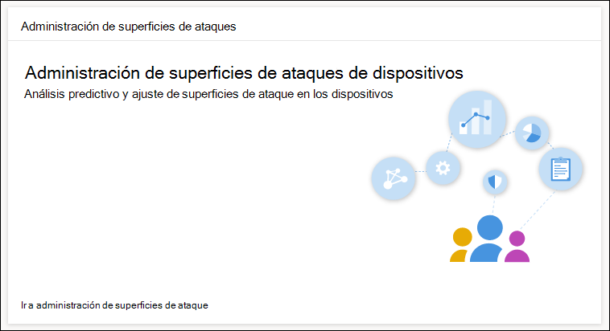
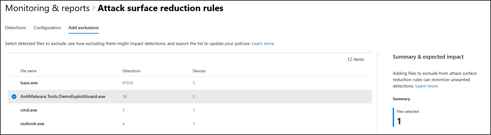

# Optimizar la implementación y detecciones de reglas ASR

[!INCLUDE [Microsoft 365 Defender rebranding](../../includes/microsoft-defender.md)]

**Se aplica a:**
- [Microsoft Defender para punto de conexión](https://go.microsoft.com/fwlink/p/?linkid=2154037)
- [Microsoft 365 Defender](https://go.microsoft.com/fwlink/?linkid=2118804)

> ¿Desea experimentar Defender for Endpoint? [Registrarse para obtener una versión de prueba gratuita](https://www.microsoft.com/en-us/WindowsForBusiness/windows-atp?ocid=docs-wdatp-onboardconfigure-abovefoldlink).

Las reglas de reducción de superficie de ataque [(ASR)](./attack-surface-reduction.md) identifican y evitan vulnerabilidades de malware típicas. Controlan cuándo y cómo se puede ejecutar el código potencialmente malintencionado. Por ejemplo, pueden impedir que JavaScript o VBScript inicien un archivo ejecutable descargado, bloquear llamadas a la API de Win32 de macros Office y bloquear procesos que se ejecutan desde unidades USB.

 
*Tarjeta de administración de superficie de ataque*

La *tarjeta de administración de superficie de* ataque es un punto de entrada a las herramientas Microsoft 365 centro de seguridad que puedes usar para:

* Comprenda cómo se implementan actualmente las reglas de ASR en su organización.
* Revise las detecciones de ASR e identifique posibles detecciones incorrectas.
* Analice el impacto de las exclusiones y genere la lista de rutas de archivo que se excluirán.

Selecciona **Ir a administración de** superficie de ataque Supervisión & informes > reglas de reducción de superficie de ataque > Agregar  >  **exclusiones**. Desde allí, puede navegar a otras secciones del centro Microsoft 365 seguridad.

 
La ***pestaña Agregar exclusiones** de la página Reglas de reducción de superficie de ataque en Microsoft 365 centro de seguridad*

> [!NOTE]
> Para acceder Microsoft 365 de seguridad, necesita una licencia Microsoft 365 E3 o E5 y una cuenta que tenga ciertos roles en Azure Active Directory. [Lea acerca de las licencias y permisos necesarios.](/office365/securitycompliance/microsoft-security-and-compliance#required-licenses-and-permissions)

Para obtener más información acerca de la implementación de reglas ASR en Microsoft 365 de seguridad, vea [Monitor and manage ASR rule deployment and detections](/office365/securitycompliance/monitor-devices#monitor-and-manage-asr-rule-deployment-and-detections).

**Temas relacionados**

* [Asegurarse de que los dispositivos estén configurados de manera adecuada](configure-machines.md)
* [Obtener dispositivos incorporados a Microsoft Defender para endpoint](configure-machines-onboarding.md)
* [Supervisar el cumplimiento de la línea base de seguridad de Microsoft Defender para endpoints](configure-machines-security-baseline.md)
