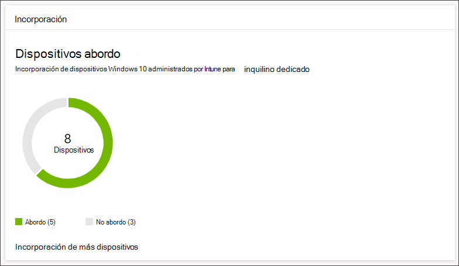
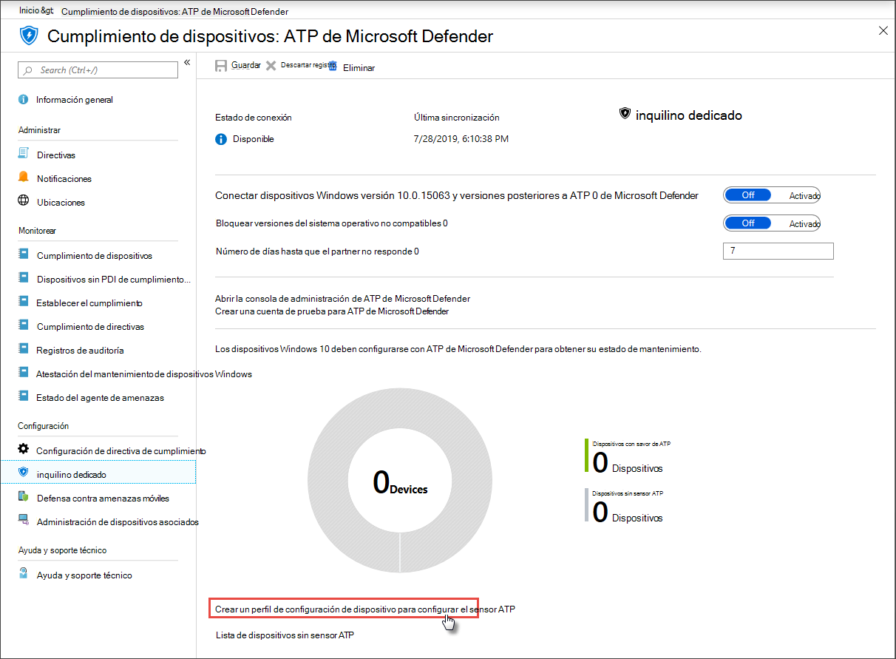

# Obtener dispositivos incorporados a Microsoft Defender para endpointGet devices onboarded to Microsoft Defender for Endpoint

[!INCLUDE [Microsoft 365 Defender rebranding](../../includes/microsoft-defender.md)]

**Se aplica a:****Applies to:**
- [Microsoft Defender para punto de conexiónMicrosoft Defender for Endpoint](https://go.microsoft.com/fwlink/p/?linkid=2154037)
- [Microsoft 365 DefenderMicrosoft 365 Defender](https://go.microsoft.com/fwlink/?linkid=2118804)

>¿Desea experimentar Microsoft Defender para endpoint?Want to experience Microsoft Defender for Endpoint? [Regístrate para obtener una versión de prueba gratuita.Sign up for a free trial.](https://www.microsoft.com/microsoft-365/windows/microsoft-defender-atp?ocid=docs-wdatp-onboardconfigure-abovefoldlink)

Cada dispositivo incorporado agrega un sensor de detección y respuesta de puntos de conexión (EDR) adicional y aumenta la visibilidad sobre la actividad de vulneración en la red.Each onboarded device adds an additional endpoint detection and response (EDR) sensor and increases visibility over breach activity in your network. La incorporación también garantiza que un dispositivo se pueda comprobar si hay componentes vulnerables, así como problemas de configuración de seguridad y puede recibir acciones críticas de corrección durante los ataques.Onboarding also ensures that a device can be checked for vulnerable components as well security configuration issues and can receive critical remediation actions during attacks.

Antes de poder realizar un seguimiento y administrar la incorporación de dispositivos:Before you can track and manage onboarding of devices:
- [Inscribir los dispositivos en la administración de IntuneEnroll your devices to Intune management](configure-machines.md#enroll-devices-to-intune-management)
- [Asegúrese de que tiene los permisos necesariosEnsure you have the necessary permissions](configure-machines.md#obtain-required-permissions)

## Detectar y realizar un seguimiento de dispositivos sin protecciónDiscover and track unprotected devices

La **tarjeta** de incorporación proporciona una descripción general de alto nivel de la tasa de incorporación comparando el número de dispositivos Windows 10 que se han incorporado realmente a Defender para Endpoint con el número total de dispositivos Windows 10 administrados por Intune.The **Onboarding** card provides a high-level overview of your onboarding rate by comparing the number of Windows 10 devices that have actually onboarded to Defender for Endpoint against the total number of Intune-managed Windows 10 devices.

 
*Tarjeta que muestra dispositivos incorporados en comparación con el número total de dispositivos Windows 10 administrados por Intune**Card showing onboarded devices compared to the total number of Intune-managed Windows 10 device*

>[!NOTE]
>Si usó Security Center Configuration Manager, el script de incorporación u otros métodos de incorporación que no usan perfiles de Intune, es posible que encuentre discrepancias de datos.If you used Security Center Configuration Manager, the onboarding script, or other onboarding methods that don’t use Intune profiles, you might encounter data discrepancies. Para resolver estas discrepancias, crea un perfil de configuración de Intune correspondiente para la incorporación de Defender for Endpoint y asigna ese perfil a los dispositivos.To resolve these discrepancies, create a corresponding Intune configuration profile for Defender for Endpoint onboarding and assign that profile to your devices.

## Incorporación de más dispositivos con perfiles de IntuneOnboard more devices with Intune profiles

Defender for Endpoint proporciona varias opciones convenientes para [incorporar dispositivos Windows 10.](onboard-configure.md)Defender for Endpoint provides several convenient options for [onboarding Windows 10 devices](onboard-configure.md). Sin embargo, en el caso de los dispositivos administrados por Intune, puede aprovechar los perfiles de Intune para implementar cómodamente el sensor Defender for Endpoint para seleccionar dispositivos, incorporando estos dispositivos de forma eficaz al servicio.For Intune-managed devices, however, you can leverage Intune profiles to conveniently deploy the Defender for Endpoint sensor to select devices, effectively onboarding these devices to the service.

En la **tarjeta incorporación,** selecciona **Incorporar más dispositivos** para crear y asignar un perfil en Intune.From the **Onboarding** card, select **Onboard more devices** to create and assign a profile on Intune. El vínculo te lleva a la página de cumplimiento del dispositivo en Intune, que proporciona una introducción similar al estado de incorporación.The link takes you to the device compliance page on Intune, which provides a similar overview of your onboarding state.

 
   *Página de cumplimiento de dispositivos ATP de Microsoft Defender en la administración de dispositivos de Intune**Microsoft Defender ATP device compliance page on Intune device management*

>[!TIP]
>Como alternativa, puede navegar a la página de cumplimiento de incorporación de Defender for Endpoint en [Microsoft Azure Portal](https://portal.azure.com/) desde Todos los servicios > Intune > Cumplimiento de dispositivos > ATP de Microsoft **Defender.**Alternatively, you can navigate to the Defender for Endpoint onboarding compliance page in the [Microsoft Azure portal](https://portal.azure.com/) from **All services > Intune > Device compliance > Microsoft Defender ATP**.

>[!NOTE]
> Si quieres ver los datos de dispositivo más actualizados, haz clic en Lista de **dispositivos sin sensor ATP**.If you want to view the most up-to-date device data, click on **List of devices without ATP sensor**.

Desde la página de cumplimiento del dispositivo, crea un perfil de configuración específicamente para la implementación del sensor Defender for Endpoint y asigna ese perfil a los dispositivos que quieras incorporar.From the device compliance page, create a configuration profile specifically for the deployment of the Defender for Endpoint sensor and assign that profile to the devices you want to onboard. Para ello, puede:To do this, you can either:

- Selecciona **Crear un perfil de configuración de dispositivo para configurar el sensor DE ATP** para empezar con un perfil de configuración de dispositivo predefinido.Select **Create a device configuration profile to configure ATP sensor** to start with a predefined device configuration profile.
- Crea el perfil de configuración del dispositivo desde cero.Create the device configuration profile from scratch.

Para obtener más información, [lea acerca del uso de perfiles](https://docs.microsoft.com/intune/advanced-threat-protection#onboard-devices-by-using-a-configuration-profile)de configuración de dispositivos de Intune para incorporar dispositivos a Defender para endpoint .For more information, [read about using Intune device configuration profiles to onboard devices to Defender for Endpoint](https://docs.microsoft.com/intune/advanced-threat-protection#onboard-devices-by-using-a-configuration-profile).

>¿Desea experimentar ATP de Microsoft Defender?Want to experience Microsoft Defender ATP? [Regístrate para obtener una versión de prueba gratuita.Sign up for a free trial.](https://www.microsoft.com/microsoft-365/windows/microsoft-defender-atp?ocid=docs-wdatp-onboardconfigure-belowfoldlink)

## Temas relacionadosRelated topics
- [Asegúrese de que los dispositivos estén configurados correctamenteEnsure your devices are configured properly](configure-machines.md)
- [Aumentar el cumplimiento de la línea base de seguridad de Defender for EndpointIncrease compliance to the Defender for Endpoint security baseline](configure-machines-security-baseline.md)
- [Optimizar la implementación y detecciones de reglas ASROptimize ASR rule deployment and detections](configure-machines-asr.md)
