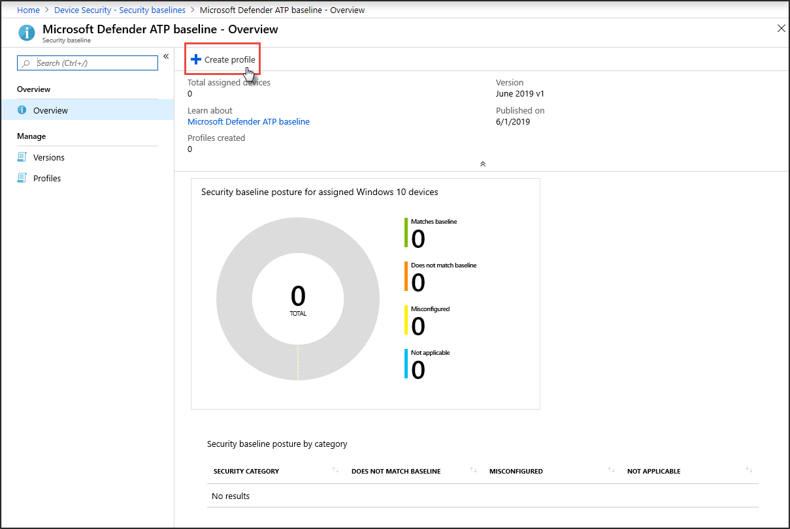

# Aumentar el cumplimiento de la línea base de seguridad de Microsoft Defender para endpoints

[!INCLUDE [Microsoft 365 Defender rebranding](../../includes/microsoft-defender.md)]

**Se aplica a:**
- [Microsoft Defender para punto de conexión](https://go.microsoft.com/fwlink/p/?linkid=2154037)
- [Microsoft 365 Defender](https://go.microsoft.com/fwlink/?linkid=2118804)

>¿Desea experimentar Defender for Endpoint? [Regístrate para obtener una versión de prueba gratuita.](https://www.microsoft.com/microsoft-365/windows/microsoft-defender-atp?ocid=docs-wdatp-onboardconfigure-abovefoldlink)

Las líneas base de seguridad garantizan que las características de seguridad estén configuradas de acuerdo con las instrucciones de expertos en seguridad y administradores expertos del sistema Windows. Cuando se implementa, la línea base de seguridad de Defender para endpoint establece los controles de seguridad de Defender for Endpoint para proporcionar una protección óptima.

Para comprender las líneas base de seguridad y cómo se asignan en Intune mediante perfiles de configuración, [lea estas preguntas más frecuentes](https://docs.microsoft.com/intune/security-baselines#q--a).

Antes de implementar y realizar un seguimiento del cumplimiento de las líneas base de seguridad:
- [Inscribir los dispositivos en la administración de Intune](configure-machines.md#enroll-devices-to-intune-management)
- [Asegúrese de que tiene los permisos necesarios](configure-machines.md#obtain-required-permissions)

## Comparar las líneas base de seguridad de Microsoft Defender para Endpoint y Windows Intune
La línea base de seguridad de Windows Intune proporciona un conjunto completo de opciones recomendadas necesarias para configurar de forma segura los dispositivos que ejecutan Windows, incluida la configuración del explorador, la configuración de PowerShell, así como la configuración de algunas características de seguridad como Antivirus de Microsoft Defender. En cambio, la línea base de Defender para punto de conexión proporciona opciones que optimizan todos los controles de seguridad de la pila defender para puntos de conexión, incluida la configuración para la detección y respuesta de puntos de conexión (EDR), así como la configuración que también se encuentra en la línea base de seguridad de Windows Intune. Para obtener más información acerca de cada línea base, vea:

- [Configuración de línea base de seguridad de Windows para Intune](https://docs.microsoft.com/intune/security-baseline-settings-windows)
- [Configuración de línea base de Microsoft Defender para Endpoint para Intune](https://docs.microsoft.com/intune/security-baseline-settings-defender-atp)

Lo ideal es que los dispositivos incorporados a Defender for Endpoint se implementen en ambas líneas base: la línea base de seguridad de Windows Intune para proteger inicialmente Windows y, a continuación, la línea base de seguridad de Defender para endpoints en capas superiores para configurar de forma óptima los controles de seguridad de Defender para endpoints. Para beneficiarse de los últimos datos sobre riesgos y amenazas y para minimizar los conflictos a medida que evolucionan las líneas base, aplique siempre las versiones más recientes de las líneas base en todos los productos tan pronto como se liberan.

>[!NOTE]
>La línea base de seguridad de Defender for Endpoint se ha optimizado para dispositivos físicos y actualmente no se recomienda su uso en máquinas virtuales (VM) o puntos de conexión VDI. Ciertas opciones de configuración de línea base pueden afectar a sesiones interactivas remotas en entornos virtualizados.

## Supervisar el cumplimiento de la línea base de seguridad de Defender for Endpoint

La tarjeta De  línea **base** de seguridad en la administración de configuración de dispositivos proporciona una introducción al cumplimiento en todos los dispositivos Windows 10 a los que se ha asignado la línea base de seguridad defender para puntos de conexión.

 
*Tarjeta que muestra el cumplimiento de la línea base de seguridad de Defender for Endpoint*

Cada dispositivo tiene uno de los siguientes tipos de estado:

- **Coincide con la línea** base: la configuración del dispositivo coincide con todas las opciones de la línea base
- **No coincide con la línea base:** al menos una configuración del dispositivo no coincide con la línea base
- **Mal configurado:** al menos una configuración de línea base no está configurada correctamente en el dispositivo y está en un estado de conflicto, error o pendiente
- **No aplicable:** al menos una configuración de línea base no es aplicable en el dispositivo

Para revisar dispositivos específicos, seleccione **Configurar la línea base de seguridad** en la tarjeta. Esto te lleva a la administración de dispositivos de Intune. Desde allí, selecciona **Estado del dispositivo** para los nombres y estados de los dispositivos.

>[!NOTE]
>Es posible que experimente discrepancias en los datos agregados que se muestran en la página de administración de configuración del dispositivo y en los que se muestran en pantallas de información general en Intune.

## Revisar y asignar la línea base de seguridad de Microsoft Defender para endpoint

La administración de configuración de dispositivos supervisa el cumplimiento previsto solo de dispositivos Windows 10 a los que se asignó específicamente la línea base de seguridad de Microsoft Defender para puntos de conexión. Puedes revisar cómodamente la línea base y asignarla a dispositivos en la administración de dispositivos de Intune.

1. Selecciona **Configurar la línea base de** seguridad en la tarjeta de **línea** base de seguridad para ir a Administración de dispositivos de Intune. Se muestra una descripción general similar del cumplimiento de la línea base.

   >[!TIP]
   > Como alternativa, puede navegar a la línea base de seguridad defender para puntos de conexión en Microsoft Azure Portal desde Todos los servicios > Intune > Seguridad del dispositivo > Líneas base de seguridad > línea base de ATP de **Microsoft Defender.**

2. Crear un perfil nuevo.

    
   *Introducción a la línea base de seguridad de Microsoft Defender para endpoints en Intune*

3. Durante la creación de perfiles, puede revisar y ajustar la configuración específica de la línea base.

    
   *Opciones de línea base de seguridad durante la creación de perfiles en Intune*

4. Asigna el perfil al grupo de dispositivos adecuado.

    
   *Asignar el perfil de línea base de seguridad en Intune*

5. Crea el perfil para guardarlo e implementarlo en el grupo de dispositivos asignado.

    
   *Creación del perfil de línea base de seguridad en Intune*

>[!TIP]
>Las líneas base de seguridad en Intune proporcionan una forma cómoda de proteger y proteger exhaustivamente los dispositivos. [Obtenga más información sobre las líneas base de seguridad en Intune](https://docs.microsoft.com/intune/security-baselines).

>¿Desea experimentar Microsoft Defender para endpoint? [Regístrate para obtener una versión de prueba gratuita.](https://www.microsoft.com/microsoft-365/windows/microsoft-defender-atp?ocid=docs-wdatp-onboardconfigure-belowfoldlink)

## Temas relacionados
- [Asegurarse de que los dispositivos estén configurados de manera adecuada](configure-machines.md)
- [Obtener dispositivos incorporados a Microsoft Defender para endpoint](configure-machines-onboarding.md)
- [Optimizar la implementación y detecciones de reglas ASR](configure-machines-asr.md)
