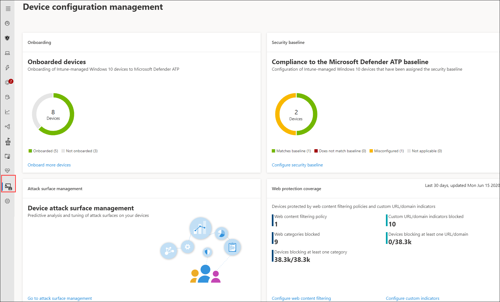

# Asegúrese de que los dispositivos estén configurados correctamente

[!INCLUDE [Microsoft 365 Defender rebranding](../../includes/microsoft-defender.md)]

**Se aplica a:**
- [Microsoft Defender para punto de conexión](https://go.microsoft.com/fwlink/p/?linkid=2154037)
- [Microsoft 365 Defender](https://go.microsoft.com/fwlink/?linkid=2118804)

>¿Desea experimentar Defender for Endpoint? [Regístrate para obtener una versión de prueba gratuita.](https://www.microsoft.com/microsoft-365/windows/microsoft-defender-atp?ocid=docs-wdatp-onboardconfigure-abovefoldlink)

Con dispositivos configurados correctamente, puedes aumentar la resistencia general frente a amenazas y mejorar tu capacidad para detectar y responder a los ataques. La administración de la configuración de seguridad ayuda a garantizar que los dispositivos:

- Incorporación a Microsoft Defender para endpoint
- Cumplir o superar la configuración de línea base de seguridad de Defender for Endpoint
- Tener mitigaciones de superficie de ataques estratégicos en su lugar

Haga **clic en Administración de** configuración en el menú de navegación para abrir la página Administración de configuración de dispositivos.

 
*Página de administración de configuración de dispositivos*

Puedes realizar un seguimiento del estado de configuración en un nivel organizativo y tomar medidas rápidamente en respuesta a una cobertura de incorporación deficiente, problemas de cumplimiento y mitigaciones de superficies de ataque mal optimizadas a través de vínculos directos y profundos a páginas de administración de dispositivos en Microsoft Intune y el centro de seguridad de Microsoft 365.

Al hacerlo, se beneficia de:
- Visibilidad completa de los eventos en los dispositivos
- Inteligencia de amenazas sólida y tecnologías de aprendizaje de dispositivos eficaces para procesar eventos sin procesar e identificar la actividad de vulneración y los indicadores de amenazas
- Una pila completa de características de seguridad configuradas para detener eficazmente la instalación de implantes malintencionados, el secuestro de archivos y procesos del sistema, la exfiltración de datos y otras actividades de amenazas
- Mitigaciones optimizadas de superficie de ataque, maximizando las defensas estratégicas contra la actividad de amenazas al mismo tiempo que minimiza el impacto en la productividad

## Inscribir dispositivos en la administración de Intune

La administración de configuración de dispositivos funciona estrechamente con la administración de dispositivos de Intune para establecer el inventario de los dispositivos de la organización y la configuración de seguridad de línea base. Podrás realizar un seguimiento y administrar problemas de configuración en dispositivos Windows 10 administrados por Intune.

Antes de garantizar que los dispositivos estén configurados correctamente, inscríbalos en la administración de Intune. La inscripción de Intune es sólida y tiene varias opciones de inscripción para dispositivos Windows 10. Para obtener más información acerca de las opciones de inscripción de Intune, lee sobre [cómo configurar la inscripción para dispositivos Windows](https://docs.microsoft.com/intune/windows-enroll).

>[!NOTE]
>Para inscribir dispositivos Windows en Intune, los administradores deben tener ya asignadas licencias. [Lea acerca de la asignación de licencias para la inscripción de dispositivos.](https://docs.microsoft.com/intune/licenses-assign)

>[!TIP] 
>Para optimizar la administración de dispositivos a través de Intune, [conecte Intune a Defender para endpoint](https://docs.microsoft.com/intune/advanced-threat-protection#enable-windows-defender-atp-in-intune).

## Obtener los permisos necesarios
De forma predeterminada, solo los usuarios a los que se haya asignado el rol Administrador global o administrador de servicio de Intune en Azure AD pueden administrar y asignar los perfiles de configuración de dispositivos necesarios para incorporar dispositivos e implementar la línea base de seguridad.

Si se le han asignado otros roles, asegúrese de que tiene los permisos necesarios:

- Permisos completos para configuraciones de dispositivos
- Permisos completos para las líneas base de seguridad
- Permisos de lectura para directivas de cumplimiento de dispositivos
- Permisos de lectura para la organización

 
*Permisos de configuración de dispositivos en Intune*

>[!TIP] 
>Para obtener más información sobre la asignación de permisos en Intune, [lea acerca de cómo crear roles personalizados](https://docs.microsoft.com/intune/create-custom-role#to-create-a-custom-role).

## En esta sección
Tema | Descripción
:---|:---
[Obtener dispositivos incorporados a Defender for Endpoint](configure-machines-onboarding.md)| Realice un seguimiento del estado de incorporación de dispositivos administrados por Intune e incorpore más dispositivos a través de Intune. 
[Aumentar el cumplimiento de la línea base de seguridad de Defender for Endpoint](configure-machines-security-baseline.md) | Realizar un seguimiento del cumplimiento de línea base y el incumplimiento. Implemente la línea base de seguridad en más dispositivos administrados por Intune.
[Optimizar la implementación y detecciones de reglas ASR](configure-machines-asr.md) | Revise la implementación de reglas y ajuste las detecciones con herramientas de análisis de impacto en el Centro de seguridad de Microsoft 365.

>¿Desea experimentar Defender for Endpoint? [Regístrate para obtener una versión de prueba gratuita.](https://www.microsoft.com/microsoft-365/windows/microsoft-defender-atp?ocid=docs-wdatp-onboardconfigure-belowfoldlink)
