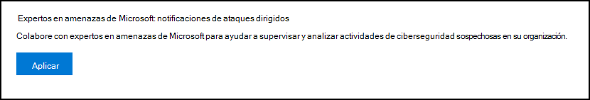
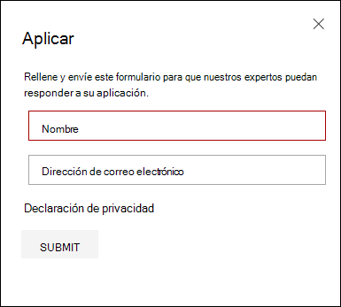
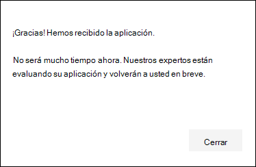
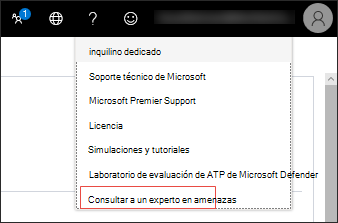
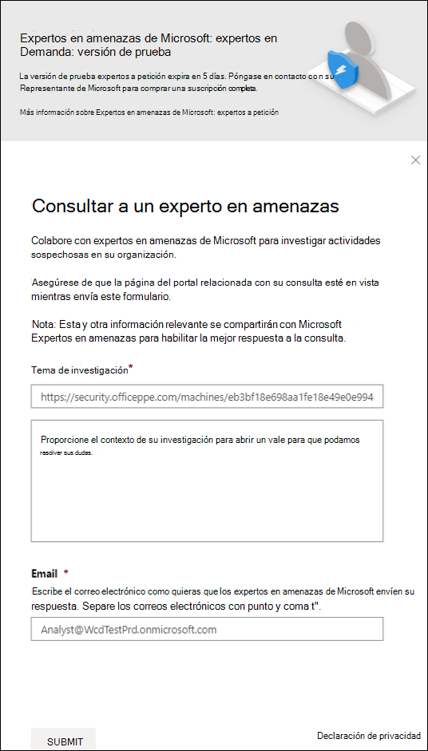
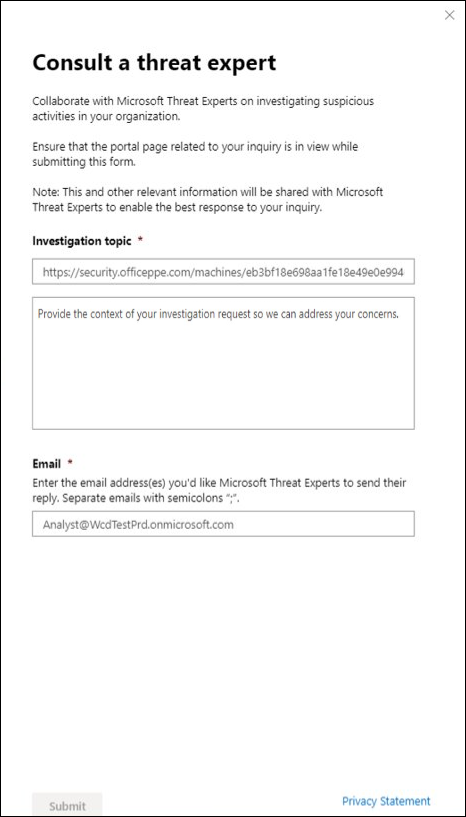

# Configurar y administrar las funcionalidades de Expertos en amenazas de Microsoft

[!INCLUDE [Microsoft 365 Defender rebranding](../../includes/microsoft-defender.md)]

**Se aplica a:**
- [Microsoft Defender para punto de conexión](https://go.microsoft.com/fwlink/p/?linkid=2154037)
- [Microsoft 365 Defender](https://go.microsoft.com/fwlink/?linkid=2118804)

>¿Desea experimentar Defender for Endpoint? [Regístrate para obtener una versión de prueba gratuita.](https://www.microsoft.com/microsoft-365/windows/microsoft-defender-atp?ocid=docs-wdatp-assignaccess-abovefoldlink)

## Antes de empezar 
> [!NOTE]
> Analice los requisitos de elegibilidad con el proveedor de servicios técnicos de Microsoft y el equipo de cuenta antes de aplicar a Expertos en amenazas de Microsoft: servicio de búsqueda de amenazas administradas por notificación de ataque dirigida.

Asegúrese de que Defender for Endpoint está implementado en su entorno con dispositivos inscritos y no solo en una configuración de laboratorio.

Si eres cliente de Defender for Endpoint, debes solicitar Expertos en amenazas de Microsoft- Notificaciones de **ataques dirigidos** para obtener información y análisis especiales para ayudar a identificar las amenazas más críticas, de modo que puedas responderlas rápidamente. Póngase en contacto con su equipo de cuenta o representante de Microsoft para suscribirse a **Expertos en amenazas de Microsoft:** expertos a petición para consultar con nuestros expertos en amenazas sobre detecciones y adversarias relevantes.

## Aplicar para Expertos en amenazas de Microsoft: servicio de notificaciones de ataques dirigidos 
Si ya eres cliente de Defender for Endpoint, puedes aplicar a través del Centro de seguridad de Microsoft Defender. 

1. En el panel de navegación, vaya a Configuración > General > Características avanzadas **> Expertos en amenazas de Microsoft: Notificaciones de ataques dirigidos**.

2. Haga clic en **Aplicar**.

    

3. Escriba su nombre y dirección de correo electrónico para que Microsoft pueda volver a usted en la aplicación.

    

4. Lea la [declaración de privacidad](https://privacy.microsoft.com/en-us/privacystatement)y, a continuación, haga clic en **Enviar** cuando haya terminado. Recibirá un correo electrónico de bienvenida una vez que se apruebe la aplicación.

    

Cuando se acepte, recibirá un correo electrónico  de bienvenida y verá el cambio del botón Aplicar a una alternancia que está "activa". En caso de que quieras salir del servicio de notificaciones de ataques  dirigidos, desliza el botón de alternancia "desactivado" y haz clic en Guardar preferencias en la parte inferior de la página. 

## Donde verás las notificaciones de ataques dirigidos desde Expertos en amenazas de Microsoft 
Puedes recibir una notificación de ataque dirigida desde Expertos en amenazas de Microsoft a través del siguiente medio:  
- Página Incidentes del portal defender para el punto de **conexión** 
- Panel de alertas del portal defender para el punto **de** conexión  
- API de alerta [de](/windows/security/threat-protection/microsoft-defender-atp/get-alerts) OData y API de [REST](/windows/security/threat-protection/microsoft-defender-atp/pull-alerts-using-rest-api)
- [Tabla DeviceAlertEvents](/windows/security/threat-protection/microsoft-defender-atp/advanced-hunting-devicealertevents-table) en búsqueda avanzada
- Su correo electrónico, si decide configurarlo 

Para recibir notificaciones de ataque dirigidas por correo electrónico, crea una regla de notificación de correo electrónico.

### Crear una regla de notificación de correo electrónico 
Puede crear reglas para enviar notificaciones por correo electrónico para los destinatarios de notificaciones. Consulte  [Configurar notificaciones de alerta para](configure-email-notifications.md) crear, editar, eliminar o solucionar problemas de notificación de correo electrónico, para obtener más información.

## Ver la notificación de ataque dirigido  
Empezarás a recibir una notificación de ataque dirigida Expertos en amenazas de Microsoft en tu correo electrónico después de configurar el sistema para recibir una notificación por correo electrónico.  

1. Haga clic en el vínculo del correo electrónico para ir al contexto de alerta correspondiente en el panel etiquetado con **expertos en amenazas.** 

2. En el panel, seleccione el mismo tema de alerta que obtuvo del correo electrónico para ver los detalles.  

## Suscribirse a Expertos en amenazas de Microsoft: expertos a petición
Está disponible como servicio de suscripción. Si ya eres cliente de Defender for Endpoint, puedes ponerse en contacto con tu representante de Microsoft para suscribirte a Expertos en amenazas de Microsoft - Expertos a petición. 

## Consulte a un experto en amenazas de Microsoft sobre actividades de ciberseguridad sospechosas en su organización 
Puede asociarse con Expertos en amenazas de Microsoft que pueden participar directamente desde dentro del Centro de seguridad de Microsoft Defender para obtener una respuesta rápida y precisa. Los expertos proporcionan información para comprender mejor las amenazas complejas, las notificaciones de ataque dirigidas que recibes o si necesitas más información sobre las alertas, un dispositivo potencialmente comprometido o un contexto de inteligencia de amenazas que ves en el panel del portal. 

> [!NOTE]
> - Actualmente, no se admiten las consultas de alerta relacionadas con los datos de inteligencia de amenazas personalizados de la organización. Consulte a su equipo de operaciones de seguridad o respuesta a incidentes para obtener más información.
> - Debe tener el permiso Administrar la configuración **de** seguridad en el portal del Centro de seguridad para poder enviar una consulta "Consulte a un experto en amenazas".

1. Vaya a la página del portal con la información relevante que le gustaría investigar, por ejemplo, la página **Incidentes.** Asegúrate de que la página de la alerta o dispositivo relevante esté en vista antes de enviar una solicitud de investigación. 

2. En el menú superior derecho, haga clic en **?** . A continuación, **seleccione Consultar a un experto en amenazas.** 

    

    Se abre una pantalla desplegable. En la siguiente pantalla se muestra cuándo está en una suscripción de prueba.

    

    En la siguiente pantalla se muestra cuándo está en una suscripción Expertos en amenazas de Microsoft- Expertos a petición.

    

    El **campo Tema de** consulta se rellena previamente con el vínculo a la página correspondiente para la solicitud de investigación. Por ejemplo, un vínculo a la página de detalles del incidente, alerta o dispositivo en la que estaba cuando realizó la solicitud.

3.  En el siguiente campo, proporcione información suficiente para proporcionar al Expertos en amenazas de Microsoft suficiente contexto para iniciar la investigación.
  
4. Escriba la dirección de correo electrónico que desea usar para que se corresponda con Expertos en amenazas de Microsoft.

> [!NOTE]
> Si desea realizar un seguimiento del estado de los casos de expertos a petición a través del Centro de servicios de Microsoft, comunicarse con el Administrador técnico de cuentas. 

Vea este vídeo para obtener una introducción rápida al Centro de servicios de Microsoft.

>[!VIDEO https://www.microsoft.com/videoplayer/embed/RE4pk9f] 

   
## Temas de investigación de ejemplo que puede consultar con Expertos en amenazas de Microsoft: Expertos a petición 

**Información de alerta**
- Vemos un nuevo tipo de alerta para un binario vivo fuera de la tierra: [AlertID]. ¿Puede decirnos algo más sobre esta alerta y cómo podemos investigar más?
- Hemos observado dos ataques similares, que intentan ejecutar scripts de PowerShell malintencionados pero generan alertas diferentes. Una es "Línea de comandos sospechosa de PowerShell" y la otra es "Se detectó un archivo malintencionado en función de la indicación proporcionada por O365". ¿Cuál es la diferencia?
- Recibo una alerta impar hoy por el número anormal de inicios de sesión con errores desde el dispositivo de un usuario de perfil alto. No puedo encontrar más evidencias en torno a estos intentos de inicio de sesión. ¿Cómo puede Defender for Endpoint ver estos intentos? ¿Qué tipo de inicios de sesión se están supervisando?
- Puede proporcionar más contexto o información sobre esta alerta: "Se observó un comportamiento sospechoso por parte de una utilidad del sistema". 

**Posible peligro de máquina**
- ¿Puede ayudar a responder por qué vemos "Proceso desconocido observado?" Este mensaje o alerta se ve con frecuencia en muchos dispositivos. Agradecemos cualquier entrada para aclarar si este mensaje o alerta está relacionado con actividad malintencionada.
- ¿Puede ayudar a validar un posible compromiso en el siguiente sistema en [fecha] con comportamientos similares a la detección de malware anterior [nombre de malware] en el mismo sistema en [mes]?

**Detalles de inteligencia de amenazas**
- Se detectó un correo electrónico de suplantación de identidad (phishing) que entregaba un documento malintencionado de Word a un usuario. El documento malintencionado de Word provocó una serie de eventos sospechosos, que desencadenaron varias alertas de Microsoft Defender para malware [nombre de malware]. ¿Tiene información sobre este malware? Si es así, ¿puede enviarme un vínculo?
- Recientemente vi una publicación [referencia a redes sociales, por ejemplo, Twitter o blog] sobre una amenaza dirigida a mi sector. ¿Me puede ayudar a comprender qué protección proporciona Defender for Endpoint contra este actor de amenazas? 

**Expertos en amenazas de Microsoft de alertas** 
- ¿Puede su equipo de respuesta a incidentes ayudarnos a solucionar la notificación de ataque dirigida que tenemos?
- Recibí esta notificación de ataque dirigido desde Expertos en amenazas de Microsoft. No tenemos nuestro propio equipo de respuesta a incidentes. ¿Qué podemos hacer ahora y cómo podemos contener el incidente?
- Recibí una notificación de ataque dirigida de Expertos en amenazas de Microsoft. ¿Qué datos nos puede proporcionar que podamos transmitir a nuestro equipo de respuesta a incidentes?

  >[!NOTE]
  >Expertos en amenazas de Microsoft es un servicio de búsqueda de ciberseguridad administrado y no un servicio de respuesta a incidentes. Sin embargo, los expertos pueden realizar una transición sin problemas de la investigación a los servicios del Equipo de detección y respuesta (DART) de Microsoft Cybersecurity Solutions Group (CSG), cuando sea necesario. También puede optar por interactuar con su propio equipo de respuesta a incidentes para solucionar problemas que requieren una respuesta a incidentes. 

## Escenario

### Recibir un informe de progreso sobre la consulta de búsqueda administrada 
La respuesta Expertos en amenazas de Microsoft varía según la consulta. En un plazo de dos  días, le enviarán un informe de progreso sobre la consulta de un experto en amenazas para comunicar el estado de la investigación de las siguientes categorías: 
- Se necesita más información para continuar con la investigación 
- Se necesita un archivo o varios ejemplos de archivos para determinar el contexto técnico 
- La investigación requiere más tiempo   
- La información inicial era suficiente para concluir la investigación 

Es fundamental responder rápidamente para que la investigación siga avanzando. 

## Tema relacionado
- [Información general sobre Expertos en amenazas de Microsoft](microsoft-threat-experts.md)
- [Expertos en amenazas de Microsoft en Microsoft 365 información general](/microsoft-365/security/mtp/microsoft-threat-experts)
