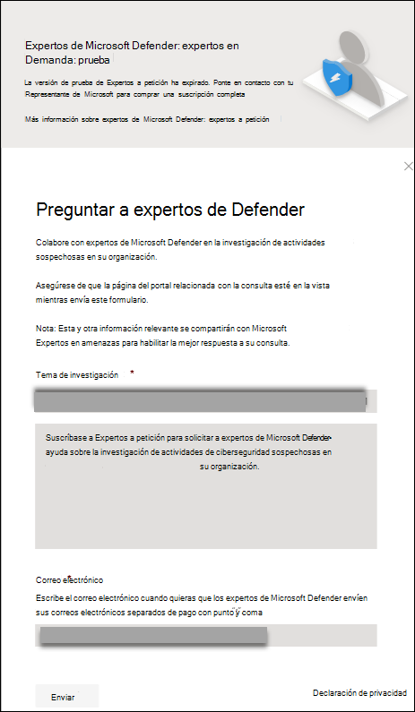

# Configurar y administrar las funcionalidades de Expertos en amenazas de Microsoft

[!INCLUDE [Microsoft 365 Defender rebranding](../../includes/microsoft-defender.md)]

**Se aplica a:**

- [Microsoft Defender para punto de conexión Plan 2](https://go.microsoft.com/fwlink/p/?linkid=2154037)
- [Microsoft 365 Defender](https://go.microsoft.com/fwlink/?linkid=2118804)

> ¿Quiere experimentar Defender para punto de conexión? [Regístrese para obtener una prueba gratuita.](https://signup.microsoft.com/create-account/signup?products=7f379fee-c4f9-4278-b0a1-e4c8c2fcdf7e&ru=https://aka.ms/MDEp2OpenTrial?ocid=docs-wdatp-assignaccess-abovefoldlink)

## Antes de empezar

> [!NOTE]
> Analice los requisitos de idoneidad con el proveedor de servicios técnicos de Microsoft y el equipo de cuentas antes de aplicar al servicio de búsqueda de amenazas administrada de notificaciones de ataque de punto de conexión.

Asegúrese de que defender para punto de conexión implementado en su entorno con dispositivos inscritos y no solo en una configuración de laboratorio.

Si es cliente de Defender para punto de conexión, debe solicitar **notificaciones de ataque de punto de conexión** para obtener información y análisis especiales que ayuden a identificar las amenazas más críticas, de modo que pueda responder a ellas rápidamente. Póngase en contacto con el equipo de su cuenta o con el representante de Microsoft para suscribirse a **Expertos en amenazas de Microsoft- Experts on Demand** para consultar a nuestros expertos en amenazas sobre las detecciones y adversarios pertinentes.

## Solicitud para el servicio de notificaciones de ataque de punto de conexión

Si ya es cliente de Defender para punto de conexión, puede aplicar a través del portal de Microsoft 365 Defender.

1. En el panel de navegación, vaya a **Configuración > General > Características avanzadas > Notificaciones de ataque de punto de conexión**.

2. Haga clic en **Aplicar**.

   :::image type="content" source="images/mte-collaboratewithmte.png" alt-text="Configuración de Expertos en amenazas de Microsoft" lightbox="images/mte-collaboratewithmte.png":::

3. Escriba su nombre y dirección de correo electrónico para que Microsoft pueda volver a usted en la aplicación.

   :::image type="content" source="images/mte-apply.png" alt-text="Campo Nombre en la página de la aplicación Expertos en amenazas de Microsoft" lightbox="images/mte-apply.png":::

4. Lea la [declaración de privacidad](https://privacy.microsoft.com/privacystatement) y haga clic en **Enviar** cuando haya terminado. Recibirá un correo electrónico de bienvenida una vez aprobada la aplicación.

   :::image type="content" source="images/mte-applicationconfirmation.png" alt-text="Mensaje de confirmación de la aplicación Expertos en amenazas de Microsoft" lightbox="images/mte-applicationconfirmation.png":::

Cuando se acepte, recibirá un correo electrónico de bienvenida y verá que el botón **Aplicar** cambia a un botón de alternancia que está "activado". En caso de que quiera salir del servicio notificaciones de ataque de punto de conexión, deslice el botón de alternancia "desactivado" y haga clic en **Guardar preferencias** en la parte inferior de la página.

## Donde verá las notificaciones de ataque de punto de conexión de Expertos en amenazas de Microsoft

Puede recibir una notificación de ataque dirigida desde Expertos en amenazas de Microsoft a través del siguiente medio:

- Página **Incidentes** del portal de Defender para punto de conexión
- Panel **de alertas** del portal de Defender para punto de conexión
- [API](/windows/security/threat-protection/microsoft-defender-atp/get-alerts) de alertas de OData y [API REST](/windows/security/threat-protection/microsoft-defender-atp/pull-alerts-using-rest-api)
- [Tabla DeviceAlertEvents](/windows/security/threat-protection/microsoft-defender-atp/advanced-hunting-devicealertevents-table) en búsqueda avanzada
- Su correo electrónico, si decide configurarlo

Para recibir notificaciones de ataque de punto de conexión por correo electrónico, cree una regla de notificación por correo electrónico.

### Creación de una regla de notificación por correo electrónico

Puede crear reglas para enviar notificaciones por correo electrónico para los destinatarios de notificaciones. Consulte  [Configuración de notificaciones de alerta](configure-email-notifications.md) para crear, editar, eliminar o solucionar problemas de notificaciones por correo electrónico para obtener más información.

## Visualización de las notificaciones de ataque de punto de conexión

Empezará a recibir notificaciones de ataque de punto de conexión de Expertos en amenazas de Microsoft en el correo electrónico después de configurar el sistema para recibir notificaciones por correo electrónico.

1. Haga clic en el vínculo del correo electrónico para ir al contexto de alerta correspondiente en el panel etiquetado con **expertos en amenazas**.

2. En el panel, seleccione el mismo tema de alerta que obtuvo del correo electrónico para ver los detalles.

### Filtrar para ver solo las notificaciones de ataque de punto de conexión

Puede filtrar los incidentes y las alertas si solo quiere ver las notificaciones de ataque de punto de conexión entre las muchas alertas. Para ello:

1. En el menú de navegación, vaya a **Incidentes & alertas** > **alertas**/ de incidentes > seleccione el  de Defender.
2. Desplácese hacia abajo hasta el campo Etiquetas > active la casilla **Expertos de Defender** .
3. Seleccione **Aplicar**.

## Suscribirse a Expertos en amenazas de Microsoft: expertos a petición

Está disponible como servicio de suscripción. Si ya es cliente de Defender para punto de conexión, puede ponerse en contacto con su representante de Microsoft para suscribirse a Expertos en amenazas de Microsoft - Experts on Demand.
> [!NOTE]
> Expertos a petición no es un servicio de respuesta a incidentes de seguridad. Está pensado para proporcionar una mejor comprensión de las amenazas complejas que afectan a su organización. Póngase en contacto con su propio equipo de respuesta a incidentes de seguridad para solucionar problemas urgentes de respuesta a incidentes de seguridad. Si no tiene su propio equipo de respuesta a incidentes de seguridad y desea la ayuda de Microsoft, cree una solicitud de soporte técnico en el [Centro de servicios Premier](/services-hub/).

## Pregunte a expertos de Defender sobre actividades sospechosas de ciberseguridad en su organización

Puede asociarse con Expertos en amenazas de Microsoft que pueden participar directamente desde el portal de Microsoft 365 Defender para su respuesta. Los expertos proporcionan información para comprender mejor las amenazas complejas, las notificaciones de ataque dirigidas que recibe o si necesita más información sobre las alertas, un dispositivo potencialmente en peligro o un contexto de inteligencia sobre amenazas que vea en el panel del portal.

> [!NOTE]
>
> - Actualmente no se admiten las consultas de alerta relacionadas con los datos personalizados de inteligencia sobre amenazas de la organización. Consulte a su equipo de operaciones de seguridad o respuesta a incidentes para obtener más información.
> - Debe tener el permiso **Administrar la configuración de seguridad** en el portal de Microsoft 365 Defender para poder enviar la consulta Preguntar a **expertos de Defender**.

1. Vaya a la página del portal con la información pertinente que le gustaría investigar, por ejemplo, la página **Incidente** . Asegúrese de que la página de la alerta o dispositivo pertinente esté en vista antes de enviar una solicitud de investigación.

2. En el menú superior derecho, haga clic en **?** . A continuación, seleccione **Preguntar a expertos de Defender.**

Se abre una pantalla flotante. En la pantalla siguiente se muestra cuándo está en una suscripción de prueba. En la siguiente pantalla se muestra cuándo está en una suscripción completa Expertos en amenazas de Microsoft - Experts on Demand.

El campo **Tema de consulta** se rellena previamente con el vínculo a la página correspondiente para la solicitud de investigación. Por ejemplo, un vínculo a la página de detalles del dispositivo, alerta o incidente en la que se encontraba cuando realizó la solicitud.

3. En el campo siguiente, proporcione suficiente información para proporcionar al Expertos en amenazas de Microsoft contexto suficiente para iniciar la investigación.

4. Escriba la dirección de correo electrónico que desea usar para que se corresponda con Expertos en amenazas de Microsoft.

> [!NOTE]
> Si desea realizar un seguimiento del estado de los casos de Expertos a petición a través de Microsoft Services Hub, póngase en contacto con el Administrador de cuentas de éxito del cliente.

Vea este vídeo para obtener una introducción rápida al Centro de servicios de Microsoft.

> [!VIDEO <https://www.microsoft.com/videoplayer/embed/RE4pk9f>]

## Temas de investigación de ejemplo que puede consultar con Expertos en amenazas de Microsoft: Expertos a petición

### Información de alerta

- Vemos un nuevo tipo de alerta para un binario que se encuentra fuera de la tierra: [AlertID]. ¿Puede decirnos algo más sobre esta alerta y cómo podemos investigar más?
- Hemos observado dos ataques similares, que intentan ejecutar scripts malintencionados de PowerShell pero generan alertas diferentes. Una es "Línea de comandos de PowerShell sospechosa" y la otra es "Se detectó un archivo malintencionado en función de la indicación proporcionada por O365". ¿Cuál es la diferencia?
- Recibo una alerta impar hoy por el número anómalo de inicios de sesión erróneos desde el dispositivo de un usuario de alto perfil. No puedo encontrar más pruebas en torno a estos intentos de inicio de sesión. ¿Cómo puede Defender para punto de conexión ver estos intentos? ¿Qué tipo de inicios de sesión se están supervisando?
- Puede proporcionar más contexto o conclusiones sobre esta alerta: "Se observó un comportamiento sospechoso por parte de una utilidad del sistema".

### Posible peligro del dispositivo

- ¿Puede ayudar a responder por qué vemos "Proceso desconocido observado?" Este mensaje o alerta se ve con frecuencia en muchos dispositivos. Agradecemos cualquier entrada para aclarar si este mensaje o alerta está relacionado con la actividad malintencionada.
- ¿Puede ayudar a validar un posible riesgo en el siguiente sistema en [fecha] con comportamientos similares a los de la detección de malware anterior [nombre de malware] en el mismo sistema en [mes]?

### Detalles de inteligencia sobre amenazas

- Hemos detectado un correo electrónico de suplantación de identidad (phishing) que ha entregado un documento de Word malintencionado a un usuario. El documento malintencionado de Word produjo una serie de eventos sospechosos, que desencadenaron varias alertas de notificaciones de ataque de punto de conexión para el malware [nombre de malware]. ¿Tiene alguna información sobre este malware? Si es así, ¿puedes enviarme un enlace?
- Recientemente vi una entrada [referencia de redes sociales, por ejemplo, Twitter o blog] sobre una amenaza que está dirigida a mi sector. ¿Puede ayudarme a comprender qué protección proporciona Defender para punto de conexión frente a este actor de amenazas?

### Comunicaciones de alerta de expertos de Defender

- ¿Puede el equipo de respuesta a incidentes ayudarnos a abordar las notificaciones de ataque de punto de conexión que tenemos?
- He recibido las notificaciones de ataque de punto de conexión de Expertos en amenazas de Microsoft. No tenemos nuestro propio equipo de respuesta a incidentes. ¿Qué podemos hacer ahora y cómo podemos contener el incidente?
- He recibido notificaciones de ataque de punto de conexión de Expertos en amenazas de Microsoft. ¿Qué datos puede proporcionarnos que podemos pasar a nuestro equipo de respuesta a incidentes?

  > [!NOTE]
  > Expertos en amenazas de Microsoft es un servicio administrado de búsqueda de ciberseguridad y no un servicio de respuesta a incidentes. Sin embargo, puede interactuar con su propio equipo de respuesta a incidentes para abordar los problemas que requieren una respuesta a incidentes. Si no tiene su propio equipo de respuesta a incidentes y desea la ayuda de Microsoft, puede interactuar con el equipo de respuesta a incidentes de ciberseguridad (CIRT) de CSS. Pueden abrir una incidencia para ayudar a abordar su consulta.

## Escenario

### Recepción de un informe de progreso sobre la consulta de búsqueda administrada

La respuesta de Expertos en amenazas de Microsoft varía según su consulta. Le enviarán por correo electrónico un informe de progreso sobre la consulta **de expertos de Ask Defender** en un plazo de dos días para comunicar el estado de la investigación de las siguientes categorías:

- Se necesita más información para continuar con la investigación
- Se necesita un archivo o varios ejemplos de archivo para determinar el contexto técnico
- La investigación requiere más tiempo
- La información inicial fue suficiente para concluir la investigación

Es fundamental responder rápidamente para mantener la investigación en movimiento.

#### Para buscar amenazas de forma proactiva entre puntos de conexión, Office 365, aplicaciones en la nube e identidad, consulte

- [Información general sobre expertos de Microsoft Defender en Microsoft 365](../defender/defender-experts-for-hunting.md)
