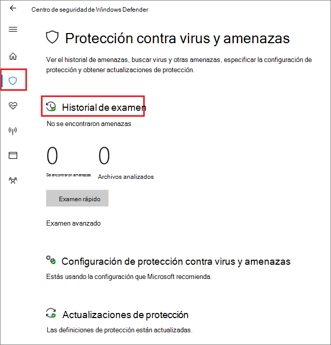

# <a name="configure-and-validate-microsoft-defender-antivirus-network-connections"></a>Configurar y validar las conexiones de red del Antivirus de Windows Defender

[!INCLUDE [Microsoft 365 Defender rebranding](../../includes/microsoft-defender.md)]


**Se aplica a:**

- [Microsoft Defender para punto de conexión](/microsoft-365/security/defender-endpoint/)

Para asegurarse de que la protección en la nube de Antivirus de Microsoft Defender funciona correctamente, debe configurar la red para permitir conexiones entre los puntos de conexión y determinados servidores de Microsoft.

En este artículo se enumeran las conexiones que se deben permitir, como mediante reglas de firewall, y se proporcionan instrucciones para validar la conexión. La configuración correcta de la protección ayuda a garantizar que recibe el mejor valor de los servicios de protección entregados en la nube.

Consulta la entrada de blog [Cambios importantes en el punto](https://techcommunity.microsoft.com/t5/Configuration-Manager-Archive/Important-changes-to-Microsoft-Active-Protection-Service-MAPS/ba-p/274006) de conexión de Microsoft Active Protection Services para obtener algunos detalles sobre la conectividad de red.

>[!TIP]
>También puede visitar el sitio web de demostración de Microsoft Defender para endpoint [en demo.wd.microsoft.com](https://demo.wd.microsoft.com?ocid=cx-wddocs-testground) para confirmar que funcionan las siguientes características:
>
>- Protección entregada en la nube
>- Aprendizaje rápido (incluido el bloqueo a primera vista)
>- Bloqueo de aplicaciones potencialmente no deseado

## <a name="allow-connections-to-the-microsoft-defender-antivirus-cloud-service"></a>Permitir conexiones al servicio en la nube de Antivirus de Microsoft Defender

El servicio en la nube de Antivirus de Microsoft Defender proporciona una protección rápida y segura para los puntos de conexión. Habilitar el servicio de protección entregado en la nube es opcional, pero es muy recomendable porque proporciona protección importante contra malware en los puntos de conexión y en toda la red.

>[!NOTE]
>El servicio en la nube de Antivirus de Microsoft Defender es un mecanismo para ofrecer protección actualizada a la red y los puntos de conexión. Aunque se denomina servicio en la nube, no es simplemente protección para los archivos almacenados en la nube, sino que usa recursos distribuidos y aprendizaje automático para ofrecer protección a los puntos de conexión a una velocidad mucho más rápida que las actualizaciones de inteligencia de seguridad tradicionales.

Consulte [Enable cloud-delivered protection](enable-cloud-protection-microsoft-defender-antivirus.md) para obtener más información sobre cómo habilitar el servicio con Intune, Microsoft Endpoint Configuration Manager, directiva de grupo, cmdlets de PowerShell o en clientes individuales en la aplicación seguridad de Windows. 

Después de habilitar el servicio, es posible que deba configurar la red o firewall para permitir conexiones entre él y los puntos de conexión.

Dado que la protección es un servicio en la nube, los equipos deben tener acceso a Internet y llegar a los servicios de aprendizaje automático de Microsoft Defender para Office 365. No excluya la dirección URL `*.blob.core.windows.net` de ningún tipo de inspección de red. 

En la tabla siguiente se enumeran los servicios y sus direcciones URL asociadas. Asegúrese de que no hay reglas de filtrado de red o firewall que denieguen el acceso a estas direcciones URL, o puede que necesite crear una regla de permitido específicamente para ellas (excluyendo la dirección `*.blob.core.windows.net` URL). A continuación se menciona que las direcciones URL usan el puerto 443 para la comunicación.


| **Servicio**| **Descripción** |**URL** |
| :--: | :-- | :-- |
| Servicio de protección entregado en la nube de Antivirus de Microsoft Defender, también conocido como Servicio de Protección activa de Microsoft (MAPS)|Usado por Microsoft Defender Antivirus para proporcionar protección entregada en la nube|`*.wdcp.microsoft.com` <br/> `*.wdcpalt.microsoft.com` <br/> `*.wd.microsoft.com`|
| Servicio de Microsoft Update (MU) <br/> Servicio de Windows Update (WU)|  Inteligencia de seguridad y actualizaciones de productos   |`*.update.microsoft.com` <br/> `*.delivery.mp.microsoft.com`<br/> `*.windowsupdate.com` <br/><br/> Para obtener más [información, consulta Connection endpoints for Windows Update](/windows/privacy/manage-windows-1709-endpoints#windows-update)|
|Actualizaciones de inteligencia de seguridad Ubicación alternativa de descarga (ADL)|   Ubicación alternativa para las actualizaciones de inteligencia de Seguridad antivirus de Microsoft Defender si la inteligencia de seguridad instalada no está actualizada (7 o más días después)|    `*.download.microsoft.com`  </br> `*.download.windowsupdate.com`</br> `https://fe3cr.delivery.mp.microsoft.com/ClientWebService/client.asmx`|
| Almacenamiento de envío de malware|Ubicación de carga de los archivos enviados a Microsoft mediante el formulario de envío o el envío automático de ejemplo    | `ussus1eastprod.blob.core.windows.net` <br/>    `ussus2eastprod.blob.core.windows.net` <br/>    `ussus3eastprod.blob.core.windows.net` <br/>    `ussus4eastprod.blob.core.windows.net` <br/>    `wsus1eastprod.blob.core.windows.net` <br/>    `wsus2eastprod.blob.core.windows.net` <br/>    `ussus1westprod.blob.core.windows.net` <br/>    `ussus2westprod.blob.core.windows.net` <br/>    `ussus3westprod.blob.core.windows.net` <br/>    `ussus4westprod.blob.core.windows.net` <br/>    `wsus1westprod.blob.core.windows.net` <br/>    `wsus2westprod.blob.core.windows.net` <br/>    `usseu1northprod.blob.core.windows.net` <br/>    `wseu1northprod.blob.core.windows.net` <br/>    `usseu1westprod.blob.core.windows.net` <br/>    `wseu1westprod.blob.core.windows.net` <br/>    `ussuk1southprod.blob.core.windows.net` <br/>    `wsuk1southprod.blob.core.windows.net` <br/>    `ussuk1westprod.blob.core.windows.net` <br/>    `wsuk1westprod.blob.core.windows.net` |
| Lista de revocación de certificados (CRL)|Usado por Windows al crear la conexión SSL a MAPS para actualizar la CRL   | `http://www.microsoft.com/pkiops/crl/` <br/> `http://www.microsoft.com/pkiops/certs` <br/>   `http://crl.microsoft.com/pki/crl/products` <br/> `http://www.microsoft.com/pki/certs` |
| Almacén de símbolos|Usado por Microsoft Defender Antivirus para restaurar determinados archivos críticos durante los flujos de corrección  | `https://msdl.microsoft.com/download/symbols` |
| Cliente de telemetría universal| Usado por Windows para enviar datos de diagnóstico de cliente; Antivirus de Microsoft Defender usa telemetría con fines de supervisión de la calidad del producto   | La actualización usa SSL (puerto TCP 443) para descargar manifiestos y cargar datos de diagnóstico en Microsoft que usa los siguientes extremos DNS:   `vortex-win.data.microsoft.com` <br/>   `settings-win.data.microsoft.com`|

## <a name="validate-connections-between-your-network-and-the-cloud"></a>Validar conexiones entre la red y la nube

Después de permitir las direcciones URL enumeradas anteriormente, puede probar si está conectado al servicio en la nube de Antivirus de Microsoft Defender y está informando y recibiendo información correctamente para asegurarse de que está totalmente protegido.

**Use la herramienta cmdline para validar la protección entregada en la nube:**

Use el siguiente argumento con la utilidad de línea de comandos antivirus de Microsoft Defender ( ) para comprobar que la red se puede comunicar con el servicio en la nube `mpcmdrun.exe` antivirus de Microsoft Defender:

```console
"%ProgramFiles%\Windows Defender\MpCmdRun.exe" -ValidateMapsConnection
```

> [!NOTE]
> Debe abrir una versión de nivel de administrador del símbolo del sistema. Haga clic con el botón secundario en el elemento del menú Inicio, haga clic **en Ejecutar como administrador** y haga clic en Sí **en** el símbolo del sistema de permisos. Este comando solo funcionará en Windows 10, versión 1703 o posterior.

Para obtener más información, vea [Manage Microsoft Defender Antivirus with the mpcmdrun.exe commandline tool](command-line-arguments-microsoft-defender-antivirus.md).

**Intentar descargar un archivo de malware falso de Microsoft:**

Puedes descargar un archivo de ejemplo que Antivirus de Microsoft Defender detectará y bloqueará si estás conectado correctamente a la nube.

Descargue el archivo visitando [https://aka.ms/ioavtest](https://aka.ms/ioavtest) .

>[!NOTE]
>Este archivo no es una parte real de malware. Es un archivo falso que está diseñado para probar si estás conectado correctamente a la nube.

Si estás conectado correctamente, verás una notificación de Antivirus de Microsoft Defender de advertencia.

Si usa Microsoft Edge, también verá un mensaje de notificación:


Si usa Internet Explorer, se produce un mensaje similar:


También verás una detección en **Amenazas** en cuarentena en **la** sección Historial de análisis de la aplicación Seguridad de Windows:

1. Abre la aplicación Seguridad de Windows haciendo clic en el icono de escudo de la barra de tareas o buscando en el menú inicio de **Defender**.

2. Seleccione el **icono Protección contra &** virus (o el icono de escudo de la barra de menús izquierda) y, a continuación, la etiqueta Historial **de** análisis:

    

3. En la **sección Amenazas en** cuarentena, seleccione Ver historial **completo** para ver el malware falso detectado.

   > [!NOTE]
   > Las versiones de Windows 10 anteriores a la versión 1703 tienen una interfaz de usuario diferente. Consulta [Antivirus de Microsoft Defender en la aplicación seguridad de Windows](microsoft-defender-security-center-antivirus.md).

   El registro de eventos de Windows también mostrará Windows Defender [identificador de evento de cliente 1116](troubleshoot-microsoft-defender-antivirus.md).

## <a name="related-articles"></a>Artículos relacionados

- [Antivirus de Microsoft Defender en Windows 10](microsoft-defender-antivirus-in-windows-10.md)

- [Habilitar la protección de entrega en la nube](enable-cloud-protection-microsoft-defender-antivirus.md)

- [Argumentos de línea de comandos](command-line-arguments-microsoft-defender-antivirus.md)

- [Cambios importantes en el punto de conexión de Microsoft Active Protection Services](https://techcommunity.microsoft.com/t5/Configuration-Manager-Archive/Important-changes-to-Microsoft-Active-Protection-Service-MAPS/ba-p/274006)