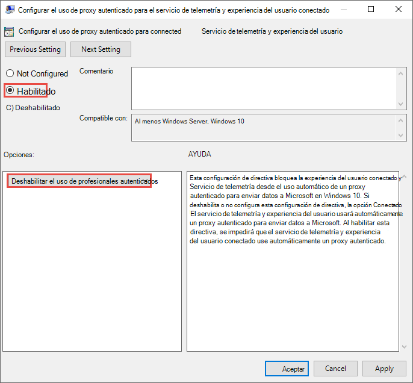
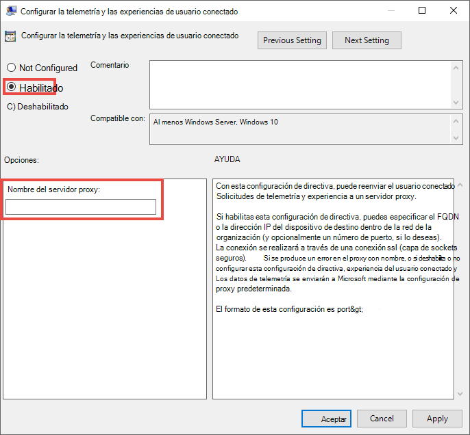

# <a name="configure-device-proxy-and-internet-connectivity-settings"></a>Configurar el proxy de dispositivo y la configuración de conectividad a Internet

[!INCLUDE [Microsoft 365 Defender rebranding](../../includes/microsoft-defender.md)]

**Se aplica a:**
- [Microsoft Defender para punto de conexión](https://go.microsoft.com/fwlink/p/?linkid=2154037)
- [Microsoft 365 Defender](https://go.microsoft.com/fwlink/?linkid=2118804)

> ¿Desea experimentar Defender for Endpoint? [Regístrate para obtener una versión de prueba gratuita.](https://www.microsoft.com/en-us/WindowsForBusiness/windows-atp?ocid=docs-wdatp-configureendpointsscript-abovefoldlink)

El sensor Defender for Endpoint requiere Microsoft Windows HTTP (WinHTTP) para informar de los datos del sensor y comunicarse con el servicio Defender for Endpoint.

El sensor de Defender for Endpoint incrustado se ejecuta en el contexto del sistema mediante la cuenta LocalSystem. El sensor usa Servicios HTTP de Microsoft Windows (WinHTTP) para habilitar la comunicación con el servicio en la nube defender para endpoint.

>[!TIP]
>Para las organizaciones que usan servidores proxy de reenvío como puerta de enlace a Internet, puede usar la protección de red para investigar lo que ocurre detrás de un servidor proxy. Para obtener más información, vea [Investigar eventos de conexión que ocurren detrás de los servidores proxy de reenvío](investigate-behind-proxy.md).

La configuración de WinHTTP es independiente de la configuración de proxy de exploración de Internet de Windows Internet (WinINet) y solo puede detectar un servidor proxy mediante los siguientes métodos de detección:

- Métodos de detección automática:
  - Proxy transparente
  - Protocolo de detección automática de proxy web (WPAD)

    > [!NOTE]
    > Si usas proxy transparente o WPAD en la topología de red, no necesitas opciones de configuración especiales. Para obtener más información sobre las exclusiones de url de extremo de Defender en el proxy, vea Habilitar el acceso a las direcciones URL del servicio defender para puntos de conexión [en el servidor proxy.](#enable-access-to-microsoft-defender-for-endpoint-service-urls-in-the-proxy-server)

- Configuración del proxy estático manual:
  - Configuración basada en el registro
  - WinHTTP se configuró con el comando netsh (adecuado solo para dispositivos de escritorio en una topología estable, por ejemplo, un escritorio en una red corporativa detrás del mismo proxy)

## <a name="configure-the-proxy-server-manually-using-a-registry-based-static-proxy"></a>Configurar manualmente el servidor proxy mediante un proxy estático basado en el registro

Configure un proxy estático basado en el Registro para permitir que solo el sensor Defender for Endpoint informe de datos de diagnóstico y se comunique con Defender for Endpoint services si un equipo no tiene permiso para conectarse a Internet.

> [!NOTE]
> - Al usar esta opción en Windows 10 o Windows Server 2019, se recomienda tener la siguiente compilación (o posterior) y el paquete acumulativo de actualizaciones acumulativas:</br>
> Windows 10, versión 1909 : https://support.microsoft.com/kb/4601380</br>
> Windows 10, versión 2004 : https://support.microsoft.com/kb/4601382</br>
> Windows 10, versión 20H2: https://support.microsoft.com/kb/4601382</br>
> Estas actualizaciones mejoran la conectividad y la confiabilidad del canal CnC (comando y control).</br>

El proxy estático se puede configurar mediante la directiva de grupo (GP). La directiva de grupo se puede encontrar aquí:

- Plantillas administrativas > componentes de Windows > recopilación de datos y versiones preliminares > Configurar el uso de proxy autenticado para el servicio de telemetría y experiencia del usuario conectado
  - Estadíla en **Habilitado** y seleccione **Deshabilitar uso de proxy autenticado:** Imagen de configuración de directiva de 
- **Plantillas administrativas > componentes de Windows > recopilación** de datos y versiones preliminares > Configurar la telemetría y las experiencias de usuario conectados:
  - Configurar el proxy:<br>
    

    La directiva establece dos valores del registro `TelemetryProxyServer` como REG_SZ y `DisableEnterpriseAuthProxy` como REG_DWORD en la clave del registro `HKLM\Software\Policies\Microsoft\Windows\DataCollection`.

    El valor del `TelemetryProxyServer` Registro tiene el siguiente formato de cadena:

    ```text
    <server name or ip>:<port>
    ```

    Por ejemplo, 10.0.0.6:8080

    El valor del registro `DisableEnterpriseAuthProxy` debe establecerse en 1.

## <a name="configure-the-proxy-server-manually-using-netsh-command"></a>Configurar el servidor proxy manualmente mediante el comando netsh

Use netsh para configurar un proxy estático en todo el sistema.

> [!NOTE]
> - Esto afectará a todas las aplicaciones, incluidos los servicios de Windows que utilicen WinHTTP con el proxy predeterminado.</br>
> - Los portátiles que cambian la topología (por ejemplo: de la oficina a la casa) no funcionan correctamente con netsh. Use la configuración de proxy estático basada en el registro.

1. Abra un símbolo del sistema con privilegios elevados:

    a. Vaya a **Inicio** y escriba **cmd**.

    b. Haga clic derecho en **Símbolo del sistema** y seleccione **Ejecutar como administrador**.

2. Escriba el siguiente comando y presione **Entrar**:

   ```PowerShell
   netsh winhttp set proxy <proxy>:<port>
   ```

   Por ejemplo: netsh winhttp set proxy 10.0.0.6:8080

Para restablecer el proxy winhttp, escriba el siguiente comando y presione **ENTRAR**

```PowerShell
netsh winhttp reset proxy
```

Para obtener más información, vea [Sintaxis de comando Netsh, contextos y formatos](https://docs.microsoft.com/windows-server/networking/technologies/netsh/netsh-contexts).

## <a name="enable-access-to-microsoft-defender-for-endpoint-service-urls-in-the-proxy-server"></a>Habilitar el acceso a las direcciones URL del servicio de punto de conexión de Microsoft Defender en el servidor proxy

Si un servidor proxy o firewall bloquea todo el tráfico de forma predeterminada y permite únicamente el acceso a dominios específicos, agregue los dominios que aparecen en la hoja descargable a la lista de dominios permitidos.

En la siguiente hoja de cálculo descargable se enumeran los servicios y sus direcciones URL asociadas a las que la red debe poder conectarse. Debe asegurarse de que no hay reglas de filtrado de red o firewall que denieguen el acceso *a* estas direcciones URL, o puede que necesite crear una regla de permitir específicamente para ellas.


|**Hoja de cálculo de la lista de dominios**|**Descripción**|
|:-----|:-----|
|<br/>  | Hoja de cálculo de registros DNS específicos para ubicaciones de servicio, ubicaciones geográficas y sistema operativo. <br><br>[Descargue la hoja de cálculo aquí.](https://download.microsoft.com/download/8/a/5/8a51eee5-cd02-431c-9d78-a58b7f77c070/mde-urls.xlsx) 


Si un servidor proxy o firewall tiene habilitada la detección HTTPS (inspección SSL), excluya los dominios que aparecen en la tabla anterior de la detección HTTPS.

> [!NOTE]
> settings-win.data.microsoft.com solo es necesario si tienes dispositivos Windows 10 que ejecutan la versión 1803 o anterior.<br>


> [!NOTE]
> Las direcciones URL que incluyen v20 solo son necesarias si tienes dispositivos Windows 10 que ejecutan la versión 1803 o posterior. Por ejemplo, es necesario para un dispositivo con Windows 10 que ejecute la versión 1803 o posterior y se incorpore a la región de almacenamiento de datos ```us-v20.events.data.microsoft.com``` de ESTADOS UNIDOS.


> [!NOTE]
> Si usa Antivirus de Microsoft Defender en su entorno, consulte [Configure network connections to the Microsoft Defender Antivirus cloud service](https://docs.microsoft.com/windows/security/threat-protection/microsoft-defender-antivirus/configure-network-connections-microsoft-defender-antivirus).

Si un proxy o firewall bloquea el tráfico anónimo, ya que el sensor Defender for Endpoint se conecta desde el contexto del sistema, asegúrese de que el tráfico anónimo está permitido en las direcciones URL enumeradas anteriormente.

### <a name="microsoft-monitoring-agent-mma---proxy-and-firewall-requirements-for-older-versions-of-windows-client-or-windows-server"></a>Microsoft Monitoring Agent (MMA): requisitos de proxy y firewall para versiones anteriores del cliente de Windows o Windows Server

La siguiente información enumera la información de configuración de proxy y firewall necesaria para comunicarse con el agente de Log Analytics (a menudo denominado Microsoft Monitoring Agent) para las versiones anteriores de Windows como Windows 7 SP1, Windows 8.1, Windows Server 2008 R2, Windows Server 2012 R2 y Windows Server 2016.

|Recurso agent|Puertos |Dirección |Omitir inspección HTTPS|
|------|---------|--------|--------|   
|*.ods.opinsights.azure.com |Puerto 443 |Salida|Sí |  
|*.oms.opinsights.azure.com |Puerto 443 |Salida|Sí |  
|*.blob.core.windows.net |Puerto 443 |Salida|Sí |
|*.azure-automation.net |Puerto 443 |Salida|Sí |  


> [!NOTE]
> Como solución basada en la nube, el intervalo IP puede cambiar. Se recomienda pasar a la configuración de resolución de DNS.

## <a name="confirm-microsoft-monitoring-agent-mma-service-url-requirements"></a>Confirmar los requisitos de la dirección URL del servicio de Microsoft Monitoring Agent (MMA) 

Consulta las siguientes instrucciones para eliminar el requisito de comodín (*) para tu entorno específico al usar Microsoft Monitoring Agent (MMA) para versiones anteriores de Windows.

1.  Incorpore un sistema operativo anterior con Microsoft Monitoring Agent (MMA) en Defender for Endpoint (para obtener más información, vea [Onboard previous versions of Windows on Defender for Endpoint](https://go.microsoft.com/fwlink/p/?linkid=2010326) and Onboard Windows [servers](configure-server-endpoints.md#windows-server-2008-r2-sp1-windows-server-2012-r2-and-windows-server-2016).

2.  Asegúrese de que la máquina se está informando correctamente en el portal del Centro de seguridad de Microsoft Defender.

3.  Ejecute la herramienta TestCloudConnection.exe desde "C:\Program Files\Microsoft Monitoring Agent\Agent" para validar la conectividad y ver las direcciones URL necesarias para su área de trabajo específica.

4.  Consulte la lista de direcciones URL de punto de conexión de Microsoft Defender para obtener la lista completa de requisitos para su región (consulte la hoja de cálculo de direcciones URL de [servicio](https://download.microsoft.com/download/8/a/5/8a51eee5-cd02-431c-9d78-a58b7f77c070/mde-urls.xlsx)).


Los comodines (*) usados en los puntos de conexión *.ods.opinsights.azure.com, *.oms.opinsights.azure.com y *.agentsvc.azure-automation.net URL se pueden reemplazar por el identificador de área de trabajo específico. El identificador de área de trabajo es específico de su entorno y área de trabajo y se puede encontrar en la sección Incorporación de su inquilino en el portal del Centro de seguridad de Microsoft Defender.

El extremo de dirección URL *.blob.core.windows.net se puede reemplazar por las direcciones URL mostradas en la sección "Regla de firewall: *.blob.core.windows.net" de los resultados de la prueba. 

> [!NOTE]
> En el caso de la incorporación a través de Azure Defender, se pueden usar varias áreas de trabajo. Deberá realizar el procedimiento de TestCloudConnection.exe anterior en una máquina integrada de cada área de trabajo (para determinar si hay cambios en las direcciones URL *.blob.core.windows.net entre las áreas de trabajo).

## <a name="verify-client-connectivity-to-microsoft-defender-for-endpoint-service-urls"></a>Comprobar la conectividad del cliente a Microsoft Defender para las direcciones URL del servicio endpoint

Compruebe que la configuración del proxy se ha completado correctamente, que WinHTTP puede detectar y comunicarse mediante el servidor proxy en su entorno y que el servidor proxy permite el tráfico a las direcciones URL del servicio de Defender para punto de conexión.

1. Descargue la herramienta Analizador de cliente [MDATP](https://aka.ms/mdatpanalyzer) en el equipo en el que se ejecuta el sensor defender para el extremo.

2. Extraiga el contenido de MDATPClientAnalyzer.zip en el dispositivo.

3. Abra un símbolo del sistema con privilegios elevados:

    a. Vaya a **Inicio** y escriba **cmd**.

    b.  Haga clic derecho en **Símbolo del sistema** y seleccione **Ejecutar como administrador**.

4. Escriba el siguiente comando y presione **Entrar**:

    ```PowerShell
    HardDrivePath\MDATPClientAnalyzer.cmd
    ```

    Reemplace *HardDrivePath* por la ruta de acceso en la que se descargó la herramienta MDATPClientAnalyzer, por ejemplo:

    ```PowerShell
    C:\Work\tools\MDATPClientAnalyzer\MDATPClientAnalyzer.cmd
    ```

5. Extraiga el *MDATPClientAnalyzerResult.zip* creado por la herramienta en la carpeta usada en *HardDrivePath*.

6. Abra *MDATPClientAnalyzerResult.txt* y compruebe que ha realizado los pasos de configuración del proxy para habilitar la detección del servidor y tener acceso a las direcciones URL del servicio. <br><br>
   La herramienta comprueba la conectividad de las direcciones URL del servicio de Defender para punto de conexión con las que el cliente está configurado para interactuar. Luego, imprime los resultados en el archivo *MDATPClientAnalyzerResult.txt* para cada URL que se puede usar potencialmente para comunicarse con los servicios de Defender para punto de conexión. Por ejemplo:

   ```text
   Testing URL : https://xxx.microsoft.com/xxx
   1 - Default proxy: Succeeded (200)
   2 - Proxy auto discovery (WPAD): Succeeded (200)
   3 - Proxy disabled: Succeeded (200)
   4 - Named proxy: Doesn't exist
   5 - Command line proxy: Doesn't exist
   ```

Si al menos una de las opciones de conectividad devuelve un estado (200), el cliente de Defender para punto de conexión puede comunicarse con la URL probada correctamente con este método de conectividad. <br><br>

Pero si los resultados de la comprobación de conectividad indican un error, se mostrará un error HTTP (vea los códigos de estado HTTP). A continuación, puede usar las direcciones URL de la tabla que se muestra en Habilitar el acceso a las direcciones URL del servicio defender para puntos de conexión [en el servidor proxy](#enable-access-to-microsoft-defender-for-endpoint-service-urls-in-the-proxy-server). Las direcciones URL que usará dependerán de la región seleccionada durante el procedimiento de incorporación.

> [!NOTE]
>  La herramienta Analizador de conectividad no es compatible con la regla ASR [Bloquear las creaciones de procesos procedentes de comandos PSExec y WMI](https://docs.microsoft.com/windows/security/threat-protection/windows-defender-exploit-guard/attack-surface-reduction#attack-surface-reduction-rules). Tendrá que deshabilitar temporalmente esta regla para ejecutar la herramienta de conectividad.


> [!NOTE]
> Cuando se establece TelemetryProxyServer, en el Registro o a través de la directiva de grupo, Defender for Endpoint volverá a dirigirse si no puede tener acceso al proxy definido.

## <a name="related-topics"></a>Temas relacionados

- [Incorporar dispositivos Windows 10 mediante la directiva de grupo](configure-endpoints.md)
- [Solucionar problemas de incorporación de puntos de conexión de Microsoft Defender](troubleshoot-onboarding.md)
