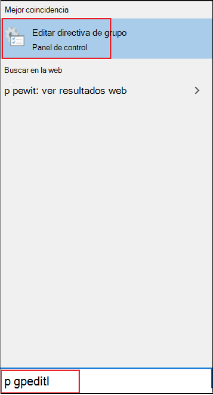

# Habilitar y configurar la protección siempre activa del Antivirus de Windows Defender en la directiva de grupoEnable and configure Microsoft Defender Antivirus always-on protection in Group Policy

[!INCLUDE [Microsoft 365 Defender rebranding](../../includes/microsoft-defender.md)]

**Se aplica a:****Applies to:**

- [Microsoft Defender para punto de conexiónMicrosoft Defender for Endpoint](/microsoft-365/security/defender-endpoint/)

La protección siempre activa consiste en la protección en tiempo real, la supervisión del comportamiento y la heurística para identificar malware basado en actividades sospechosas y malintencionadas conocidas.Always-on protection consists of real-time protection, behavior monitoring, and heuristics to identify malware based on known suspicious and malicious activities.

Estas actividades incluyen eventos, como procesos que hacen cambios inusuales en los archivos existentes, modificar o crear claves de registro de inicio automático y ubicaciones de inicio (también conocidas como puntos de extensibilidad de inicio automático o ASEP) y otros cambios en el sistema de archivos o la estructura de archivos.These activities include events, such as processes making unusual changes to existing files, modifying or creating automatic startup registry keys and startup locations (also known as auto-start extensibility points, or ASEPs), and other changes to the file system or file structure.

## Habilitar y configurar la protección siempre activa en la directiva de grupoEnable and configure always-on protection in Group Policy

Puede usar el **Editor de directivas de** grupo local para habilitar y configurar Antivirus de Microsoft Defender de protección siempre activa.You can use **Local Group Policy Editor** to enable and configure Microsoft Defender Antivirus always-on protection settings.

Para habilitar y configurar la protección siempre activa:To enable and configure always-on protection:

1. Abra **el Editor de directivas de grupo local**.Open **Local Group Policy Editor**. Para ello:To do this:  

    1. En el Windows 10 de búsqueda de la barra de tareas, escriba **gpedit**.In your Windows 10 taskbar search box, type **gpedit**.
    
    1. En **Coincidencia recomendada,** haga clic **en Editar directiva de grupo** para iniciar el Editor de directivas de grupo **local.**Under **Best match**, click **Edit group policy** to launch **Local Group Policy Editor**.
    
       

2. En el panel izquierdo del Editor de directivas de grupo **local,** expanda el árbol a Configuración del equipo Plantillas administrativas  >    >  **Windows componentes**  >  **Antivirus de Microsoft Defender**.In the left pane of **Local Group Policy Editor**, expand the tree to **Computer Configuration** > **Administrative Templates** > **Windows Components** > **Microsoft Defender Antivirus**. 

3. Configure la configuración Antivirus de Microsoft Defender directiva de servicio antimalware.Configure the Microsoft Defender Antivirus antimalware service policy settings. Para ello:To do this:  

    1. En el **Antivirus de Microsoft Defender** detalles de la derecha, haga doble clic en la configuración de directiva especificada en la tabla siguiente:In the **Microsoft Defender Antivirus** details pane on right, double-click the policy setting as specified in the following table:

       | ConfiguraciónSetting | DescripciónDescription | Configuración predeterminadaDefault setting |
       |-----------------------------|------------------------|-------------------------------|
       | Permitir el inicio del servicio antimalware con prioridad normalAllow antimalware service to startup with normal priority | Puede reducir la prioridad del motor de Antivirus de Microsoft Defender, que puede ser útil en implementaciones ligeras donde desea tener un proceso de inicio lo más delgado posible.You can lower the priority of the Microsoft Defender Antivirus engine, which may be useful in lightweight deployments where you want to have as lean a startup process as possible. Esto puede afectar a la protección en el extremo.This may impact protection on the endpoint. | HabilitadoEnabled
       | Permitir que el servicio antimalware siga ejecutándose siempreAllow antimalware service to remain running always | Si las actualizaciones de protección se han deshabilitado, puede Antivirus de Microsoft Defender para que se ejecuten.If protection updates have been disabled, you can set Microsoft Defender Antivirus to still run. Esto reduce la protección en el extremo.This lowers the protection on the endpoint. | DeshabilitadaDisabled |
    
    1. Configure la configuración según corresponda y haga clic en **Aceptar**.Configure the setting as appropriate, and click **OK**.
    
    1. Repita los pasos anteriores para cada configuración de la tabla.Repeat the previous steps for each setting in the table.

4. Configure la Antivirus de Microsoft Defender de protección en tiempo real.Configure the Microsoft Defender Antivirus real-time protection policy settings. Para ello:To do this:

    1. En el **panel Antivirus de Microsoft Defender** detalles, haga doble clic en Protección en **tiempo real**.In the **Microsoft Defender Antivirus** details pane, double-click **Real-time Protection**. O bien, en el **Antivirus de Microsoft Defender** en el panel izquierdo, haga clic **en Protección en tiempo real**.Or, from the **Microsoft Defender Antivirus** tree on left pane, click **Real-time Protection**.
    
    1. En el **panel de detalles protección** en tiempo real de la derecha, haga doble clic en la configuración de directiva especificada en la tabla siguiente:In the **Real-time Protection** details pane on right, double-click the policy setting as specified in the following table:  

       | ConfiguraciónSetting | DescripciónDescription | Configuración predeterminadaDefault setting |
       |-----------------------------|------------------------|-------------------------------|
       | Activar la supervisión del comportamientoTurn on behavior monitoring | El motor de ANTIVIRUS supervisará los procesos de archivos, los cambios de archivos y del Registro, y otros eventos en los puntos de conexión en busca de actividad malintencionada sospechosa y conocida.The AV engine will monitor file processes, file and registry changes, and other events on your endpoints for suspicious and known malicious activity. | HabilitadoEnabled |
       | Examinar todos los archivos y datos adjuntos descargadosScan all downloaded files and attachments | Los archivos descargados y los datos adjuntos se examinan automáticamente.Downloaded files and attachments are automatically scanned. Esto funciona además del filtro Windows Defender SmartScreen, que examina los archivos antes y durante la descarga.This operates in addition to the Windows Defender SmartScreen filter, which scans files before and during downloading. | HabilitadoEnabled |
       | Supervisar la actividad de archivos y programas en el equipoMonitor file and program activity on your computer | El motor de Antivirus de Microsoft Defender toma nota de los cambios de archivos (escrituras de archivos, como movimientos, copias o modificaciones) y la actividad general del programa (programas que se abren o ejecutan y que hacen que se ejecuten otros programas).The Microsoft Defender Antivirus engine makes note of any file changes (file writes, such as moves, copies, or modifications) and general program activity (programs that are opened or running and that cause other programs to run). | HabilitadoEnabled |
       | Activar las notificaciones de escritura por volumen sin procesarTurn on raw volume write notifications | La supervisión del comportamiento analizará la información sobre las escrituras de volumen sin procesar.Information about raw volume writes will be analyzed by behavior monitoring. | HabilitadoEnabled |
       | Activar el examen de procesos siempre que esté habilitada la protección en tiempo realTurn on process scanning whenever real-time protection is enabled | Puede habilitar el motor de Antivirus de Microsoft Defender de forma independiente para examinar los procesos en ejecución en busca de modificaciones o comportamientos sospechosos.You can independently enable the Microsoft Defender Antivirus engine to scan running processes for suspicious modifications or behaviors. Esto resulta útil si ha deshabilitado temporalmente la protección en tiempo real y desea examinar automáticamente los procesos que se iniciaron mientras estaba deshabilitado.This is useful if you have temporarily disabled real-time protection and want to automatically scan processes that started while it was disabled. | HabilitadoEnabled |
       | Definir el tamaño máximo de los archivos y datos adjuntos descargados que se examinaránDefine the maximum size of downloaded files and attachments to be scanned | Puede definir el tamaño en kilobytes.You can define the size in kilobytes. | HabilitadoEnabled |
       | Configurar la invalidación de configuración local para activar la supervisión del comportamientoConfigure local setting override for turn on behavior monitoring | Configure una invalidación local para la configuración de la supervisión del comportamiento.Configure a local override for the configuration of behavior monitoring. Esta configuración solo se puede establecer mediante la directiva de grupo.This setting can only be set by Group Policy. Si habilita esta configuración, la configuración de preferencia local tendrá prioridad sobre la directiva de grupo.If you enable this setting, the local preference setting will take priority over Group Policy. Si deshabilita o no configura esta configuración, la directiva de grupo tendrá prioridad sobre la configuración de preferencia local.If you disable or do not configure this setting, Group Policy will take priority over the local preference setting.| HabilitadoEnabled |
       | Configurar la invalidación de configuración local para examinar todos los archivos y datos adjuntos descargadosConfigure local setting override for scanning all downloaded files and attachments | Configure una invalidación local para la configuración del examen de todos los archivos y datos adjuntos descargados.Configure a local override for the configuration of scanning for all downloaded files and attachments. Esta configuración solo se puede establecer mediante la directiva de grupo.This setting can only be set by Group Policy. Si habilita esta configuración, la configuración de preferencia local tendrá prioridad sobre la directiva de grupo.If you enable this setting, the local preference setting will take priority over Group Policy. Si deshabilita o no configura esta configuración, la directiva de grupo tendrá prioridad sobre la configuración de preferencia local.If you disable or do not configure this setting, Group Policy will take priority over the local preference setting.| HabilitadoEnabled |
       | Configurar la invalidación de configuración local para la actividad del programa y el archivo de supervisión en el equipoConfigure local setting override for monitoring file and program activity on your computer | Configure una invalidación local para la configuración de la supervisión de la actividad de archivos y programas en el equipo.Configure a local override for the configuration of monitoring for file and program activity on your computer. Esta configuración solo se puede establecer mediante la directiva de grupo.This setting can only be set by Group Policy. Si habilita esta configuración, la configuración de preferencia local tendrá prioridad sobre la directiva de grupo.If you enable this setting, the local preference setting will take priority over Group Policy. Si deshabilita o no configura esta configuración, la directiva de grupo tendrá prioridad sobre la configuración de preferencia local.If you disable or do not configure this setting, Group Policy will take priority over the local preference setting.| HabilitadoEnabled |
       | Configurar la invalidación de configuración local para activar la protección en tiempo realConfigure local setting override to turn on real-time protection | Configure una invalidación local para que la configuración active la protección en tiempo real.Configure a local override for the configuration to turn on real-time protection. Esta configuración solo se puede establecer mediante la directiva de grupo.This setting can only be set by Group Policy. Si habilita esta configuración, la configuración de preferencia local tendrá prioridad sobre la directiva de grupo.If you enable this setting, the local preference setting will take priority over Group Policy. Si deshabilita o no configura esta configuración, la directiva de grupo tendrá prioridad sobre la configuración de preferencia local.If you disable or do not configure this setting, Group Policy will take priority over the local preference setting.| HabilitadoEnabled |
       | Configurar la invalidación de configuración local para la supervisión de la actividad de archivos entrantes y salientesConfigure local setting override for monitoring for incoming and outgoing file activity | Configure una invalidación local para la configuración de la supervisión de la actividad de archivos entrantes y salientes.Configure a local override for the configuration of monitoring for incoming and outgoing file activity. Esta configuración solo se puede establecer mediante la directiva de grupo.This setting can only be set by Group Policy. Si habilita esta configuración, la configuración de preferencia local tendrá prioridad sobre la directiva de grupo.If you enable this setting, the local preference setting will take priority over Group Policy. Si deshabilita o no configura esta configuración, la directiva de grupo tendrá prioridad sobre la configuración de preferencia local.If you disable or do not configure this setting, Group Policy will take priority over the local preference setting. | HabilitadoEnabled |
       | Configurar la supervisión para la actividad del programa y los archivos entrantes y salientesConfigure monitoring for incoming and outgoing file and program activity | Especifique si la supervisión debe producirse en la dirección entrante, saliente, ambas o ninguna.Specify whether monitoring should occur on incoming, outgoing, both, or neither direction. Esto es relevante para las instalaciones de Windows Server en las que ha definido servidores específicos o roles de servidor que ven grandes cantidades de cambios de archivo en una sola dirección y desea mejorar el rendimiento de la red.This is relevant for Windows Server installations where you have defined specific servers or Server Roles that see large amounts of file changes in only one direction and you want to improve network performance. Los puntos de conexión (y los servidores) totalmente actualizados en una red verán poco impacto en el rendimiento independientemente del número o la dirección de los cambios en los archivos.Fully updated endpoints (and servers) on a network will see little performance impact irrespective of the number or direction of file changes. | Habilitado (ambas direcciones)Enabled (both directions) |

    1. Configure la configuración según corresponda y haga clic en **Aceptar**.Configure the setting as appropriate, and click **OK**.
    
    1. Repita los pasos anteriores para cada configuración de la tabla.Repeat the previous steps for each setting in the table.

5. Configure la configuración de Antivirus de Microsoft Defender de análisis.Configure the Microsoft Defender Antivirus scanning policy setting. Para ello:To do this:  

    1. En el **Antivirus de Microsoft Defender** en el panel izquierdo, haga clic en **Examinar**.From the **Microsoft Defender Antivirus** tree on left pane, click **Scan**.
    
       

    1. En el **panel Detección** de detalles de la derecha, haga doble clic en la configuración de directiva especificada en la tabla siguiente:In the **Scan** details pane on right, double-click the policy setting as specified in the following table:

       | ConfiguraciónSetting | DescripciónDescription | Configuración predeterminadaDefault setting |
       |-----------------------------|------------------------|-------------------------------|    
       | Activar heurísticaTurn on heuristics | La protección heurística deshabilitará o bloqueará la actividad sospechosa inmediatamente antes de que se pida al Antivirus de Microsoft Defender que detecte la actividad.Heuristic protection will disable or block suspicious activity immediately before the Microsoft Defender Antivirus engine is asked to detect the activity. | HabilitadoEnabled |

    1. Configure la configuración según corresponda y haga clic en **Aceptar**.Configure the setting as appropriate, and click **OK**.
    
6. Cierre **el Editor de directivas de grupo local**.Close **Local Group Policy Editor**.

## Deshabilitar la protección en tiempo real en la directiva de grupoDisable real-time protection in Group Policy

> [!WARNING]
> Deshabilitar la protección en tiempo real reduce drásticamente la protección en los puntos de conexión y no se recomienda.Disabling real-time protection drastically reduces the protection on your endpoints and is not recommended.

La principal funcionalidad de protección en tiempo real está habilitada de forma predeterminada, pero puede deshabilitarla mediante el Editor de directivas **de grupo local**.The main real-time protection capability is enabled by default, but you can disable it by using **Local Group Policy Editor**.

Para deshabilitar la protección en tiempo real en la directiva de grupo:To disable real-time protection in Group policy:

1. Abra **el Editor de directivas de grupo local**.Open **Local Group Policy Editor**.

   1. En el Windows 10 de búsqueda de la barra de tareas, escriba **gpedit**.In your Windows 10 taskbar search box, type **gpedit**.
   
   1. En **Coincidencia recomendada,** haga clic **en Editar directiva de grupo** para iniciar el Editor de directivas de grupo **local.**Under **Best match**, click **Edit group policy** to launch **Local Group Policy Editor**.

2.  En el panel izquierdo del Editor de directivas de grupo **local,** expanda el árbol a Configuración del equipo Plantillas administrativas Windows componentes Antivirus de Microsoft Defender  >    >    >    >  **protección en tiempo real**.In the left pane of **Local Group Policy Editor**, expand the tree to **Computer Configuration** > **Administrative Templates** > **Windows Components** > **Microsoft Defender Antivirus** > **Real-time Protection**.

3. En el **panel detalles de protección** en tiempo real a la derecha, haga doble clic en Desactivar la protección en tiempo **real.**In the **Real-time Protection** details pane on right, double-click **Turn off real-time protection**.

   

4. En la ventana Desactivar la configuración de protección en tiempo **real,** establezca la opción en **Habilitado**.In the **Turn off real-time protection** setting window, set the option to **Enabled**.

   
   
5. Haga clic en **Aceptar**.Click **OK**.

6. Cierre **el Editor de directivas de grupo local**.Close **Local Group Policy Editor**.

## Artículos relacionadosRelated articles

- [Configurar la protección en tiempo real, heurística y de comportamientoConfigure behavioral, heuristic, and real-time protection](configure-protection-features-microsoft-defender-antivirus.md)
- [Antivirus de Microsoft Defender en Windows 10Microsoft Defender Antivirus in Windows 10](microsoft-defender-antivirus-in-windows-10.md)