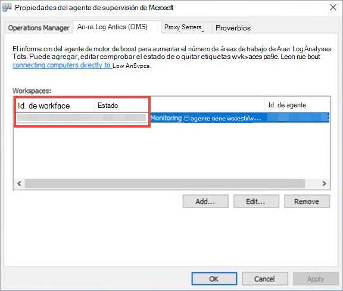
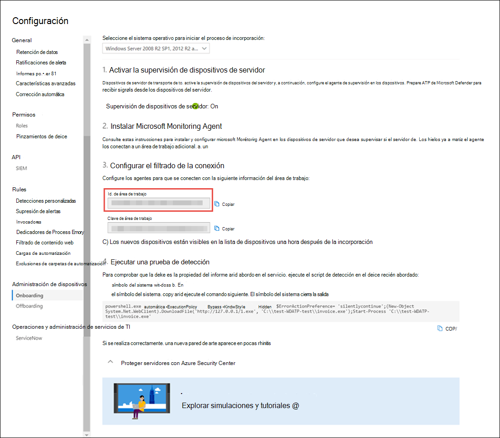

# <a name="onboard-windows-servers-to-the-microsoft-defender-for-endpoint-service"></a>Incorporación Windows servidores al servicio de Microsoft Defender para puntos de conexión

[!INCLUDE [Microsoft 365 Defender rebranding](../../includes/microsoft-defender.md)]

**Se aplica a:**

- Windows Server 2008 R2 SP1
- Windows Server 2012 R2
- Windows Server 2016
- Windows Server (SAC) version 1803 and later
- Windows Server 2019 y versiones posteriores
- Windows Edición principal de Server 2019

> ¿Desea experimentar Defender for Endpoint? [Regístrate para obtener una versión de prueba gratuita.](https://www.microsoft.com/microsoft-365/windows/microsoft-defender-atp?ocid=docs-wdatp-configserver-abovefoldlink)

Defender for Endpoint amplía la compatibilidad para incluir también el sistema operativo Windows server. Esta compatibilidad proporciona capacidades avanzadas de detección de ataques e investigación sin problemas a través de Centro de seguridad de Microsoft Defender consola.

Para obtener instrucciones prácticas sobre lo que debe haber para las licencias y la infraestructura, vea [Protecting Windows Servers with Defender for Endpoint](https://techcommunity.microsoft.com/t5/What-s-New/Protecting-Windows-Server-with-Windows-Defender-ATP/m-p/267114#M128).

Para obtener instrucciones sobre cómo descargar y usar Seguridad de Windows base de datos para Windows servidores, vea [Seguridad de Windows Baselines](/windows/device-security/windows-security-baselines).

## <a name="windows-server-2008-r2-sp1-windows-server-2012-r2-and-windows-server-2016"></a>Windows Server 2008 R2 SP1, Windows Server 2012 R2 y Windows Server 2016

Puede incorporar Windows Server 2008 R2 SP1, Windows Server 2012 R2 y Windows Server 2016 a Defender for Endpoint mediante cualquiera de las siguientes opciones:

- **Opción 1:** Incorporación mediante la instalación y configuración de [Microsoft Monitoring Agent (MMA)](#option-1-onboard-by-installing-and-configuring-microsoft-monitoring-agent-mma)
- **Opción 2:** [Incorporación a través del Centro de seguridad de Azure](#option-2-onboard-windows-servers-through-azure-security-center)
- **Opción 3:** [Incorporación Microsoft Endpoint Manager versión 2002 y posteriores](#option-3-onboard-windows-servers-through-microsoft-endpoint-manager-version-2002-and-later)

Después de completar los pasos de incorporación con cualquiera de las opciones proporcionadas, deberá configurar y actualizar los [System Center Endpoint Protection cliente.](#configure-and-update-system-center-endpoint-protection-clients)

> [!NOTE]
> La licencia de servidor independiente de Defender for Endpoint es necesaria, por nodo, para incorporar un servidor de Windows a través de Microsoft Monitoring Agent (opción 1) o a través de Microsoft Endpoint Manager (opción 3). Como alternativa, se requiere una licencia de Azure Defender para servidores, por nodo, para incorporar un servidor de Windows a través del Centro de seguridad de Azure (opción 2), consulte Características admitidas disponibles en [Azure Defender](/azure/security-center/security-center-services).

### <a name="option-1-onboard-by-installing-and-configuring-microsoft-monitoring-agent-mma"></a>Opción 1: Incorporación mediante la instalación y configuración de Microsoft Monitoring Agent (MMA)

Deberá instalar y configurar MMA para que los servidores Windows informen los datos del sensor a Defender for Endpoint. Para obtener más información, vea [Recopilar datos de registro con el agente de Azure Log Analytics](/azure/azure-monitor/platform/log-analytics-agent).

Si ya usa System Center Operations Manager (SCOM) o Azure Monitor (anteriormente conocido como Operations Management Suite (OMS)), adjunte el Microsoft Monitoring Agent (MMA) para informar al área de trabajo de Defender para endpoint mediante la compatibilidad con multiconsulta.

En general, deberá seguir los pasos siguientes:

1. Cumpla los requisitos de incorporación descritos en **la sección Antes de comenzar.**
2. Active la supervisión del servidor desde el Centro de seguridad de Microsoft Defender.
3. Instale y configure MMA para que el servidor informe los datos del sensor a Defender for Endpoint.
4. Configure y actualice System Center Endpoint Protection clientes.

> [!TIP]
> Después de incorporar el dispositivo, puedes elegir ejecutar una prueba de detección para comprobar que está correctamente incorporado al servicio. Para obtener más información, vea [Run a detection test on a newly onboarded Defender for Endpoint endpoint](run-detection-test.md).

#### <a name="before-you-begin"></a>Antes de empezar

Realice los siguientes pasos para cumplir los requisitos de incorporación:

Para Windows Server 2008 R2 SP1 o Windows Server 2012 R2, asegúrese de instalar la siguiente revisión:

- [Actualización de la experiencia del cliente y telemetría de diagnóstico](https://support.microsoft.com/help/3080149/update-for-customer-experience-and-diagnostic-telemetry)

Para Windows Server 2008 R2 SP1, asegúrese de cumplir los siguientes requisitos:

- Instalar el paquete [acumulativo de actualizaciones mensuales de febrero](https://support.microsoft.com/help/4074598/windows-7-update-kb4074598)
- Instalar [.NET Framework 4.5](https://www.microsoft.com/download/details.aspx?id=30653) (o posterior) o [KB3154518](https://support.microsoft.com/help/3154518/support-for-tls-system-default-versions-included-in-the-net-framework)

    > [!NOTE]
    > Si administra su Windows Server 2008 R2 SP1 con SCCM, el agente cliente de SCCM instala .Net Framework 4.5.2. Por lo tanto, no es necesario instalar .NET Framework 4.5 (o posterior).

For Windows Server 2008 R2 SP1 and Windows Server 2012 R2: [Configure and update System Center Endpoint Protection clients](#configure-and-update-system-center-endpoint-protection-clients).

> [!NOTE]
> Este paso solo es necesario si su organización usa System Center Endpoint Protection (SCEP) y está incorporando Windows Server 2008 R2 SP1 y Windows Server 2012 R2.

### <a name="install-and-configure-microsoft-monitoring-agent-mma-to-report-sensor-data-to-microsoft-defender-for-endpoint"></a>Instalar y configurar Microsoft Monitoring Agent (MMA) para informar de los datos del sensor a Microsoft Defender para endpoint

1. Descargue el archivo de instalación del [agente: Windows agente de 64 bits](https://go.microsoft.com/fwlink/?LinkId=828603).

2. Mediante el identificador de área de trabajo y la clave de área de trabajo obtenidas en el procedimiento anterior, elija cualquiera de los siguientes métodos de instalación para instalar el agente en el Windows servidor:
    - [Instale manualmente el agente mediante el programa de instalación](/azure/log-analytics/log-analytics-windows-agents#install-agent-using-setup-wizard). 
    En la **página Opciones de configuración del** agente, elija Conectar el agente a Azure Log Analytics **(OMS).**
    - [Instale el agente mediante la línea de comandos](/azure/log-analytics/log-analytics-windows-agents#install-agent-using-command-line).
    - [Configure el agente mediante un script](/azure/log-analytics/log-analytics-windows-agents#install-agent-using-dsc-in-azure-automation).

> [!NOTE]
> Si es cliente de [Us Government](gov.md), en "Azure Cloud" tendrá que elegir "Azure US Government" si usa el asistente para la instalación, o si usa una línea de comandos o un script: establezca el parámetro "OPINSIGHTS_WORKSPACE_AZURE_CLOUD_TYPE" en 1.

### <a name="configure-windows-server-proxy-and-internet-connectivity-settings-if-needed"></a>Configurar Windows proxy de servidor y conectividad a Internet si es necesario

Si los servidores necesitan usar un proxy para comunicarse con Defender for Endpoint, use uno de los métodos siguientes para configurar la MMA para usar el servidor proxy:

- [Configurar la MMA para usar un servidor proxy](/azure/azure-monitor/platform/agent-windows#install-agent-using-setup-wizard)

- [Configurar Windows usar un servidor proxy para todas las conexiones](configure-proxy-internet.md)

Si hay un proxy o firewall en uso, asegúrese de que los servidores puedan tener acceso a todas las direcciones URL del servicio de Microsoft Defender para endpoints directamente y sin interceptación SSL. Para obtener más información, vea [habilitar el acceso a las direcciones URL del servicio defender para puntos de conexión](configure-proxy-internet.md#enable-access-to-microsoft-defender-for-endpoint-service-urls-in-the-proxy-server). El uso de la interceptación SSL impedirá que el sistema se comunique con el servicio Defender for Endpoint.

Una vez completado, debería ver los servidores Windows incorporados en el portal en una hora.

### <a name="option-2-onboard-windows-servers-through-azure-security-center"></a>Opción 2: Incorporar servidores Windows a través del Centro de seguridad de Azure

1. En el panel Centro de seguridad de Microsoft Defender navegación, **seleccione Configuración** Incorporación de administración  >  **de**  >  **dispositivos**.

2. Seleccione **Windows Server 2008 R2 SP1, 2012 R2 y 2016** como sistema operativo.

3. Haga **clic en Servidores integrados en El Centro de seguridad de Azure**.

4. Siga las instrucciones de incorporación en [Microsoft Defender para](/azure/security-center/security-center-wdatp) endpoint con Azure Defender y si usa Azure ARC, siga las instrucciones de incorporación en Habilitar la integración de Microsoft Defender para [endpoints](/azure/security-center/security-center-wdatp#enabling-the-microsoft-defender-for-endpoint-integration).

Después de completar los pasos de incorporación, deberá configurar y actualizar los [System Center Endpoint Protection cliente.](#configure-and-update-system-center-endpoint-protection-clients)

> [!NOTE]
>
> - Para que la incorporación a través de Azure Defender para servidores funcione según lo esperado, el servidor debe tener una clave y un área de trabajo adecuadas configuradas dentro de la configuración de Microsoft Monitoring Agent (MMA).
> - Una vez configurado, el módulo de administración de nube adecuado se implementa en el equipo y el proceso de sensor (MsSenseS.exe) se implementará e iniciará.
> - Esto también es necesario si el servidor está configurado para usar un servidor de puerta de enlace OMS como proxy.

### <a name="option-3-onboard-windows-servers-through-microsoft-endpoint-manager-version-2002-and-later"></a>Opción 3: Incorporar servidores Windows a través Microsoft Endpoint Manager versión 2002 y posteriores

Puede incorporar Windows Server 2012 R2 y Windows Server 2016 mediante Microsoft Endpoint Manager versión 2002 y versiones posteriores. Para obtener más información, vea [Microsoft Defender for Endpoint en Microsoft Endpoint Manager rama actual](/mem/configmgr/protect/deploy-use/defender-advanced-threat-protection).

Después de completar los pasos de incorporación, deberá configurar y actualizar los [System Center Endpoint Protection cliente.](#configure-and-update-system-center-endpoint-protection-clients)

## <a name="windows-server-sac-version-1803-windows-server-2019-and-windows-server-2019-core-edition"></a>Windows Server (SAC) versión 1803, Windows Server 2019 y Windows Server 2019 Core Edition

Puede incorporar Windows Server (SAC) versión 1803, Windows Server 2019 o Windows Server 2019 Core edition mediante los siguientes métodos de implementación:

- [Script local](configure-endpoints-script.md)
- [Directiva de grupo](configure-endpoints-gp.md)
- [Microsoft Endpoint Configuration Manager](configure-endpoints-sccm.md)
- [System Center Configuration Manager 2012 / 2012 R2 1511 / 1602](configure-endpoints-sccm.md#onboard-devices-using-system-center-configuration-manager)
- [Scripts de incorporación de VDI para dispositivos no persistentes](configure-endpoints-vdi.md)

> [!NOTE]
>
> - El paquete de incorporación para Windows Server 2019 a Microsoft Endpoint Manager envía actualmente un script. Para obtener más información sobre cómo implementar scripts en Configuration Manager, vea [Paquetes y programas en Configuration Manager](/configmgr/apps/deploy-use/packages-and-programs).
> - Un script local es adecuado para una prueba de concepto, pero no debe usarse para la implementación de producción. Para una implementación de producción, se recomienda usar la directiva de grupo o Microsoft Endpoint Configuration Manager.

La compatibilidad con Windows Server proporciona información más detallada sobre las actividades del servidor, la cobertura para la detección de ataques de kernel y memoria y habilita acciones de respuesta.

1. Configure defender para la incorporación de puntos de conexión en el servidor Windows con las mismas herramientas y métodos para Windows 10 dispositivos. Para obtener más información, vea [Onboard Windows 10 devices](configure-endpoints.md).

2. Si estás ejecutando una solución antimalware de terceros, tendrás que aplicar la siguiente configuración del modo pasivo antivirus de Microsoft Defender. Compruebe que se configuró correctamente:

    1. Establezca la siguiente entrada del Registro:
       - Ruta de acceso: `HKLM\SOFTWARE\Policies\Microsoft\Windows Advanced Threat Protection`
       - Nombre: ForceDefenderPassiveMode
       - Tipo: REG_DWORD
       - Value: 1

    1. Ejecute el siguiente comando de PowerShell para comprobar que se configuró el modo pasivo:

       ```PowerShell
       Get-WinEvent -FilterHashtable @{ProviderName="Microsoft-Windows-Sense" ;ID=84}
       ```

    1. Confirme que se encuentra un evento reciente que contiene el evento de modo pasivo:

       

3. Ejecute el siguiente comando para comprobar si Microsoft Defender AV está instalado:

   ```sc.exe query Windefend```

    Si el resultado es "El servicio especificado no existe como servicio instalado", tendrá que instalar Microsoft Defender AV. Para obtener más información, [vea Antivirus de Microsoft Defender en Windows 10](/windows/security/threat-protection/microsoft-defender-antivirus/microsoft-defender-antivirus-in-windows-10).

    Para obtener información sobre cómo usar la directiva de grupo para configurar y administrar Antivirus de Microsoft Defender en los servidores de Windows, vea [Use Group Policy settings to configure and manage Antivirus de Microsoft Defender](/windows/security/threat-protection/microsoft-defender-antivirus/use-group-policy-microsoft-defender-antivirus).

## <a name="integration-with-azure-defender"></a>Integración con Azure Defender

Defender for Endpoint se puede integrar con Azure Defender para proporcionar una solución completa Windows protección de servidores. Con esta integración, Azure Defender puede usar la potencia de Defender para endpoint para proporcionar una mejor detección de amenazas para Windows servidores.

En esta integración se incluyen las siguientes funcionalidades:

- Incorporación automatizada: el sensor Defender for Endpoint se habilita automáticamente en los servidores Windows que están incorporados a Azure Defender. Para obtener más información sobre la incorporación de Azure Defender, consulte [Use the integrated Microsoft Defender for Endpoint license](/azure/security-center/security-center-wdatp).

    > [!NOTE]
    > La integración entre Azure Defender para servidores y Microsoft Defender para endpoint se ha expandido para admitir [Windows Server 2019 y Windows Virtual Desktop (WVD).](/azure/security-center/release-notes#microsoft-defender-for-endpoint-integration-with-azure-defender-now-supports-windows-server-2019-and-windows-10-virtual-desktop-wvd-in-preview)

- Windows servidores supervisados por Azure Defender también estarán disponibles en Defender para endpoint: Azure Defender se conecta perfectamente al inquilino de Defender para endpoint, lo que proporciona una vista única entre clientes y servidores.  Además, las alertas de Defender para extremo estarán disponibles en la consola de Azure Defender.
- Investigación del servidor: los clientes de Azure Defender pueden acceder a Centro de seguridad de Microsoft Defender realizar una investigación detallada para descubrir el ámbito de una posible infracción.

> [!IMPORTANT]
> - Cuando usa Azure Defender para supervisar los servidores, se crea automáticamente un inquilino de Defender for Endpoint (en Estados Unidos para usuarios estadounidenses, en la UE para usuarios europeos y británicos).<br>
Los datos recopilados por Defender para endpoint se almacenan en la ubicación geográfica del inquilino tal como se identifica durante el aprovisionamiento.
> - Si usa Defender para endpoint antes de usar Azure Defender, los datos se almacenarán en la ubicación que especificó al crear el inquilino, incluso si se integra con Azure Defender más adelante.
> - Una vez configurado, no se puede cambiar la ubicación donde se almacenan los datos. Si necesita mover los datos a otra ubicación, póngase en contacto con el soporte técnico de Microsoft para restablecer el espacio empresarial. <br>
La supervisión de extremos de servidor que utiliza esta integración se ha deshabilitado para Office 365 GCC clientes.

## <a name="configure-and-update-system-center-endpoint-protection-clients"></a>Configurar y actualizar System Center Endpoint Protection clientes

Defender for Endpoint se integra con System Center Endpoint Protection. La integración proporciona visibilidad a las detecciones de malware y para detener la propagación de un ataque en la organización mediante la prohibición de archivos potencialmente malintencionados o malware sospechoso.

Se requieren los siguientes pasos para habilitar esta integración:

- Instale la actualización de la plataforma antimalware de enero de [2017 para Endpoint Protection cliente.](https://support.microsoft.com/help/3209361/january-2017-anti-malware-platform-update-for-endpoint-protection-clie)

- [Configure la pertenencia al servicio de protección](/windows/security/threat-protection/microsoft-defender-antivirus/enable-cloud-protection-microsoft-defender-antivirus) en la nube del cliente SCEP a la **configuración** Avanzada.

## <a name="offboard-windows-servers"></a>Servidores de Windows offboard

Puede salir de Windows Server (SAC), Windows Server 2019 y Windows Server 2019 Core edition en el mismo método disponible para dispositivos cliente Windows 10 cliente.

Para otras Windows de servidor, tiene dos opciones para salir Windows servidores del servicio:

- Desinstalar el agente mma
- Quitar la configuración del área de trabajo de Defender for Endpoint

> [!NOTE]
> La offboarding hace que el servidor Windows deje de enviar datos del sensor al portal, pero los datos del servidor de Windows, incluida la referencia a las alertas que ha tenido, se conservarán durante un máximo de 6 meses.

### <a name="uninstall-windows-servers-by-uninstalling-the-mma-agent"></a>Desinstalar Windows servidores mediante la desinstalación del agente mma

Para salir del servidor Windows, puede desinstalar el agente mma del servidor de Windows o desasoyérselo del informe al área de trabajo de Defender para endpoint. Después de desactivar el agente, el servidor Windows ya no enviará datos del sensor a Defender para endpoint.
Para obtener más información, vea [Para deshabilitar un agente](/azure/log-analytics/log-analytics-windows-agents#to-disable-an-agent).

### <a name="remove-the-defender-for-endpoint-workspace-configuration"></a>Quitar la configuración del área de trabajo de Defender for Endpoint

Para salir del servidor Windows, puede usar cualquiera de los siguientes métodos:

- Quitar la configuración del área de trabajo de Defender for Endpoint del agente mma
- Ejecutar un comando de PowerShell para quitar la configuración

#### <a name="remove-the-defender-for-endpoint-workspace-configuration-from-the-mma-agent"></a>Quitar la configuración del área de trabajo de Defender for Endpoint del agente mma

1. En el **Microsoft Monitoring Agent ,** seleccione la pestaña Azure Log **Analytics (OMS).**

2. Seleccione el área de trabajo Defender para extremo y haga clic en **Quitar**.

    

#### <a name="run-a-powershell-command-to-remove-the-configuration"></a>Ejecutar un comando de PowerShell para quitar la configuración

1. Obtener el id. de área de trabajo:

   1. En el panel de navegación, **seleccione Configuración**  >  **Incorporación**.

   1. Seleccione **Windows Server 2008 R2 SP1, 2012 R2 y 2016** como sistema operativo y obtenga el identificador de área de trabajo:

      

2. Abra un PowerShell con privilegios elevados y ejecute el siguiente comando. Use el identificador de área de trabajo que obtuvo y reemplace `WorkspaceID` :

    ```powershell
    $ErrorActionPreference = "SilentlyContinue&quot;
    # Load agent scripting object
    $AgentCfg = New-Object -ComObject AgentConfigManager.MgmtSvcCfg
    # Remove OMS Workspace
    $AgentCfg.RemoveCloudWorkspace(&quot;WorkspaceID")
    # Reload the configuration and apply changes
    $AgentCfg.ReloadConfiguration()

    ```

## <a name="onboarding-servers-with-no-management-solution"></a>Servidores de incorporación sin solución de administración

### <a name="using-group-policy"></a>Uso de la directiva de grupo

**Paso 1: Crear los archivos necesarios para copiar en los servidores.**

1. Vaya a c:\windows\sysvol\domain\scripts (podría ser necesario el control de cambio en uno de los controladores de dominio).
1. Cree una carpeta denominada MMA.
1. Descargue lo siguiente y colócalo en la carpeta MMA:

    **Actualización de la telemetría de diagnóstico y experiencia del cliente (Windows Server 2008 R2 y Windows Server 2012 R2)**

    [Para Windows 2008 R2 x64](https://www.microsoft.com/download/details.aspx?familyid=1bd1d18d-4631-4d8e-a897-327925765f71)

    [Para Windows 2012 R2 x64](https://www.microsoft.com/download/details.aspx?familyid=94cf6d85-017a-4c4c-afca-7d00721b500f)

    > [!NOTE]
    > En este artículo se supone que usa servidores basados en x64 (agente mma .exe x64 nueva versión compatible con [SHA-2](https://go.microsoft.com/fwlink/?LinkId=828603))

**Paso 2: Crear un nombre de archivo DeployMMA.cmd (con bloc de notas)** Agregue las siguientes líneas al archivo cmd. Ten en cuenta que necesitarás el identificador de área de trabajo y la clave.

```dos
@echo off 
cd "C:"
IF EXIST "C:\Program Files\Microsoft Monitoring Agent\Agent\MonitoringHost.exe" ( 
exit
) ELSE (
wusa.exe c:\Windows\MMA\Windows6.1-KB123456-x86.msu /quiet /norestart
wusa.exe c:\Windows\MMA\Windows8.1-KB123456-x86.msu /quiet /norestart
"c:\windows\MMA\MMASetup-AMD64.exe" /C:"setup.exe /qn ADD_OPINSIGHTS_WORKSPACE=1
OPINSIGHTS_WORKSPACE_ID=<your workspace ID>
OPINSIGHTS_WORKSPACE_KEY=<your workspace key>== AcceptEndUserLicenseAgreement=1"
)
```

## <a name="group-policy-configuration"></a>Configuración de directiva de grupo

Crea una nueva directiva de grupo específicamente para los dispositivos de incorporación, como "Microsoft Defender para la incorporación de puntos de conexión".

- Crear una carpeta de directiva de grupo denominada "c:\windows\MMA"

     :::image type="content" source="images/grppolicyconfig1.png" alt-text="carpetas":::

    **Esto agregará una nueva carpeta en cada servidor que obtiene el GPO aplicado, denominado MMA, y se almacenará en c:\windows. Esto contendrá los archivos de instalación del MMA, los requisitos previos y el script de instalación.**

- Cree una preferencia de archivos de directiva de grupo para cada uno de los archivos almacenados en el inicio de sesión de red.

     :::image type="content" source="images/grppolicyconfig2.png" alt-text="imagen de directiva de grupo1":::

Copia los archivos de DOMAIN\NETLOGON\MMA\filename a C:\windows\MMA\filename, por lo que los archivos de instalación son **locales en el servidor:**

:::image type="content" source="images/deploymma.png" alt-text="implementar mma cmd":::

Para los dos KB (uno para Windows Server 2008R2/Windows 7 y el otro para Windows Server 2012 R2) repita el proceso pero cree la segmentación de nivel de elemento en la pestaña COMMON, por lo que el archivo solo se copia en la versión de plataforma o sistema operativo correspondiente en el ámbito:

:::image type="content" source="images/targeteditor.png" alt-text="editor de destino":::

- Para Windows Server 2008 R2 necesita (y solo copiará hacia abajo) Windows6.1-BJ3080149-x64.msu
- Para Windows Server 2012 R2 que necesitas (y solo se copiará hacia abajo) Windows8.1-BJ3080149-x64.msu

Una vez hecho esto, deberá crear una directiva de script de inicio:

:::image type="content" source="images/startupprops.png" alt-text="propiedades de inicio":::

El nombre del archivo que se va a ejecutar aquí es c:\windows\MMA\DeployMMA.cmd.
Una vez reiniciado el servidor como parte del proceso de inicio, se instalará la actualización de la experiencia del cliente y la telemetría de diagnóstico KB y, a continuación, se instalará el agente mma, mientras se establece el identificador de área de trabajo y la clave, y se incorporará el servidor.

También puede usar una **tarea inmediata para** ejecutar deployMMA.cmd si no desea reiniciar todos los servidores.
Esto se podría hacer en dos fases. En primer **lugar,** cree los archivos y la carpeta en GPO: dé tiempo al sistema para asegurarse de que se ha aplicado el GPO y de que todos los servidores tienen los archivos de instalación. A continuación, agregue la tarea inmediata. Esto logrará el mismo resultado sin necesidad de reiniciar.

Dado que el script tiene un método exit y no se vuelve a ejecutar si está instalado el MMA, también puede usar una tarea programada diariamente para lograr el mismo resultado. De forma similar a una directiva de cumplimiento de Configuration Manager, se comprobará diariamente para asegurarse de que la MMA está presente.

:::image type="content" source="images/schtask.png" alt-text="tarea de programación":::

:::image type="content" source="images/newtaskprops.png" alt-text="nuevas propiedades de tarea":::

:::image type="content" source="images/deploymmadowmload.png" alt-text="implementar aplicaciones de descarga de mma":::

:::image type="content" source="images/tasksch.png" alt-text="programador de tareas":::

Como se mencionó en la documentación de incorporación de Server específicamente en torno a Server 2008 R2, vea a continuación:

Para Windows Server 2008 R2 PS1, asegúrese de cumplir los siguientes requisitos:

- Instalar el paquete acumulativo de actualizaciones [mensuales de febrero de 2018](https://support.microsoft.com/help/4074598/windows-7-update-kb4074598)
  
- Instalar [.NET Framework 4.5](https://www.microsoft.com/download/details.aspx?id=30653) (o posterior) o [KB3154518](https://support.microsoft.com/help/3154518/support-for-tls-system-default-versions-included-in-the-net-framework)

Compruebe que los KB están presentes antes de incorporar Windows Server 2008 R2 Este proceso le permite incorporar todos los servidores si no tiene configuration manager managing Servers.

## <a name="related-topics"></a>Temas relacionados

- [Incorporar dispositivos Windows 10 mediante la directiva de grupo](configure-endpoints.md)
- [Incorporar dispositivos que no tienen Windows](configure-endpoints-non-windows.md)
- [Configurar las opciones del proxy y de conectividad a Internet](configure-proxy-internet.md)
- [Ejecutar una prueba de detección en un dispositivo Defender for Endpoint recién incorporado](run-detection-test.md)
- [Solución de problemas de incorporación de Microsoft Defender para puntos de conexión](troubleshoot-onboarding.md)
