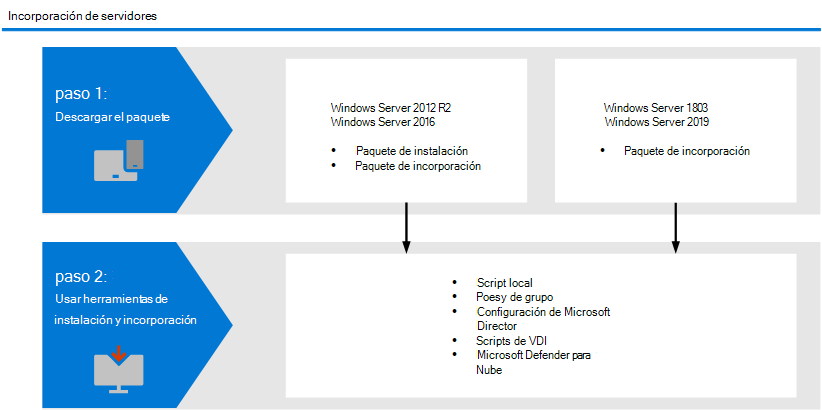

# <a name="onboard-windows-servers-to-the-microsoft-defender-for-endpoint-service"></a>Incorporación Windows servidores al servicio de Microsoft Defender para puntos de conexión

[!INCLUDE [Microsoft 365 Defender rebranding](../../includes/microsoft-defender.md)]

**Se aplica a:**

- Windows Server 2012 R2
- Windows Server 2016
- Windows Server Semi-Annual Enterprise Channel
- Windows Server 2019 y versiones posteriores
- Windows Server 2019 core edition
- Windows Server 2022
- [Microsoft Defender para punto de conexión Plan 2](https://go.microsoft.com/fwlink/p/?linkid=2154037)

[!include[Prerelease information](../../includes/prerelease.md)]

> ¿Desea experimentar Defender for Endpoint? [Regístrese para obtener una prueba gratuita.](https://signup.microsoft.com/create-account/signup?products=7f379fee-c4f9-4278-b0a1-e4c8c2fcdf7e&ru=https://aka.ms/MDEp2OpenTrial?ocid=docs-wdatp-configserver-abovefoldlink)

Defender for Endpoint amplía la compatibilidad para incluir también el sistema operativo Windows server. Esta compatibilidad proporciona capacidades avanzadas de detección de ataques e investigación sin problemas a través de Microsoft 365 Defender consola. La compatibilidad con Windows Server proporciona información más detallada sobre las actividades del servidor, la cobertura para la detección de ataques de kernel y memoria y habilita acciones de respuesta.

En este tema se describe cómo incorporar servidores de Windows específicos a Microsoft Defender para endpoint.

Para obtener instrucciones prácticas sobre lo que debe haber para las licencias y la infraestructura, vea [Protecting Windows Servers with Defender for Endpoint](https://techcommunity.microsoft.com/t5/What-s-New/Protecting-Windows-Server-with-Windows-Defender-ATP/m-p/267114#M128).

Para obtener instrucciones sobre cómo descargar y usar Seguridad de Windows base de datos para Windows servidores, vea [Seguridad de Windows Baselines](/windows/device-security/windows-security-baselines).

## <a name="windows-server-onboarding-overview"></a>Windows introducción a la incorporación del servidor

Deberá completar los siguientes pasos generales para incorporar correctamente los servidores.



**Windows Server 2012 R2 y Windows Server 2016 (versión preliminar)**

- Descargar paquetes de instalación e incorporación
- Instalar aplicación
- Siga los pasos de incorporación de la herramienta correspondiente

**Windows Server Semi-Annual Enterprise Channel y Windows Server 2019**

- Descargar el paquete de incorporación
- Siga los pasos de incorporación de la herramienta correspondiente

### <a name="new-functionality-in-the-modern-unified-solution-for-windows-server-2012-r2-and-2016-preview"></a>Nueva funcionalidad en la solución unificada moderna para Windows Server 2012 versión preliminar de R2 y 2016

La implementación anterior de la incorporación Windows Server 2012 R2 y Windows Server 2016 requerían el uso de Microsoft Monitoring Agent (MMA).

El nuevo paquete de solución unificada facilita la incorporación de servidores mediante la eliminación de dependencias y pasos de instalación. Además, este paquete de solución unificada incluye las siguientes mejoras principales:

- [Antivirus de Microsoft Defender](/microsoft-365/security/defender-endpoint/microsoft-defender-antivirus-windows) con [protección de última generación](/microsoft-365/security/defender-endpoint/next-generation-protection) para Windows Server 2012 R2
- [Reglas de reducción de superficie de ataque (ASR)](/microsoft-365/security/defender-endpoint/attack-surface-reduction-rules)
- [Protección de red](/microsoft-365/security/defender-endpoint/network-protection)
- [Acceso controlado a carpetas](/microsoft-365/security/defender-endpoint/controlled-folders)
- [Bloqueo de aplicaciones potencialmente no deseadas (PUA)](/microsoft-365/security/defender-endpoint/detect-block-potentially-unwanted-apps-microsoft-defender-antivirus)
- [Capacidades de detección mejoradas](/microsoft-365/security/defender-endpoint/overview-endpoint-detection-response)
- [Capacidades de respuesta expandida](/microsoft-365/security/defender-endpoint/respond-machine-alerts) en dispositivos y [archivos](/microsoft-365/security/defender-endpoint/respond-file-alerts)
- [EDR en modo de bloqueo](/microsoft-365/security/defender-endpoint/edr-in-block-mode)
- [Respuesta en directo](/microsoft-365/security/defender-endpoint/live-response)
- [Investigación y respuesta automatizadas (AIR)](/microsoft-365/security/defender-endpoint/automated-investigations)
- [Protección contra alteraciones](/microsoft-365/security/defender-endpoint/prevent-changes-to-security-settings-with-tamper-protection)

Si ya ha incorporado los servidores con MMA, siga las instrucciones que se proporcionan en [Migración](server-migration.md) de servidores para migrar a la nueva solución.

>[!NOTE]
>Aunque este método de incorporación Windows Server 2012 R2 y Windows Server 2016 está en versión preliminar, puede seguir usando el método de incorporación anterior mediante Microsoft Monitoring Agent (MMA). Para obtener más información, vea [Install and configure endpoints using MMA](onboard-downlevel.md#install-and-configure-microsoft-monitoring-agent-mma).

#### <a name="known-issues-and-limitations"></a>Problemas y limitaciones conocidos

Los siguientes detalles se aplican al nuevo paquete de soluciones unificado para Windows Server 2012 R2 y 2016:

- Asegúrese de que se cumplen los requisitos de conectividad especificados en [Enable access to Microsoft Defender for Endpoint service URLs in the proxy server.](/microsoft-365/security/defender-endpoint/configure-proxy-internet?enable-access-to-microsoft-defender-for-endpoint-service-urls-in-the-proxy-server) Son equivalentes a los de Windows Server 2019.
- Anteriormente, el uso de la Microsoft Monitoring Agent (MMA) en Windows Server 2016 y a continuación permitía que la puerta de enlace OMS/Log Analytics proporcionara conectividad a los servicios en la nube de Defender. La nueva solución, como Microsoft Defender para endpoint en Windows Server 2019, Windows Server 2022 y Windows 10, no admite esta puerta de enlace.
- Al Windows Server 2016, compruebe que Antivirus de Microsoft Defender está instalado, está activo y actualizado. Puede descargar e instalar la versión más reciente de la plataforma mediante Windows Update. Como alternativa, descargue el paquete de actualización manualmente desde el Catálogo [de Microsoft Update o](https://www.catalog.update.microsoft.com/Search.aspx?q=KB4052623) desde [MMPC](https://go.microsoft.com/fwlink/?linkid=870379&arch=x64).  
- En Windows Server 2012 R2, no hay ninguna interfaz de usuario para Antivirus de Microsoft Defender. Además, la interfaz de usuario en Windows Server 2016 solo permite operaciones básicas. Para realizar operaciones en un dispositivo localmente, consulte [Manage Microsoft Defender for Endpoint with PowerShell, WMI, and MPCmdRun.exe](/microsoft-365/security/defender-endpoint/manage-atp-post-migration-other-tools). Como resultado, es posible que las características que se basan específicamente en la interacción del usuario, como cuando se le pida al usuario que tome una decisión o realice una tarea específica, no funcionen como se esperaba. Se recomienda deshabilitar o no habilitar la interfaz de usuario ni requerir la interacción del usuario en cualquier servidor administrado, ya que puede afectar a la funcionalidad de protección.
- No todas las reglas de reducción de superficie de ataque están disponibles en todos los sistemas operativos. Consulta Reglas de reducción de superficie de [ataque (ASR).](/microsoft-365/security/defender-endpoint/attack-surface-reduction-rules)
- Para habilitar [La protección de red,](/microsoft-365/security/defender-endpoint/network-protection)se requiere una configuración adicional:
  - `Set-MpPreference -EnableNetworkProtection Enabled`
  - `Set-MpPreference -AllowNetworkProtectionOnWinServer 1`
  - `Set-MpPreference -AllowNetworkProtectionDownLevel 1`
  - `Set-MpPreference -AllowDatagramProcessingOnWinServer 1`

  Además, en máquinas con un gran volumen de tráfico de red, se recomienda encarecidamente realizar pruebas de rendimiento en el entorno antes de habilitar esta funcionalidad de forma general. Es posible que deba tener en cuenta el consumo de recursos adicional.
- En Windows Server 2012 R2, es posible que los eventos de red no se rellenen en la escala de tiempo. Este problema requiere una actualización Windows publicada como parte del paquete acumulativo mensual del 12 de octubre de [2021 (KB5006714).](https://support.microsoft.com/topic/october-12-2021-kb5006714-monthly-rollup-4dc4a2cd-677c-477b-8079-dcfef2bda09e)
- No se admiten actualizaciones del sistema operativo. A continuación, desinstale offboard antes de actualizar.
- Las exclusiones automáticas de *roles* de servidor no se admiten en Windows Server 2012 R2; sin embargo, las exclusiones integradas para los archivos del sistema operativo son. Para obtener más información acerca de cómo agregar exclusiones, vea Recomendaciones de detección de virus para Enterprise equipos que ejecutan versiones compatibles [actualmente de Windows](https://support.microsoft.com/topic/virus-scanning-recommendations-for-enterprise-computers-that-are-running-currently-supported-versions-of-windows-kb822158-c067a732-f24a-9079-d240-3733e39b40bc).

<a name="integration-with-azure-defender"></a>

## <a name="integration-with-microsoft-defender-for-cloud"></a>Integración con Microsoft Defender for Cloud

Microsoft Defender para endpoint se integra perfectamente con Microsoft Defender para la nube. Puede incorporar servidores automáticamente, hacer que los servidores supervisados por Azure Defender aparezcan en Defender for Endpoint y llevar a cabo investigaciones detalladas como cliente de Microsoft Defender para la nube.

Para obtener más información, vea [Integration with Microsoft Defender for Cloud](azure-server-integration.md).

> [!NOTE]
> For Windows Server 2012 R2 and 2016 running the modern unified solution preview, integration with Microsoft Defender for Cloud/Microsoft Defender for servers for alerting and automated deployment is not yet available. Aunque puede instalar la nueva solución en estas máquinas, no se mostrará ninguna alerta en Microsoft Defender para la nube.

## <a name="windows-server-2012-r2-and-windows-server-2016"></a>Windows Server 2012 R2 y Windows Server 2016

> [!NOTE]
> Aunque este método de incorporación Windows Server 2012 R2 y Windows Server 2016 está en versión preliminar, puede seguir usando el método de incorporación anterior mediante Microsoft Monitoring Agent (MMA). Para obtener más información, vea [Install and configure endpoints using MMA](onboard-downlevel.md#install-and-configure-microsoft-monitoring-agent-mma).

### <a name="prerequisites"></a>Requisitos previos

**Requisitos previos para Windows Server 2012 R2**

Si ha actualizado completamente sus [](/troubleshoot/windows-client/deployment/standard-terminology-software-updates.md#monthly-rollup) máquinas con el último paquete acumulativo mensual, **no hay requisitos** previos adicionales.


El paquete del instalador comprobará si los siguientes componentes ya se han instalado mediante una actualización:

- [Actualización de la experiencia del cliente y telemetría de diagnóstico](https://support.microsoft.com/help/3080149/update-for-customer-experience-and-diagnostic-telemetry)
- [Actualización de Tiempo de ejecución universal de C en Windows](https://support.microsoft.com/topic/update-for-universal-c-runtime-in-windows-c0514201-7fe6-95a3-b0a5-287930f3560c)

**Requisitos previos para Windows Server 2016** 

Aparte de actualizar completamente el equipo con la actualización acumulativa más reciente (LCU), compruebe que Antivirus de Microsoft Defender está instalado, está activo y actualizado. Puede descargar e instalar la versión más reciente de la plataforma mediante Windows Update. Como alternativa, descargue el paquete de actualización manualmente desde el Catálogo [de Microsoft Update o](https://www.catalog.update.microsoft.com/Search.aspx?q=KB4052623) desde [MMPC](https://go.microsoft.com/fwlink/?linkid=870379&arch=x64). 

> [!NOTE]
> Para actualizar correctamente la versión integrada de Windows Defender, que tiene un número de versión a partir de la 4.10, a la plataforma disponible más reciente, se debe haber aplicado una actualización de pila de mantenimiento, así como la actualización acumulativa más reciente (LCU) igual o posterior al 20 de septiembre de 2018: KB4457127 (compilación del sistema operativo 14393.2515).

**Nuevo paquete de actualización para Microsoft Defender para Endpoint en Windows Server 2012 R2 y 2016**

Para recibir mejoras y correcciones periódicas del producto para el componente del sensor de EDR, asegúrese de que Windows se aplique o apruebe la actualización [KB5005292.](https://go.microsoft.com/fwlink/?linkid=2168277) Además, para mantener actualizados los componentes de protección, [vea Manage Antivirus de Microsoft Defender updates and apply baselines](/microsoft-365/security/defender-endpoint/manage-updates-baselines-microsoft-defender-antivirus#monthly-platform-and-engine-versions).

### <a name="download-installation-and-onboarding-packages"></a>Descargar paquetes de instalación e incorporación

1. En Centro de seguridad de Microsoft Defender, vaya **a Configuración > Device Management > Onboarding**.

2. Seleccione **Windows Server 2012 R2 y 2016**.

3. Seleccione **Descargar paquete de instalación** y guarde el .msi archivo. Puede ejecutar el paquete msi a través del asistente de instalación o seguir los pasos de la línea de comandos de Instalar Microsoft Defender para endpoint [mediante la línea de comandos](#install-microsoft-defender-for-endpoint-using-command-line).

   > [!NOTE]
   > Antivirus de Microsoft Defender se instalará y estará activo a menos que se establezca en modo pasivo. 
 

4. Seleccione **Descargar paquete de incorporación** y guarde el .zip archivo.

5. Instale el paquete de instalación con cualquiera de las opciones para instalar Antivirus de Microsoft Defender. 

6. Siga los pasos proporcionados en la [sección pasos de incorporación.](#onboarding-steps)

### <a name="options-to-install-microsoft-defender-for-endpoint"></a>Opciones para instalar Microsoft Defender para endpoint

En la sección anterior, descargó un paquete de instalación. El paquete de instalación contiene el instalador de todos los componentes de Microsoft Defender para endpoint.

### <a name="install-microsoft-defender-for-endpoint-using-command-line"></a>Instalar Microsoft Defender para endpoint mediante línea de comandos

Use el paquete de instalación del paso anterior para instalar Microsoft Defender para endpoint.

Ejecute el siguiente comando para instalar Microsoft Defender para endpoint:

```console
Msiexec /i md4ws.msi /quiet
```

Para desinstalar, asegúrese de que la máquina está fuera deborde primero con el script de offboarding adecuado. A continuación, use Programas y características del Panel de control \> \> para realizar la desinstalación.

Como alternativa, ejecute el siguiente comando de desinstalación para desinstalar Microsoft Defender para endpoint:

```console
Msiexec /x md4ws.msi /quiet
```

Debe usar el mismo paquete que usó para la instalación para que el comando anterior se realizara correctamente.

El `/quiet` modificador suprime todas las notificaciones.

> [!NOTE]
> Antivirus de Microsoft Defender no pasa automáticamente al modo pasivo. Puede optar por establecer Antivirus de Microsoft Defender para que se ejecute en modo pasivo si está ejecutando una solución antivirus o antimalware que no sea de Microsoft. Para las instalaciones de línea de comandos, el opcional establece inmediatamente `FORCEPASSIVEMODE=1` el componente Antivirus de Microsoft Defender en modo pasivo para evitar interferencias. A continuación, para asegurarse de que Defender Antivirus permanece en modo pasivo después de la incorporación para admitir funcionalidades como EDR Block, establezca la clave del Registro "ForceDefenderPassiveMode".
>
> - El paquete de incorporación para Windows Server 2019 y Windows Server 2022 a Microsoft Endpoint Manager incluye actualmente un script. Para obtener más información sobre cómo implementar scripts en Configuration Manager, vea [Paquetes y programas en Configuration Manager](/configmgr/apps/deploy-use/packages-and-programs).
> - Un script local es adecuado para una prueba de concepto, pero no debe usarse para la implementación de producción. Para una implementación de producción, se recomienda usar la directiva de grupo o Microsoft Endpoint Configuration Manager.

La compatibilidad con Windows Server proporciona información más detallada sobre las actividades del servidor, la cobertura para la detección de ataques de kernel y memoria y habilita acciones de respuesta.

### <a name="install-microsoft-defender-for-endpoint-using-a-script"></a>Instalar Microsoft Defender para endpoint con un script

También puede usar el [script del instalador para](server-migration.md#installer-script) ayudar a automatizar la instalación, desinstalación e incorporación. 

## <a name="windows-server-semi-annual-enterprise-channel-and-windows-server-2019-and-windows-server-2022"></a>Windows Server Semi-Annual Enterprise Channel y Windows Server 2019 y Windows Server 2022

El paquete de incorporación para Windows Server 2019 y Windows Server 2022 a Microsoft Endpoint Manager envía actualmente un script. Para obtener más información sobre cómo implementar scripts en Configuration Manager, vea [Paquetes y programas en Configuration Manager](/configmgr/apps/deploy-use/packages-and-programs).

### <a name="download-package"></a>Descargar paquete

1. En Centro de seguridad de Microsoft Defender, vaya **a Configuración > Device Management > Onboarding**.

2. Seleccione **Windows Server 1803 y 2019**.

3. Seleccione **Descargar paquete**. Guárdelo como WindowsDefenderATPOnboardingPackage.zip.

4. Siga los pasos proporcionados en la [sección pasos de incorporación.](#onboarding-steps)

## <a name="onboarding-steps"></a>Pasos de incorporación

1. Ahora que ha descargado los paquetes de incorporación necesarios, use las instrucciones indicadas en herramientas y métodos de incorporación [para](configure-endpoints.md#endpoint-onboarding-tools) el servidor.

2. (Solo es aplicable si usa una solución antimalware de terceros). Tendrás que aplicar la siguiente configuración Antivirus de Microsoft Defender modo pasivo. Compruebe que se configuró correctamente:

    1. Establezca la siguiente entrada del Registro:
       - Ruta de acceso: `HKLM\SOFTWARE\Policies\Microsoft\Windows Advanced Threat Protection`
       - Nombre: `ForceDefenderPassiveMode`
       - Tipo: `REG_DWORD`
       - Valor: `1`

    2. Ejecute el siguiente comando de PowerShell para comprobar que se configuró el modo pasivo:

        ```powershell
        Get-WinEvent -FilterHashtable @{ProviderName="Microsoft-Windows-Sense" ;ID=84}
        ```

        > [!NOTE]
        > - La integración entre Microsoft Defender para servidores y Microsoft Defender para endpoint se ha ampliado para admitir Windows Server 2022, [Windows Server 2019 y Windows Virtual Desktop (WVD).](/azure/security-center/release-notes#microsoft-defender-for-endpoint-integration-with-azure-defender-now-supports-windows-server-2019-and-windows-10-virtual-desktop-wvd-in-preview)
        > - La supervisión de extremos de servidor que utiliza esta integración se ha deshabilitado para Office 365 GCC clientes.

    3. Confirme que se encuentra un evento reciente que contiene el evento de modo pasivo:

       

> [!IMPORTANT]
>
> - Cuando usa Microsoft Defender para la nube para supervisar los servidores, se crea automáticamente un inquilino de Defender for Endpoint (en Estados Unidos para usuarios estadounidenses, en la UE para usuarios europeos y en el Reino Unido para usuarios del Reino Unido).
Los datos recopilados por Defender para endpoint se almacenan en la ubicación geográfica del inquilino tal como se identifica durante el aprovisionamiento.
> - Si usa Defender para endpoint antes de usar Microsoft Defender para la nube, los datos se almacenarán en la ubicación que especificó al crear el inquilino, incluso si se integra con Microsoft Defender para la nube más adelante.
> - Una vez configurado, no se puede cambiar la ubicación donde se almacenan los datos. Si necesita mover los datos a otra ubicación, póngase en contacto con el soporte técnico de Microsoft para restablecer el espacio empresarial.

## <a name="verify-the-onboarding-and-installation"></a>Comprobar la incorporación e instalación

Compruebe que Antivirus de Microsoft Defender y Microsoft Defender para Endpoint se estén ejecutando.

## <a name="run-a-detection-test-to-verify-onboarding"></a>Ejecutar una prueba de detección para comprobar la incorporación

Después de incorporar el dispositivo, puedes elegir ejecutar una prueba de detección para comprobar que un dispositivo está correctamente incorporado al servicio. Para obtener más información, consulta [Ejecutar una prueba de detección en un dispositivo de Microsoft Defender para endpoint](run-detection-test.md)recién incorporado.

> [!NOTE]
> La Antivirus de Microsoft Defender no es necesaria, pero se recomienda. Si otro producto de proveedor de antivirus es la solución principal de protección de puntos de conexión, puede ejecutar Defender Antivirus en modo pasivo. Solo puedes confirmar que el modo pasivo está activo después de comprobar que se está ejecutando el sensor de Microsoft Defender para endpoints (SENSE).

1. Ejecute el siguiente comando para comprobar que Antivirus de Microsoft Defender está instalado:

    >[!NOTE]
    >Este paso de verifcation solo es necesario si usa Antivirus de Microsoft Defender como la solución antimalware activa.

    `sc.exe query Windefend`


    Si el resultado es "El servicio especificado no existe como servicio instalado", deberá instalar Antivirus de Microsoft Defender. 


    Para obtener información sobre cómo usar la directiva de grupo para configurar y administrar Antivirus de Microsoft Defender en los servidores de Windows, vea [Use Group Policy settings to configure and manage Antivirus de Microsoft Defender](use-group-policy-microsoft-defender-antivirus.md).

2. Ejecute el siguiente comando para comprobar que se está ejecutando Microsoft Defender para endpoint:

    `sc.exe query sense`

    El resultado debe mostrar que se está ejecutando. Si tiene problemas con la incorporación, consulte [Solucionar problemas de incorporación.](troubleshoot-onboarding.md)

## <a name="run-a-detection-test"></a>Ejecutar una prueba de detección

Siga los pasos descritos en Ejecutar una prueba de detección en un dispositivo recién incorporado para comprobar que el servidor está informando [a](run-detection-test.md) Defender para el servicio de extremo.

## <a name="next-steps"></a>Siguientes pasos

Después de incorporar dispositivos correctamente al servicio, deberá configurar los componentes individuales de Microsoft Defender para endpoint. Siga el [orden de adopción](prepare-deployment.md#adoption-order) para guiarse en la habilitación de los distintos componentes.

## <a name="offboard-windows-servers"></a>Servidores de Windows offboard

Puede Windows Server 2012 Windows Server 2012 R2, Windows Server 2016, Windows Server (SAC), Windows Server 2019, Windows Server 2019 Core edition en el mismo método disponible para dispositivos cliente Windows 10.

- [Dispositivos offboard con directiva de grupo](configure-endpoints-gp.md#offboard-devices-using-group-policy)
- [Dispositivos offboard con Configuration Manager](configure-endpoints-sccm.md#offboard-devices-using-configuration-manager)
- [Offboard y supervisar dispositivos con herramientas de administración de dispositivos móviles](configure-endpoints-mdm.md#offboard-and-monitor-devices-using-mobile-device-management-tools)
- [Dispositivos offboard con un script local](configure-endpoints-script.md#offboard-devices-using-a-local-script)

Para otras Windows de servidor, tiene dos opciones para salir Windows servidores del servicio:

- Desinstalar el agente mma
- Quitar la configuración del área de trabajo de Defender for Endpoint

>[!NOTE]
>*Estas instrucciones de offboarding para otras versiones de servidor de Windows también se aplican si está ejecutando el anterior Microsoft Defender para endpoint para Windows Server 2016 y Windows Server 2012 R2 que requiere la MMA. Las instrucciones para migrar a la nueva solución no fiada se encuentran en [Escenarios](/microsoft-365/security/defender-endpoint/server-migration)de migración de servidor en Microsoft Defender para endpoint .

## <a name="related-topics"></a>Temas relacionados

- [Incorporar versiones anteriores de Windows](onboard-downlevel.md)
- [Incorporar dispositivos Windows 10 mediante la directiva de grupo](configure-endpoints.md)
- [Incorporar dispositivos que no tienen Windows](configure-endpoints-non-windows.md)
- [Configurar las opciones del proxy y de conectividad a Internet](configure-proxy-internet.md)
- [Ejecutar una prueba de detección en un dispositivo Defender for Endpoint recién incorporado](run-detection-test.md)
- [Solución de problemas de incorporación de Microsoft Defender para puntos de conexión](troubleshoot-onboarding.md)
