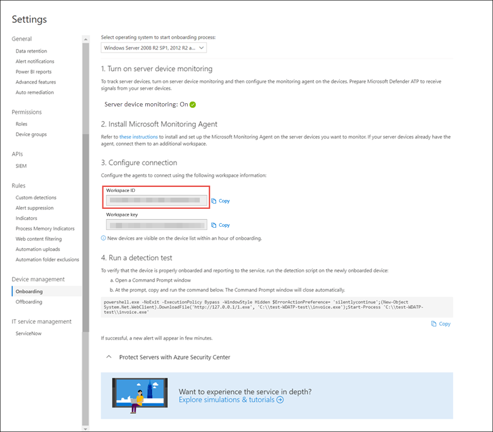

# <a name="onboard-windows-servers-to-the-microsoft-defender-for-endpoint-service"></a>Incorporación de servidores de Windows al servicio microsoft defender para puntos de conexión

[!INCLUDE [Microsoft 365 Defender rebranding](../../includes/microsoft-defender.md)]


**Se aplica a:**

- Windows Server 2008 R2 SP1
- Windows Server 2012 R2
- Windows Server 2016
- Windows Server (SAC) versión 1803 y versiones posteriores
- Windows Server 2019 y versiones posteriores
- Edición principal de Windows Server 2019

> ¿Desea experimentar Defender for Endpoint? [Regístrate para obtener una versión de prueba gratuita.](https://www.microsoft.com/microsoft-365/windows/microsoft-defender-atp?ocid=docs-wdatp-configserver-abovefoldlink)


Defender for Endpoint amplía la compatibilidad para incluir también el sistema operativo Windows Server. Esta compatibilidad proporciona capacidades avanzadas de detección de ataques e investigación sin problemas a través de la consola del Centro de seguridad de Microsoft Defender.

Para obtener instrucciones prácticas sobre lo que debe haber para las licencias y la infraestructura, consulta Protección de los servidores [windows con Defender para endpoint.](https://techcommunity.microsoft.com/t5/What-s-New/Protecting-Windows-Server-with-Windows-Defender-ATP/m-p/267114#M128)

Para obtener instrucciones sobre cómo descargar y usar líneas base de seguridad de Windows para servidores Windows, consulta [Líneas base de seguridad de Windows](https://docs.microsoft.com/windows/device-security/windows-security-baselines).

<br>

## <a name="windows-server-2008-r2-sp1-windows-server-2012-r2-and-windows-server-2016"></a>Windows Server 2008 R2 SP1, Windows Server 2012 R2 y Windows Server 2016

Puedes incorporar Windows Server 2008 R2 SP1, Windows Server 2012 R2 y Windows Server 2016 a Defender para endpoint mediante cualquiera de las siguientes opciones:

- **Opción 1:** [Incorporación mediante la instalación y configuración de Microsoft Monitoring Agent (MMA)](#option-1-onboard-by-installing-and-configuring-microsoft-monitoring-agent-mma)
- **Opción 2:** [Incorporación a través del Centro de seguridad de Azure](#option-2-onboard-windows-servers-through-azure-security-center)
- **Opción 3:** [Incorporación a través de Microsoft Endpoint Manager versión 2002 y versiones posteriores](#option-3-onboard-windows-servers-through-microsoft-endpoint-manager-version-2002-and-later)


Después de completar los pasos de incorporación con cualquiera de las opciones proporcionadas, deberá configurar y actualizar los clientes de [System Center Endpoint Protection](#configure-and-update-system-center-endpoint-protection-clients).


> [!NOTE]
> La licencia de servidor independiente de Defender for Endpoint es necesaria, por nodo, para incorporar un servidor Windows a través de Microsoft Monitoring Agent (opción 1) o a través de Microsoft Endpoint Manager (opción 3). Como alternativa, se requiere una licencia de Azure Defender para servidores, por nodo, para incorporar un servidor Windows a través del Centro de seguridad de Azure (opción 2), consulte Características admitidas disponibles en [Azure Security Center](https://docs.microsoft.com/azure/security-center/security-center-services).


### <a name="option-1-onboard-by-installing-and-configuring-microsoft-monitoring-agent-mma"></a>Opción 1: Incorporación mediante la instalación y configuración de Microsoft Monitoring Agent (MMA)
Tendrás que instalar y configurar MMA para que los servidores Windows informen los datos del sensor a Defender para endpoint. Para obtener más información, vea [Recopilar datos de registro con el agente de Azure Log Analytics](https://docs.microsoft.com/azure/azure-monitor/platform/log-analytics-agent).

Si ya está usando System Center Operations Manager (SCOM) o Azure Monitor (anteriormente conocido como Operations Management Suite (OMS)), adjunte Microsoft Monitoring Agent (MMA) para informar al área de trabajo de Defender para Endpoint mediante la compatibilidad con multiconsulta.

En general, deberá seguir los pasos siguientes:
1. Cumpla los requisitos de incorporación descritos en **la sección Antes de comenzar.**
2. Active la supervisión del servidor desde el Centro de seguridad de Microsoft Defender.
3. Instale y configure MMA para que el servidor informe los datos del sensor a Defender for Endpoint.
4. Configurar y actualizar clientes de System Center Endpoint Protection.


> [!TIP]
> Después de incorporar el dispositivo, puedes elegir ejecutar una prueba de detección para comprobar que está correctamente incorporado al servicio. Para obtener más información, vea [Run a detection test on a newly onboarded Defender for Endpoint endpoint](run-detection-test.md).


#### <a name="before-you-begin"></a>Antes de empezar 
Realice los siguientes pasos para cumplir los requisitos de incorporación:

 - Para Windows Server 2008 R2 SP1 o Windows Server 2012 R2, asegúrese de instalar la siguiente revisión:
    - [Actualización de la experiencia del cliente y telemetría de diagnóstico](https://support.microsoft.com/help/3080149/update-for-customer-experience-and-diagnostic-telemetry)

 - Además, para Windows Server 2008 R2 SP1, asegúrate de cumplir los siguientes requisitos:
    - Instalar el paquete [acumulativo de actualizaciones mensuales de febrero](https://support.microsoft.com/help/4074598/windows-7-update-kb4074598)
    - Instalar [.NET Framework 4.5](https://www.microsoft.com/download/details.aspx?id=30653) (o posterior) o [KB3154518](https://support.microsoft.com/help/3154518/support-for-tls-system-default-versions-included-in-the-net-framework)
   
   > [!NOTE]
    > Si administras Windows Server 2008 R2 SP1 con SCCM, el agente cliente sccm instala .Net Framework 4.5.2. Por lo tanto, no es necesario instalar .NET Framework 4.5 (o posterior).
   
 - Para Windows Server 2008 R2 SP1 y Windows Server 2012 R2: Configurar y actualizar clientes de [System Center Endpoint Protection](#configure-and-update-system-center-endpoint-protection-clients).

    > [!NOTE]
    > Este paso solo es necesario si su organización usa System Center Endpoint Protection (SCEP) y está incorporando Windows Server 2008 R2 SP1 y Windows Server 2012 R2.


<span id="server-mma"/>

### <a name="install-and-configure-microsoft-monitoring-agent-mma-to-report-sensor-data-to-microsoft-defender-for-endpoint"></a>Instalar y configurar Microsoft Monitoring Agent (MMA) para informar de los datos del sensor a Microsoft Defender para endpoint

1. Descargue el archivo de instalación del agente: agente de [Windows 64 bits](https://go.microsoft.com/fwlink/?LinkId=828603).

2. Con el identificador de área de trabajo y la clave área de trabajo obtenidas en el procedimiento anterior, elija cualquiera de los siguientes métodos de instalación para instalar el agente en el servidor Windows:
    - [Instale manualmente el agente mediante el programa de instalación](https://docs.microsoft.com/azure/log-analytics/log-analytics-windows-agents#install-agent-using-setup-wizard). <br>
    En la **página Opciones de configuración del** agente, elija Conectar el agente a Azure Log Analytics **(OMS).**
    - [Instale el agente mediante la línea de comandos](https://docs.microsoft.com/azure/log-analytics/log-analytics-windows-agents#install-agent-using-command-line).
    - [Configure el agente mediante un script](https://docs.microsoft.com/azure/log-analytics/log-analytics-windows-agents#install-agent-using-dsc-in-azure-automation).

> [!NOTE]
> Si es cliente de [Us Government](gov.md), en "Azure Cloud" tendrá que elegir "Azure US Government" si usa el asistente para la instalación, o si usa una línea de comandos o un script: establezca el parámetro "OPINSIGHTS_WORKSPACE_AZURE_CLOUD_TYPE" en 1.


<span id="server-proxy"/>

### <a name="configure-windows-server-proxy-and-internet-connectivity-settings-if-needed"></a>Configurar el proxy del servidor Windows y la configuración de conectividad a Internet si es necesario
Si los servidores necesitan usar un proxy para comunicarse con Defender for Endpoint, use uno de los métodos siguientes para configurar la MMA para usar el servidor proxy:


- [Configurar la MMA para usar un servidor proxy](https://docs.microsoft.com/azure/azure-monitor/platform/agent-windows#install-agent-using-setup-wizard)

- [Configurar Windows para usar un servidor proxy para todas las conexiones](configure-proxy-internet.md)

Si hay un proxy o firewall en uso, asegúrese de que los servidores puedan tener acceso a todas las direcciones URL del servicio de Microsoft Defender para endpoints directamente y sin interceptación SSL. Para obtener más información, vea [habilitar el acceso a las direcciones URL del servicio defender para puntos de conexión](configure-proxy-internet.md#enable-access-to-microsoft-defender-for-endpoint-service-urls-in-the-proxy-server). El uso de la interceptación SSL impedirá que el sistema se comunique con el servicio Defender for Endpoint. 

Una vez completado, deberías ver los servidores de Windows incorporados en el portal en una hora.

### <a name="option-2-onboard-windows-servers-through-azure-security-center"></a>Opción 2: Incorporar servidores windows a través del Centro de seguridad de Azure
1. En el panel de navegación del Centro de seguridad de Microsoft Defender, seleccione **Configuración**  >  **Incorporación de administración de**  >  **dispositivos**.

2. Selecciona **Windows Server 2008 R2 SP1, 2012 R2 y 2016** como sistema operativo.

3. Haga **clic en Servidores integrados en El Centro de seguridad de Azure**.

4. Siga las instrucciones de incorporación en [Microsoft Defender para Endpoint with Azure Security Center](https://docs.microsoft.com/azure/security-center/security-center-wdatp).

Después de completar los pasos de incorporación, deberá configurar y actualizar los clientes de [System Center Endpoint Protection](#configure-and-update-system-center-endpoint-protection-clients).

> [!NOTE]
> - Para que la incorporación a través de Azure Defender para servidores (anteriormente Azure Security Center Standard Edition) funcione como se esperaba, el servidor debe tener una clave y un área de trabajo adecuadas configuradas dentro de la configuración de Microsoft Monitoring Agent (MMA).
> - Una vez configurado, el módulo de administración de nube adecuado se implementa en el equipo y el proceso de sensor (MsSenseS.exe) se implementará e iniciará. 
> - Esto también es necesario si el servidor está configurado para usar un servidor de puerta de enlace OMS como proxy.

### <a name="option-3-onboard-windows-servers-through-microsoft-endpoint-manager-version-2002-and-later"></a>Opción 3: Incorporar servidores windows a través de Microsoft Endpoint Manager versión 2002 y versiones posteriores
Puedes incorporar Windows Server 2012 R2 y Windows Server 2016 con Microsoft Endpoint Manager versión 2002 y versiones posteriores. Para obtener más información, vea [Microsoft Defender for Endpoint in Microsoft Endpoint Manager current branch](https://docs.microsoft.com/mem/configmgr/protect/deploy-use/defender-advanced-threat-protection).

Después de completar los pasos de incorporación, deberá configurar y actualizar los clientes de [System Center Endpoint Protection](#configure-and-update-system-center-endpoint-protection-clients).

<br>

## <a name="windows-server-sac-version-1803-windows-server-2019-and-windows-server-2019-core-edition"></a>Windows Server (SAC) versión 1803, Windows Server 2019 y Windows Server 2019 Core edition
Puedes incorporar Windows Server (SAC) versión 1803, Windows Server 2019 o Windows Server 2019 Core Edition mediante los siguientes métodos de implementación:

- [Script local](configure-endpoints-script.md) 
- [Directiva de grupo](configure-endpoints-gp.md)
- [Microsoft Endpoint Configuration Manager](configure-endpoints-sccm.md)
- [System Center Configuration Manager 2012 / 2012 R2 1511 / 1602](configure-endpoints-sccm.md#onboard-devices-using-system-center-configuration-manager)
- [Scripts de incorporación de VDI para dispositivos no persistentes](configure-endpoints-vdi.md)

> [!NOTE]
> - El paquete de incorporación para Windows Server 2019 a través de Microsoft Endpoint Manager actualmente incluye un script. Para obtener más información sobre cómo implementar scripts en Configuration Manager, vea [Paquetes y programas en Configuration Manager](https://docs.microsoft.com/configmgr/apps/deploy-use/packages-and-programs).
> - Un script local es adecuado para una prueba de concepto, pero no debe usarse para la implementación de producción. Para una implementación de producción, se recomienda usar la directiva de grupo o Microsoft Endpoint Configuration Manager.

La compatibilidad con Windows Server proporciona información más detallada sobre las actividades del servidor, la cobertura para la detección de ataques de kernel y memoria y habilita acciones de respuesta.

1. Configura Defender para la incorporación de puntos de conexión en el servidor Windows con las mismas herramientas y métodos para dispositivos Con Windows 10. Para obtener más información, [consulta Incorporación de dispositivos Windows 10](configure-endpoints.md).

2. Si está ejecutando una solución antimalware de terceros, deberá aplicar la siguiente configuración del modo pasivo antivirus de Microsoft Defender. Compruebe que se configuró correctamente:

    1. Establezca la siguiente entrada del Registro:
       - Ruta de acceso: `HKLM\SOFTWARE\Policies\Microsoft\Windows Advanced Threat Protection`
       - Nombre: ForceDefenderPassiveMode
       - Tipo: REG_DWORD
       - Value: 1

    1. Ejecute el siguiente comando de PowerShell para comprobar que se configuró el modo pasivo:

       ```PowerShell
       Get-WinEvent -FilterHashtable @{ProviderName="Microsoft-Windows-Sense" ;ID=84}
       ```

    1. Confirme que se encuentra un evento reciente que contiene el evento de modo pasivo:

       

3. Ejecute el siguiente comando para comprobar si Microsoft Defender AV está instalado:

   ```sc.exe query Windefend```

    Si el resultado es "El servicio especificado no existe como servicio instalado", tendrá que instalar Microsoft Defender AV. Para obtener más información, [consulta Antivirus de Microsoft Defender en Windows 10](https://docs.microsoft.com/windows/security/threat-protection/microsoft-defender-antivirus/microsoft-defender-antivirus-in-windows-10).
    
    Para obtener información sobre cómo usar la directiva de grupo para configurar y administrar Antivirus de Microsoft Defender en los servidores windows, consulta Usar la configuración de directiva de grupo para configurar y administrar [Antivirus de Microsoft Defender.](https://docs.microsoft.com/windows/security/threat-protection/microsoft-defender-antivirus/use-group-policy-microsoft-defender-antivirus)

<br>

## <a name="integration-with-azure-security-center"></a>Integración con Azure Security Center
Defender for Endpoint se puede integrar con Azure Security Center para proporcionar una solución completa de protección de windows server. Con esta integración, Azure Security Center puede usar la potencia de Defender para Endpoint para proporcionar una mejor detección de amenazas para servidores Windows.

En esta integración se incluyen las siguientes funcionalidades:
- Incorporación automatizada: el sensor defender para puntos de conexión se habilita automáticamente en los servidores Windows que están incorporados al Centro de seguridad de Azure. Para obtener más información sobre la incorporación de Azure Security Center, consulte [Onboarding to Azure Security Center Standard for enhanced security](https://docs.microsoft.com/azure/security-center/security-center-onboarding).

    > [!NOTE]
    > La incorporación automatizada solo se aplica a Windows Server 2008 R2 SP1, Windows Server 2012 R2 y Windows Server 2016.

- Los servidores windows supervisados por Azure Security Center también estarán disponibles en Defender para endpoint: El Centro de seguridad de Azure se conecta perfectamente al inquilino de Defender for Endpoint, lo que proporciona una vista única entre clientes y servidores.  Además, las alertas de Defender for Endpoint estarán disponibles en la consola del Centro de seguridad de Azure.
- Investigación del servidor: los clientes del Centro de seguridad de Azure pueden acceder al Centro de seguridad de Microsoft Defender para realizar una investigación detallada para descubrir el ámbito de una posible infracción.

> [!IMPORTANT]
> - Cuando usa Azure Security Center para supervisar los servidores, se crea automáticamente un inquilino de Defender for Endpoint (en Estados Unidos para usuarios estadounidenses, en la UE para usuarios europeos y británicos).<br>
Los datos recopilados por Defender para endpoint se almacenan en la ubicación geográfica del inquilino tal como se identifica durante el aprovisionamiento.
> - Si usa Defender para endpoint antes de usar Azure Security Center, los datos se almacenarán en la ubicación que especificó al crear el espacio empresarial, incluso si se integra con Azure Security Center más adelante.
> - Una vez configurado, no se puede cambiar la ubicación donde se almacenan los datos. Si necesita mover los datos a otra ubicación, póngase en contacto con el soporte técnico de Microsoft para restablecer el espacio empresarial. <br>
La supervisión de extremo de servidor que utiliza esta integración se ha deshabilitado para los clientes GCC de Office 365.

<br>

## <a name="configure-and-update-system-center-endpoint-protection-clients"></a>Configurar y actualizar clientes de System Center Endpoint Protection

Defender for Endpoint se integra con System Center Endpoint Protection. La integración proporciona visibilidad a las detecciones de malware y para detener la propagación de un ataque en la organización mediante la prohibición de archivos potencialmente malintencionados o malware sospechoso.

Se requieren los siguientes pasos para habilitar esta integración:
- Instale la actualización de la plataforma antimalware de enero de [2017 para los clientes de Endpoint Protection](https://support.microsoft.com/help/3209361/january-2017-anti-malware-platform-update-for-endpoint-protection-clie).

- [Configure la pertenencia al servicio de protección](https://docs.microsoft.com/windows/security/threat-protection/microsoft-defender-antivirus/enable-cloud-protection-microsoft-defender-antivirus) en la nube del cliente SCEP a la **configuración** Avanzada.

<br>

## <a name="offboard-windows-servers"></a>Servidores de Windows fuera de la tabla
Puedes salir de Windows Server (SAC), Windows Server 2019 y Windows Server 2019 Core edition en el mismo método disponible para dispositivos cliente de Windows 10.

Para otras versiones de Windows Server, tienes dos opciones para salir de los servidores windows desde el servicio:
- Desinstalar el agente mma
- Quitar la configuración del área de trabajo de Defender for Endpoint

> [!NOTE]
> La offboarding hace que el servidor Windows deje de enviar datos del sensor al portal, pero los datos del servidor Windows, incluida la referencia a las alertas que ha tenido, se conservarán durante un máximo de 6 meses.

### <a name="uninstall-windows-servers-by-uninstalling-the-mma-agent"></a>Desinstalar servidores windows desinstalando el agente mma
Para salir del servidor Windows, puedes desinstalar el agente mma del servidor Windows o desasoyérselo de los informes a tu área de trabajo de Defender para endpoint. Después de desactivar el agente, el servidor Windows ya no enviará datos del sensor a Defender para endpoint.
Para obtener más información, vea [Para deshabilitar un agente](https://docs.microsoft.com/azure/log-analytics/log-analytics-windows-agents#to-disable-an-agent).

### <a name="remove-the-defender-for-endpoint-workspace-configuration"></a>Quitar la configuración del área de trabajo de Defender for Endpoint
Para salir del servidor Windows, puedes usar cualquiera de los siguientes métodos:

- Quitar la configuración del área de trabajo de Defender for Endpoint del agente mma
- Ejecutar un comando de PowerShell para quitar la configuración

#### <a name="remove-the-defender-for-endpoint-workspace-configuration-from-the-mma-agent"></a>Quitar la configuración del área de trabajo de Defender for Endpoint del agente mma

1. En las **propiedades del agente de supervisión de Microsoft,** seleccione la pestaña Azure Log Analytics **(OMS).**

2. Seleccione el área de trabajo Defender para extremo y haga clic en **Quitar**.

    

#### <a name="run-a-powershell-command-to-remove-the-configuration"></a>Ejecutar un comando de PowerShell para quitar la configuración

1. Obtener el id. de área de trabajo:

   1. En el panel de navegación, seleccione **Configuración**  >  **incorporación**.

   1. Selecciona **Windows Server 2008 R2 SP1, 2012 R2 y 2016** como sistema operativo y obtén el identificador de área de trabajo:

      

2. Abra un PowerShell con privilegios elevados y ejecute el siguiente comando. Use el identificador de área de trabajo que obtuvo y reemplace `WorkspaceID` :

    ```powershell
    $ErrorActionPreference = "SilentlyContinue"
    # Load agent scripting object
    $AgentCfg = New-Object -ComObject AgentConfigManager.MgmtSvcCfg
    # Remove OMS Workspace
    $AgentCfg.RemoveCloudWorkspace("WorkspaceID")
    # Reload the configuration and apply changes
    $AgentCfg.ReloadConfiguration()

    ```

<br>

## <a name="related-topics"></a>Temas relacionados
- [Incorporación de dispositivos Windows 10](configure-endpoints.md)
- [Incorporación de dispositivos que no son de Windows](configure-endpoints-non-windows.md)
- [Configuración de proxy y conectividad a Internet](configure-proxy-internet.md)
- [Ejecutar una prueba de detección en un dispositivo Defender for Endpoint recién incorporado](run-detection-test.md)
- [Solución de problemas de incorporación de Microsoft Defender para puntos de conexión](troubleshoot-onboarding.md)
