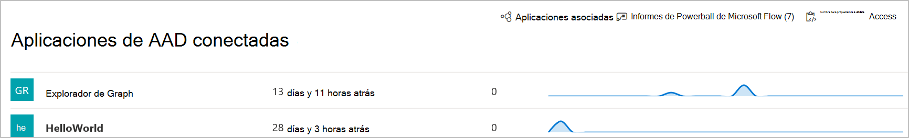

# Aplicaciones conectadas en Microsoft Defender para endpoint

[!INCLUDE [Microsoft 365 Defender rebranding](../../includes/microsoft-defender.md)]

**Se aplica a:**
- [Microsoft Defender para punto de conexión](https://go.microsoft.com/fwlink/p/?linkid=2154037)
- [Microsoft 365 Defender](https://go.microsoft.com/fwlink/?linkid=2118804)

>¿Desea experimentar Defender for Endpoint? [Regístrate para obtener una versión de prueba gratuita.](https://www.microsoft.com/microsoft-365/windows/microsoft-defender-atp?ocid=docs-wdatp-assignaccess-abovefoldlink)

Las aplicaciones conectadas se integran con la plataforma Defender for Endpoint mediante API. 

Las aplicaciones usan el protocolo estándar OAuth 2.0 para autenticar y proporcionar tokens para su uso con Microsoft Defender para las API de extremo.  Además, las aplicaciones de Azure Active Directory (Azure AD) permiten a los administradores de inquilinos establecer un control explícito sobre las API a las que se puede tener acceso mediante la aplicación correspondiente.
 
Deberá seguir estos pasos [para](https://docs.microsoft.com/microsoft-365/security/defender-endpoint/apis-intro) usar las API con la aplicación conectada.
 
## Acceder a la página de la aplicación conectada
En el menú de navegación izquierdo, seleccione **Partners & API**  >  **conectadas aplicaciones de AAD**.

 
## Ver detalles de la aplicación conectada
La página Aplicaciones conectadas proporciona información sobre las aplicaciones de Azure AD conectadas a Microsoft Defender para endpoint en su organización. Puede revisar el uso de las aplicaciones conectadas: última vista, número de solicitudes en las últimas 24 horas y tendencias de solicitudes en los últimos 30 días.

 
## Editar, volver a configurar o eliminar una aplicación conectada
El **vínculo Abrir configuración de la** aplicación abre la página de administración de aplicaciones de Azure AD correspondiente en Azure Portal. Desde Azure Portal, puede administrar permisos, reconfigurar o eliminar las aplicaciones conectadas.
