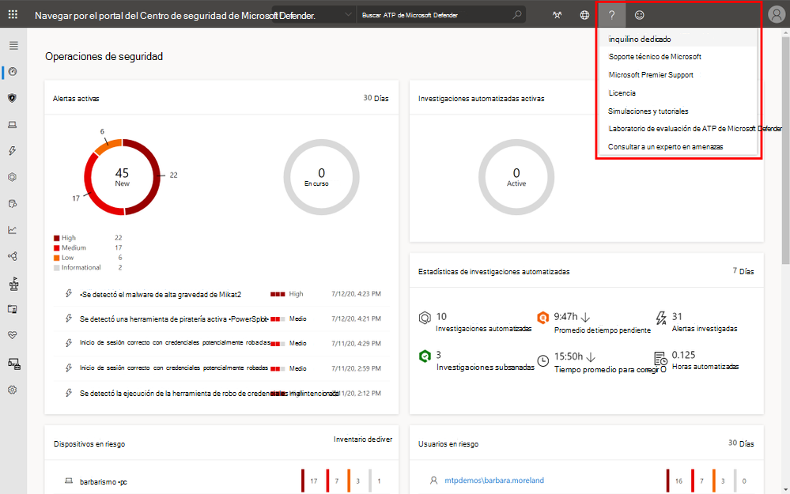
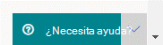
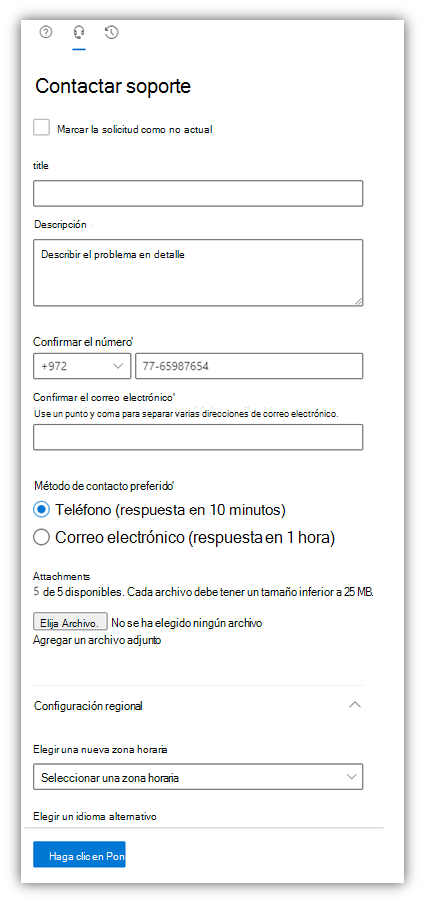

# Ponerse en contacto con el soporte técnico de Microsoft Defender para punto de conexión

[!INCLUDE [Microsoft 365 Defender rebranding](../../includes/microsoft-defender.md)]

**Se aplica a:**
- [Microsoft Defender para punto de conexión](https://go.microsoft.com/fwlink/p/?linkid=2154037)
- [Microsoft 365 Defender](https://go.microsoft.com/fwlink/?linkid=2118804)

>¿Desea experimentar Defender for Endpoint? [Regístrate para obtener una versión de prueba gratuita.](https://www.microsoft.com/microsoft-365/windows/microsoft-defender-atp?ocid=docs-wdatp-assignaccess-abovefoldlink)

Defender for Endpoint ha actualizado recientemente el proceso de soporte técnico para ofrecer una experiencia de soporte más moderna y avanzada. 

El nuevo widget permite a los clientes:
- Buscar soluciones a problemas comunes
- Enviar un caso de soporte técnico al equipo de soporte técnico de Microsoft

## Requisitos previos
Es importante conocer los roles específicos que tienen permiso para abrir casos de soporte técnico.

Como mínimo, debe tener un rol de administrador de soporte técnico **o** de administrador de soporte técnico.

Para obtener más información sobre qué roles tienen permiso, vea [Security Administrator permissions](https://docs.microsoft.com/azure/active-directory/users-groups-roles/directory-assign-admin-roles#security-administrator-permissions). Los roles que incluyen la acción `microsoft.office365.supportTickets/allEntities/allTasks` pueden enviar un caso.

Para obtener información general sobre los roles de administrador, vea [About admin roles](https://docs.microsoft.com/microsoft-365/admin/add-users/about-admin-roles?view=o365-worldwide&preserve-view=true).

## Acceder al widget
El acceso al nuevo widget de soporte técnico se puede realizar de dos maneras:

1.  Haga clic en el signo de interrogación de la parte superior derecha del portal y, a continuación, haga clic en "Soporte técnico de Microsoft":

    

2. Hacer clic en **el botón ¿Necesita ayuda?**  en la parte inferior derecha del Centro de seguridad de Microsoft Defender:

    

En el widget se te ofrecerán dos opciones:

- Buscar soluciones a problemas comunes    
- Abrir una solicitud de servicio  

## Buscar soluciones a problemas comunes
Esta opción incluye artículos que podrían estar relacionados con la pregunta que puede hacer. Solo tienes que empezar a escribir la pregunta en el cuadro de búsqueda y aparecerán los artículos relacionados con la búsqueda.

En caso de que los artículos sugeridos no sean suficientes, puede abrir una solicitud de servicio.

## Abrir una solicitud de servicio

Para obtener información sobre cómo abrir vales de soporte técnico, póngase en contacto con el soporte técnico de Defender para endpoints. 

> [!Note]
> Si tiene un contrato de soporte técnico de permier con Microsoft, verá la etiqueta premier en el widget. Si no es así, póngase en contacto con el administrador de cuentas de Microsoft.

### Contactar soporte
Esta opción está disponible haciendo clic en el icono que parece un auricular. A continuación, recibirá la siguiente página para enviar el caso de soporte técnico:

1. Rellene un título y una descripción del problema al que se enfrenta, así como un número de teléfono y una dirección de correo electrónico donde podamos contactar con usted. 

2. (Opcional) Incluya hasta cinco datos adjuntos que sean relevantes para el problema con el fin de proporcionar contexto adicional para el caso de soporte técnico. 

3. Seleccione la zona horaria y un idioma alternativo, si procede. La solicitud se enviará al equipo de soporte técnico de Microsoft. El equipo responderá a su solicitud de servicio en breve.

## Temas relacionados
- [Solucionar problemas de servicio](troubleshoot-mdatp.md)
- [Comprobar el estado del servicio](service-status.md)
