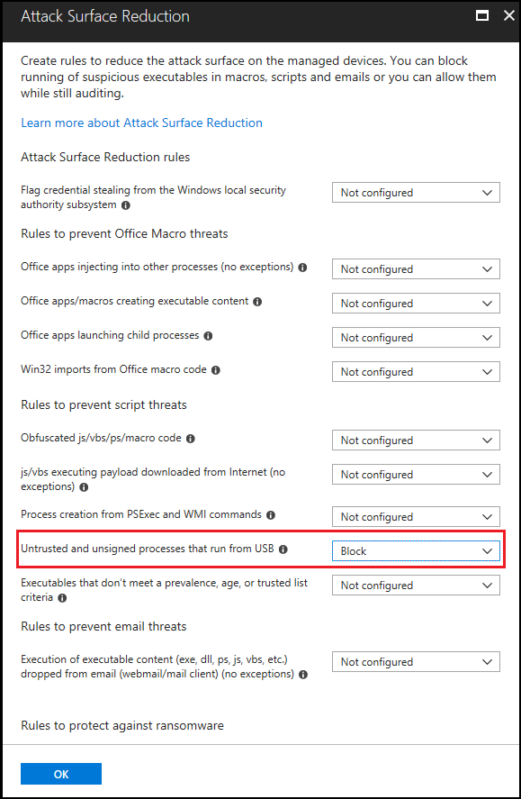

# <a name="how-to-control-usb-devices-and-other-removable-media-using-microsoft-defender-for-endpoint"></a><span data-ttu-id="0f059-103">Cómo controlar dispositivos USB y otros medios extraíbles con Microsoft Defender para endpoint</span><span class="sxs-lookup"><span data-stu-id="0f059-103">How to control USB devices and other removable media using Microsoft Defender for Endpoint</span></span>

<span data-ttu-id="0f059-104">**Se aplica a:** [Microsoft Defender para endpoint](https://go.microsoft.com/fwlink/p/?linkid=2069559)</span><span class="sxs-lookup"><span data-stu-id="0f059-104">**Applies to:** [Microsoft Defender for Endpoint](https://go.microsoft.com/fwlink/p/?linkid=2069559)</span></span>

<span data-ttu-id="0f059-105">Microsoft recomienda un enfoque por capas para proteger los medios extraíbles y Microsoft Defender para endpoint proporciona varias características de supervisión y control para ayudar [a](https://aka.ms/devicecontrolblog)evitar que las amenazas en periféricos no autorizados comporten los dispositivos:</span><span class="sxs-lookup"><span data-stu-id="0f059-105">Microsoft recommends [a layered approach to securing removable media](https://aka.ms/devicecontrolblog), and Microsoft Defender for Endpoint provides multiple monitoring and control features to help prevent threats in unauthorized peripherals from compromising your devices:</span></span>

1. <span data-ttu-id="0f059-106">[Descubrir eventos conectados plug and play para periféricos en La](#discover-plug-and-play-connected-events)búsqueda avanzada de Microsoft Defender para endpoint.</span><span class="sxs-lookup"><span data-stu-id="0f059-106">[Discover plug and play connected events for peripherals in Microsoft Defender for Endpoint advanced hunting](#discover-plug-and-play-connected-events).</span></span> <span data-ttu-id="0f059-107">Identificar o investigar actividades de uso sospechosas.</span><span class="sxs-lookup"><span data-stu-id="0f059-107">Identify or investigate suspicious usage activity.</span></span>

2. <span data-ttu-id="0f059-108">Configure para permitir o bloquear solo determinados dispositivos extraíbles y evitar amenazas.</span><span class="sxs-lookup"><span data-stu-id="0f059-108">Configure to allow or block only certain removable devices and prevent threats.</span></span>
    1. <span data-ttu-id="0f059-109">[Permitir o bloquear dispositivos extraíbles](#allow-or-block-removable-devices) en función de la configuración granular para denegar el acceso de escritura a discos extraíbles y aprobar o denegar dispositivos mediante el uso de los IDs de dispositivo USB.</span><span class="sxs-lookup"><span data-stu-id="0f059-109">[Allow or block removable devices](#allow-or-block-removable-devices) based on granular configuration to deny write access to removable disks and approve or deny devices by using USB device IDs.</span></span> <span data-ttu-id="0f059-110">Asignación de directiva flexible de la configuración de instalación de dispositivos en función de un usuario o grupo de Azure Active Directory (Azure AD) usuarios y dispositivos.</span><span class="sxs-lookup"><span data-stu-id="0f059-110">Flexible policy assignment of device installation settings based on an individual or group of Azure Active Directory (Azure AD) users and devices.</span></span>

    2. <span data-ttu-id="0f059-111">[Impedir que las amenazas quiten el](#prevent-threats-from-removable-storage) almacenamiento introducido por los dispositivos de almacenamiento extraíbles habilitando:</span><span class="sxs-lookup"><span data-stu-id="0f059-111">[Prevent threats from removable storage](#prevent-threats-from-removable-storage) introduced by removable storage devices by enabling:</span></span>  
        - <span data-ttu-id="0f059-112">Antivirus de Microsoft Defender protección en tiempo real (RTP) para examinar el almacenamiento extraíble en busca de malware.</span><span class="sxs-lookup"><span data-stu-id="0f059-112">Microsoft Defender Antivirus real-time protection (RTP) to scan removable storage for malware.</span></span>  
        - <span data-ttu-id="0f059-113">La regla USB de reducción de superficie de ataque (ASR) para bloquear procesos que no son de confianza y que no se firman y que se ejecutan desde USB.</span><span class="sxs-lookup"><span data-stu-id="0f059-113">The Attack Surface Reduction (ASR) USB rule to block untrusted and unsigned processes that run from USB.</span></span>  
        - <span data-ttu-id="0f059-114">Configuración de protección de Acceso directo a la memoria (DMA) para mitigar los ataques de DMA, incluida la protección de kernel DMA para Thunderbolt y el bloqueo de DMA hasta que un usuario inicia sesión.</span><span class="sxs-lookup"><span data-stu-id="0f059-114">Direct Memory Access (DMA) protection settings to mitigate DMA attacks, including Kernel DMA Protection for Thunderbolt and blocking DMA until a user signs in.</span></span>  

3. <span data-ttu-id="0f059-115">[Cree alertas](#create-customized-alerts-and-response-actions) personalizadas y acciones de respuesta para supervisar el uso de dispositivos extraíbles basados en estos eventos plug and play o en cualquier otro evento de Microsoft Defender para endpoint con reglas [de detección personalizadas.](/microsoft-365/security/defender-endpoint/custom-detection-rules)</span><span class="sxs-lookup"><span data-stu-id="0f059-115">[Create customized alerts and response actions](#create-customized-alerts-and-response-actions) to monitor usage of removable devices based on these plug and play events or any other Microsoft Defender for Endpoint events with [custom detection rules](/microsoft-365/security/defender-endpoint/custom-detection-rules).</span></span>

4. <span data-ttu-id="0f059-116">[Responder a las amenazas](#respond-to-threats) de los periféricos en tiempo real en función de las propiedades notificadas por cada periférico.</span><span class="sxs-lookup"><span data-stu-id="0f059-116">[Respond to threats](#respond-to-threats) from peripherals in real-time based on properties reported by each peripheral.</span></span>

>[!Note]
><span data-ttu-id="0f059-117">Estas medidas de reducción de amenazas ayudan a evitar que el malware entre en su entorno.</span><span class="sxs-lookup"><span data-stu-id="0f059-117">These threat reduction measures help prevent malware from coming into your environment.</span></span> <span data-ttu-id="0f059-118">Para proteger los datos empresariales de salir del entorno, también puede configurar medidas de prevención de pérdida de datos.</span><span class="sxs-lookup"><span data-stu-id="0f059-118">To protect enterprise data from leaving your environment, you can also configure data loss prevention measures.</span></span> <span data-ttu-id="0f059-119">Por ejemplo, en dispositivos Windows 10 puede configurar [BitLocker](/windows/security/information-protection/bitlocker/bitlocker-overview.md) y [Windows Information Protection](/windows/security/information-protection/create-wip-policy-using-intune-azure.md), que cifrarán los datos de la empresa incluso si se almacenan en un dispositivo personal, o usar el CSP [Storage/RemovableDiskDenyWriteAccess](/windows/client-management/mdm/policy-csp-storage#storage-removablediskdenywriteaccess) para denegar el acceso de escritura a discos extraíbles.</span><span class="sxs-lookup"><span data-stu-id="0f059-119">For example, on Windows 10 devices you can configure [BitLocker](/windows/security/information-protection/bitlocker/bitlocker-overview.md) and [Windows Information Protection](/windows/security/information-protection/create-wip-policy-using-intune-azure.md), which will encrypt company data even if it is stored on a personal device, or use the [Storage/RemovableDiskDenyWriteAccess CSP](/windows/client-management/mdm/policy-csp-storage#storage-removablediskdenywriteaccess) to deny write access to removable disks.</span></span> <span data-ttu-id="0f059-120">Además, puede clasificar y proteger archivos en dispositivos [Windows](/windows/security/threat-protection/windows-defender-atp/information-protection-in-windows-overview) (incluidos sus dispositivos USB montados) mediante Microsoft Defender para Endpoint y Azure Information Protection.</span><span class="sxs-lookup"><span data-stu-id="0f059-120">Additionally, you can [classify and protect files on Windows devices](/windows/security/threat-protection/windows-defender-atp/information-protection-in-windows-overview) (including their mounted USB devices) by using Microsoft Defender for Endpoint and Azure Information Protection.</span></span>

## <a name="discover-plug-and-play-connected-events"></a><span data-ttu-id="0f059-121">Descubrir eventos conectados de plug and play</span><span class="sxs-lookup"><span data-stu-id="0f059-121">Discover plug and play connected events</span></span>

<span data-ttu-id="0f059-122">Puedes ver eventos conectados plug and play en La búsqueda avanzada de Microsoft Defender para endpoint para identificar actividad de uso sospechosa o realizar investigaciones internas.</span><span class="sxs-lookup"><span data-stu-id="0f059-122">You can view plug and play connected events in Microsoft Defender for Endpoint advanced hunting to identify suspicious usage activity or perform internal investigations.</span></span>
<span data-ttu-id="0f059-123">Para obtener ejemplos de consultas de búsqueda avanzada de Defender for Endpoint, consulta las consultas de búsqueda de [Microsoft Defender para endpoints GitHub repositorio](https://github.com/Microsoft/WindowsDefenderATP-Hunting-Queries).</span><span class="sxs-lookup"><span data-stu-id="0f059-123">For examples of Defender for Endpoint advanced hunting queries, see the [Microsoft Defender for Endpoint hunting queries GitHub repo](https://github.com/Microsoft/WindowsDefenderATP-Hunting-Queries).</span></span>

<span data-ttu-id="0f059-124">Las plantillas de Power BI de informes de ejemplo están disponibles para Microsoft Defender para endpoint que puede usar para consultas de búsqueda avanzadas.</span><span class="sxs-lookup"><span data-stu-id="0f059-124">Sample Power BI report templates are available for Microsoft Defender for Endpoint that you can use for Advanced hunting queries.</span></span> <span data-ttu-id="0f059-125">Con estas plantillas de ejemplo, incluida una para el control de dispositivos, puedes integrar la potencia de la búsqueda avanzada en Power BI.</span><span class="sxs-lookup"><span data-stu-id="0f059-125">With these sample templates, including one for device control, you can integrate the power of Advanced hunting into Power BI.</span></span> <span data-ttu-id="0f059-126">Vea el [repositorio GitHub de plantillas de PowerBI](https://github.com/microsoft/MDATP-PowerBI-Templates) para obtener más información.</span><span class="sxs-lookup"><span data-stu-id="0f059-126">See the [GitHub repository for PowerBI templates](https://github.com/microsoft/MDATP-PowerBI-Templates) for more information.</span></span> <span data-ttu-id="0f059-127">Consulte [Create custom reports using Power BI](/microsoft-365/security/defender-endpoint/api-power-bi) para obtener más información sobre Power BI integración.</span><span class="sxs-lookup"><span data-stu-id="0f059-127">See [Create custom reports using Power BI](/microsoft-365/security/defender-endpoint/api-power-bi) to learn more about Power BI integration.</span></span>

## <a name="allow-or-block-removable-devices"></a><span data-ttu-id="0f059-128">Permitir o bloquear dispositivos extraíbles</span><span class="sxs-lookup"><span data-stu-id="0f059-128">Allow or block removable devices</span></span>
<span data-ttu-id="0f059-129">En la tabla siguiente se describen las formas en que Microsoft Defender para endpoint puede permitir o bloquear dispositivos extraíbles en función de la configuración granular.</span><span class="sxs-lookup"><span data-stu-id="0f059-129">The following table describes the ways Microsoft Defender for Endpoint can allow or block removable devices based on granular configuration.</span></span>

| <span data-ttu-id="0f059-130">Control</span><span class="sxs-lookup"><span data-stu-id="0f059-130">Control</span></span>  | <span data-ttu-id="0f059-131">Descripción</span><span class="sxs-lookup"><span data-stu-id="0f059-131">Description</span></span> |
|----------|-------------|
| [<span data-ttu-id="0f059-132">Restringir unidades USB y otros periféricos</span><span class="sxs-lookup"><span data-stu-id="0f059-132">Restrict USB drives and other peripherals</span></span>](#restrict-usb-drives-and-other-peripherals) | <span data-ttu-id="0f059-133">Puedes permitir o impedir que los usuarios instalen solo las unidades USB y otros periféricos incluidos en una lista de dispositivos o tipos de dispositivos autorizados o no autorizados.</span><span class="sxs-lookup"><span data-stu-id="0f059-133">You can allow/prevent users to install only the USB drives and other peripherals included on a list of authorized/unauthorized devices or device types.</span></span> |
| [<span data-ttu-id="0f059-134">Bloquear la instalación y el uso del almacenamiento extraíble</span><span class="sxs-lookup"><span data-stu-id="0f059-134">Block installation and usage of removable storage</span></span>](#block-installation-and-usage-of-removable-storage) | <span data-ttu-id="0f059-135">No puede instalar ni usar almacenamiento extraíble.</span><span class="sxs-lookup"><span data-stu-id="0f059-135">You can't install or use removable storage.</span></span> |
| [<span data-ttu-id="0f059-136">Permitir la instalación y el uso de periféricos aprobados específicamente</span><span class="sxs-lookup"><span data-stu-id="0f059-136">Allow installation and usage of specifically approved peripherals</span></span>](#allow-installation-and-usage-of-specifically-approved-peripherals)   | <span data-ttu-id="0f059-137">Solo puede instalar y usar periféricos aprobados que informen de propiedades específicas en su firmware.</span><span class="sxs-lookup"><span data-stu-id="0f059-137">You can only install and use approved peripherals that report specific properties in their firmware.</span></span> |
| [<span data-ttu-id="0f059-138">Impedir la instalación de periféricos específicamente prohibidos</span><span class="sxs-lookup"><span data-stu-id="0f059-138">Prevent installation of specifically prohibited peripherals</span></span>](#prevent-installation-of-specifically-prohibited-peripherals) | <span data-ttu-id="0f059-139">No puede instalar ni usar periféricos prohibidos que informen de propiedades específicas en su firmware.</span><span class="sxs-lookup"><span data-stu-id="0f059-139">You can't install or use prohibited peripherals that report specific properties in their firmware.</span></span> |
| [<span data-ttu-id="0f059-140">Permitir la instalación y el uso de periféricos aprobados específicamente con los IDs de instancia del dispositivo que coincidan</span><span class="sxs-lookup"><span data-stu-id="0f059-140">Allow installation and usage of specifically approved peripherals with matching device instance IDs</span></span>](#allow-installation-and-usage-of-specifically-approved-peripherals-with-matching-device-instance-ids) | <span data-ttu-id="0f059-141">Solo puedes instalar y usar periféricos aprobados que coincidan con cualquiera de estos IDs de instancia de dispositivo.</span><span class="sxs-lookup"><span data-stu-id="0f059-141">You can only install and use approved peripherals that match any of these device instance IDs.</span></span> |
| [<span data-ttu-id="0f059-142">Impedir la instalación y el uso de periféricos específicamente prohibidos con los IDs de instancia del dispositivo que coincidan</span><span class="sxs-lookup"><span data-stu-id="0f059-142">Prevent installation and usage of specifically prohibited peripherals with matching device instance IDs</span></span>](#prevent-installation-and-usage-of-specifically-prohibited-peripherals-with-matching-device-instance-ids) | <span data-ttu-id="0f059-143">No puedes instalar ni usar periféricos prohibidos que coincidan con ninguno de estos IDs de instancia de dispositivo.</span><span class="sxs-lookup"><span data-stu-id="0f059-143">You can't install or use prohibited peripherals that match any of these device instance IDs.</span></span> |
| [<span data-ttu-id="0f059-144">Limitar servicios que usan Bluetooth</span><span class="sxs-lookup"><span data-stu-id="0f059-144">Limit services that use Bluetooth</span></span>](#limit-services-that-use-bluetooth) | <span data-ttu-id="0f059-145">Puede limitar los servicios que pueden usar Bluetooth.</span><span class="sxs-lookup"><span data-stu-id="0f059-145">You can limit the services that can use Bluetooth.</span></span> |
| [<span data-ttu-id="0f059-146">Usar Microsoft Defender para la configuración de línea base de punto de conexión</span><span class="sxs-lookup"><span data-stu-id="0f059-146">Use Microsoft Defender for Endpoint baseline settings</span></span>](#use-microsoft-defender-for-endpoint-baseline-settings) | <span data-ttu-id="0f059-147">Puede establecer la configuración recomendada para ATP mediante la línea base de seguridad defender para puntos de conexión.</span><span class="sxs-lookup"><span data-stu-id="0f059-147">You can set the recommended configuration for ATP by using the Defender for Endpoint security baseline.</span></span> |

### <a name="restrict-usb-drives-and-other-peripherals"></a><span data-ttu-id="0f059-148">Restringir unidades USB y otros periféricos</span><span class="sxs-lookup"><span data-stu-id="0f059-148">Restrict USB drives and other peripherals</span></span>

<span data-ttu-id="0f059-149">Para evitar infecciones de malware o pérdida de datos, una organización puede restringir las unidades USB y otros periféricos.</span><span class="sxs-lookup"><span data-stu-id="0f059-149">To prevent malware infections or data loss, an organization may restrict USB drives and other peripherals.</span></span> <span data-ttu-id="0f059-150">En la tabla siguiente se describen las formas en que Microsoft Defender para Endpoint puede ayudar a evitar la instalación y el uso de unidades USB y otros periféricos.</span><span class="sxs-lookup"><span data-stu-id="0f059-150">The following table describes the ways Microsoft Defender for Endpoint can help prevent installation and usage of USB drives and other peripherals.</span></span>

| <span data-ttu-id="0f059-151">Control</span><span class="sxs-lookup"><span data-stu-id="0f059-151">Control</span></span>  | <span data-ttu-id="0f059-152">Descripción</span><span class="sxs-lookup"><span data-stu-id="0f059-152">Description</span></span>
|----------|-------------|
| [<span data-ttu-id="0f059-153">Permitir la instalación y el uso de unidades USB y otros periféricos</span><span class="sxs-lookup"><span data-stu-id="0f059-153">Allow installation and usage of USB drives and other peripherals</span></span>](#allow-installation-and-usage-of-usb-drives-and-other-peripherals) | <span data-ttu-id="0f059-154">Permitir a los usuarios instalar solo las unidades USB y otros periféricos incluidos en una lista de dispositivos o tipos de dispositivos autorizados</span><span class="sxs-lookup"><span data-stu-id="0f059-154">Allow users to install only the USB drives and other peripherals included on a list of authorized devices or device types</span></span> |
| [<span data-ttu-id="0f059-155">Impedir la instalación y el uso de unidades USB y otros periféricos</span><span class="sxs-lookup"><span data-stu-id="0f059-155">Prevent installation and usage of USB drives and other peripherals</span></span>](#prevent-installation-and-usage-of-usb-drives-and-other-peripherals) | <span data-ttu-id="0f059-156">Impedir que los usuarios instalen unidades USB y otros periféricos incluidos en una lista de dispositivos y tipos de dispositivos no autorizados</span><span class="sxs-lookup"><span data-stu-id="0f059-156">Prevent users from installing USB drives and other peripherals included on a list of unauthorized devices and device types</span></span> |

<span data-ttu-id="0f059-157">Todos los controles anteriores se pueden establecer a través de las plantillas administrativas [de](/intune/administrative-templates-windows)Intune .</span><span class="sxs-lookup"><span data-stu-id="0f059-157">All of the above controls can be set through the Intune [Administrative Templates](/intune/administrative-templates-windows).</span></span> <span data-ttu-id="0f059-158">Las directivas relevantes se encuentran aquí en plantillas de administrador de Intune:</span><span class="sxs-lookup"><span data-stu-id="0f059-158">The relevant policies are located here in the Intune Administrator Templates:</span></span>


>[!Note]
><span data-ttu-id="0f059-160">Con Intune, puede aplicar directivas de configuración de dispositivos a grupos de dispositivos o usuarios de Azure AD.</span><span class="sxs-lookup"><span data-stu-id="0f059-160">Using Intune, you can apply device configuration policies to Azure AD user and/or device groups.</span></span>
<span data-ttu-id="0f059-161">Las directivas anteriores también se pueden establecer a través de la configuración del CSP de instalación de [dispositivos](/windows/client-management/mdm/policy-csp-deviceinstallation) y los [GPO de instalación de dispositivos.](/previous-versions/dotnet/articles/bb530324(v=msdn.10))</span><span class="sxs-lookup"><span data-stu-id="0f059-161">The above policies can also be set through the [Device Installation CSP settings](/windows/client-management/mdm/policy-csp-deviceinstallation) and the [Device Installation GPOs](/previous-versions/dotnet/articles/bb530324(v=msdn.10)).</span></span>

> [!Note]
> <span data-ttu-id="0f059-162">Pruebe y refine siempre esta configuración con un grupo piloto de usuarios y dispositivos antes de aplicarlos en producción.</span><span class="sxs-lookup"><span data-stu-id="0f059-162">Always test and refine these settings with a pilot group of users and devices first before applying them in production.</span></span>
<span data-ttu-id="0f059-163">Para obtener más información acerca del control de dispositivos USB, consulta el [blog de Microsoft Defender para endpoint](https://www.microsoft.com/security/blog/2018/12/19/windows-defender-atp-has-protections-for-usb-and-removable-devices/).</span><span class="sxs-lookup"><span data-stu-id="0f059-163">For more information about controlling USB devices, see the [Microsoft Defender for Endpoint blog](https://www.microsoft.com/security/blog/2018/12/19/windows-defender-atp-has-protections-for-usb-and-removable-devices/).</span></span>

#### <a name="allow-installation-and-usage-of-usb-drives-and-other-peripherals"></a><span data-ttu-id="0f059-164">Permitir la instalación y el uso de unidades USB y otros periféricos</span><span class="sxs-lookup"><span data-stu-id="0f059-164">Allow installation and usage of USB drives and other peripherals</span></span>

<span data-ttu-id="0f059-165">Una forma de acercarse para permitir la instalación y el uso de unidades USB y otros periféricos es empezar por permitir todo.</span><span class="sxs-lookup"><span data-stu-id="0f059-165">One way to approach allowing installation and usage of USB drives and other peripherals is to start by allowing everything.</span></span> <span data-ttu-id="0f059-166">Después, puedes empezar a reducir los controladores USB permitidos y otros periféricos.</span><span class="sxs-lookup"><span data-stu-id="0f059-166">Afterwards, you can start reducing the allowable USB drivers and other peripherals.</span></span>

>[!Note]
><span data-ttu-id="0f059-167">Dado que un periférico USB no autorizado puede tener firmware que suplanta sus propiedades USB, se recomienda permitir solo periféricos USB aprobados específicamente y limitar los usuarios que pueden acceder a ellos.</span><span class="sxs-lookup"><span data-stu-id="0f059-167">Because an unauthorized USB peripheral can have firmware that spoofs its USB properties, we recommend only allowing specifically approved USB peripherals and limiting the users who can access them.</span></span>

1. <span data-ttu-id="0f059-168">Habilitar **Impedir la instalación de dispositivos no descritos por otras configuraciones de directiva** para todos los usuarios.</span><span class="sxs-lookup"><span data-stu-id="0f059-168">Enable **Prevent installation of devices not described by other policy settings** to all users.</span></span>
2. <span data-ttu-id="0f059-169">Habilitar **Permitir la instalación de dispositivos con controladores que coincidan con estas** clases de configuración de dispositivo para todas las clases de configuración del [dispositivo.](/windows-hardware/drivers/install/system-defined-device-setup-classes-available-to-vendors)</span><span class="sxs-lookup"><span data-stu-id="0f059-169">Enable **Allow installation of devices using drivers that match these device setup classes** for all [device setup classes](/windows-hardware/drivers/install/system-defined-device-setup-classes-available-to-vendors).</span></span>

<span data-ttu-id="0f059-170">Para aplicar la directiva para dispositivos ya instalados, aplique las directivas de prevención que tengan esta configuración.</span><span class="sxs-lookup"><span data-stu-id="0f059-170">To enforce the policy for already installed devices, apply the prevent policies that have this setting.</span></span>

<span data-ttu-id="0f059-171">Al configurar la directiva de instalación de dispositivos permitidos, también debes permitir todos los atributos primarios.</span><span class="sxs-lookup"><span data-stu-id="0f059-171">When configuring the allow device installation policy, you must allow all parent attributes as well.</span></span> <span data-ttu-id="0f059-172">Puedes ver los padres de un dispositivo abriendo el Administrador de dispositivos y ver por conexión.</span><span class="sxs-lookup"><span data-stu-id="0f059-172">You can view the parents of a device by opening Device Manager and view by connection.</span></span>


<span data-ttu-id="0f059-174">En este ejemplo, es necesario agregar las siguientes clases: HID, Keyboard y {36fc9e60-c465-11cf-8056-444553540000}.</span><span class="sxs-lookup"><span data-stu-id="0f059-174">In this example, the following classes needed to be added: HID, Keyboard, and {36fc9e60-c465-11cf-8056-444553540000}.</span></span> <span data-ttu-id="0f059-175">Consulta [Controladores USB proporcionados por Microsoft](/windows-hardware/drivers/usbcon/supported-usb-classes) para obtener más información.</span><span class="sxs-lookup"><span data-stu-id="0f059-175">See [Microsoft-provided USB drivers](/windows-hardware/drivers/usbcon/supported-usb-classes) for more information.</span></span>


<span data-ttu-id="0f059-177">Si quieres restringir a determinados dispositivos, quita la clase de configuración del dispositivo del periférico que quieres limitar.</span><span class="sxs-lookup"><span data-stu-id="0f059-177">If you want to restrict to certain devices, remove the device setup class of the peripheral that you want to limit.</span></span> <span data-ttu-id="0f059-178">A continuación, agrega el identificador de dispositivo que quieras agregar.</span><span class="sxs-lookup"><span data-stu-id="0f059-178">Then add the device ID that you want to add.</span></span> <span data-ttu-id="0f059-179">El id. de dispositivo se basa en los valores de id. de proveedor y de producto de un dispositivo.</span><span class="sxs-lookup"><span data-stu-id="0f059-179">Device ID is based on the vendor ID and product ID values for a device.</span></span> <span data-ttu-id="0f059-180">Para obtener información sobre los formatos de id. de dispositivo, [consulte Standard USB Identifiers](/windows-hardware/drivers/install/standard-usb-identifiers).</span><span class="sxs-lookup"><span data-stu-id="0f059-180">For information on device ID formats, see [Standard USB Identifiers](/windows-hardware/drivers/install/standard-usb-identifiers).</span></span> 

<span data-ttu-id="0f059-181">Para buscar los identificadores de dispositivo, [consulta Buscar identificador de dispositivo](#look-up-device-id).</span><span class="sxs-lookup"><span data-stu-id="0f059-181">To find the device IDs, see [Look up device ID](#look-up-device-id).</span></span> 

<span data-ttu-id="0f059-182">Por ejemplo:</span><span class="sxs-lookup"><span data-stu-id="0f059-182">For example:</span></span>

1. <span data-ttu-id="0f059-183">Quite la clase USBDevice de **Permitir la instalación de dispositivos con controladores que coincidan con la configuración de estos dispositivos.**</span><span class="sxs-lookup"><span data-stu-id="0f059-183">Remove class USBDevice from the **Allow installation of devices using drivers that match these device setup**.</span></span>
2. <span data-ttu-id="0f059-184">Agrega el identificador del dispositivo para permitir la instalación del dispositivo **que coincida con cualquiera de estos identificadores de dispositivo.**</span><span class="sxs-lookup"><span data-stu-id="0f059-184">Add the device ID to allow in the **Allow installation of device that match any of these device IDs**.</span></span> 


#### <a name="prevent-installation-and-usage-of-usb-drives-and-other-peripherals"></a><span data-ttu-id="0f059-185">Impedir la instalación y el uso de unidades USB y otros periféricos</span><span class="sxs-lookup"><span data-stu-id="0f059-185">Prevent installation and usage of USB drives and other peripherals</span></span>

<span data-ttu-id="0f059-186">Si quieres impedir la instalación de una clase de dispositivo o determinados dispositivos, puedes usar las directivas de instalación de dispositivos de prevención:</span><span class="sxs-lookup"><span data-stu-id="0f059-186">If you want to prevent the installation of a device class or certain devices, you can use the prevent device installation policies:</span></span>

1. <span data-ttu-id="0f059-187">Habilita **Impedir la instalación de dispositivos que coincidan con cualquiera de estos IDs** de dispositivo y agrega estos dispositivos a la lista.</span><span class="sxs-lookup"><span data-stu-id="0f059-187">Enable **Prevent installation of devices that match any of these device IDs** and add these devices to the list.</span></span>
2. <span data-ttu-id="0f059-188">Habilitar **Impedir la instalación de dispositivos con controladores que coincidan con estas clases de configuración de dispositivos.**</span><span class="sxs-lookup"><span data-stu-id="0f059-188">Enable **Prevent installation of devices using drivers that match these device setup classes**.</span></span>

> [!Note]
> <span data-ttu-id="0f059-189">Las directivas de instalación de dispositivos de prevención tienen prioridad sobre las directivas de instalación de dispositivos permitidos.</span><span class="sxs-lookup"><span data-stu-id="0f059-189">The prevent device installation policies take precedence over the allow device installation policies.</span></span>

<span data-ttu-id="0f059-190">La directiva Impedir la instalación de dispositivos que coincidan con cualquiera de estos **IDs** de dispositivo te permite especificar una lista de dispositivos que Windows se impide la instalación.</span><span class="sxs-lookup"><span data-stu-id="0f059-190">The **Prevent installation of devices that match any of these device IDs** policy allows you to specify a list of devices that Windows is prevented from installing.</span></span> 

<span data-ttu-id="0f059-191">Para evitar la instalación de dispositivos que coincidan con cualquiera de estos IDs de dispositivo:</span><span class="sxs-lookup"><span data-stu-id="0f059-191">To prevent installation of devices that match any of these device IDs:</span></span> 

1. <span data-ttu-id="0f059-192">[Busca el identificador de](#look-up-device-id) dispositivo para los dispositivos que quieras Windows impedir la instalación.</span><span class="sxs-lookup"><span data-stu-id="0f059-192">[Look up device ID](#look-up-device-id) for devices that you want Windows to prevent from installing.</span></span>

   

2. <span data-ttu-id="0f059-194">Habilita **Impedir la instalación de dispositivos que coincidan** con cualquiera de estos IDs de dispositivo y agrega los nombres de proveedor o producto a la lista.</span><span class="sxs-lookup"><span data-stu-id="0f059-194">Enable **Prevent installation of devices that match any of these device IDs** and add the vendor or product IDs to the list.</span></span>

    

#### <a name="look-up-device-id"></a><span data-ttu-id="0f059-196">Buscar id. de dispositivo</span><span class="sxs-lookup"><span data-stu-id="0f059-196">Look up device ID</span></span>

<span data-ttu-id="0f059-197">Puedes usar el Administrador de dispositivos para buscar un identificador de dispositivo.</span><span class="sxs-lookup"><span data-stu-id="0f059-197">You can use Device Manager to look up a device ID.</span></span>

1. <span data-ttu-id="0f059-198">Abra el Administrador de dispositivos.</span><span class="sxs-lookup"><span data-stu-id="0f059-198">Open Device Manager.</span></span>
2. <span data-ttu-id="0f059-199">Haga **clic en** Ver y seleccione **Dispositivos por conexión.**</span><span class="sxs-lookup"><span data-stu-id="0f059-199">Click **View** and select **Devices by connection**.</span></span>
3. <span data-ttu-id="0f059-200">En el árbol, haga clic con el botón secundario en el dispositivo y seleccione **Propiedades**.</span><span class="sxs-lookup"><span data-stu-id="0f059-200">From the tree, right-click the device and select **Properties**.</span></span>
4. <span data-ttu-id="0f059-201">En el cuadro de diálogo del dispositivo seleccionado, haga clic en la **pestaña** Detalles.</span><span class="sxs-lookup"><span data-stu-id="0f059-201">In the dialog box for the selected device, click the **Details** tab.</span></span>
5. <span data-ttu-id="0f059-202">Haga clic **en la** lista desplegable Propiedades y seleccione **Identificadores de hardware.**</span><span class="sxs-lookup"><span data-stu-id="0f059-202">Click the **Property** drop-down list and select **Hardware Ids**.</span></span>
6. <span data-ttu-id="0f059-203">Haga clic con el botón secundario en el valor de identificador superior y seleccione **Copiar**.</span><span class="sxs-lookup"><span data-stu-id="0f059-203">Right-click the top ID value and select **Copy**.</span></span>

<span data-ttu-id="0f059-204">Para obtener información acerca de los formatos de id. [de dispositivo, consulte Standard USB Identifiers](/windows-hardware/drivers/install/standard-usb-identifiers).</span><span class="sxs-lookup"><span data-stu-id="0f059-204">For information about Device ID formats, see [Standard USB Identifiers](/windows-hardware/drivers/install/standard-usb-identifiers).</span></span>

<span data-ttu-id="0f059-205">Para obtener información sobre los IDs de proveedor, vea [Miembros USB](https://www.usb.org/members).</span><span class="sxs-lookup"><span data-stu-id="0f059-205">For information on vendor IDs, see [USB members](https://www.usb.org/members).</span></span>

<span data-ttu-id="0f059-206">A continuación se muestra un ejemplo para buscar un identificador de proveedor de dispositivos o un id. de producto (que forma parte del identificador del dispositivo) con PowerShell:</span><span class="sxs-lookup"><span data-stu-id="0f059-206">The following is an example for looking up a device vendor ID or product ID (which is part of the device ID) using PowerShell:</span></span> 

```powershell
Get-WMIObject -Class Win32_DiskDrive |
Select-Object -Property * 
```

<span data-ttu-id="0f059-207">La **directiva Impedir la instalación de dispositivos** con controladores que coincidan con estas clases de configuración de dispositivos te permite especificar las clases de configuración de dispositivo que Windows se impide la instalación.</span><span class="sxs-lookup"><span data-stu-id="0f059-207">The **Prevent installation of devices using drivers that match these device setup classes** policy allows you to specify device setup classes that Windows is prevented from installing.</span></span> 

<span data-ttu-id="0f059-208">Para evitar la instalación de determinadas clases de dispositivos:</span><span class="sxs-lookup"><span data-stu-id="0f059-208">To prevent installation of particular classes of devices:</span></span> 

1. <span data-ttu-id="0f059-209">Busque el GUID de la clase de configuración del dispositivo en Clases de configuración de dispositivo definidas por el sistema [disponibles para los proveedores.](/windows-hardware/drivers/install/system-defined-device-setup-classes-available-to-vendors)</span><span class="sxs-lookup"><span data-stu-id="0f059-209">Find the GUID of the device setup class from [System-Defined Device Setup Classes Available to Vendors](/windows-hardware/drivers/install/system-defined-device-setup-classes-available-to-vendors).</span></span>

2. <span data-ttu-id="0f059-210">Habilita **Impedir la instalación de dispositivos con controladores que coincidan con estas** clases de configuración de dispositivos y agrega el GUID de clase a la lista.</span><span class="sxs-lookup"><span data-stu-id="0f059-210">Enable **Prevent installation of devices using drivers that match these device setup classes** and add the class GUID to the list.</span></span>

    > [!div class="mx-imgBorder"]
    > <span data-ttu-id="0f059-211"></span><span class="sxs-lookup"><span data-stu-id="0f059-211"></span></span>

### <a name="block-installation-and-usage-of-removable-storage"></a><span data-ttu-id="0f059-212">Bloquear la instalación y el uso del almacenamiento extraíble</span><span class="sxs-lookup"><span data-stu-id="0f059-212">Block installation and usage of removable storage</span></span>

1. <span data-ttu-id="0f059-213">Inicie sesión en el centro [Microsoft Endpoint Manager administración](https://endpoint.microsoft.com/).</span><span class="sxs-lookup"><span data-stu-id="0f059-213">Sign in to the [Microsoft Endpoint Manager admin center](https://endpoint.microsoft.com/).</span></span>

2. <span data-ttu-id="0f059-214">Haga clic **en**  >  **Perfiles de configuración de dispositivos**  >  **Crear perfil**.</span><span class="sxs-lookup"><span data-stu-id="0f059-214">Click **Devices** > **Configuration Profiles** > **Create profile**.</span></span>

    > [!div class="mx-imgBorder"]
    > <span data-ttu-id="0f059-215"></span><span class="sxs-lookup"><span data-stu-id="0f059-215"></span></span>

3. <span data-ttu-id="0f059-216">Use la configuración siguiente:</span><span class="sxs-lookup"><span data-stu-id="0f059-216">Use the following settings:</span></span>

   - <span data-ttu-id="0f059-217">Nombre: escriba un nombre para el perfil</span><span class="sxs-lookup"><span data-stu-id="0f059-217">Name: Type a name for the profile</span></span>
   - <span data-ttu-id="0f059-218">Descripción: escriba una descripción</span><span class="sxs-lookup"><span data-stu-id="0f059-218">Description: Type a description</span></span>
   - <span data-ttu-id="0f059-219">Plataforma: Windows 10 y versiones posteriores</span><span class="sxs-lookup"><span data-stu-id="0f059-219">Platform: Windows 10 and later</span></span>
   - <span data-ttu-id="0f059-220">Tipo de perfil: restricciones de dispositivo</span><span class="sxs-lookup"><span data-stu-id="0f059-220">Profile type: Device restrictions</span></span>

   > [!div class="mx-imgBorder"]
   > <span data-ttu-id="0f059-221"></span><span class="sxs-lookup"><span data-stu-id="0f059-221"></span></span>

4. <span data-ttu-id="0f059-222">Haga clic **en**  >  **Configurar general**.</span><span class="sxs-lookup"><span data-stu-id="0f059-222">Click **Configure** > **General**.</span></span>  

5. <span data-ttu-id="0f059-223">Para **Almacenamiento extraíble y** conexión USB **(solo móvil),** elija **Bloquear**.</span><span class="sxs-lookup"><span data-stu-id="0f059-223">For **Removable storage** and **USB connection (mobile only)**, choose **Block**.</span></span> <span data-ttu-id="0f059-224">**El almacenamiento extraíble** incluye unidades USB, mientras que la conexión **USB (solo móvil)** excluye la carga USB, pero solo incluye otras conexiones USB en dispositivos móviles.</span><span class="sxs-lookup"><span data-stu-id="0f059-224">**Removable storage** includes USB drives, whereas **USB connection (mobile only)** excludes USB charging but includes other USB connections on mobile devices only.</span></span> 

   

6. <span data-ttu-id="0f059-226">Haga **clic en Aceptar** para cerrar Configuración **general** y **Restricciones de dispositivo.**</span><span class="sxs-lookup"><span data-stu-id="0f059-226">Click **OK** to close **General** settings and **Device restrictions**.</span></span>

7. <span data-ttu-id="0f059-227">Haga **clic en** Crear para guardar el perfil.</span><span class="sxs-lookup"><span data-stu-id="0f059-227">Click **Create** to save the profile.</span></span>

### <a name="allow-installation-and-usage-of-specifically-approved-peripherals"></a><span data-ttu-id="0f059-228">Permitir la instalación y el uso de periféricos aprobados específicamente</span><span class="sxs-lookup"><span data-stu-id="0f059-228">Allow installation and usage of specifically approved peripherals</span></span>

<span data-ttu-id="0f059-229">Los periféricos que pueden instalarse pueden especificarse mediante su [identidad de hardware](/windows-hardware/drivers/install/device-identification-strings).</span><span class="sxs-lookup"><span data-stu-id="0f059-229">Peripherals that are allowed to be installed can be specified by their [hardware identity](/windows-hardware/drivers/install/device-identification-strings).</span></span> <span data-ttu-id="0f059-230">Para obtener una lista de estructuras de identificador comunes, consulta [Formatos de identificador de dispositivo](/windows-hardware/drivers/install/device-identifier-formats).</span><span class="sxs-lookup"><span data-stu-id="0f059-230">For a list of common identifier structures, see [Device Identifier Formats](/windows-hardware/drivers/install/device-identifier-formats).</span></span> <span data-ttu-id="0f059-231">Pruebe la configuración antes de implementarla para asegurarse de que se bloquea y permite los dispositivos esperados.</span><span class="sxs-lookup"><span data-stu-id="0f059-231">Test the configuration prior to rolling it out to ensure it blocks and allows the devices expected.</span></span> <span data-ttu-id="0f059-232">Lo ideal es probar varias instancias del hardware.</span><span class="sxs-lookup"><span data-stu-id="0f059-232">Ideally test various instances of the hardware.</span></span> <span data-ttu-id="0f059-233">Por ejemplo, pruebe varias claves USB en lugar de solo una.</span><span class="sxs-lookup"><span data-stu-id="0f059-233">For example, test multiple USB keys rather than only one.</span></span>

<span data-ttu-id="0f059-234">Para ver un ejemplo de SyncML que permite la instalación de determinados IDs de dispositivo, consulta [DeviceInstallation/AllowInstallationOfMatchingDeviceIDs CSP](/windows/client-management/mdm/policy-csp-deviceinstallation#deviceinstallation-allowinstallationofmatchingdeviceids).</span><span class="sxs-lookup"><span data-stu-id="0f059-234">For a SyncML example that allows installation of specific device IDs, see [DeviceInstallation/AllowInstallationOfMatchingDeviceIDs CSP](/windows/client-management/mdm/policy-csp-deviceinstallation#deviceinstallation-allowinstallationofmatchingdeviceids).</span></span> <span data-ttu-id="0f059-235">Para permitir clases de dispositivo específicas, consulta [DeviceInstallation/AllowInstallationOfMatchingDeviceSetupClasses CSP](/windows/client-management/mdm/policy-csp-deviceinstallation#deviceinstallation-allowinstallationofmatchingdevicesetupclasses).</span><span class="sxs-lookup"><span data-stu-id="0f059-235">To allow specific device classes, see [DeviceInstallation/AllowInstallationOfMatchingDeviceSetupClasses CSP](/windows/client-management/mdm/policy-csp-deviceinstallation#deviceinstallation-allowinstallationofmatchingdevicesetupclasses).</span></span>
<span data-ttu-id="0f059-236">Para permitir la instalación de dispositivos específicos también es necesario habilitar [DeviceInstallation/PreventInstallationOfDevicesNotDescribedByOtherPolicySettings](/windows/client-management/mdm/policy-csp-deviceinstallation#deviceinstallation-preventinstallationofdevicesnotdescribedbyotherpolicysettings).</span><span class="sxs-lookup"><span data-stu-id="0f059-236">Allowing installation of specific devices requires also enabling [DeviceInstallation/PreventInstallationOfDevicesNotDescribedByOtherPolicySettings](/windows/client-management/mdm/policy-csp-deviceinstallation#deviceinstallation-preventinstallationofdevicesnotdescribedbyotherpolicysettings).</span></span>

### <a name="prevent-installation-of-specifically-prohibited-peripherals"></a><span data-ttu-id="0f059-237">Impedir la instalación de periféricos específicamente prohibidos</span><span class="sxs-lookup"><span data-stu-id="0f059-237">Prevent installation of specifically prohibited peripherals</span></span>

<span data-ttu-id="0f059-238">Microsoft Defender para endpoint bloquea la instalación y el uso de periféricos prohibidos mediante cualquiera de estas opciones:</span><span class="sxs-lookup"><span data-stu-id="0f059-238">Microsoft Defender for Endpoint blocks installation and usage of prohibited peripherals by using either of these options:</span></span>

- <span data-ttu-id="0f059-239">[Las plantillas administrativas](/intune/administrative-templates-windows) pueden bloquear cualquier dispositivo con un identificador de hardware o una clase de configuración que coincida.</span><span class="sxs-lookup"><span data-stu-id="0f059-239">[Administrative Templates](/intune/administrative-templates-windows) can block any device with a matching hardware ID or setup class.</span></span>  
- <span data-ttu-id="0f059-240">[Configuración de CSP de instalación de dispositivos](/windows/client-management/mdm/policy-csp-deviceinstallation) con un perfil personalizado en Intune.</span><span class="sxs-lookup"><span data-stu-id="0f059-240">[Device Installation CSP settings](/windows/client-management/mdm/policy-csp-deviceinstallation) with a custom profile in Intune.</span></span> <span data-ttu-id="0f059-241">Puedes impedir [la instalación de determinados IDs de dispositivo o](/windows/client-management/mdm/policy-csp-deviceinstallation#deviceinstallation-preventinstallationofmatchingdeviceids) impedir clases de dispositivo [específicas.](/windows/client-management/mdm/policy-csp-deviceinstallation#deviceinstallation-preventinstallationofmatchingdevicesetupclasses)</span><span class="sxs-lookup"><span data-stu-id="0f059-241">You can [prevent installation of specific device IDs](/windows/client-management/mdm/policy-csp-deviceinstallation#deviceinstallation-preventinstallationofmatchingdeviceids) or [prevent specific device classes](/windows/client-management/mdm/policy-csp-deviceinstallation#deviceinstallation-preventinstallationofmatchingdevicesetupclasses).</span></span>

### <a name="allow-installation-and-usage-of-specifically-approved-peripherals-with-matching-device-instance-ids"></a><span data-ttu-id="0f059-242">Permitir la instalación y el uso de periféricos aprobados específicamente con los IDs de instancia del dispositivo que coincidan</span><span class="sxs-lookup"><span data-stu-id="0f059-242">Allow installation and usage of specifically approved peripherals with matching device instance IDs</span></span>

<span data-ttu-id="0f059-243">Los periféricos que pueden instalarse pueden especificarse mediante sus [IDs de instancia de dispositivo.](/windows-hardware/drivers/install/device-instance-ids)</span><span class="sxs-lookup"><span data-stu-id="0f059-243">Peripherals that are allowed to be installed can be specified by their [device instance IDs](/windows-hardware/drivers/install/device-instance-ids).</span></span> <span data-ttu-id="0f059-244">Pruebe la configuración antes de implementarla para asegurarse de que permite los dispositivos esperados.</span><span class="sxs-lookup"><span data-stu-id="0f059-244">Test the configuration prior to rolling it out to ensure it allows the devices expected.</span></span> <span data-ttu-id="0f059-245">Lo ideal es probar varias instancias del hardware.</span><span class="sxs-lookup"><span data-stu-id="0f059-245">Ideally test various instances of the hardware.</span></span> <span data-ttu-id="0f059-246">Por ejemplo, pruebe varias claves USB en lugar de solo una.</span><span class="sxs-lookup"><span data-stu-id="0f059-246">For example, test multiple USB keys rather than only one.</span></span>

<span data-ttu-id="0f059-247">Puedes permitir la instalación y el uso de periféricos aprobados con los IDs de instancia de dispositivo que coincidan configurando la configuración de directiva [DeviceInstallation/AllowInstallationOfMatchingDeviceInstanceIDs.](/windows/client-management/mdm/policy-csp-deviceinstallation#deviceinstallation-allowinstallationofmatchingdeviceinstanceids)</span><span class="sxs-lookup"><span data-stu-id="0f059-247">You can allow installation and usage of approved peripherals with matching device instance IDs by configuring [DeviceInstallation/AllowInstallationOfMatchingDeviceInstanceIDs](/windows/client-management/mdm/policy-csp-deviceinstallation#deviceinstallation-allowinstallationofmatchingdeviceinstanceids) policy setting.</span></span>

### <a name="prevent-installation-and-usage-of-specifically-prohibited-peripherals-with-matching-device-instance-ids"></a><span data-ttu-id="0f059-248">Impedir la instalación y el uso de periféricos específicamente prohibidos con los IDs de instancia del dispositivo que coincidan</span><span class="sxs-lookup"><span data-stu-id="0f059-248">Prevent installation and usage of specifically prohibited peripherals with matching device instance IDs</span></span>

<span data-ttu-id="0f059-249">Los periféricos que están prohibidos para instalarse pueden especificarse mediante sus [IDs de instancia de dispositivo.](/windows-hardware/drivers/install/device-instance-ids)</span><span class="sxs-lookup"><span data-stu-id="0f059-249">Peripherals that are prohibited to be installed can be specified by their [device instance IDs](/windows-hardware/drivers/install/device-instance-ids).</span></span> <span data-ttu-id="0f059-250">Pruebe la configuración antes de implementarla para asegurarse de que permite los dispositivos esperados.</span><span class="sxs-lookup"><span data-stu-id="0f059-250">Test the configuration prior to rolling it out to ensure it allows the devices expected.</span></span> <span data-ttu-id="0f059-251">Lo ideal es probar varias instancias del hardware.</span><span class="sxs-lookup"><span data-stu-id="0f059-251">Ideally test various instances of the hardware.</span></span> <span data-ttu-id="0f059-252">Por ejemplo, pruebe varias claves USB en lugar de solo una.</span><span class="sxs-lookup"><span data-stu-id="0f059-252">For example, test multiple USB keys rather than only one.</span></span>

<span data-ttu-id="0f059-253">Puedes impedir la instalación de los periféricos prohibidos con los IDs de instancia del dispositivo que coincidan configurando la configuración de directiva [DeviceInstallation/PreventInstallationOfMatchingDeviceInstanceIDs.](/windows/client-management/mdm/policy-csp-deviceinstallation#deviceinstallation-preventinstallationofmatchingdeviceinstanceids)</span><span class="sxs-lookup"><span data-stu-id="0f059-253">You can prevent installation of the prohibited peripherals with matching device instance IDs by configuring [DeviceInstallation/PreventInstallationOfMatchingDeviceInstanceIDs](/windows/client-management/mdm/policy-csp-deviceinstallation#deviceinstallation-preventinstallationofmatchingdeviceinstanceids) policy setting.</span></span>

### <a name="limit-services-that-use-bluetooth"></a><span data-ttu-id="0f059-254">Limitar servicios que usan Bluetooth</span><span class="sxs-lookup"><span data-stu-id="0f059-254">Limit services that use Bluetooth</span></span>

<span data-ttu-id="0f059-255">Con Intune, puede limitar los servicios que pueden usar Bluetooth a través de [los "Bluetooth permitidos".](/windows/client-management/mdm/policy-csp-bluetooth#servicesallowedlist-usage-guide)</span><span class="sxs-lookup"><span data-stu-id="0f059-255">Using Intune, you can limit the services that can use Bluetooth through the ["Bluetooth allowed services"](/windows/client-management/mdm/policy-csp-bluetooth#servicesallowedlist-usage-guide).</span></span> <span data-ttu-id="0f059-256">El estado predeterminado de la configuración Bluetooth "servicios permitidos" significa que todo está permitido.</span><span class="sxs-lookup"><span data-stu-id="0f059-256">The default state of "Bluetooth allowed services" settings means everything is allowed.</span></span>  <span data-ttu-id="0f059-257">Tan pronto como se agrega un servicio, se convierte en la lista permitida.</span><span class="sxs-lookup"><span data-stu-id="0f059-257">As soon as a service is added, that becomes the allowed list.</span></span> <span data-ttu-id="0f059-258">Si el cliente agrega los valores teclados y ratones y no agrega los GUID de transferencia de archivos, se debe bloquear la transferencia de archivos.</span><span class="sxs-lookup"><span data-stu-id="0f059-258">If the customer adds the Keyboards and Mice values, and doesn’t add the file transfer GUIDs, file transfer should be blocked.</span></span>

> [!div class="mx-imgBorder"]
> <span data-ttu-id="0f059-259"></span><span class="sxs-lookup"><span data-stu-id="0f059-259"></span></span>

### <a name="use-microsoft-defender-for-endpoint-baseline-settings"></a><span data-ttu-id="0f059-260">Usar Microsoft Defender para la configuración de línea base de punto de conexión</span><span class="sxs-lookup"><span data-stu-id="0f059-260">Use Microsoft Defender for Endpoint baseline settings</span></span>

<span data-ttu-id="0f059-261">La configuración de línea base de Microsoft Defender para extremo representa la configuración recomendada para la protección contra amenazas.</span><span class="sxs-lookup"><span data-stu-id="0f059-261">The Microsoft Defender for Endpoint baseline settings represent the recommended configuration for threat protection.</span></span> <span data-ttu-id="0f059-262">Las opciones de configuración para la línea base se encuentran en la página editar perfil de las opciones de configuración.</span><span class="sxs-lookup"><span data-stu-id="0f059-262">Configuration settings for baseline are located in the edit profile page of the configuration settings.</span></span>

> [!div class="mx-imgBorder"]
> <span data-ttu-id="0f059-263"></span><span class="sxs-lookup"><span data-stu-id="0f059-263"></span></span>

## <a name="prevent-threats-from-removable-storage"></a><span data-ttu-id="0f059-264">Impedir que las amenazas quiten el almacenamiento</span><span class="sxs-lookup"><span data-stu-id="0f059-264">Prevent threats from removable storage</span></span>
  
<span data-ttu-id="0f059-265">Los dispositivos de almacenamiento extraíbles pueden introducir riesgos de seguridad adicionales para la organización.</span><span class="sxs-lookup"><span data-stu-id="0f059-265">Removable storage devices can introduce additional security risk to your organization.</span></span> <span data-ttu-id="0f059-266">Microsoft Defender para endpoint puede ayudar a identificar y bloquear archivos malintencionados en dispositivos de almacenamiento extraíbles.</span><span class="sxs-lookup"><span data-stu-id="0f059-266">Microsoft Defender for Endpoint can help identify and block malicious files on removable storage devices.</span></span>

<span data-ttu-id="0f059-267">Microsoft Defender para endpoint también puede impedir que se utilicen periféricos USB en dispositivos para ayudar a evitar amenazas externas.</span><span class="sxs-lookup"><span data-stu-id="0f059-267">Microsoft Defender for Endpoint can also prevent USB peripherals from being used on devices to help prevent external threats.</span></span> <span data-ttu-id="0f059-268">Para ello, usa las propiedades notificadas por periféricos USB para determinar si se pueden instalar y usar en el dispositivo.</span><span class="sxs-lookup"><span data-stu-id="0f059-268">It does this by using the properties reported by USB peripherals to determine whether or not they can be installed and used on the device.</span></span>

<span data-ttu-id="0f059-269">Ten en cuenta que si bloqueas dispositivos USB o cualquier otra clase de dispositivo mediante las directivas de instalación del dispositivo, los dispositivos conectados, como los teléfonos, aún pueden cargarse.</span><span class="sxs-lookup"><span data-stu-id="0f059-269">Note that if you block USB devices or any other device classes using the device installation policies, connected devices, such as phones, can still charge.</span></span>

>[!NOTE]
><span data-ttu-id="0f059-270">Pruebe y refine siempre esta configuración con un grupo piloto de usuarios y dispositivos primero antes de distribuirla ampliamente a su organización.</span><span class="sxs-lookup"><span data-stu-id="0f059-270">Always test and refine these settings with a pilot group of users and devices first before widely distributing to your organization.</span></span> 

<span data-ttu-id="0f059-271">En la tabla siguiente se describen las formas en que Microsoft Defender para endpoint puede ayudar a evitar que las amenazas se puedan quitar.</span><span class="sxs-lookup"><span data-stu-id="0f059-271">The following table describes the ways Microsoft Defender for Endpoint can help prevent threats from removable storage.</span></span>

<span data-ttu-id="0f059-272">Para obtener más información acerca del control de dispositivos USB, consulta el [blog de Microsoft Defender para endpoint](https://aka.ms/devicecontrolblog).</span><span class="sxs-lookup"><span data-stu-id="0f059-272">For more information about controlling USB devices, see the [Microsoft Defender for Endpoint blog](https://aka.ms/devicecontrolblog).</span></span>

| <span data-ttu-id="0f059-273">Control</span><span class="sxs-lookup"><span data-stu-id="0f059-273">Control</span></span>  | <span data-ttu-id="0f059-274">Descripción</span><span class="sxs-lookup"><span data-stu-id="0f059-274">Description</span></span> |
|----------|-------------|
| [<span data-ttu-id="0f059-275">Habilitar Antivirus de Microsoft Defender digitalización</span><span class="sxs-lookup"><span data-stu-id="0f059-275">Enable Microsoft Defender Antivirus Scanning</span></span>](#enable-microsoft-defender-antivirus-scanning) | <span data-ttu-id="0f059-276">Habilite Antivirus de Microsoft Defender para la protección en tiempo real o exámenes programados.</span><span class="sxs-lookup"><span data-stu-id="0f059-276">Enable Microsoft Defender Antivirus scanning for real-time protection or scheduled scans.</span></span>|
| [<span data-ttu-id="0f059-277">Bloquear procesos no de confianza y sin firma en periféricos USB</span><span class="sxs-lookup"><span data-stu-id="0f059-277">Block untrusted and unsigned processes on USB peripherals</span></span>](#block-untrusted-and-unsigned-processes-on-usb-peripherals) | <span data-ttu-id="0f059-278">Bloquee los archivos USB que no estén firmando o que no sean de confianza.</span><span class="sxs-lookup"><span data-stu-id="0f059-278">Block USB files that are unsigned or untrusted.</span></span> |
| [<span data-ttu-id="0f059-279">Proteger contra ataques de acceso directo a la memoria (DMA)</span><span class="sxs-lookup"><span data-stu-id="0f059-279">Protect against Direct Memory Access (DMA) attacks</span></span>](#protect-against-direct-memory-access-dma-attacks) | <span data-ttu-id="0f059-280">Configurar las opciones para proteger contra ataques de DMA.</span><span class="sxs-lookup"><span data-stu-id="0f059-280">Configure settings to protect against DMA attacks.</span></span> |

>[!NOTE]
><span data-ttu-id="0f059-281">Dado que un periférico USB no autorizado puede tener firmware que suplanta sus propiedades USB, se recomienda permitir solo periféricos USB aprobados específicamente y limitar los usuarios que pueden acceder a ellos.</span><span class="sxs-lookup"><span data-stu-id="0f059-281">Because an unauthorized USB peripheral can have firmware that spoofs its USB properties, we recommend only allowing specifically approved USB peripherals and limiting the users who can access them.</span></span>

### <a name="enable-microsoft-defender-antivirus-scanning"></a><span data-ttu-id="0f059-282">Habilitar Antivirus de Microsoft Defender digitalización</span><span class="sxs-lookup"><span data-stu-id="0f059-282">Enable Microsoft Defender Antivirus Scanning</span></span>

<span data-ttu-id="0f059-283">Proteger el almacenamiento extraíble autorizado con Antivirus de Microsoft Defender es necesario habilitar la protección en tiempo [real](/microsoft-365/security/defender-endpoint/configure-real-time-protection-microsoft-defender-antivirus) o programar exámenes y configurar unidades extraíbles para exámenes.</span><span class="sxs-lookup"><span data-stu-id="0f059-283">Protecting authorized removable storage with Microsoft Defender Antivirus requires [enabling real-time protection](/microsoft-365/security/defender-endpoint/configure-real-time-protection-microsoft-defender-antivirus) or scheduling scans and configuring removable drives for scans.</span></span>

- <span data-ttu-id="0f059-284">Si la protección en tiempo real está habilitada, los archivos se examinan antes de tener acceso a ellos y ejecutarse.</span><span class="sxs-lookup"><span data-stu-id="0f059-284">If real-time protection is enabled, files are scanned before they are accessed and executed.</span></span> <span data-ttu-id="0f059-285">El ámbito de examen incluye todos los archivos, incluidos los de dispositivos extraíbles montados, como las unidades USB.</span><span class="sxs-lookup"><span data-stu-id="0f059-285">The scanning scope includes all files, including those on mounted removable devices such as USB drives.</span></span> <span data-ttu-id="0f059-286">Opcionalmente, puede ejecutar un script de [PowerShell](/samples/browse/?redirectedfrom=TechNet-Gallery) para realizar un examen personalizado de una unidad USB después de su montaje, de modo que Antivirus de Microsoft Defender comience a examinar todos los archivos de un dispositivo extraíble una vez que se haya conectado el dispositivo extraíble.</span><span class="sxs-lookup"><span data-stu-id="0f059-286">You can optionally [run a PowerShell script to perform a custom scan](/samples/browse/?redirectedfrom=TechNet-Gallery) of a USB drive after it is mounted, so that Microsoft Defender Antivirus starts scanning all files on a removable device once the removable device is attached.</span></span> <span data-ttu-id="0f059-287">Sin embargo, se recomienda habilitar la protección en tiempo real para mejorar el rendimiento del examen, especialmente para dispositivos de almacenamiento grandes.</span><span class="sxs-lookup"><span data-stu-id="0f059-287">However, we recommend enabling real-time protection for improved scanning performance, especially for large storage devices.</span></span>

- <span data-ttu-id="0f059-288">Si se usan exámenes programados, debes deshabilitar la configuración DisableRemovableDriveScanning (habilitada de forma predeterminada) para examinar el dispositivo extraíble durante un examen completo.</span><span class="sxs-lookup"><span data-stu-id="0f059-288">If scheduled scans are used, then you need to disable the DisableRemovableDriveScanning setting (enabled by default) to scan the removable device during a full scan.</span></span> <span data-ttu-id="0f059-289">Los dispositivos extraíbles se examinan durante un examen rápido o personalizado independientemente de la configuración DisableRemovableDriveScanning.</span><span class="sxs-lookup"><span data-stu-id="0f059-289">Removable devices are scanned during a quick or custom scan regardless of the DisableRemovableDriveScanning setting.</span></span>

>[!NOTE]
><span data-ttu-id="0f059-290">Se recomienda habilitar la supervisión en tiempo real para el examen.</span><span class="sxs-lookup"><span data-stu-id="0f059-290">We recommend enabling real-time monitoring for scanning.</span></span> <span data-ttu-id="0f059-291">En Intune, puedes habilitar la supervisión en tiempo real para Windows 10 **en Restricciones** de dispositivo Configurar  >    >  **Antivirus de Microsoft Defender**  >  **supervisión en tiempo real.**</span><span class="sxs-lookup"><span data-stu-id="0f059-291">In Intune, you can enable real-time monitoring for Windows 10 in **Device Restrictions** > **Configure** > **Microsoft Defender Antivirus** > **Real-time monitoring**.</span></span>

<!-- Need to build out point in the preceding note. 
-->

### <a name="block-untrusted-and-unsigned-processes-on-usb-peripherals"></a><span data-ttu-id="0f059-292">Bloquear procesos no de confianza y sin firma en periféricos USB</span><span class="sxs-lookup"><span data-stu-id="0f059-292">Block untrusted and unsigned processes on USB peripherals</span></span>

<span data-ttu-id="0f059-293">Los usuarios finales pueden conectar dispositivos extraíbles que estén infectados con malware.</span><span class="sxs-lookup"><span data-stu-id="0f059-293">End-users might plug in removable devices that are infected with malware.</span></span>
<span data-ttu-id="0f059-294">Para evitar infecciones, una empresa puede bloquear los archivos USB que no están firmando o que no son de confianza.</span><span class="sxs-lookup"><span data-stu-id="0f059-294">To prevent infections, a company can block USB files that are unsigned or untrusted.</span></span>
<span data-ttu-id="0f059-295">Como alternativa, las empresas pueden [](/microsoft-365/security/defender-endpoint/attack-surface-reduction) aprovechar la característica de auditoría de las reglas de reducción de superficie de ataque para supervisar la actividad de los procesos no de confianza y sin firma que se ejecutan en un periférico USB.</span><span class="sxs-lookup"><span data-stu-id="0f059-295">Alternatively, companies can leverage the audit feature of [attack surface reduction rules](/microsoft-365/security/defender-endpoint/attack-surface-reduction) to monitor the activity of untrusted and unsigned processes that execute on a USB peripheral.</span></span>
<span data-ttu-id="0f059-296">Esto se puede hacer estableciendo procesos que no son de confianza y sin firma que se ejecutan desde **USB** en **Solo** bloquear o **auditar**, respectivamente.</span><span class="sxs-lookup"><span data-stu-id="0f059-296">This can be done by setting **Untrusted and unsigned processes that run from USB** to either **Block** or **Audit only**, respectively.</span></span>
<span data-ttu-id="0f059-297">Con esta regla, los administradores pueden impedir o auditar archivos ejecutables no firmables o no de confianza que se ejecuten desde unidades extraíbles USB, incluidas las tarjetas SD.</span><span class="sxs-lookup"><span data-stu-id="0f059-297">With this rule, admins can prevent or audit unsigned or untrusted executable files from running from USB removable drives, including SD cards.</span></span>
<span data-ttu-id="0f059-298">Los tipos de archivo afectados incluyen archivos ejecutables (como .exe, .dll o .scr) y archivos de script como PowerShell (.ps), VisualBasic (.vbs) o JavaScript (.js).</span><span class="sxs-lookup"><span data-stu-id="0f059-298">Affected file types include executable files (such as .exe, .dll, or .scr) and script files such as a PowerShell (.ps), VisualBasic (.vbs), or JavaScript (.js) files.</span></span>

<span data-ttu-id="0f059-299">Esta configuración requiere [habilitar la protección en tiempo real](/microsoft-365/security/defender-endpoint/configure-real-time-protection-microsoft-defender-antivirus).</span><span class="sxs-lookup"><span data-stu-id="0f059-299">These settings require [enabling real-time protection](/microsoft-365/security/defender-endpoint/configure-real-time-protection-microsoft-defender-antivirus).</span></span>

1. <span data-ttu-id="0f059-300">Inicie sesión en el [Microsoft Endpoint Manager](https://endpoint.microsoft.com/).</span><span class="sxs-lookup"><span data-stu-id="0f059-300">Sign in to the [Microsoft Endpoint Manager](https://endpoint.microsoft.com/).</span></span>

2. <span data-ttu-id="0f059-301">Haga **clic en**  >  **Dispositivos Windows**  >  **Directivas de configuración** Crear  >  **perfil**.</span><span class="sxs-lookup"><span data-stu-id="0f059-301">Click **Devices** > **Windows** > **Configuration Policies** > **Create profile**.</span></span> 

    

3. <span data-ttu-id="0f059-303">Use la configuración siguiente:</span><span class="sxs-lookup"><span data-stu-id="0f059-303">Use the following settings:</span></span>
   - <span data-ttu-id="0f059-304">Plataforma: Windows 10 y versiones posteriores</span><span class="sxs-lookup"><span data-stu-id="0f059-304">Platform: Windows 10 and later</span></span> 
   - <span data-ttu-id="0f059-305">Tipo de perfil: restricciones de dispositivo</span><span class="sxs-lookup"><span data-stu-id="0f059-305">Profile type: Device restrictions</span></span>

   > [!div class="mx-imgBorder"]
   > <span data-ttu-id="0f059-306"></span><span class="sxs-lookup"><span data-stu-id="0f059-306"></span></span>

4. <span data-ttu-id="0f059-307">Haga clic en **Crear**.</span><span class="sxs-lookup"><span data-stu-id="0f059-307">Click **Create**.</span></span>  

5. <span data-ttu-id="0f059-308">Para **los procesos no firmados y que no** son de confianza que se ejecutan desde USB, elija **Bloquear**.</span><span class="sxs-lookup"><span data-stu-id="0f059-308">For **Unsigned and untrusted processes that run from USB**, choose **Block**.</span></span>

   

6. <span data-ttu-id="0f059-310">Haga **clic en Aceptar** para cerrar la configuración y las **restricciones de dispositivo.**</span><span class="sxs-lookup"><span data-stu-id="0f059-310">Click **OK** to close settings and **Device restrictions**.</span></span>

### <a name="protect-against-direct-memory-access-dma-attacks"></a><span data-ttu-id="0f059-311">Proteger contra ataques de acceso directo a la memoria (DMA)</span><span class="sxs-lookup"><span data-stu-id="0f059-311">Protect against Direct Memory Access (DMA) attacks</span></span>

<span data-ttu-id="0f059-312">Los ataques de DMA pueden provocar la divulgación de información confidencial que reside en un equipo o incluso la inyección de malware que permite a los atacantes omitir la pantalla de bloqueo o controlar equipos de forma remota.</span><span class="sxs-lookup"><span data-stu-id="0f059-312">DMA attacks can lead to disclosure of sensitive information residing on a PC, or even injection of malware that allows attackers to bypass the lock screen or control PCs remotely.</span></span> <span data-ttu-id="0f059-313">La siguiente configuración ayuda a evitar ataques de DMA:</span><span class="sxs-lookup"><span data-stu-id="0f059-313">The following settings help to prevent DMA attacks:</span></span>

1. <span data-ttu-id="0f059-314">A partir Windows 10 versión 1803, Microsoft introdujo [kernel DMA Protection for Thunderbolt](/windows/security/information-protection/kernel-dma-protection-for-thunderbolt.md) para proporcionar protección nativa contra ataques DMA a través de puertos Thunderbolt.</span><span class="sxs-lookup"><span data-stu-id="0f059-314">Beginning with Windows 10 version 1803, Microsoft introduced [Kernel DMA Protection for Thunderbolt](/windows/security/information-protection/kernel-dma-protection-for-thunderbolt.md) to provide native protection against DMA attacks via Thunderbolt ports.</span></span> <span data-ttu-id="0f059-315">Kernel DMA Protection for Thunderbolt está habilitado por los fabricantes del sistema y los usuarios no pueden activar ni desactivar.</span><span class="sxs-lookup"><span data-stu-id="0f059-315">Kernel DMA Protection for Thunderbolt is enabled by system manufacturers and cannot be turned on or off by users.</span></span>

   <span data-ttu-id="0f059-316">A partir Windows 10 versión 1809, puede ajustar el nivel de Protección de DMA kernel configurando el CSP de [DMA Guard](/windows/client-management/mdm/policy-csp-dmaguard#dmaguard-deviceenumerationpolicy).</span><span class="sxs-lookup"><span data-stu-id="0f059-316">Beginning with Windows 10 version 1809, you can adjust the level of Kernel DMA Protection by configuring the [DMA Guard CSP](/windows/client-management/mdm/policy-csp-dmaguard#dmaguard-deviceenumerationpolicy).</span></span> <span data-ttu-id="0f059-317">Este es un control adicional para periféricos que no admiten el aislamiento de memoria del dispositivo (también conocido como remapping de DMA).</span><span class="sxs-lookup"><span data-stu-id="0f059-317">This is an additional control for peripherals that don't support device memory isolation (also known as DMA-remapping).</span></span> <span data-ttu-id="0f059-318">El aislamiento de memoria permite que el sistema operativo aproveche la Unidad de administración de memoria de E/S (IOMMU) de un dispositivo para bloquear E/S no permitidos, o acceso a la memoria, mediante el periférico (espacio aislado de memoria).</span><span class="sxs-lookup"><span data-stu-id="0f059-318">Memory isolation allows the OS to leverage the I/O Memory Management Unit (IOMMU) of a device to block unallowed I/O, or memory access, by the peripheral (memory sandboxing).</span></span> <span data-ttu-id="0f059-319">En otras palabras, el sistema operativo asigna un intervalo de memoria determinado al periférico.</span><span class="sxs-lookup"><span data-stu-id="0f059-319">In other words, the OS assigns a certain memory range to the peripheral.</span></span> <span data-ttu-id="0f059-320">Si el periférico intenta leer y escribir en la memoria fuera del intervalo asignado, el sistema operativo lo bloquea.</span><span class="sxs-lookup"><span data-stu-id="0f059-320">If the peripheral attempts to read/write to memory outside of the assigned range, the OS blocks it.</span></span>

   <span data-ttu-id="0f059-321">Los periféricos que admiten el aislamiento de memoria del dispositivo siempre se pueden conectar.</span><span class="sxs-lookup"><span data-stu-id="0f059-321">Peripherals that support device memory isolation can always connect.</span></span> <span data-ttu-id="0f059-322">Periféricos que no se pueden bloquear, permitir o permitir solo después de que el usuario inicia sesión (valor predeterminado).</span><span class="sxs-lookup"><span data-stu-id="0f059-322">Peripherals that don't can be blocked, allowed, or allowed only after the user signs in (default).</span></span>

2. <span data-ttu-id="0f059-323">En Windows 10 que no son compatibles con kernel DMA Protection, puede:</span><span class="sxs-lookup"><span data-stu-id="0f059-323">On Windows 10 systems that do not support Kernel DMA Protection, you can:</span></span>

   - [<span data-ttu-id="0f059-324">Bloquear DMA hasta que un usuario inicia sesión</span><span class="sxs-lookup"><span data-stu-id="0f059-324">Block DMA until a user signs in</span></span>](/windows/client-management/mdm/policy-csp-dataprotection#dataprotection-allowdirectmemoryaccess)
   - [<span data-ttu-id="0f059-325">Bloquear todas las conexiones a través de los puertos Thunderbolt (incluidos los dispositivos USB)</span><span class="sxs-lookup"><span data-stu-id="0f059-325">Block all connections via the Thunderbolt ports (including USB devices)</span></span>](https://support.microsoft.com/help/2516445/blocking-the-sbp-2-driver-and-thunderbolt-controllers-to-reduce-1394-d)

## <a name="create-customized-alerts-and-response-actions"></a><span data-ttu-id="0f059-326">Crear alertas personalizadas y acciones de respuesta</span><span class="sxs-lookup"><span data-stu-id="0f059-326">Create customized alerts and response actions</span></span>

<span data-ttu-id="0f059-327">Puede crear alertas personalizadas y acciones de respuesta con WDATP Connector y las reglas de detección personalizadas:</span><span class="sxs-lookup"><span data-stu-id="0f059-327">You can create custom alerts and response actions with the WDATP Connector and the custom detection rules:</span></span>

<span data-ttu-id="0f059-328">**Acciones de respuesta del conector Wdatp:**</span><span class="sxs-lookup"><span data-stu-id="0f059-328">**Wdatp Connector response Actions:**</span></span>

<span data-ttu-id="0f059-329">**Investigar:** Inicie investigaciones, recopile el paquete de investigación y aísle una máquina.</span><span class="sxs-lookup"><span data-stu-id="0f059-329">**Investigate:** Initiate investigations, collect investigation package, and isolate a machine.</span></span>

<span data-ttu-id="0f059-330">**Análisis de amenazas** en dispositivos USB.</span><span class="sxs-lookup"><span data-stu-id="0f059-330">**Threat Scanning** on USB devices.</span></span>

<span data-ttu-id="0f059-331">**Restringir la** ejecución de todas las aplicaciones en la máquina excepto un conector MDATP de conjunto predefinido es uno de los más de 200 conectores predefinidos, incluidos Outlook, Teams, Slack, etc. Se pueden crear conectores personalizados.</span><span class="sxs-lookup"><span data-stu-id="0f059-331">**Restrict execution of all applications** on the machine except a predefined set MDATP connector is one of over 200 pre-defined connectors including Outlook, Teams, Slack, etc. Custom connectors can be built.</span></span>
- [<span data-ttu-id="0f059-332">Más información sobre las acciones de respuesta del conector WDATP</span><span class="sxs-lookup"><span data-stu-id="0f059-332">More information on WDATP Connector Response Actions</span></span>](/connectors/wdatp/)

<span data-ttu-id="0f059-333">**Acción de respuesta de reglas de detección personalizadas:** Se pueden aplicar acciones a nivel de máquina y de archivo.</span><span class="sxs-lookup"><span data-stu-id="0f059-333">**Custom Detection Rules Response Action:** Both machine and file level actions can be applied.</span></span>
- [<span data-ttu-id="0f059-334">Más información sobre acciones de respuesta de reglas de detección personalizadas</span><span class="sxs-lookup"><span data-stu-id="0f059-334">More information on Custom Detection Rules Response Actions</span></span>](/microsoft-365/security/defender-endpoint/custom-detection-rules)

<span data-ttu-id="0f059-335">Para obtener información sobre eventos de búsqueda avanzada relacionados con el control de dispositivos y ejemplos sobre cómo crear alertas personalizadas, consulta Actualizaciones avanzadas de búsqueda: eventos USB, acciones de nivel de máquina y cambios [de esquema.](https://techcommunity.microsoft.com/t5/Microsoft-Defender-ATP/Advanced-hunting-updates-USB-events-machine-level-actions-and/ba-p/824152)</span><span class="sxs-lookup"><span data-stu-id="0f059-335">For information on device control related advance hunting events and examples on how to create custom alerts, see [Advanced hunting updates: USB events, machine-level actions, and schema changes](https://techcommunity.microsoft.com/t5/Microsoft-Defender-ATP/Advanced-hunting-updates-USB-events-machine-level-actions-and/ba-p/824152).</span></span>

## <a name="respond-to-threats"></a><span data-ttu-id="0f059-336">Responder a amenazas</span><span class="sxs-lookup"><span data-stu-id="0f059-336">Respond to threats</span></span>

<span data-ttu-id="0f059-337">Puede crear alertas personalizadas y acciones de respuesta automáticas con las reglas de detección personalizadas de punto de conexión [de Microsoft Defender.](/microsoft-365/security/defender-endpoint/custom-detection-rules)</span><span class="sxs-lookup"><span data-stu-id="0f059-337">You can create custom alerts and automatic response actions with the [Microsoft Defender for Endpoint Custom Detection Rules](/microsoft-365/security/defender-endpoint/custom-detection-rules).</span></span> <span data-ttu-id="0f059-338">Las acciones de respuesta dentro de la detección personalizada cubren tanto las acciones de nivel de máquina como de archivo.</span><span class="sxs-lookup"><span data-stu-id="0f059-338">Response actions within the custom detection cover both machine and file level actions.</span></span> <span data-ttu-id="0f059-339">También puede crear alertas y acciones de respuesta automáticas mediante [PowerApps](https://powerapps.microsoft.com/) [y Flow](https://flow.microsoft.com/) con el conector de Microsoft Defender [para endpoint](/connectors/wdatp/).</span><span class="sxs-lookup"><span data-stu-id="0f059-339">You can also create alerts and automatic response actions using [PowerApps](https://powerapps.microsoft.com/) and [Flow](https://flow.microsoft.com/) with the [Microsoft Defender for Endpoint connector](/connectors/wdatp/).</span></span> <span data-ttu-id="0f059-340">El conector admite acciones para la investigación, el examen de amenazas y la restricción de aplicaciones en ejecución.</span><span class="sxs-lookup"><span data-stu-id="0f059-340">The connector supports actions for investigation, threat scanning, and restricting running applications.</span></span> <span data-ttu-id="0f059-341">Es uno de los más de 200 conectores predefinidos, incluidos Outlook, Teams, Slack y mucho más.</span><span class="sxs-lookup"><span data-stu-id="0f059-341">It is one of over 200 pre-defined connectors including Outlook, Teams, Slack, and more.</span></span> <span data-ttu-id="0f059-342">También se pueden crear conectores personalizados.</span><span class="sxs-lookup"><span data-stu-id="0f059-342">Custom connectors can also be built.</span></span> <span data-ttu-id="0f059-343">Consulte [Conectores](/connectors/) para obtener más información sobre los conectores.</span><span class="sxs-lookup"><span data-stu-id="0f059-343">See [Connectors](/connectors/) to learn more about connectors.</span></span>
 
<span data-ttu-id="0f059-344">Por ejemplo, con cualquiera de los dos métodos, puedes hacer que el Antivirus de Microsoft Defender se ejecute automáticamente cuando un dispositivo USB se monta en una máquina.</span><span class="sxs-lookup"><span data-stu-id="0f059-344">For example, using either approach, you can automatically have the Microsoft Defender Antivirus run when a USB device is mounted onto a machine.</span></span>

## <a name="related-topics"></a><span data-ttu-id="0f059-345">Temas relacionados</span><span class="sxs-lookup"><span data-stu-id="0f059-345">Related topics</span></span>

- [<span data-ttu-id="0f059-346">Configurar la protección en tiempo real para Antivirus de Microsoft Defender</span><span class="sxs-lookup"><span data-stu-id="0f059-346">Configure real-time protection for Microsoft Defender Antivirus</span></span>](/microsoft-365/security/defender-endpoint/configure-real-time-protection-microsoft-defender-antivirus)
- [<span data-ttu-id="0f059-347">Defender/AllowFullScanRemovableDriveScanning</span><span class="sxs-lookup"><span data-stu-id="0f059-347">Defender/AllowFullScanRemovableDriveScanning</span></span>](/windows/client-management/mdm/policy-csp-defender#defender-allowfullscanremovabledrivescanning)
- [<span data-ttu-id="0f059-348">CSP de directiva/DeviceInstallation</span><span class="sxs-lookup"><span data-stu-id="0f059-348">Policy/DeviceInstallation CSP</span></span>](/windows/client-management/mdm/policy-csp-deviceinstallation)
- [<span data-ttu-id="0f059-349">Realizar un examen personalizado de un dispositivo extraíble</span><span class="sxs-lookup"><span data-stu-id="0f059-349">Perform a custom scan of a removable device</span></span>](/samples/browse/?redirectedfrom=TechNet-Gallery)
- [<span data-ttu-id="0f059-350">Plantilla PowerBI de control de dispositivos para informes personalizados</span><span class="sxs-lookup"><span data-stu-id="0f059-350">Device Control PowerBI Template for custom reporting</span></span>](https://github.com/microsoft/MDATP-PowerBI-Templates)
- [<span data-ttu-id="0f059-351">BitLocker</span><span class="sxs-lookup"><span data-stu-id="0f059-351">BitLocker</span></span>](/windows/security/information-protection/bitlocker/bitlocker-overview.md) 
- [<span data-ttu-id="0f059-352">Windows Information Protection</span><span class="sxs-lookup"><span data-stu-id="0f059-352">Windows Information Protection</span></span>](/windows/security/information-protection/windows-information-protection/create-wip-policy-using-intune-azure.md)
