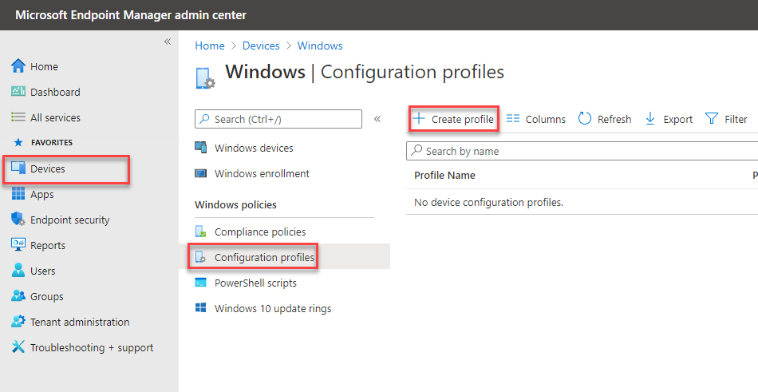

# <a name="how-to-control-usb-devices-and-other-removable-media-using-microsoft-defender-for-endpoint"></a>Cómo controlar dispositivos USB y otros medios extraíbles con Microsoft Defender para endpoint

**Se aplica a:** [Microsoft Defender para endpoint](https://go.microsoft.com/fwlink/p/?linkid=2069559)

Microsoft recomienda un enfoque por capas para proteger los medios extraíbles y Microsoft Defender para endpoint proporciona varias características de supervisión y control para ayudar [a](https://aka.ms/devicecontrolblog)evitar que las amenazas en periféricos no autorizados comporten los dispositivos:

1. [Descubrir eventos conectados plug and play para periféricos en La](#discover-plug-and-play-connected-events)búsqueda avanzada de Microsoft Defender para endpoint. Identificar o investigar actividades de uso sospechosas.

2. Configure para permitir o bloquear solo determinados dispositivos extraíbles y evitar amenazas.
    1. [Permitir o bloquear dispositivos extraíbles](#allow-or-block-removable-devices) en función de la configuración granular para denegar el acceso de escritura a discos extraíbles y aprobar o denegar dispositivos mediante el uso de los IDs de dispositivo USB. Asignación de directiva flexible de la configuración de instalación de dispositivos en función de un usuario o grupo de dispositivos y usuarios de Azure Active Directory (Azure AD).

    2. [Impedir que las amenazas quiten el](#prevent-threats-from-removable-storage) almacenamiento introducido por los dispositivos de almacenamiento extraíbles habilitando:  
        - Protección en tiempo real (RTP) de Antivirus de Microsoft Defender para examinar el almacenamiento extraíble en busca de malware.  
        - La regla USB de reducción de superficie de ataque (ASR) para bloquear procesos que no son de confianza y que no se firman y que se ejecutan desde USB.  
        - Configuración de protección de Acceso directo a la memoria (DMA) para mitigar los ataques de DMA, incluida la protección de kernel DMA para Thunderbolt y el bloqueo de DMA hasta que un usuario inicia sesión.  

3. [Cree alertas](#create-customized-alerts-and-response-actions) personalizadas y acciones de respuesta para supervisar el uso de dispositivos extraíbles basados en estos eventos plug and play o en cualquier otro evento de Microsoft Defender para endpoint con reglas [de detección personalizadas.](/microsoft-365/security/defender-endpoint/custom-detection-rules)

4. [Responder a las amenazas](#respond-to-threats) de los periféricos en tiempo real en función de las propiedades notificadas por cada periférico.

>[!Note]
>Estas medidas de reducción de amenazas ayudan a evitar que el malware entre en su entorno. Para proteger los datos empresariales de salir del entorno, también puede configurar medidas de prevención de pérdida de datos. Por ejemplo, en dispositivos Windows 10 puedes configurar [BitLocker](/windows/security/information-protection/bitlocker/bitlocker-overview.md) y [Windows Information Protection](/windows/security/information-protection/create-wip-policy-using-intune-azure.md), que cifrarán los datos de la empresa incluso si se almacenan en un dispositivo personal, o usar el CSP [Storage/RemovableDiskDenyWriteAccess](/windows/client-management/mdm/policy-csp-storage#storage-removablediskdenywriteaccess) para denegar el acceso de escritura a discos extraíbles. Además, puedes clasificar y proteger archivos en dispositivos [Windows](/windows/security/threat-protection/windows-defender-atp/information-protection-in-windows-overview) (incluidos sus dispositivos USB montados) mediante Microsoft Defender para Endpoint y Azure Information Protection.

## <a name="discover-plug-and-play-connected-events"></a>Descubrir eventos conectados de plug and play

Puedes ver eventos conectados plug and play en La búsqueda avanzada de Microsoft Defender para endpoint para identificar actividad de uso sospechosa o realizar investigaciones internas.
Para obtener ejemplos de consultas de búsqueda avanzada de Defender for Endpoint, consulta el repositorio de consultas de búsqueda [de GitHub de Microsoft Defender para](https://github.com/Microsoft/WindowsDefenderATP-Hunting-Queries)endpoints.

Las plantillas de informe de Power BI de ejemplo están disponibles para Microsoft Defender para endpoint que puede usar para consultas de búsqueda avanzadas. Con estas plantillas de ejemplo, incluida una para el control de dispositivos, puedes integrar la potencia de búsqueda avanzada en Power BI. Consulta el [repositorio de GitHub para plantillas de PowerBI](https://github.com/microsoft/MDATP-PowerBI-Templates) para obtener más información. Consulte [Crear informes personalizados con Power BI](/microsoft-365/security/defender-endpoint/api-power-bi) para obtener más información sobre la integración de Power BI.

## <a name="allow-or-block-removable-devices"></a>Permitir o bloquear dispositivos extraíbles
En la tabla siguiente se describen las formas en que Microsoft Defender para endpoint puede permitir o bloquear dispositivos extraíbles en función de la configuración granular.

| Control  | Descripción |
|----------|-------------|
| [Restringir unidades USB y otros periféricos](#restrict-usb-drives-and-other-peripherals) | Puedes permitir o impedir que los usuarios instalen solo las unidades USB y otros periféricos incluidos en una lista de dispositivos o tipos de dispositivos autorizados o no autorizados. |
| [Bloquear la instalación y el uso del almacenamiento extraíble](#block-installation-and-usage-of-removable-storage) | No puede instalar ni usar almacenamiento extraíble. |
| [Permitir la instalación y el uso de periféricos aprobados específicamente](#allow-installation-and-usage-of-specifically-approved-peripherals)   | Solo puede instalar y usar periféricos aprobados que informen de propiedades específicas en su firmware. |
| [Impedir la instalación de periféricos específicamente prohibidos](#prevent-installation-of-specifically-prohibited-peripherals) | No puede instalar ni usar periféricos prohibidos que informen de propiedades específicas en su firmware. |
| [Permitir la instalación y el uso de periféricos aprobados específicamente con los IDs de instancia del dispositivo que coincidan](#allow-installation-and-usage-of-specifically-approved-peripherals-with-matching-device-instance-ids) | Solo puedes instalar y usar periféricos aprobados que coincidan con cualquiera de estos IDs de instancia de dispositivo. |
| [Impedir la instalación y el uso de periféricos específicamente prohibidos con los IDs de instancia del dispositivo que coincidan](#prevent-installation-and-usage-of-specifically-prohibited-peripherals-with-matching-device-instance-ids) | No puedes instalar ni usar periféricos prohibidos que coincidan con ninguno de estos IDs de instancia de dispositivo. |
| [Limitar los servicios que usan Bluetooth](#limit-services-that-use-bluetooth) | Puede limitar los servicios que pueden usar Bluetooth. |
| [Usar Microsoft Defender para la configuración de línea base de punto de conexión](#use-microsoft-defender-for-endpoint-baseline-settings) | Puede establecer la configuración recomendada para ATP mediante la línea base de seguridad defender para puntos de conexión. |

### <a name="restrict-usb-drives-and-other-peripherals"></a>Restringir unidades USB y otros periféricos

Para evitar infecciones de malware o pérdida de datos, una organización puede restringir las unidades USB y otros periféricos. En la tabla siguiente se describen las formas en que Microsoft Defender para Endpoint puede ayudar a evitar la instalación y el uso de unidades USB y otros periféricos.

| Control  | Descripción
|----------|-------------|
| [Permitir la instalación y el uso de unidades USB y otros periféricos](#allow-installation-and-usage-of-usb-drives-and-other-peripherals) | Permitir a los usuarios instalar solo las unidades USB y otros periféricos incluidos en una lista de dispositivos o tipos de dispositivos autorizados |
| [Impedir la instalación y el uso de unidades USB y otros periféricos](#prevent-installation-and-usage-of-usb-drives-and-other-peripherals) | Impedir que los usuarios instalen unidades USB y otros periféricos incluidos en una lista de dispositivos y tipos de dispositivos no autorizados |

Todos los controles anteriores se pueden establecer a través de las plantillas administrativas [de](/intune/administrative-templates-windows)Intune . Las directivas relevantes se encuentran aquí en plantillas de administrador de Intune:


>[!Note]
>Con Intune, puede aplicar directivas de configuración de dispositivos a grupos de dispositivos o usuarios de Azure AD.
Las directivas anteriores también se pueden establecer a través de la configuración del CSP de instalación de [dispositivos](/windows/client-management/mdm/policy-csp-deviceinstallation) y los [GPO de instalación de dispositivos.](/previous-versions/dotnet/articles/bb530324(v=msdn.10))

> [!Note]
> Pruebe y refine siempre esta configuración con un grupo piloto de usuarios y dispositivos antes de aplicarlos en producción.
Para obtener más información acerca del control de dispositivos USB, consulta el [blog de Microsoft Defender para endpoint](https://www.microsoft.com/security/blog/2018/12/19/windows-defender-atp-has-protections-for-usb-and-removable-devices/).

#### <a name="allow-installation-and-usage-of-usb-drives-and-other-peripherals"></a>Permitir la instalación y el uso de unidades USB y otros periféricos

Una forma de acercarse para permitir la instalación y el uso de unidades USB y otros periféricos es empezar por permitir todo. Después, puedes empezar a reducir los controladores USB permitidos y otros periféricos.

>[!Note]
>Dado que un periférico USB no autorizado puede tener firmware que suplanta sus propiedades USB, se recomienda permitir solo periféricos USB aprobados específicamente y limitar los usuarios que pueden acceder a ellos.

1. Habilitar **Impedir la instalación de dispositivos no descritos por otras configuraciones de directiva** para todos los usuarios.
2. Habilitar **Permitir la instalación de dispositivos con controladores que coincidan con estas** clases de configuración de dispositivo para todas las clases de configuración del [dispositivo.](/windows-hardware/drivers/install/system-defined-device-setup-classes-available-to-vendors)

Para aplicar la directiva para dispositivos ya instalados, aplique las directivas de prevención que tengan esta configuración.

Al configurar la directiva de instalación de dispositivos permitidos, también debes permitir todos los atributos primarios. Puedes ver los padres de un dispositivo abriendo el Administrador de dispositivos y ver por conexión.


En este ejemplo, es necesario agregar las siguientes clases: HID, Keyboard y {36fc9e60-c465-11cf-8056-444553540000}. Consulta [Controladores USB proporcionados por Microsoft](/windows-hardware/drivers/usbcon/supported-usb-classes) para obtener más información.


Si quieres restringir a determinados dispositivos, quita la clase de configuración del dispositivo del periférico que quieres limitar. A continuación, agrega el identificador de dispositivo que quieras agregar. El id. de dispositivo se basa en los valores de id. de proveedor y de producto de un dispositivo. Para obtener información sobre los formatos de id. de dispositivo, [consulte Standard USB Identifiers](/windows-hardware/drivers/install/standard-usb-identifiers). 

Para buscar los identificadores de dispositivo, [consulta Buscar identificador de dispositivo](#look-up-device-id). 

Por ejemplo:

1. Quite la clase USBDevice de **Permitir la instalación de dispositivos con controladores que coincidan con la configuración de estos dispositivos.**
2. Agrega el identificador del dispositivo para permitir la instalación del dispositivo **que coincida con cualquiera de estos identificadores de dispositivo.** 


#### <a name="prevent-installation-and-usage-of-usb-drives-and-other-peripherals"></a>Impedir la instalación y el uso de unidades USB y otros periféricos

Si quieres impedir la instalación de una clase de dispositivo o determinados dispositivos, puedes usar las directivas de instalación de dispositivos de prevención:

1. Habilita **Impedir la instalación de dispositivos que coincidan con cualquiera de estos IDs** de dispositivo y agrega estos dispositivos a la lista.
2. Habilitar **Impedir la instalación de dispositivos con controladores que coincidan con estas clases de configuración de dispositivos.**

> [!Note]
> Las directivas de instalación de dispositivos de prevención tienen prioridad sobre las directivas de instalación de dispositivos permitidos.

La directiva Impedir la instalación de dispositivos que coincidan con cualquiera de estos **IDs** de dispositivo te permite especificar una lista de dispositivos que Windows no puede instalar. 

Para evitar la instalación de dispositivos que coincidan con cualquiera de estos IDs de dispositivo: 

1. [Busca el identificador de dispositivo](#look-up-device-id) para los dispositivos que quieres que Windows impida la instalación.

   

2. Habilita **Impedir la instalación de dispositivos que coincidan** con cualquiera de estos IDs de dispositivo y agrega los nombres de proveedor o producto a la lista.

    

#### <a name="look-up-device-id"></a>Buscar id. de dispositivo

Puedes usar el Administrador de dispositivos para buscar un identificador de dispositivo.

1. Abre el Administrador de dispositivos.
2. Haga **clic en** Ver y seleccione **Dispositivos por conexión.**
3. En el árbol, haga clic con el botón secundario en el dispositivo y seleccione **Propiedades**.
4. En el cuadro de diálogo del dispositivo seleccionado, haga clic en la **pestaña** Detalles.
5. Haga clic **en la** lista desplegable Propiedades y seleccione **Identificadores de hardware.**
6. Haga clic con el botón secundario en el valor de identificador superior y seleccione **Copiar**.

Para obtener información acerca de los formatos de id. [de dispositivo, consulte Standard USB Identifiers](/windows-hardware/drivers/install/standard-usb-identifiers).

Para obtener información sobre los IDs de proveedor, vea [Miembros USB](https://www.usb.org/members).

A continuación se muestra un ejemplo para buscar un identificador de proveedor de dispositivos o un id. de producto (que forma parte del identificador del dispositivo) con PowerShell: 

```powershell
Get-WMIObject -Class Win32_DiskDrive |
Select-Object -Property * 
```

La **directiva Impedir la instalación de dispositivos** con controladores que coincidan con estas clases de configuración de dispositivos te permite especificar clases de configuración de dispositivos que Windows no pueda instalar. 

Para evitar la instalación de determinadas clases de dispositivos: 

1. Busque el GUID de la clase de configuración del dispositivo en Clases de configuración de dispositivo definidas por el sistema [disponibles para los proveedores.](/windows-hardware/drivers/install/system-defined-device-setup-classes-available-to-vendors)

2. Habilita **Impedir la instalación de dispositivos con controladores que coincidan con estas** clases de configuración de dispositivos y agrega el GUID de clase a la lista.

    > [!div class="mx-imgBorder"]
    > 

### <a name="block-installation-and-usage-of-removable-storage"></a>Bloquear la instalación y el uso del almacenamiento extraíble

1. Inicie sesión en [Microsoft Azure Portal](https://portal.azure.com/).

2. Haga clic **en**  >  **Perfiles de configuración de** dispositivo de Intune Crear  >    >  **perfil**.

    > [!div class="mx-imgBorder"]
    > 

3. Use la configuración siguiente:

   - Nombre: escriba un nombre para el perfil
   - Descripción: escriba una descripción
   - Plataforma: Windows 10 y versiones posteriores
   - Tipo de perfil: restricciones de dispositivo

   > [!div class="mx-imgBorder"]
   > 

4. Haga clic **en**  >  **Configurar general**.  

5. Para **Almacenamiento extraíble y** conexión USB **(solo móvil),** elija **Bloquear**. **El almacenamiento extraíble** incluye unidades USB, mientras que la conexión **USB (solo móvil)** excluye la carga USB, pero solo incluye otras conexiones USB en dispositivos móviles. 

   

6. Haga **clic en Aceptar** para cerrar Configuración **general** y **Restricciones de dispositivo.**

7. Haga **clic en** Crear para guardar el perfil.

### <a name="allow-installation-and-usage-of-specifically-approved-peripherals"></a>Permitir la instalación y el uso de periféricos aprobados específicamente

Los periféricos que pueden instalarse pueden especificarse mediante su [identidad de hardware](/windows-hardware/drivers/install/device-identification-strings). Para obtener una lista de estructuras de identificador comunes, consulta [Formatos de identificador de dispositivo](/windows-hardware/drivers/install/device-identifier-formats). Pruebe la configuración antes de implementarla para asegurarse de que se bloquea y permite los dispositivos esperados. Lo ideal es probar varias instancias del hardware. Por ejemplo, pruebe varias claves USB en lugar de solo una.

Para ver un ejemplo de SyncML que permite la instalación de determinados IDs de dispositivo, consulta [DeviceInstallation/AllowInstallationOfMatchingDeviceIDs CSP](/windows/client-management/mdm/policy-csp-deviceinstallation#deviceinstallation-allowinstallationofmatchingdeviceids). Para permitir clases de dispositivo específicas, consulta [DeviceInstallation/AllowInstallationOfMatchingDeviceSetupClasses CSP](/windows/client-management/mdm/policy-csp-deviceinstallation#deviceinstallation-allowinstallationofmatchingdevicesetupclasses).
Para permitir la instalación de dispositivos específicos también es necesario habilitar [DeviceInstallation/PreventInstallationOfDevicesNotDescribedByOtherPolicySettings](/windows/client-management/mdm/policy-csp-deviceinstallation#deviceinstallation-preventinstallationofdevicesnotdescribedbyotherpolicysettings).

### <a name="prevent-installation-of-specifically-prohibited-peripherals"></a>Impedir la instalación de periféricos específicamente prohibidos

Microsoft Defender para endpoint bloquea la instalación y el uso de periféricos prohibidos mediante cualquiera de estas opciones:

- [Las plantillas administrativas](/intune/administrative-templates-windows) pueden bloquear cualquier dispositivo con un identificador de hardware o una clase de configuración que coincida.  
- [Configuración de CSP de instalación de dispositivos](/windows/client-management/mdm/policy-csp-deviceinstallation) con un perfil personalizado en Intune. Puedes impedir [la instalación de determinados IDs de dispositivo o](/windows/client-management/mdm/policy-csp-deviceinstallation#deviceinstallation-preventinstallationofmatchingdeviceids) impedir clases de dispositivo [específicas.](/windows/client-management/mdm/policy-csp-deviceinstallation#deviceinstallation-preventinstallationofmatchingdevicesetupclasses)

### <a name="allow-installation-and-usage-of-specifically-approved-peripherals-with-matching-device-instance-ids"></a>Permitir la instalación y el uso de periféricos aprobados específicamente con los IDs de instancia del dispositivo que coincidan

Los periféricos que pueden instalarse pueden especificarse mediante sus [IDs de instancia de dispositivo.](/windows-hardware/drivers/install/device-instance-ids) Pruebe la configuración antes de implementarla para asegurarse de que permite los dispositivos esperados. Lo ideal es probar varias instancias del hardware. Por ejemplo, pruebe varias claves USB en lugar de solo una.

Puedes permitir la instalación y el uso de periféricos aprobados con los IDs de instancia de dispositivo que coincidan configurando la configuración de directiva [DeviceInstallation/AllowInstallationOfMatchingDeviceInstanceIDs.](/windows/client-management/mdm/policy-csp-deviceinstallation#deviceinstallation-allowinstallationofmatchingdeviceinstanceids)

### <a name="prevent-installation-and-usage-of-specifically-prohibited-peripherals-with-matching-device-instance-ids"></a>Impedir la instalación y el uso de periféricos específicamente prohibidos con los IDs de instancia del dispositivo que coincidan

Los periféricos que están prohibidos para instalarse pueden especificarse mediante sus [IDs de instancia de dispositivo.](/windows-hardware/drivers/install/device-instance-ids) Pruebe la configuración antes de implementarla para asegurarse de que permite los dispositivos esperados. Lo ideal es probar varias instancias del hardware. Por ejemplo, pruebe varias claves USB en lugar de solo una.

Puedes impedir la instalación de los periféricos prohibidos con los IDs de instancia del dispositivo que coincidan configurando la configuración de directiva [DeviceInstallation/PreventInstallationOfMatchingDeviceInstanceIDs.](/windows/client-management/mdm/policy-csp-deviceinstallation#deviceinstallation-preventinstallationofmatchingdeviceinstanceids)

### <a name="limit-services-that-use-bluetooth"></a>Limitar los servicios que usan Bluetooth

Con Intune, puede limitar los servicios que pueden usar Bluetooth a través de [los "Bluetooth permitidos".](/windows/client-management/mdm/policy-csp-bluetooth#servicesallowedlist-usage-guide) El estado predeterminado de la configuración Bluetooth "servicios permitidos" significa que todo está permitido.  Tan pronto como se agrega un servicio, se convierte en la lista permitida. Si el cliente agrega los valores teclados y ratones y no agrega los GUID de transferencia de archivos, se debe bloquear la transferencia de archivos.

> [!div class="mx-imgBorder"]
> 

### <a name="use-microsoft-defender-for-endpoint-baseline-settings"></a>Usar Microsoft Defender para la configuración de línea base de punto de conexión

La configuración de línea base de Microsoft Defender para extremo representa la configuración recomendada para la protección contra amenazas. Las opciones de configuración para la línea base se encuentran en la página editar perfil de las opciones de configuración.

> [!div class="mx-imgBorder"]
> 

## <a name="prevent-threats-from-removable-storage"></a>Impedir que las amenazas quiten el almacenamiento
  
Los dispositivos de almacenamiento extraíbles pueden introducir riesgos de seguridad adicionales para la organización. Microsoft Defender para endpoint puede ayudar a identificar y bloquear archivos malintencionados en dispositivos de almacenamiento extraíbles.

Microsoft Defender para endpoint también puede impedir que se utilicen periféricos USB en dispositivos para ayudar a evitar amenazas externas. Para ello, usa las propiedades notificadas por periféricos USB para determinar si se pueden instalar y usar en el dispositivo.

Ten en cuenta que si bloqueas dispositivos USB o cualquier otra clase de dispositivo mediante las directivas de instalación del dispositivo, los dispositivos conectados, como los teléfonos, aún pueden cargarse.

>[!NOTE]
>Pruebe y refine siempre esta configuración con un grupo piloto de usuarios y dispositivos primero antes de distribuirla ampliamente a su organización. 

En la tabla siguiente se describen las formas en que Microsoft Defender para endpoint puede ayudar a evitar que las amenazas se puedan quitar.

Para obtener más información acerca del control de dispositivos USB, consulta el [blog de Microsoft Defender para endpoint](https://aka.ms/devicecontrolblog).

| Control  | Descripción |
|----------|-------------|
| [Habilitar el examen antivirus de Microsoft Defender](#enable-microsoft-defender-antivirus-scanning) | Habilite el examen de Antivirus de Microsoft Defender para obtener protección en tiempo real o exámenes programados.|
| [Bloquear procesos no de confianza y sin firma en periféricos USB](#block-untrusted-and-unsigned-processes-on-usb-peripherals) | Bloquee los archivos USB que no estén firmando o que no sean de confianza. |
| [Proteger contra ataques de acceso directo a la memoria (DMA)](#protect-against-direct-memory-access-dma-attacks) | Configurar las opciones para proteger contra ataques de DMA. |

>[!NOTE]
>Dado que un periférico USB no autorizado puede tener firmware que suplanta sus propiedades USB, se recomienda permitir solo periféricos USB aprobados específicamente y limitar los usuarios que pueden acceder a ellos.

### <a name="enable-microsoft-defender-antivirus-scanning"></a>Habilitar el examen antivirus de Microsoft Defender

Proteger el almacenamiento extraíble autorizado con Antivirus de Microsoft Defender requiere habilitar la protección en tiempo [real](/microsoft-365/security/defender-endpoint/configure-real-time-protection-microsoft-defender-antivirus) o programar exámenes y configurar unidades extraíbles para exámenes.

- Si la protección en tiempo real está habilitada, los archivos se examinan antes de tener acceso a ellos y ejecutarse. El ámbito de examen incluye todos los archivos, incluidos los de dispositivos extraíbles montados, como las unidades USB. Opcionalmente, puede ejecutar un script de [PowerShell](/samples/browse/?redirectedfrom=TechNet-Gallery) para realizar un examen personalizado de una unidad USB después de montarla, de modo que Antivirus de Microsoft Defender comience a examinar todos los archivos de un dispositivo extraíble una vez que se haya conectado el dispositivo extraíble. Sin embargo, se recomienda habilitar la protección en tiempo real para mejorar el rendimiento del examen, especialmente para dispositivos de almacenamiento grandes.

- Si se usan exámenes programados, debes deshabilitar la configuración DisableRemovableDriveScanning (habilitada de forma predeterminada) para examinar el dispositivo extraíble durante un examen completo. Los dispositivos extraíbles se examinan durante un examen rápido o personalizado independientemente de la configuración DisableRemovableDriveScanning.

>[!NOTE]
>Se recomienda habilitar la supervisión en tiempo real para el examen. En Intune, puedes habilitar la supervisión en tiempo real para Windows 10 en **Device Restrictions**  >  **Configure**  >  **Microsoft Defender Antivirus**  >  **Real-time monitoring**.

<!-- Need to build out point in the preceding note. 
-->

### <a name="block-untrusted-and-unsigned-processes-on-usb-peripherals"></a>Bloquear procesos no de confianza y sin firma en periféricos USB

Los usuarios finales pueden conectar dispositivos extraíbles que estén infectados con malware.
Para evitar infecciones, una empresa puede bloquear los archivos USB que no están firmando o que no son de confianza.
Como alternativa, las empresas pueden [](/microsoft-365/security/defender-endpoint/attack-surface-reduction) aprovechar la característica de auditoría de las reglas de reducción de superficie de ataque para supervisar la actividad de los procesos no de confianza y sin firma que se ejecutan en un periférico USB.
Esto se puede hacer estableciendo procesos que no son de confianza y sin firma que se ejecutan desde **USB** en **Solo** bloquear o **auditar**, respectivamente.
Con esta regla, los administradores pueden impedir o auditar archivos ejecutables no firmables o no de confianza que se ejecuten desde unidades extraíbles USB, incluidas las tarjetas SD.
Los tipos de archivo afectados incluyen archivos ejecutables (como .exe, .dll o .scr) y archivos de script como powershell (.ps), visualbasic (.vbs) o archivos JavaScript (.js).

Esta configuración requiere [habilitar la protección en tiempo real](/microsoft-365/security/defender-endpoint/configure-real-time-protection-microsoft-defender-antivirus).

1. Inicie sesión en [Microsoft Endpoint Manager](https://endpoint.microsoft.com/).

2. Haga clic **en**  >    >  **Dispositivos Directivas de configuración de** Windows Crear  >  **perfil**. 

    

3. Use la configuración siguiente:
   - Plataforma: Windows 10 y versiones posteriores 
   - Tipo de perfil: restricciones de dispositivo

   > [!div class="mx-imgBorder"]
   > 

4. Haga clic en **Crear**.  

5. Para **los procesos no firmados y que no** son de confianza que se ejecutan desde USB, elija **Bloquear**.

   

6. Haga **clic en Aceptar** para cerrar la configuración y las **restricciones de dispositivo.**

### <a name="protect-against-direct-memory-access-dma-attacks"></a>Proteger contra ataques de acceso directo a la memoria (DMA)

Los ataques de DMA pueden provocar la divulgación de información confidencial que reside en un equipo o incluso la inyección de malware que permite a los atacantes omitir la pantalla de bloqueo o controlar equipos de forma remota. La siguiente configuración ayuda a evitar ataques de DMA:

1. A partir de Windows 10 versión 1803, Microsoft introdujo [kernel DMA Protection for Thunderbolt](/windows/security/information-protection/kernel-dma-protection-for-thunderbolt.md) para proporcionar protección nativa contra ataques DMA a través de puertos Thunderbolt. Kernel DMA Protection for Thunderbolt está habilitado por los fabricantes del sistema y los usuarios no pueden activar ni desactivar.

   A partir de Windows 10 versión 1809, puedes ajustar el nivel de Protección de kernel DMA configurando el CSP de [DMA Guard](/windows/client-management/mdm/policy-csp-dmaguard#dmaguard-deviceenumerationpolicy). Este es un control adicional para periféricos que no admiten el aislamiento de memoria del dispositivo (también conocido como remapping de DMA). El aislamiento de memoria permite que el sistema operativo aproveche la Unidad de administración de memoria de E/S (IOMMU) de un dispositivo para bloquear E/S no permitidos, o acceso a la memoria, mediante el periférico (espacio aislado de memoria). En otras palabras, el sistema operativo asigna un intervalo de memoria determinado al periférico. Si el periférico intenta leer y escribir en la memoria fuera del intervalo asignado, el sistema operativo lo bloquea.

   Los periféricos que admiten el aislamiento de memoria del dispositivo siempre se pueden conectar. Periféricos que no se pueden bloquear, permitir o permitir solo después de que el usuario inicia sesión (valor predeterminado).

2. En sistemas Windows 10 que no son compatibles con Kernel DMA Protection, puedes:

   - [Bloquear DMA hasta que un usuario inicia sesión](/windows/client-management/mdm/policy-csp-dataprotection#dataprotection-allowdirectmemoryaccess)
   - [Bloquear todas las conexiones a través de los puertos Thunderbolt (incluidos los dispositivos USB)](https://support.microsoft.com/help/2516445/blocking-the-sbp-2-driver-and-thunderbolt-controllers-to-reduce-1394-d)

## <a name="create-customized-alerts-and-response-actions"></a>Crear alertas personalizadas y acciones de respuesta

Puede crear alertas personalizadas y acciones de respuesta con WDATP Connector y las reglas de detección personalizadas:

**Acciones de respuesta del conector Wdatp:**

**Investigar:** Inicie investigaciones, recopile el paquete de investigación y aísle una máquina.

**Análisis de amenazas** en dispositivos USB.

**Restringir la ejecución** de todas las aplicaciones en la máquina excepto un conector MDATP establecido predefinido es uno de los más de 200 conectores predefinidos, incluidos Outlook, Teams, Slack, etc. Se pueden crear conectores personalizados.
- [Más información sobre las acciones de respuesta del conector WDATP](/connectors/wdatp/)

**Acción de respuesta de reglas de detección personalizadas:** Se pueden aplicar acciones a nivel de máquina y de archivo.
- [Más información sobre acciones de respuesta de reglas de detección personalizadas](/microsoft-365/security/defender-endpoint/custom-detection-rules)

Para obtener información sobre eventos de búsqueda avanzada relacionados con el control de dispositivos y ejemplos sobre cómo crear alertas personalizadas, consulta Actualizaciones avanzadas de búsqueda: eventos USB, acciones de nivel de máquina y cambios [de esquema.](https://techcommunity.microsoft.com/t5/Microsoft-Defender-ATP/Advanced-hunting-updates-USB-events-machine-level-actions-and/ba-p/824152)

## <a name="respond-to-threats"></a>Responder a amenazas

Puede crear alertas personalizadas y acciones de respuesta automáticas con las reglas de detección personalizadas de punto de conexión [de Microsoft Defender.](/microsoft-365/security/defender-endpoint/custom-detection-rules) Las acciones de respuesta dentro de la detección personalizada cubren tanto las acciones de nivel de máquina como de archivo. También puede crear alertas y acciones de respuesta automáticas con [PowerApps](https://powerapps.microsoft.com/) y [Flow](https://flow.microsoft.com/) con el conector [de Microsoft Defender para endpoint](/connectors/wdatp/). El conector admite acciones para la investigación, el examen de amenazas y la restricción de aplicaciones en ejecución. Es uno de los más de 200 conectores predefinidos, incluidos Outlook, Teams, Slack y mucho más. También se pueden crear conectores personalizados. Consulte [Conectores](/connectors/) para obtener más información sobre los conectores.
 
Por ejemplo, con cualquiera de los dos métodos, puedes hacer que el Antivirus de Microsoft Defender se ejecute automáticamente cuando se monta un dispositivo USB en una máquina.

## <a name="related-topics"></a>Temas relacionados

- [Configurar la protección en tiempo real para Antivirus de Microsoft Defender](/microsoft-365/security/defender-endpoint/configure-real-time-protection-microsoft-defender-antivirus)
- [Defender/AllowFullScanRemovableDriveScanning](/windows/client-management/mdm/policy-csp-defender#defender-allowfullscanremovabledrivescanning)
- [CSP de directiva/DeviceInstallation](/windows/client-management/mdm/policy-csp-deviceinstallation)
- [Realizar un examen personalizado de un dispositivo extraíble](/samples/browse/?redirectedfrom=TechNet-Gallery)
- [Plantilla PowerBI de control de dispositivos para informes personalizados](https://github.com/microsoft/MDATP-PowerBI-Templates)
- [BitLocker](/windows/security/information-protection/bitlocker/bitlocker-overview.md) 
- [Windows Information Protection](/windows/security/information-protection/windows-information-protection/create-wip-policy-using-intune-azure.md)