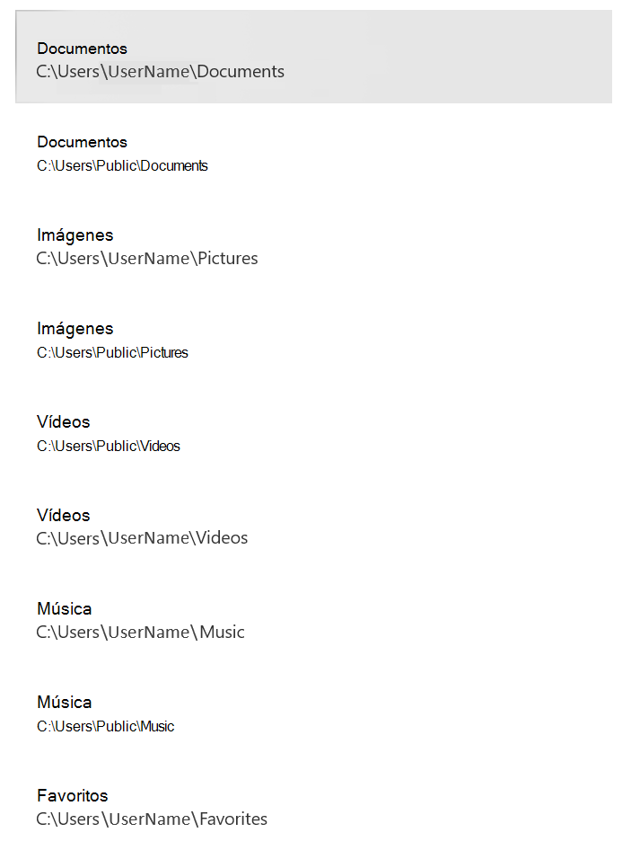

# <a name="protect-important-folders-with-controlled-folder-access"></a>Proteger carpetas importantes con acceso controlado a carpetas

[!INCLUDE [Microsoft 365 Defender rebranding](../../includes/microsoft-defender.md)]

**Se aplica a:**

- [Microsoft Defender para punto de conexión Plan 2](https://go.microsoft.com/fwlink/p/?linkid=2154037)
- [Microsoft 365 Defender](https://go.microsoft.com/fwlink/?linkid=2118804)
- Antivirus de Microsoft Defender

**Se aplica a**
- Windows


> ¿Quiere experimentar Defender para punto de conexión? [Regístrese para obtener una prueba gratuita.](https://signup.microsoft.com/create-account/signup?products=7f379fee-c4f9-4278-b0a1-e4c8c2fcdf7e&ru=https://aka.ms/MDEp2OpenTrial?ocid=docs-wdatp-assignaccess-abovefoldlink)

## <a name="what-is-controlled-folder-access"></a>¿Qué es el acceso controlado a carpetas?

El acceso controlado a carpetas ayuda a proteger los datos valiosos de aplicaciones y amenazas malintencionadas, como ransomware. El acceso controlado a carpetas protege los datos comprobando las aplicaciones con una lista de aplicaciones conocidas y de confianza. Compatible con Windows Server 2019, Windows Server 2022, Windows 10 y clientes de Windows 11, el acceso controlado a carpetas se puede activar mediante la aplicación Seguridad de Windows, Configuration Manager de punto de conexión de Microsoft o Intune (para dispositivos administrados).

> [!NOTE]
> Los motores de scripting no son de confianza y no se puede permitir el acceso a carpetas protegidas controladas. Por ejemplo, PowerShell no es de confianza mediante el acceso controlado a carpetas, incluso si se permite con [indicadores de certificado y archivo](/microsoft-365/security/defender-endpoint/indicator-certificates).

El acceso controlado a carpetas funciona mejor con [Microsoft Defender para punto de conexión](microsoft-defender-endpoint.md), lo que proporciona informes detallados sobre eventos y bloques de acceso controlados a carpetas como parte de los [escenarios habituales de investigación de alertas](investigate-alerts.md).

> [!TIP]
> Los bloques de acceso controlados a carpetas no generan alertas en la [cola de alertas](alerts-queue.md). Sin embargo, puede ver información sobre los bloques de acceso controlados a carpetas en la [vista de escala de tiempo del dispositivo](investigate-machines.md), mientras se usa [la búsqueda avanzada](advanced-hunting-overview.md) o con [reglas de detección personalizadas](custom-detection-rules.md).

## <a name="how-does-controlled-folder-access-work"></a>¿Cómo funciona el acceso controlado a carpetas?

El acceso controlado a carpetas solo funciona al permitir que las aplicaciones de confianza accedan a carpetas protegidas. Las carpetas protegidas se especifican cuando se configura el acceso controlado a carpetas. Normalmente, las carpetas que se usan normalmente, como las que se usan para documentos, imágenes, descargas, etc., se incluyen en la lista de carpetas controladas.

El acceso controlado a carpetas funciona con una lista de aplicaciones de confianza. Las aplicaciones que se incluyen en la lista de software de confianza funcionan según lo esperado. Se impide que las aplicaciones que no se incluyen en la lista realicen cambios en los archivos dentro de carpetas protegidas.

Las aplicaciones se agregan a la lista en función de su prevalencia y reputación. Las aplicaciones que son muy frecuentes en toda la organización y que nunca han mostrado ningún comportamiento considerado malintencionado se consideran de confianza. Esas aplicaciones se agregan automáticamente a la lista.

Las aplicaciones también se pueden agregar manualmente a la lista de confianza mediante Configuration Manager o Intune. Se pueden realizar acciones adicionales desde el portal de Microsoft 365 Defender.

## <a name="why-controlled-folder-access-is-important"></a>Por qué es importante el acceso controlado a carpetas

El acceso controlado a carpetas es especialmente útil para ayudar a proteger sus documentos e información frente a [ransomware](https://www.microsoft.com/wdsi/threats/ransomware). En un ataque de ransomware, sus archivos pueden ser cifrados y retenidos como rehenes. Con el acceso controlado a carpetas en su lugar, aparece una notificación en el equipo donde una aplicación intentó realizar cambios en un archivo en una carpeta protegida. Puede [personalizar la notificación](attack-surface-reduction-rules-deployment-implement.md#customize-attack-surface-reduction-rules) con los detalles de la empresa y la información de contacto. También puede habilitar las reglas individualmente para personalizar las técnicas que supervisan las características.

Las [carpetas protegidas](#review-controlled-folder-access-events-in-windows-event-viewer) incluyen carpetas comunes del sistema (incluidos los sectores de arranque) y puede [agregar más carpetas](customize-controlled-folders.md#protect-additional-folders). También puede [permitir que las aplicaciones](customize-controlled-folders.md#allow-specific-apps-to-make-changes-to-controlled-folders) les concedan acceso a las carpetas protegidas.

Puede usar el [modo de auditoría](audit-windows-defender.md) para evaluar cómo afectaría el acceso controlado a la carpeta a su organización si estuviera habilitado.

El acceso controlado a carpetas se admite en las siguientes versiones de Windows:

- [Windows 10, versión 1709](/windows/whats-new/whats-new-windows-10-version-1709) y posteriores
- Windows 11
- Windows 2012 R2
- Windows 2016
- [Windows Server 2019](/windows-server/get-started-19/whats-new-19)
- Windows Server 2022

## <a name="windows-system-folders-are-protected-by-default"></a>Las carpetas del sistema de Windows están protegidas de forma predeterminada

Las carpetas del sistema de Windows están protegidas de forma predeterminada, junto con otras carpetas:

Las carpetas protegidas incluyen carpetas comunes del sistema (incluidos los sectores de arranque) y puede agregar carpetas adicionales. También puede permitir que las aplicaciones les concedan acceso a las carpetas protegidas.  Las carpetas de sistemas Windows que están protegidas de forma predeterminada son:

- `c:\Users\<username>\Documents`
- `c:\Users\Public\Documents`
- `c:\Users\<username>\Pictures`
- `c:\Users\Public\Pictures`
- `c:\Users\Public\Videos`
- `c:\Users\<username>\Videos`
- `c:\Users\<username>\Music`
- `c:\Users\Public\Music`
- `c:\Users\<username>\Favorites`

Las carpetas predeterminadas aparecen en el perfil del usuario, en **Este equipo**.
   > [!div class="mx-imgBorder"]
   > 

> [!NOTE]
> Puede configurar carpetas adicionales como protegidas, pero no puede quitar las carpetas del sistema de Windows que están protegidas de forma predeterminada.

## <a name="requirements-for-controlled-folder-access"></a>Requisitos para el acceso controlado a carpetas

El acceso controlado a carpetas requiere habilitar la [protección en tiempo real del Antivirus de Microsoft Defender](configure-real-time-protection-microsoft-defender-antivirus.md).

## <a name="review-controlled-folder-access-events-in-the-microsoft-365-defender-portal"></a>Revisión de eventos de acceso controlado a carpetas en el portal de Microsoft 365 Defender

Defender para punto de conexión proporciona informes detallados sobre eventos y bloques como parte de sus [escenarios de investigación de alertas](investigate-alerts.md) en el portal de Microsoft 365 Defender; consulte [Microsoft Defender para punto de conexión en Microsoft 365 Defender](../defender/microsoft-365-security-center-mde.md).

Puede consultar Microsoft Defender para punto de conexión datos mediante [la búsqueda avanzada](advanced-hunting-overview.md). Si usa el [modo de auditoría](audit-windows-defender.md), puede usar la [búsqueda avanzada](advanced-hunting-overview.md) para ver cómo afectaría a su entorno la configuración de acceso controlado a carpetas si estuvieran habilitadas.

Consulta de ejemplo:

```PowerShell
DeviceEvents
| where ActionType in ('ControlledFolderAccessViolationAudited','ControlledFolderAccessViolationBlocked')
```

## <a name="review-controlled-folder-access-events-in-windows-event-viewer"></a>Revisar eventos de acceso controlado a carpetas en Windows Visor de eventos

Puede revisar el registro de eventos de Windows para ver los eventos que se crean cuando se controla el acceso a carpetas bloquea (o audita) una aplicación:

1. Descargue el [paquete de evaluación](https://aka.ms/mp7z2w) y extraiga el archivo *cfa-events.xml* en una ubicación de fácil acceso en el dispositivo.
2. Escriba **Visor de eventos** en el menú Inicio para abrir el Visor de eventos de Windows.
3. En el panel izquierdo, en **Acciones**, seleccione **Importar vista personalizada...**.
4. Vaya al lugar donde extrajo *cfa-events.xml* y selecciónelo. Como alternativa, [copie el XML directamente](event-views.md).
5. Seleccione **Aceptar**.

En la tabla siguiente se muestran eventos relacionados con el acceso controlado a carpetas:

<br/><br/>

|Id. de evento|Descripción|
|---|---|
|5007|Evento cuando se cambia la configuración|
|1124|Evento de acceso a carpetas controladas auditadas|
|1123|Evento de acceso a carpetas controladas bloqueadas|

## <a name="view-or-change-the-list-of-protected-folders"></a>Ver o cambiar la lista de carpetas protegidas

Puede usar la aplicación Seguridad de Windows para ver la lista de carpetas protegidas por el acceso controlado a carpetas.

1. En el dispositivo Windows 10 o Windows 11, abra la aplicación Seguridad de Windows.
2. Seleccione **Protección antivirus y contra amenazas**.
3. En **Protección contra ransomware**, seleccione **Administrar protección contra ransomware**.
4. Si el acceso controlado a carpetas está desactivado, deberá activarlo. Seleccione **carpetas protegidas**.
5. Realice uno de los pasos siguientes:
   - Para agregar una carpeta, seleccione **+ Agregar una carpeta protegida**.
   - Para quitar una carpeta, selecciónela y, a continuación, seleccione **Quitar**.

> [!NOTE]
> Las [carpetas del sistema de Windows](#windows-system-folders-are-protected-by-default) están protegidas de forma predeterminada y no se pueden quitar de la lista.
