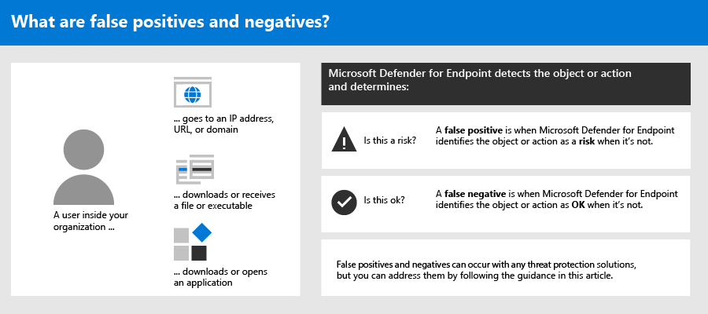
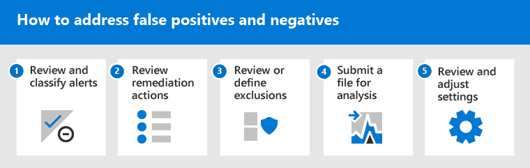

# <a name="address-false-positivesnegatives-in-microsoft-defender-for-endpoint"></a>Abordar falsos positivos/negativos en Microsoft Defender para punto de conexión

[!INCLUDE [Microsoft 365 Defender rebranding](../../includes/microsoft-defender.md)]

**Se aplica a**

- [Microsoft Defender para punto de conexión](https://go.microsoft.com/fwlink/p/?linkid=2146806)

En las soluciones de protección de puntos de conexión, un falso positivo es una entidad, como un archivo o un proceso, que se detectó e identificó como malintencionada, aunque la entidad no sea realmente una amenaza. Un falso negativo es una entidad que no se detectó como una amenaza, aunque en realidad sea malintencionada. Los falsos positivos/negativos pueden producirse con cualquier solución de protección contra amenazas, incluido [Microsoft Defender para endpoint](microsoft-defender-endpoint.md).



Afortunadamente, se pueden realizar pasos para solucionar y reducir este tipo de problemas. Si ve falsos positivos o negativos en [Microsoft 365 Defender](microsoft-defender-security-center.md) (anteriormente el Centro de seguridad de Microsoft Defender), las operaciones de seguridad pueden tomar medidas para solucionarlos mediante el siguiente proceso:

1.  [Revisar y clasificar alertas](#part-1-review-and-classify-alerts) 
2.  [Revisar las acciones de corrección que se han realizado](#part-2-review-remediation-actions)
3.  [Revisar y definir exclusiones](#part-3-review-or-define-exclusions)
4.  [Enviar una entidad para su análisis](#part-4-submit-a-file-for-analysis)
5.  [Revisar y ajustar la configuración de protección contra amenazas](#part-5-review-and-adjust-your-threat-protection-settings)

Puede obtener ayuda si sigue teniendo problemas con falsos positivos o negativos después de realizar las tareas descritas en este artículo. ¿Sigue [necesitando ayuda?](#still-need-help)



> [!NOTE]
> Este artículo está pensado como guía para los operadores de seguridad y los administradores de seguridad que usan [Microsoft Defender para Endpoint](microsoft-defender-endpoint.md).

## <a name="part-1-review-and-classify-alerts"></a>Parte 1: Revisar y clasificar alertas

Si ve una [alerta que](alerts.md) se desencadenó porque se detectó algo como malintencionado o sospechoso que no debería haber sido, puede suprimir la alerta de esa entidad. También puede suprimir alertas que no son necesariamente falsos positivos, pero que no son importantes. Se recomienda clasificar alertas también. 

Administrar las alertas y clasificar falsos positivos ayuda a entrenar la solución de protección contra amenazas y puede reducir el número de falsos positivos o falsos negativos con el tiempo. Tomar estos pasos también ayuda a reducir el ruido en el panel de operaciones de seguridad para que el equipo de seguridad pueda centrarse en los elementos de trabajo de mayor prioridad.

### <a name="determine-whether-an-alert-is-accurate"></a>Determinar si una alerta es precisa

Antes de clasificar o suprimir una alerta, determine si la alerta es precisa, un falso positivo o benigno.

1. Vaya al portal de Microsoft 365 Defender ( [https://security.microsoft.com](https://security.microsoft.com) ) e inicie sesión.

2. En el panel de navegación, elija **Cola de alertas**.

3. Seleccione una alerta para obtener más información sobre la alerta. (Vea [Revisar alertas en Microsoft Defender para endpoint](review-alerts.md).)

4. Según el estado de alerta, siga los pasos descritos en la tabla siguiente: 

| Estado de alerta | Qué hacer |
|:---|:---|
| La alerta es precisa | Asigne la alerta y, a [continuación, investigue más.](investigate-alerts.md) |
| La alerta es un falso positivo | 1. [Clasifique la alerta](#classify-an-alert) como un falso positivo. <br/>2. [Suprimir la alerta](#suppress-an-alert). <br/> 3. [Cree un indicador para](#indicators-for-microsoft-defender-for-endpoint) Microsoft Defender para Endpoint. <br/> 4. [Enviar un archivo a Microsoft para su análisis.](#part-4-submit-a-file-for-analysis) |
| La alerta es precisa, pero benigna (sin importancia) | [Clasifique la alerta](#classify-an-alert) como un verdadero positivo y, a continuación, [suprima la alerta](#suppress-an-alert). |

### <a name="classify-an-alert"></a>Clasificar una alerta

Las alertas se pueden clasificar como falsos positivos o como verdaderos positivos en Microsoft 365 Defender. Clasificar alertas ayuda a entrenar a Microsoft Defender para endpoint para que, con el tiempo, veas más alertas verdaderas y menos alertas falsas.

1. Vaya al portal de Microsoft 365 Defender ( [https://security.microsoft.com](https://security.microsoft.com) ) e inicie sesión.

2. Seleccione **Cola de alertas** y, a continuación, seleccione una alerta.

3. Para la alerta seleccionada, seleccione **Acciones**  >  **Administrar alerta**. Se abre un panel desplegable.

4. En la **sección Administrar alerta,** seleccione **True alert** o False **alert**. (Use **False alert** para clasificar un falso positivo).

> [!TIP]
> Para obtener más información acerca de la supresión de alertas, vea [Manage Microsoft Defender for Endpoint alerts](/microsoft-365/security/defender-endpoint/manage-alerts). Y, si su organización usa un servidor siem (information and event management) de seguridad, asegúrese de definir una regla de supresión allí también. 

### <a name="suppress-an-alert"></a>Suprimir una alerta

Si tiene alertas que son falsos positivos o que son verdaderos positivos, pero para eventos sin importancia, puede suprimir esas alertas en Microsoft 365 Defender. Suprimir alertas ayuda a reducir el ruido en el panel de operaciones de seguridad. 

1. Vaya al portal de Microsoft 365 Defender ( [https://security.microsoft.com](https://security.microsoft.com) ) e inicie sesión.

2. En el panel de navegación, seleccione **Cola de alertas**.

3. Seleccione una alerta que desee suprimir para abrir su **panel Detalles.**

4. En el **panel Detalles,** elija los puntos suspensivos (**...**) y, a continuación, **Cree una regla de supresión**.

5. Especifique toda la configuración de la regla de supresión y, a continuación, **elija Guardar**.

> [!TIP]
> ¿Necesita ayuda con las reglas de supresión? Consulte [Suprimir una alerta y crear una nueva regla de supresión.](/microsoft-365/security/defender-endpoint/manage-alerts#suppress-an-alert-and-create-a-new-suppression-rule)

## <a name="part-2-review-remediation-actions"></a>Parte 2: Revisar acciones de corrección

[Las acciones de corrección,](manage-auto-investigation.md#remediation-actions)como enviar un archivo a la cuarentena o detener un proceso, se toman en entidades (como archivos) que se detectan como amenazas. Varios tipos de acciones de corrección se producen automáticamente a través de la investigación automatizada y Antivirus de Microsoft Defender:   
- Poner en cuarentena un archivo
- Quitar una clave del Registro
- Eliminación de un proceso
- Detener un servicio
- Deshabilitar un controlador
- Quitar una tarea programada

Otras acciones, como iniciar un examen antivirus o recopilar un paquete de investigación, se producen manualmente o a través de [Live Response](live-response.md). Las acciones realizadas a través de Live Response no se pueden deshacer.

Después de revisar las alertas, el siguiente paso es revisar [las acciones de corrección](manage-auto-investigation.md). Si se han realizado acciones como resultado de falsos positivos, puede deshacer la mayoría de los tipos de acciones de corrección. En concreto, puede:

- [Restaurar un archivo en cuarentena desde el Centro de acciones](#restore-a-quarantined-file-from-the-action-center)
- [Deshacer varias acciones a la vez](#undo-multiple-actions-at-one-time)
- [Quitar un archivo de la cuarentena en varios dispositivos.](#remove-a-file-from-quarantine-across-multiple-devices)  y 
- [Restaurar archivo de la cuarentena](#restore-file-from-quarantine)

Cuando haya terminado de revisar y deshacer acciones que se realizaron como resultado de falsos positivos, continúe con la revisión [o definición de exclusiones](#part-3-review-or-define-exclusions).

### <a name="review-completed-actions"></a>Revisar acciones completadas

1. Vaya al Centro de acciones ( [https://security.microsoft.com/action-center](https://security.microsoft.com/action-center) ) e inicie sesión. 

2. Seleccione la **pestaña** Historial para ver una lista de acciones realizadas.  

3. Seleccione un elemento para ver más detalles sobre la acción de corrección que se ha realizado.

### <a name="restore-a-quarantined-file-from-the-action-center"></a>Restaurar un archivo en cuarentena desde el Centro de acciones

1. Vaya al Centro de acciones ( [https://security.microsoft.com/action-center](https://security.microsoft.com/action-center) ) e inicie sesión. 

2. En la **pestaña** Historial, seleccione una acción que desee deshacer.

3. En el panel desplegable, seleccione **Deshacer**. Si la acción no se puede deshacer con este método, no verá un botón **Deshacer.** (Para obtener más información, vea [Deshacer acciones completadas](manage-auto-investigation.md#undo-completed-actions)).)

### <a name="undo-multiple-actions-at-one-time"></a>Deshacer varias acciones a la vez

1. Vaya al Centro de acciones ( [https://security.microsoft.com/action-center](https://security.microsoft.com/action-center) ) e inicie sesión. 

2. En la **pestaña** Historial, seleccione las acciones que desea deshacer.

3. En el panel de la parte derecha de la pantalla, seleccione **Deshacer**.

### <a name="remove-a-file-from-quarantine-across-multiple-devices"></a>Quitar un archivo de la cuarentena en varios dispositivos 

> [!div class="mx-imgBorder"]
> 

1. Vaya al Centro de acciones ( [https://security.microsoft.com/action-center](https://security.microsoft.com/action-center) ) e inicie sesión. 

2. En la **pestaña** Historial, seleccione un archivo que tenga el tipo de acción **Archivo de cuarentena**.

3. En el panel de la parte derecha de la pantalla, seleccione **Aplicar a X más** instancias de este archivo y, a continuación, seleccione **Deshacer**.

### <a name="restore-file-from-quarantine"></a>Restaurar archivo de la cuarentena

Puede revertir y quitar un archivo de la cuarentena si ha determinado que está limpio después de una investigación. Ejecute el siguiente comando en cada dispositivo en el que se ha puesto en cuarentena el archivo.

1. Abra un símbolo del sistema con privilegios elevados en el dispositivo:

   1. Vaya a **Inicio** y escriba _cmd_.

   1. Haga clic con el **botón secundario en Símbolo del sistema** y seleccione Ejecutar como **administrador.**

2. Escriba el siguiente comando y presione **Entrar**:

    ```console
    "ProgramFiles%\Windows Defender\MpCmdRun.exe" –Restore –Name EUS:Win32/CustomEnterpriseBlock –All
    ```

    > [!IMPORTANT]
    > En algunos escenarios, **threatname** puede aparecer como `EUS:Win32/
      CustomEnterpriseBlock!cl` . Defender for Endpoint restaurará todos los archivos bloqueados personalizados que se han puesto en cuarentena en este dispositivo en los últimos 30 días.
    > Es posible que un archivo que se haya puesto en cuarentena como una amenaza de red potencial no pueda recuperarse. Si un usuario intenta restaurar el archivo después de la cuarentena, es posible que ese archivo no sea accesible. Esto puede deberse a que el sistema ya no tiene credenciales de red para tener acceso al archivo. Normalmente, esto es el resultado de un inicio de sesión temporal en un sistema o carpeta compartida y los tokens de acceso expiraron.

3. En el panel de la parte derecha de la pantalla, seleccione **Aplicar a X más** instancias de este archivo y, a continuación, seleccione **Deshacer**. 

## <a name="part-3-review-or-define-exclusions"></a>Parte 3: Revisar o definir exclusiones

Una exclusión es una entidad, como un archivo o una dirección URL, que se especifica como una excepción a las acciones de corrección. La entidad excluida aún puede detectarse, pero no se toman acciones de corrección en esa entidad. Es decir, El archivo o proceso detectado no se detendrá, se enviará a la cuarentena, se quitará o cambiará de otro modo por Microsoft Defender para endpoint. 

Para definir exclusiones en Microsoft Defender para endpoint, realice las siguientes tareas:
- [Definir exclusiones para Antivirus de Microsoft Defender](#exclusions-for-microsoft-defender-antivirus)
- [Crear indicadores de "permitir" para Microsoft Defender para endpoint](#indicators-for-microsoft-defender-for-endpoint)

> [!NOTE]
> Antivirus de Microsoft Defender exclusiones solo se aplican a la protección antivirus, no a otras funcionalidades de Microsoft Defender para puntos de conexión. Para excluir archivos en general, use exclusiones para Antivirus de Microsoft Defender indicadores [personalizados](/microsoft-365/security/defender-endpoint/manage-indicators) para Microsoft Defender para endpoint.

Los procedimientos de esta sección describen cómo definir exclusiones e indicadores.

### <a name="exclusions-for-microsoft-defender-antivirus"></a>Exclusiones para Antivirus de Microsoft Defender

En general, no es necesario definir exclusiones para Antivirus de Microsoft Defender. Asegúrese de definir las exclusiones con moderación y de que solo incluya los archivos, carpetas, procesos y archivos abiertos por procesos que resulten en falsos positivos. Además, asegúrate de revisar las exclusiones definidas con regularidad. Se recomienda usar [Microsoft Endpoint Manager](/mem/endpoint-manager-overview) para definir o editar las exclusiones antivirus; sin embargo, puede usar otros métodos, como la [directiva de grupo](/azure/active-directory-domain-services/manage-group-policy) (vea Manage Microsoft Defender for [Endpoint](manage-atp-post-migration.md)).

> [!TIP]
> ¿Necesita ayuda con las exclusiones de antivirus? Consulte [Configure and validate exclusions for Antivirus de Microsoft Defender scans](configure-exclusions-microsoft-defender-antivirus.md).

#### <a name="use-microsoft-endpoint-manager-to-manage-antivirus-exclusions-for-existing-policies"></a>Usar Microsoft Endpoint Manager para administrar exclusiones de antivirus (para directivas existentes)

1. Vaya al Centro Microsoft Endpoint Manager de administración ( [https://endpoint.microsoft.com](https://endpoint.microsoft.com) ) e inicie sesión.

2. Elija **Endpoint security**  >  **Antivirus** y, a continuación, seleccione una directiva existente. (Si no tiene una directiva existente o desea crear una nueva directiva, vaya [al siguiente procedimiento](#use-microsoft-endpoint-manager-to-create-a-new-antivirus-policy-with-exclusions)).

3. Elija **Propiedades** y, junto **a Configuración,** elija **Editar**.

4. Expanda **Antivirus de Microsoft Defender exclusiones y,** a continuación, especifique las exclusiones.

5. Elija **Revisar + guardar** y, a continuación, elija **Guardar**.

#### <a name="use-microsoft-endpoint-manager-to-create-a-new-antivirus-policy-with-exclusions"></a>Usar Microsoft Endpoint Manager para crear una nueva directiva antivirus con exclusiones

1. Vaya al Centro Microsoft Endpoint Manager de administración ( [https://endpoint.microsoft.com](https://endpoint.microsoft.com) ) e inicie sesión.

2. Elija **Endpoint security**  >  **Antivirus**+ Create  >  **Policy**. 

3. Seleccione una plataforma (como **Windows 10 y** versiones posteriores, **macOS** o **Windows 10 y Windows Server**).

4. Para **Perfil**, **seleccione Antivirus de Microsoft Defender exclusiones** y, a continuación, **elija Crear**.

5. Especifique un nombre y una descripción para el perfil y, a continuación, elija **Siguiente**.

6. En la **pestaña Configuración,** especifique las exclusiones de antivirus y, a continuación, elija **Siguiente**.

7. En la **pestaña Etiquetas de** ámbito, si usa etiquetas de ámbito en su organización, especifique etiquetas de ámbito para la directiva que está creando. (Vea [Etiquetas de ámbito](/mem/intune/fundamentals/scope-tags).)

8. En la **pestaña Asignaciones,** especifique los usuarios y grupos a los que se debe aplicar la directiva y, a continuación, **elija Siguiente**. (Si necesitas ayuda con las asignaciones, consulta [Asignar perfiles](/mem/intune/configuration/device-profile-assign)de usuario y dispositivo en Microsoft Intune .)

9. En la **pestaña Revisar + crear,** revise la configuración y, a continuación, elija **Crear**.

### <a name="indicators-for-microsoft-defender-for-endpoint"></a>Indicadores de Microsoft Defender para endpoint

[Los indicadores](/microsoft-365/security/defender-endpoint/manage-indicators) (específicamente, indicadores de riesgo o iocs) permiten al equipo de operaciones de seguridad definir la detección, prevención y exclusión de entidades. Por ejemplo, puede especificar determinados archivos que se omitirán de los exámenes y acciones de corrección en Microsoft Defender para endpoint. O bien, los indicadores se pueden usar para generar alertas para determinados archivos, direcciones IP o direcciones URL.

Para especificar entidades como exclusiones para Microsoft Defender para endpoint, cree indicadores de "permitir" para esas entidades. Estos indicadores de "permitir" en [](microsoft-defender-antivirus-in-windows-10.md)Microsoft Defender para endpoint se aplican a la protección de última generación, detección y respuesta de puntos de conexión [y](overview-endpoint-detection-response.md)la investigación automatizada [& corrección](/microsoft-365/security/defender-endpoint/automated-investigations).

Los indicadores "Permitir" se pueden crear para:

- [Files](#indicators-for-files)
- [Direcciones IP, direcciones URL y dominios](#indicators-for-ip-addresses-urls-or-domains)
- [Certificados de aplicación](#indicators-for-application-certificates)


#### <a name="indicators-for-files"></a>Indicadores de archivos

Al crear [un indicador de "permitir"](/microsoft-365/security/defender-endpoint/indicator-file)para un archivo, como un archivo ejecutable, ayuda a evitar que se bloqueen los archivos que su organización está usando. Los archivos pueden incluir archivos ejecutables portátiles (PE), como `.exe` y `.dll` archivos. 

Antes de crear indicadores para archivos, asegúrese de que se cumplen los siguientes requisitos:
- Antivirus de Microsoft Defender se configura con la protección basada en la nube habilitada (consulte [Manage cloud-based protection](/windows/security/threat-protection/microsoft-defender-antivirus/deploy-manage-report-microsoft-defender-antivirus))
- La versión del cliente antimalware es 4.18.1901.x o posterior 
- Los dispositivos se Windows 10, versión 1703 o posterior; Windows Server 2016; o Windows Server 2019 
- La [característica Bloquear o permitir está activada](/microsoft-365/security/defender-endpoint/advanced-features) 

#### <a name="indicators-for-ip-addresses-urls-or-domains"></a>Indicadores de direcciones IP, direcciones URL o dominios

Al crear [un indicador "permitir"](/microsoft-365/security/defender-endpoint/indicator-ip-domain)para una dirección IP, una dirección URL o un dominio, ayuda a evitar que se bloqueen los sitios o direcciones IP que su organización usa.

Antes de crear indicadores para direcciones IP, direcciones URL o dominios, asegúrese de que se cumplen los siguientes requisitos:
- La protección de red en Defender para endpoint está habilitada en modo de bloqueo (vea [Habilitar la protección de red)](/microsoft-365/security/defender-endpoint/enable-network-protection)
- La versión del cliente antimalware es 4.18.1906.x o posterior 
- Los dispositivos se Windows 10, versión 1709 o posterior 

Los indicadores de red personalizados están activados en el [Microsoft 365 Defender](microsoft-defender-security-center.md). Para obtener más información, vea [Características avanzadas](/microsoft-365/security/defender-endpoint/advanced-features).

#### <a name="indicators-for-application-certificates"></a>Indicadores de certificados de aplicación 

Al crear [un indicador "permitir"](/microsoft-365/security/defender-endpoint/indicator-certificates)para un certificado de aplicación, ayuda a evitar que se bloqueen las aplicaciones, como las aplicaciones desarrolladas internamente, que su organización usa. `.CER` o `.PEM` se admiten extensiones de archivo.   

Antes de crear indicadores para certificados de aplicación, asegúrese de que se cumplen los siguientes requisitos:

- Antivirus de Microsoft Defender se configura con la protección basada en la nube habilitada (consulte [Manage cloud-based protection](deploy-manage-report-microsoft-defender-antivirus.md))
- La versión del cliente antimalware es 4.18.1901.x o posterior 
- Los dispositivos se Windows 10, versión 1703 o posterior; Windows Server 2016; o Windows Server 2019 
- Las definiciones de protección contra virus y amenazas están actualizadas  

> [!TIP]
> Al crear indicadores, puede definirlos uno por uno o importar varios elementos a la vez. Tenga en cuenta que hay un límite de 15 000 indicadores para un único inquilino. Además, es posible que deba recopilar antes ciertos detalles, como la información de hash de archivo. Asegúrese de revisar los requisitos previos antes de [crear indicadores](manage-indicators.md). 

## <a name="part-4-submit-a-file-for-analysis"></a>Parte 4: Enviar un archivo para su análisis

Puede enviar entidades, como archivos y detecciones sin archivos, a Microsoft para su análisis. Los investigadores de seguridad de Microsoft analizan todos los envíos y sus resultados ayudan a informar a Microsoft Defender de las capacidades de protección contra amenazas de puntos de conexión. Al iniciar sesión en el sitio de envío, puede realizar un seguimiento de los envíos.

### <a name="submit-a-file-for-analysis"></a>Enviar un archivo para su análisis

Si tiene un archivo que se detectó incorrectamente como malintencionado o que se perdió, siga estos pasos para enviar el archivo para su análisis.

1. Revise las directrices aquí: [Enviar archivos para su análisis.](/windows/security/threat-protection/intelligence/submission-guide)

2. Visite el Inteligencia de seguridad de Microsoft de envío ( [https://www.microsoft.com/wdsi/filesubmission](https://www.microsoft.com/wdsi/filesubmission) ) y envíe los archivos.

### <a name="submit-a-fileless-detection-for-analysis"></a>Enviar una detección sin archivos para su análisis

Si se detectó algo como malware en función del comportamiento y no tiene un archivo, puede enviar el `Mpsupport.cab` archivo para su análisis. Puede obtener el archivo *.cab* mediante la herramienta Microsoft Malware Protection Command-Line Utility (MPCmdRun.exe) en Windows 10.

1.  Vaya a ` C:\ProgramData\Microsoft\Windows Defender\Platform\<version>` y, a continuación, ejecute `MpCmdRun.exe` como administrador.

2.  Escriba `mpcmdrun.exe -GetFiles` y, a continuación, presione **Entrar**.
   Se genera .cab archivo de diagnóstico que contiene varios registros de diagnóstico. La ubicación del archivo se especifica en el resultado del símbolo del sistema. De forma predeterminada, la ubicación es `C:\ProgramData\Microsoft\Microsoft Defender\Support\MpSupportFiles.cab` .

3.  Revise las directrices aquí: [Enviar archivos para su análisis.](/windows/security/threat-protection/intelligence/submission-guide)

4.  Visite el Inteligencia de seguridad de Microsoft de envío ( [https://www.microsoft.com/wdsi/filesubmission](https://www.microsoft.com/wdsi/filesubmission) ) y envíe los archivos .cab envío.

### <a name="what-happens-after-a-file-is-submitted"></a>¿Qué sucede después de enviar un archivo?

Nuestros sistemas examinan inmediatamente el envío para darle la última determinación incluso antes de que un analista comience a administrar su caso. Es posible que un analista ya haya enviado y procesado un archivo. En esos casos, se determina rápidamente.

Para los envíos que aún no se han procesado, se les da prioridad para el análisis de la siguiente manera:

- Los archivos comunes con el potencial de afectar a un gran número de equipos tienen una prioridad mayor.
- Los clientes autenticados, especialmente los clientes empresariales con identificadores de [Software Assurance (SAID) válidos,](https://www.microsoft.com/licensing/licensing-programs/software-assurance-default.aspx)tienen una prioridad más alta.
- Los envíos marcados como de alta prioridad por los titulares de SAID reciben atención inmediata.

Para comprobar si hay actualizaciones relacionadas con el envío, inicie sesión en el [Inteligencia de seguridad de Microsoft de envío](https://www.microsoft.com/wdsi/filesubmission). 

> [!TIP]
> Para obtener más información, vea [Enviar archivos para su análisis.](/windows/security/threat-protection/intelligence/submission-guide#how-does-microsoft-prioritize-submissions)

## <a name="part-5-review-and-adjust-your-threat-protection-settings"></a>Parte 5: Revisar y ajustar la configuración de protección contra amenazas

Microsoft Defender para Endpoint ofrece una amplia variedad de opciones, incluida la capacidad de ajustar la configuración de varias características y capacidades. Si está obteniendo numerosos falsos positivos, asegúrese de revisar la configuración de protección contra amenazas de su organización. Es posible que deba realizar algunos ajustes para:

- [Protección entregada en la nube](#cloud-delivered-protection)
- [Corrección de aplicaciones potencialmente no deseadas](#remediation-for-potentially-unwanted-applications)
- [Investigación y corrección automatizadas](#automated-investigation-and-remediation)

### <a name="cloud-delivered-protection"></a>Protección entregada en la nube

Compruebe si el nivel de protección entregado en la nube Antivirus de Microsoft Defender. De forma predeterminada, la protección entregada en la nube se establece en **No** configurado, que corresponde a un nivel normal de protección para la mayoría de las organizaciones. Si la protección entregada en la nube está establecida en **High**, **High +** o Zero **tolerance**, es posible que experimentes un mayor número de falsos positivos.

> [!TIP]
> Para obtener más información sobre cómo configurar la protección entregada en la nube, consulte Especificar el nivel de [protección entregado en la nube.](/windows/security/threat-protection/microsoft-defender-antivirus/specify-cloud-protection-level-microsoft-defender-antivirus)

Se recomienda usar [Microsoft Endpoint Manager](/mem/endpoint-manager-overview) para editar o establecer la configuración de protección entregada en la nube; sin embargo, puede usar otros métodos, como la [directiva de grupo](/azure/active-directory-domain-services/manage-group-policy) (vea Manage Microsoft Defender for [Endpoint](manage-atp-post-migration.md)).

#### <a name="use-microsoft-endpoint-manager-to-review-and-edit-cloud-delivered-protection-settings-for-existing-policies"></a>Use Microsoft Endpoint Manager para revisar y editar la configuración de protección entregada en la nube (para directivas existentes)

1. Vaya al Centro Microsoft Endpoint Manager de administración ( [https://endpoint.microsoft.com](https://endpoint.microsoft.com) ) e inicie sesión.

2. Elija **Endpoint security**  >  **Antivirus** y, a continuación, seleccione una directiva existente. (Si no tiene una directiva existente o desea crear una nueva directiva, vaya [al siguiente procedimiento](#use-microsoft-endpoint-manager-to-set-cloud-delivered-protection-settings-for-a-new-policy)).

3. En **Administrar**, seleccione **Propiedades**. A continuación, junto **a Configuración,** elija **Editar**.

4. Expanda **Protección en la** nube y revise la configuración actual en la fila Nivel de protección entregado en **la** nube. Se recomienda establecer la protección entregada en la nube en **No** configurado, lo que proporciona una protección sólida al tiempo que se reducen las posibilidades de obtener falsos positivos.

5. Elija **Revisar + guardar** y, a **continuación, Guardar**.

#### <a name="use-microsoft-endpoint-manager-to-set-cloud-delivered-protection-settings-for-a-new-policy"></a>Use Microsoft Endpoint Manager para establecer la configuración de protección entregada en la nube (para una nueva directiva)

1. Vaya al Centro Microsoft Endpoint Manager de administración ( [https://endpoint.microsoft.com](https://endpoint.microsoft.com) ) e inicie sesión.

2. Elija **Endpoint security**  >  **Antivirus**+ Create  >  **policy**.

3. Para **Plataforma**, seleccione una opción y, a continuación, para **Perfil,** seleccione **Antivirus** o **Antivirus de Microsoft Defender** (la opción específica depende de lo que haya seleccionado para Plataforma ).) A continuación, **elija Crear**.

4. En la **pestaña Conceptos** básicos, especifique un nombre y una descripción para la directiva. A continuación, elija **Siguiente**.

5. En la **pestaña Configuración,** expanda **Protección de la nube** y especifique la siguiente configuración:
   - Establezca **Activar la protección entregada en la nube** en **Sí**.
   - Establezca **Nivel de protección proporcionada en la nube** en **Sin configurar**. (Este nivel proporciona un alto nivel de protección de forma predeterminada, al tiempo que reduce las posibilidades de obtener falsos positivos).

6. En la **pestaña Etiquetas de** ámbito, si usa etiquetas de ámbito en su organización, especifique etiquetas de ámbito para la directiva. (Vea [Etiquetas de ámbito](/mem/intune/fundamentals/scope-tags).)

7. En la **pestaña Asignaciones,** especifique los usuarios y grupos a los que se debe aplicar la directiva y, a continuación, **elija Siguiente**. (Si necesitas ayuda con las asignaciones, consulta [Asignar perfiles](/mem/intune/configuration/device-profile-assign)de usuario y dispositivo en Microsoft Intune .)

8. En la **pestaña Revisar + crear,** revise la configuración y, a continuación, elija **Crear**.  

### <a name="remediation-for-potentially-unwanted-applications"></a>Corrección de aplicaciones potencialmente no deseadas

Las aplicaciones potencialmente no deseadas (PUA) son una categoría de software que puede hacer que los dispositivos se ejecuten lentamente, mostrar anuncios inesperados o instalar otro software que pueda ser inesperado o no deseado. Algunos ejemplos de PUA incluyen software de publicidad, agrupación de software y software de evasión que se comporta de forma diferente con los productos de seguridad. Aunque pua no se considera malware, algunos tipos de software son PUA en función de su comportamiento y reputación.

> [!TIP]
> Para obtener más información acerca de la PUA, vea [Detectar y bloquear aplicaciones potencialmente no deseadas.](/windows/security/threat-protection/microsoft-defender-antivirus/detect-block-potentially-unwanted-apps-microsoft-defender-antivirus)
 
Dependiendo de las aplicaciones que la organización esté usando, es posible que esté obteniendo falsos positivos como resultado de la configuración de la protección de PUA. Si es necesario, considere la posibilidad de ejecutar la protección de PUA en el modo de auditoría durante un tiempo o aplicar la protección pua a un subconjunto de dispositivos de la organización. La protección pua se puede configurar para el Microsoft Edge y para Antivirus de Microsoft Defender.

Se recomienda [usar](/mem/endpoint-manager-overview) Microsoft Endpoint Manager para editar o establecer la configuración de protección de PUA; sin embargo, puede usar otros métodos, como la [directiva de grupo](/azure/active-directory-domain-services/manage-group-policy) (vea Manage Microsoft Defender for [Endpoint](manage-atp-post-migration.md)).

#### <a name="use-microsoft-endpoint-manager-to-edit-pua-protection-for-existing-configuration-profiles"></a>Usar Microsoft Endpoint Manager para editar la protección de PUA (para perfiles de configuración existentes)

1. Vaya al Centro Microsoft Endpoint Manager de administración ( [https://endpoint.microsoft.com](https://endpoint.microsoft.com) ) e inicie sesión.

2. Elija   >  **Perfiles de configuración de dispositivos** y, a continuación, seleccione una directiva existente. (Si no tiene una directiva existente o desea crear una nueva directiva, vaya [al siguiente procedimiento](#use-microsoft-endpoint-manager-to-set-pua-protection-for-a-new-configuration-profile).)

3. En **Administrar**, elija **Propiedades** y, a continuación, junto **a Configuración,** elija **Editar**.

4. En la **pestaña Configuración,** desplácese hacia abajo y expanda **Antivirus de Microsoft Defender**.

5. Establezca **Detectar aplicaciones potencialmente no deseadas** en **Auditar**. (Puede desactivarlo, pero mediante el modo de auditoría, podrá ver detecciones).

6. Elija **Revisar + guardar** y, a continuación, elija **Guardar**.

#### <a name="use-microsoft-endpoint-manager-to-set-pua-protection-for-a-new-configuration-profile"></a>Use Microsoft Endpoint Manager para establecer la protección de PUA (para un nuevo perfil de configuración)

1. Vaya al Centro Microsoft Endpoint Manager de administración ( [https://endpoint.microsoft.com](https://endpoint.microsoft.com) ) e inicie sesión.

2. Elija   >  **Perfiles de configuración de dispositivos**  >  **+ Crear perfil**.

3. Para la **plataforma**, elija **Windows 10 y posteriores** **y, en Perfil,** seleccione **Restricciones de dispositivo.**

4. En la **pestaña Conceptos** básicos, especifique un nombre y una descripción para la directiva. A continuación, elija **Siguiente**.

5. En la **pestaña Configuración,** desplácese hacia abajo y expanda **Antivirus de Microsoft Defender**.

6. Establezca **Detectar aplicaciones potencialmente no deseadas** en **Auditar** y, a continuación, elija **Siguiente**. (Puede desactivar la protección de PUA, pero mediante el modo de auditoría, podrá ver detecciones).

7. En la **pestaña Asignaciones,** especifique los usuarios y grupos a los que se debe aplicar la directiva y, a continuación, **elija Siguiente**. (Si necesitas ayuda con las asignaciones, consulta [Asignar perfiles](/mem/intune/configuration/device-profile-assign)de usuario y dispositivo en Microsoft Intune .)

8. En la **pestaña Reglas de** aplicabilidad, especifique las ediciones o versiones del sistema operativo que se incluirán o excluirán de la directiva. Por ejemplo, puede establecer la directiva para que se aplique a todos los dispositivos determinadas ediciones de Windows 10. A continuación, elija **Siguiente**.

9. En la **pestaña Revisar + crear,** revise la configuración y, a continuación, elija **Crear**.

### <a name="automated-investigation-and-remediation"></a>Investigación y corrección automatizadas

[Las capacidades automatizadas](automated-investigations.md) de investigación y corrección (AIR) están diseñadas para examinar alertas y tomar medidas inmediatas para resolver infracciones. A medida que se desencadenan las alertas y se ejecuta una investigación automatizada, se genera un veredicto para cada parte de prueba investigada. Los veredictos pueden ser *malintencionados,* sospechosos o *no se encuentran amenazas.*  

Según el nivel [de](/microsoft-365/security/defender-endpoint/automation-levels) automatización establecido para la organización y otras opciones de seguridad, las acciones de corrección se toman en artefactos que se consideran *malintencionados* o *sospechosos.* En algunos casos, las acciones de corrección se producen automáticamente; en otros casos, las acciones de corrección se toman manualmente o solo tras la aprobación del equipo de operaciones de seguridad. 

- [Obtenga más información sobre los niveles de automatización;](/microsoft-365/security/defender-endpoint/automation-levels) Y entonces 
- [Configurar las capacidades de AIR en Defender para endpoint](/microsoft-365/security/defender-endpoint/configure-automated-investigations-remediation).

> [!IMPORTANT]
> Se recomienda usar la *automatización completa para* la investigación automatizada y la corrección. No desactive estas funciones debido a un falso positivo. En su lugar, use [indicadores "permitir"](#indicators-for-microsoft-defender-for-endpoint)para definir excepciones y mantenga la investigación y corrección automatizadas establecidas para realizar las acciones adecuadas automáticamente. Seguir [esta guía ayuda](automation-levels.md#levels-of-automation) a reducir el número de alertas que el equipo de operaciones de seguridad debe controlar. 

## <a name="still-need-help"></a>¿Aún necesita ayuda?

Si ha trabajado en todos los pasos de este artículo y todavía necesita ayuda, póngase en contacto con el soporte técnico.

1. Vaya a Microsoft 365 Defender ( [https://security.microsoft.com](https://security.microsoft.com) ) e inicie sesión.

2. En la esquina superior derecha, seleccione el signo de interrogación (**?**) y, a continuación, seleccione **Soporte técnico de Microsoft**.

3. En la **ventana Asistente de** soporte técnico, describa el problema y, a continuación, envíe el mensaje. Desde allí, puede abrir una solicitud de servicio.  

## <a name="see-also"></a>Vea también

[Administrar Microsoft Defender para el punto de conexión](manage-atp-post-migration.md)

[Información general sobre Microsoft 365 Defender portal](/microsoft-365/security/defender-endpoint/use) 
