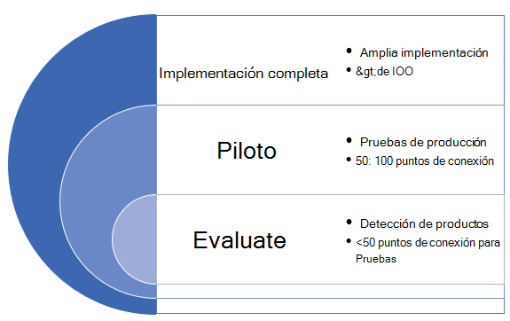
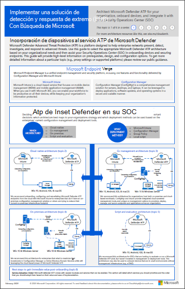

# Implementar Microsoft Defender para endpoint en anillos

[!INCLUDE [Microsoft 365 Defender rebranding](../../includes/microsoft-defender.md)]

**Se aplica a:**
- [Microsoft Defender para punto de conexión](https://go.microsoft.com/fwlink/p/?linkid=2154037)
- [Microsoft 365 Defender](https://go.microsoft.com/fwlink/?linkid=2118804)

>¿Desea experimentar Defender for Endpoint? [Regístrate para obtener una versión de prueba gratuita.](https://www.microsoft.com/microsoft-365/windows/microsoft-defender-atp?ocid=docs-wdatp-assignaccess-abovefoldlink)

La implementación de Microsoft Defender para endpoint se puede realizar mediante un enfoque de implementación basado en anillos. 

Los anillos de implementación se pueden aplicar en los siguientes escenarios:
- [Nuevas implementaciones](#new-deployments)
- [Implementaciones existentes](#existing-deployments)

## Nuevas implementaciones

Un enfoque basado en anillos es un método para identificar un conjunto de puntos de conexión a incorporar y comprobar que se cumplen ciertos criterios antes de continuar con la implementación del servicio en un conjunto de dispositivos más grande. Puede definir los criterios de salida de cada anillo y asegurarse de que se cumplen antes de pasar al siguiente anillo.

La adopción de una implementación basada en anillos ayuda a reducir los posibles problemas que podrían surgir al implementar el servicio. Al pilotar un determinado número de dispositivos en primer lugar, puedes identificar posibles problemas y mitigar los posibles riesgos que puedan surgir. 

La tabla 1 proporciona un ejemplo de los anillos de implementación que puede usar. 

**Tabla 1**

|**Anillo de implementación**|**Descripción**|
|:-----|:-----|
Evaluate | Anillo 1: Identificar 50 sistemas para pruebas piloto 
Piloto | Anillo 2: Identificar los siguientes 50-100 puntos de conexión en el entorno de producción    
Implementación completa | Anillo 3: Implementación del servicio en el resto del entorno en incrementos más grandes

### Criterios de salida
Un conjunto de ejemplos de criterios de salida para estos anillos puede incluir:
- Los dispositivos se muestran en la lista de inventario de dispositivos
- Las alertas aparecen en el panel
- [Ejecutar una prueba de detección](run-detection-test.md)
- [Ejecutar un ataque simulado en un dispositivo](attack-simulations.md)

### Evaluate
Identifique un pequeño número de máquinas de prueba en su entorno para incorporarse al servicio. Lo ideal es que estas máquinas sean menos de 50 puntos de conexión. 

### Piloto
Microsoft Defender para endpoint admite una variedad de puntos de conexión que puede incorporar al servicio. En este anillo, identifique varios dispositivos que se incorporarán y en función de los criterios de salida que defina, decida continuar con el siguiente anillo de implementación.

En la tabla siguiente se muestran los puntos de conexión compatibles y la herramienta correspondiente que puede usar para incorporar dispositivos al servicio. 

| Extremo     | Herramienta de implementación                       |
|--------------|------------------------------------------|
| **Windows**  |  [Script local (hasta 10 dispositivos)](configure-endpoints-script.md)   NOTA: Si desea implementar más de 10 dispositivos en un entorno de producción, use el método de directiva de grupo en su lugar o las otras herramientas compatibles que se enumeran a continuación.   [Directiva de grupo](configure-endpoints-gp.md)    [Microsoft Endpoint Manager/Mobile Device Manager](configure-endpoints-mdm.md)     [Microsoft Endpoint Configuration Manager](configure-endpoints-sccm.md)   [Scripts VDI](configure-endpoints-vdi.md)   |
| **macOS**    | [Script local](mac-install-manually.md)   [Microsoft Endpoint Manager](mac-install-with-intune.md)   [JAMF Pro](mac-install-with-jamf.md)   [Administración de dispositivos móviles](mac-install-with-other-mdm.md) |
| **Servidor Linux** | [Script local](linux-install-manually.md)   [Puppet](linux-install-with-puppet.md)   [Ansible](linux-install-with-ansible.md)|
| **iOS**      | [Basado en aplicaciones](ios-install.md)                                |
| **Android**  | [Microsoft Endpoint Manager](android-intune.md)               | 

### Implementación completa
En esta fase, puede usar el material de planeación [de implementación](deployment-strategy.md) para ayudarle a planear la implementación. 

Use el siguiente material para seleccionar la arquitectura de Microsoft Defender para endpoint adecuada que mejor se adapte a su organización.

|**Item**|**Descripción**|
|:-----|:-----|
|  [PDF](https://github.com/MicrosoftDocs/microsoft-365-docs/raw/public/microsoft-365/security/defender-endpoint/downloads/mdatp-deployment-strategy.pdf)  \| [Visio](https://github.com/MicrosoftDocs/microsoft-365-docs/raw/public/microsoft-365/security/defender-endpoint/downloads/mdatp-deployment-strategy.vsdx) | El material arquitectónico le ayuda a planear la implementación de las arquitecturas siguientes: <ul><li> Nativo en la nube </li><li> Administración conjunta </li><li> Local</li><li>Evaluación e incorporación local</li>

## Implementaciones existentes

### Puntos de conexión de Windows
Para Windows y/o Windows Servers, seleccionas varias máquinas para probar con antelación (antes de la revisión del martes) mediante el programa de validación de actualizaciones de seguridad **(SUVP).**

Para obtener más información, vea:
- [¿Qué es el programa de validación de actualización de seguridad?](https://techcommunity.microsoft.com/t5/windows-it-pro-blog/what-is-the-security-update-validation-program/ba-p/275767)
- [Software Update Validation Program and Centro de protección contra malware de Microsoft Establishment - TwC Interactive Timeline Part 4](https://www.microsoft.com/security/blog/2012/03/28/software-update-validation-program-and-microsoft-malware-protection-center-establishment-twc-interactive-timeline-part-4/)

### Puntos de conexión que no son de Windows
Con macOS y Linux, puede tomar un par de sistemas y ejecutarse en el canal "InsidersFast".

>[!NOTE]
>Lo ideal es que al menos un administrador de seguridad y un desarrollador puedan encontrar problemas de compatibilidad, rendimiento y confiabilidad antes de que la compilación lo haga en el canal "Producción".

La elección del canal determina el tipo y la frecuencia de las actualizaciones que se ofrecen al dispositivo. Los dispositivos de insiders-fast son los primeros en recibir actualizaciones y nuevas características, seguidos más adelante por insiders-slow y, por último, por prod.

Para obtener una vista previa de las nuevas características y proporcionar comentarios anticipados, se recomienda configurar algunos dispositivos de la empresa para que usen insiders-fast o insiders-slow.

>[!WARNING]
>Cambiar el canal después de la instalación inicial requiere que se vuelva a instalar el producto. Para cambiar el canal de producto: desinstale el paquete existente, vuelva a configurar el dispositivo para que use el nuevo canal y siga los pasos descritos en este documento para instalar el paquete desde la nueva ubicación.
