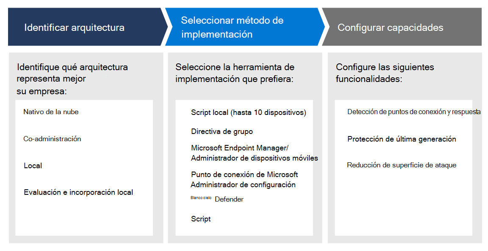

# Planear la implementación de Microsoft Defender para puntos de conexión 

[!INCLUDE [Microsoft 365 Defender rebranding](../../includes/microsoft-defender.md)]

**Se aplica a:**
- [Microsoft Defender para punto de conexión](https://go.microsoft.com/fwlink/p/?linkid=2154037)
- [Microsoft 365 Defender](https://go.microsoft.com/fwlink/?linkid=2118804)

>¿Desea experimentar Defender for Endpoint? [Regístrate para obtener una versión de prueba gratuita.](https://www.microsoft.com/microsoft-365/windows/microsoft-defender-atp?ocid=docs-wdatp-secopsdashboard-abovefoldlink) 

Planee la implementación de Microsoft Defender para puntos de conexión para que pueda maximizar las capacidades de seguridad dentro del conjunto de aplicaciones y proteger mejor su empresa de las amenazas cibernéticas.

Esta solución proporciona instrucciones sobre cómo identificar la arquitectura del entorno, seleccionar el tipo de herramienta de implementación que mejor se adapte a sus necesidades y instrucciones sobre cómo configurar las capacidades.

## Paso 1: Identificar arquitectura
Entendemos que cada entorno de empresa es único, por lo que hemos proporcionado varias opciones para darle la flexibilidad necesaria para elegir cómo implementar el servicio.

Dependiendo de su entorno, algunas herramientas son más adecuadas para determinadas arquitecturas. 

Use el siguiente material para seleccionar la arquitectura de Defender for Endpoint adecuada que mejor se adapte a su organización.

| Elemento | Descripción |
|:-----|:-----|
|  [PDF](https://github.com/MicrosoftDocs/microsoft-365-docs/raw/public/microsoft-365/security/defender-endpoint/downloads/mdatp-deployment-strategy.pdf)  \| [Visio](https://github.com/MicrosoftDocs/microsoft-365-docs/raw/public/microsoft-365/security/defender-endpoint/downloads/mdatp-deployment-strategy.vsdx) | El material arquitectónico le ayuda a planear la implementación de las arquitecturas siguientes: <ul><li> Nativo en la nube </li><li> Administración conjunta </li><li> Local</li><li>Evaluación e incorporación local</li>

## Paso 2: Seleccionar método de implementación
Defender for Endpoint admite una variedad de puntos de conexión que puede incorporar al servicio. 

En la tabla siguiente se enumeran los puntos de conexión admitidos y la herramienta de implementación correspondiente que puede usar para poder planear la implementación adecuadamente.

| Extremo     | Herramienta de implementación                       |
|--------------|------------------------------------------|
| **Windows**  |  [Script local (hasta 10 dispositivos)](configure-endpoints-script.md)    [Directiva de grupo](configure-endpoints-gp.md)    [Microsoft Endpoint Manager/ Administrador de dispositivos móviles](configure-endpoints-mdm.md)     [Microsoft Endpoint Configuration Manager](configure-endpoints-sccm.md)   [Scripts VDI](configure-endpoints-vdi.md)   |
| **macOS**    | [Script local](mac-install-manually.md)   [Microsoft Endpoint Manager](mac-install-with-intune.md)   [Jamf Pro](mac-install-with-jamf.md)   [Administración de dispositivos móviles](mac-install-with-other-mdm.md) |
| **Servidor Linux** | [Script local](linux-install-manually.md)   [Puppet](linux-install-with-puppet.md)   [Ansible](linux-install-with-ansible.md)|
| **iOS**      | [Basado en aplicaciones](ios-install.md)                                |
| **Android**  | [Microsoft Endpoint Manager](android-intune.md)               | 

## Paso 3: Configurar capacidades
Después de incorporar puntos de conexión, configure las capacidades de seguridad en Defender para endpoint para que pueda maximizar la sólida protección de seguridad disponible en el conjunto de servidores. Las funcionalidades incluyen:

- EDR
- Protección de última generación
- Reducción de la superficie expuesta a ataques

  
## Temas relacionados
- [Fases de implementación](deployment-phases.md)
