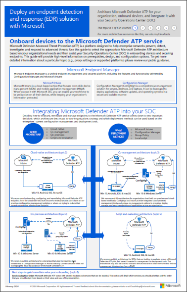

# Planear la implementación de Microsoft Defender para puntos de conexiónPlan your Microsoft Defender for Endpoint deployment 

[!INCLUDE [Microsoft 365 Defender rebranding](../../includes/microsoft-defender.md)]

**Se aplica a:****Applies to:**
- [Microsoft Defender para punto de conexiónMicrosoft Defender for Endpoint](https://go.microsoft.com/fwlink/p/?linkid=2154037)
- [Microsoft 365 DefenderMicrosoft 365 Defender](https://go.microsoft.com/fwlink/?linkid=2118804)

>¿Desea experimentar Defender for Endpoint?Want to experience Defender for Endpoint? [Regístrate para obtener una versión de prueba gratuita.Sign up for a free trial.](https://www.microsoft.com/microsoft-365/windows/microsoft-defender-atp?ocid=docs-wdatp-secopsdashboard-abovefoldlink) 

Planee la implementación de Microsoft Defender para puntos de conexión para que pueda maximizar las capacidades de seguridad dentro del conjunto de aplicaciones y proteger mejor su empresa de las amenazas cibernéticas.Plan your Microsoft Defender for Endpoint deployment so that you can maximize the security capabilities within the suite and better protect your enterprise from cyber threats.

Esta solución proporciona instrucciones sobre cómo identificar la arquitectura del entorno, seleccionar el tipo de herramienta de implementación que mejor se adapte a sus necesidades y instrucciones sobre cómo configurar las capacidades.This solution provides guidance on how to identify your environment architecture, select the type of deployment tool that best fits your needs, and guidance on how to configure capabilities.

## Paso 1: Identificar arquitecturaStep 1: Identify architecture
Entendemos que cada entorno de empresa es único, por lo que hemos proporcionado varias opciones para darle la flexibilidad necesaria para elegir cómo implementar el servicio.We understand that every enterprise environment is unique, so we've provided several options to give you the flexibility in choosing how to deploy the service.

Dependiendo de su entorno, algunas herramientas son más adecuadas para determinadas arquitecturas.Depending on your environment, some tools are better suited for certain architectures. 

Use el siguiente material para seleccionar la arquitectura de Defender for Endpoint adecuada que mejor se adapte a su organización.Use the following material to select the appropriate Defender for Endpoint architecture that best suites your organization.

| ElementoItem | DescripciónDescription |
|:-----|:-----|
|  [PDF](https://github.com/MicrosoftDocs/microsoft-365-docs/raw/public/microsoft-365/security/defender-endpoint/downloads/mdatp-deployment-strategy.pdf)  \| [Visio](https://github.com/MicrosoftDocs/microsoft-365-docs/raw/public/microsoft-365/security/defender-endpoint/downloads/mdatp-deployment-strategy.vsdx)[PDF](https://github.com/MicrosoftDocs/microsoft-365-docs/raw/public/microsoft-365/security/defender-endpoint/downloads/mdatp-deployment-strategy.pdf)  \| [Visio](https://github.com/MicrosoftDocs/microsoft-365-docs/raw/public/microsoft-365/security/defender-endpoint/downloads/mdatp-deployment-strategy.vsdx) | El material arquitectónico le ayuda a planear la implementación de las arquitecturas siguientes:The architectural material helps you plan your deployment for the following architectures: <ul><li> Nativo en la nubeCloud-native </li><li> Administración conjuntaCo-management </li><li> LocalOn-premise</li><li>Evaluación e incorporación localEvaluation and local onboarding</li>

## Paso 2: Seleccionar método de implementaciónStep 2: Select deployment method
Defender for Endpoint admite una variedad de puntos de conexión que puede incorporar al servicio.Defender for Endpoint supports a variety of endpoints that you can onboard to the service. 

En la tabla siguiente se enumeran los puntos de conexión admitidos y la herramienta de implementación correspondiente que puede usar para poder planear la implementación adecuadamente.The following table lists the supported endpoints and the corresponding deployment tool that you can use so that you can plan the deployment appropriately.

| ExtremoEndpoint     | Herramienta de implementaciónDeployment tool                       |
|--------------|------------------------------------------|
| **Windows****Windows**  |  [Script local (hasta 10 dispositivos)Local script (up to 10 devices)](configure-endpoints-script.md)    [Directiva de grupoGroup Policy](configure-endpoints-gp.md)    [Microsoft Endpoint Manager/ Administrador de dispositivos móvilesMicrosoft Endpoint Manager/ Mobile Device Manager](configure-endpoints-mdm.md)     [Microsoft Endpoint Configuration ManagerMicrosoft Endpoint Configuration Manager](configure-endpoints-sccm.md)   [Scripts VDIVDI scripts](configure-endpoints-vdi.md)   |
| **macOS****macOS**    | [Script localLocal script](mac-install-manually.md)   [Microsoft Endpoint ManagerMicrosoft Endpoint Manager](mac-install-with-intune.md)   [Jamf ProJAMF Pro](mac-install-with-jamf.md)   [Administración de dispositivos móvilesMobile Device Management](mac-install-with-other-mdm.md) |
| **Servidor Linux****Linux Server** | [Script localLocal script](linux-install-manually.md)   [PuppetPuppet](linux-install-with-puppet.md)   [AnsibleAnsible](linux-install-with-ansible.md)|
| **iOS****iOS**      | [Basado en aplicacionesApp-based](ios-install.md)                                |
| **Android****Android**  | [Microsoft Endpoint ManagerMicrosoft Endpoint Manager](android-intune.md)               | 

## Paso 3: Configurar capacidadesStep 3: Configure capabilities
Después de incorporar puntos de conexión, configure las capacidades de seguridad en Defender para endpoint para que pueda maximizar la sólida protección de seguridad disponible en el conjunto de servidores.After onboarding endpoints, configure the security capabilities in Defender for Endpoint so that you can maximize the robust security protection available in the suite. Las funcionalidades incluyen:Capabilities include:

- EDREndpoint detection and response
- Protección de última generaciónNext-generation protection
- Reducción de la superficie expuesta a ataquesAttack surface reduction

  
## Temas relacionadosRelated topics
- [Fases de implementaciónDeployment phases](deployment-phases.md)
