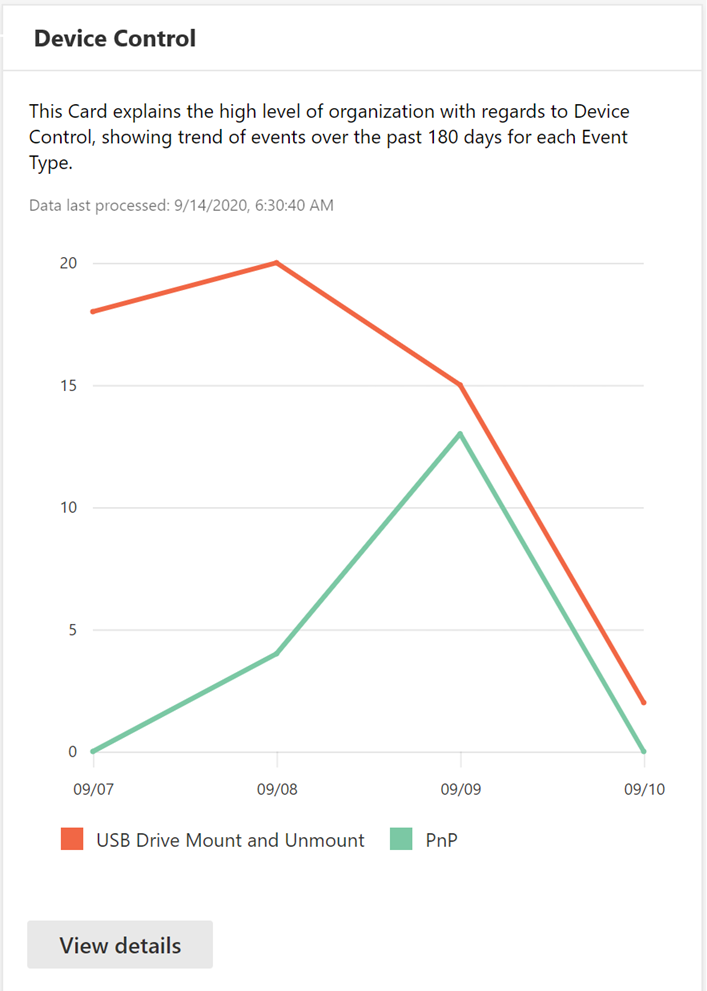
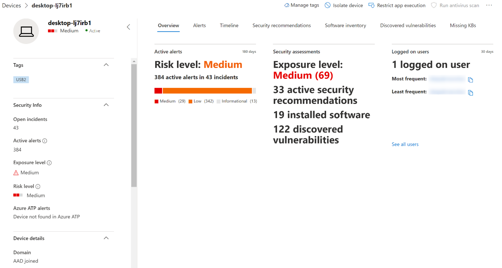

# Proteger los datos de la organización con el control de dispositivos

**Se aplica a:** [Microsoft Defender para endpoint](https://go.microsoft.com/fwlink/p/?linkid=2069559)

El control de dispositivos de Microsoft Defender para endpoints protege contra la pérdida de datos mediante la supervisión y el control del uso de medios por parte de los dispositivos de la organización, como el uso de dispositivos de almacenamiento extraíbles y unidades USB.

Con el informe de control de dispositivos, puedes ver eventos relacionados con el uso de medios, como:

- **Eventos de auditoría:** Muestra el número de eventos de auditoría que se producen cuando se conectan medios externos.
- **Eventos de directiva:** Muestra el número de eventos de directiva que se producen cuando se desencadena una directiva de control de dispositivos.

> [!NOTE]
> El evento de auditoría para realizar un seguimiento del uso de medios está habilitado de forma predeterminada para los dispositivos incorporados a Microsoft Defender para endpoint.

## Descripción de los eventos de auditoría

Los eventos de auditoría incluyen:

- **Montaje y desmontaje de la unidad USB:** Audite los eventos que se generan cuando se monta o desmonta una unidad USB.
- **PnP:** Los eventos de auditoría plug and play se generan cuando se conecta un almacenamiento extraíble, una impresora o Bluetooth multimedia.

## Supervisar la seguridad del control de dispositivos

El control de dispositivos en Microsoft Defender para endpoint habilita a los administradores de seguridad con herramientas que les permiten realizar un seguimiento de la seguridad del control de dispositivos de su organización a través de informes. Para encontrar el informe de control de dispositivos en el Centro de seguridad de Microsoft 365, vaya a **Informes > protección de dispositivos**.

La tarjeta de protección de dispositivos del panel **Informes** muestra el número de eventos de auditoría generados por tipo de medio en los últimos 180 días.

> [!div class="mx-imgBorder"]
> 

El **botón Ver detalles** muestra más datos de uso multimedia en la página del informe de control **de** dispositivos.

La página proporciona un panel con un número agregado de eventos por tipo y una lista de eventos. Los administradores pueden filtrar por intervalo de tiempo, nombre de clase multimedia e identificador de dispositivo.

> [!div class="mx-imgBorder"]
> 

Al seleccionar un evento, aparece un flyout que muestra más información:

- **Detalles generales:** Fecha, modo acción y directiva de este evento.
- **Información multimedia:** La información multimedia incluye Nombre de medios, Nombre de clase, GUID de clase, Id. de dispositivo, Id. de proveedor, Volumen, Número de serie y Tipo de bus.
- **Detalles de ubicación:** Nombre del dispositivo e id. de dispositivo MDATP.

> [!div class="mx-imgBorder"]
> 

Para ver la actividad en tiempo real de este medio en toda la organización, seleccione el **botón Abrir búsqueda** avanzada. Esto incluye una consulta incrustada y predefinida.

> [!div class="mx-imgBorder"]
> 

Para ver la seguridad del dispositivo, selecciona el botón **Abrir página del** dispositivo en el control desplegable. Este botón abre la página de entidad del dispositivo.

> [!div class="mx-imgBorder"]
> 

## Retrasos en la presentación de informes

El informe de control de dispositivos puede tener un retraso de 12 horas desde el momento en que se produce una conexión multimedia hasta el momento en que el evento se refleja en la tarjeta o en la lista de dominios.
