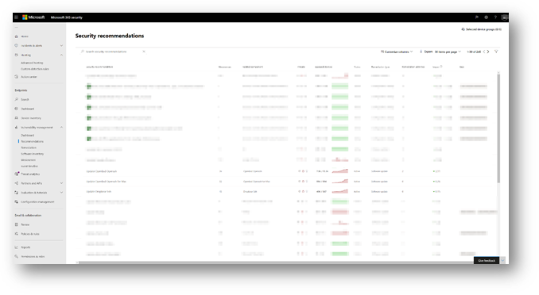

# <a name="device-discovery-overview"></a>Información general de la detección de dispositivo

[!INCLUDE [Microsoft 365 Defender rebranding](../../includes/microsoft-defender.md)]

**Se aplica a:**
- [Microsoft Defender para punto de conexión](https://go.microsoft.com/fwlink/p/?linkid=2146631)
- [Microsoft 365 Defender](https://go.microsoft.com/fwlink/?linkid=2118804)

[!include[Prerelease information](../../includes/prerelease.md)]

Proteger el entorno requiere realizar un inventario de los dispositivos que están en la red. Sin embargo, la asignación de dispositivos en una red a menudo puede ser costosa, desafiante y consume mucho tiempo. 

Microsoft Defender para endpoint proporciona una funcionalidad de detección de dispositivos que te ayuda a encontrar dispositivos no administrados conectados a la red corporativa sin necesidad de dispositivos adicionales o cambios engorrosos en el proceso.


La funcionalidad de detección de dispositivos te permite:

- **Detectar puntos de conexión empresariales conectados a la red corporativa** <br>
Con las opciones de detección básicas o estándar, puede detectar estaciones de trabajo, servidores y puntos de conexión móviles que aún no están incorporados a Microsoft Defender para endpoint.  

- **Extremos detectados incorporados**<br>
Los puntos de conexión no administrados de la red introducen vulnerabilidades y riesgos en la red. Incorporarlos al servicio puede aumentar la visibilidad de seguridad en ellos. 

Junto con esta funcionalidad, una nueva recomendación de seguridad para incorporar dispositivos a Microsoft Defender para endpoint estará disponible como parte de la experiencia existente de administración de amenazas y vulnerabilidades.


## <a name="discovery-methods"></a>Métodos de detección
Hay dos modos de detección: 

-   Detección básica 
-   Detección estándar (recomendado) 


> [!IMPORTANT]
> La detección se establece en modo básico. Puede elegir conservar esta configuración a través de la página de configuración. La detección estándar será el modo predeterminado para todos los clientes a partir del 19 de julio de 2021, a menos que se modifique a través de la página de configuración antes de esta fecha.

### <a name="basic-discovery"></a>Detección básica 

En este modo, los puntos de conexión recopilarán pasivamente eventos en la red y extraerán información del dispositivo de ellos. La detección básica usa el SenseNDR.exe binario para la recopilación de datos de red pasiva y no se iniciará tráfico de red. Los puntos de conexión simplemente extraerán datos de cada tráfico de red que ve un dispositivo incorporado. 

### <a name="standard-discovery"></a>Detección estándar 

Este modo permite a los puntos de conexión sondear activamente los dispositivos observados en la red para enriquecer los datos recopilados, lo que le ayuda a crear un inventario de dispositivos confiable y coherente. El modo estándar usa sondeos inteligentes y activos para descubrir aún más información sobre los dispositivos observados para enriquecer la información del dispositivo existente.  

Cuando el modo estándar está habilitado, las herramientas de supervisión de red de la organización pueden observar una actividad de red mínima y insignificante generada por el sensor de detección.  

 Si decide no habilitar este modo, solo obtendrá una visibilidad limitada de los puntos de conexión no administrados en la red.

La detección estándar usa varios scripts de PowerShell para sondear activamente los dispositivos de la red. Esos scripts de PowerShell están firmados por Microsoft y se ejecutan desde la siguiente ubicación: `C:\ProgramData\Microsoft\Windows Defender Advanced Threat Protection\Downloads\*.ps` . Por ejemplo, `C:\ProgramData\Microsoft\Windows Defender Advanced Threat Protection\Downloads\UnicastScannerV1.1.0.ps1`.

Puedes cambiar y personalizar la configuración de detección, para obtener más información, consulta [Configurar la detección de dispositivos.](configure-device-discovery.md)

> [!NOTE]
> El motor de detección distingue entre los eventos de red que se reciben en la red corporativa frente a fuera de la red corporativa. Los dispositivos que no están conectados a redes corporativas no se detectarán ni se mostrarán en el inventario de dispositivos. 


## <a name="device-inventory"></a>Inventario de dispositivos 
Los dispositivos que se han detectado pero aún no se han incorporado y protegidos por Microsoft Defender para endpoint aparecerán en el Inventario de dispositivos en la pestaña Puntos de conexión. Ahora puedes usar un nuevo filtro en la lista de inventario de dispositivos denominada Estado de incorporación que puede tener cualquiera de los siguientes valores:

- Incorporado: el punto de conexión se incorpora a Microsoft Defender para endpoint.
- Se puede incorporar: el punto de conexión se descubrió en la red y el sistema operativo se identificó como uno compatible con Microsoft Defender para endpoint, pero no está incorporado actualmente. Recomendamos encarecidamente la incorporación de estos dispositivos.
- No compatible: el punto de conexión se ha detectado en la red, pero Microsoft Defender no admite endpoint.
- Información insuficiente: el sistema no pudo determinar la compatibilidad del dispositivo. Habilitar la detección estándar en más dispositivos de la red puede enriquecer los atributos detectados. 
 


> [!TIP]
> Siempre puedes aplicar filtros para excluir dispositivos no administrados de la lista de inventario de dispositivos. También puede usar la columna de estado de incorporación en las consultas API para filtrar los dispositivos no administrados. 

## <a name="vulnerability-assessment-on-discovered-devices"></a>Evaluación de vulnerabilidad en dispositivos detectados
Las vulnerabilidades y riesgos en los dispositivos, así como otros dispositivos no administrados detectados en la red, forman parte de los flujos actuales de TVM en "Security Recomendaciones" y se representan en páginas de entidad en todo el portal. Busque recomendaciones de seguridad relacionadas con "SSH" para buscar vulnerabilidades SSH relacionadas con dispositivos administrados y no administrados. 

  

## <a name="use-advanced-hunting-on-discovered-devices"></a>Usar la búsqueda avanzada en dispositivos detectados
Puedes usar consultas de búsqueda avanzada para obtener visibilidad en dispositivos detectados.
Encuentre detalles sobre los puntos de conexión detectados en la tabla DeviceInfo o información relacionada con la red sobre esos dispositivos en la tabla DeviceNetworkInfo.
  


La detección de dispositivos aprovecha los dispositivos integrados de Microsoft Defender para endpoint como origen de datos de red para atribuir actividades a dispositivos no incorporados. Esto significa que si un dispositivo integrado de Microsoft Defender para endpoint se comunica con un dispositivo no incorporado, las actividades del dispositivo no incorporado se pueden ver en la escala de tiempo y a través de la tabla DeviceNetworkEvents de búsqueda avanzada. 


Los nuevos eventos están basados en conexiones del Protocolo de control de transmisión (TCP) y se ajustarán al esquema DeviceNetworkEvents actual. Entrada tcp al dispositivo habilitado para Microsoft Defender para endpoint desde un dispositivo que no es de Microsoft Defender para endpoint habilitado.  

También se han agregado los siguientes tipos de acción:  

- ConnectionAttempt: un intento de establecer una conexión TCP (syn)  
- ConnectionAcknowledged: confirmación de que se aceptó una conexión TCP (syn\ack)  

Puede probar esta consulta de ejemplo:  

```
DeviceNetworkEvents  
| where ActionType == "ConnectionAcknowledged" or ActionType == "ConnectionAttempt"  
| take 10  
```


## <a name="changed-behavior"></a>Comportamiento cambiado
En la siguiente sección se enumeran los cambios que observará en Microsoft Defender para endpoint y/o Microsoft 365 Security Center cuando esta funcionalidad esté habilitada. 
 
1.  Se espera que los dispositivos que no están incorporados a Microsoft Defender a Endpoint aparezcan en el inventario de dispositivos, la búsqueda avanzada y las consultas api. Esto puede aumentar significativamente el tamaño de los resultados de la consulta. 
    1. Las tablas "DeviceInfo" y "DeviceNetworkInfo" en la búsqueda avanzada ahora mantendrán el dispositivo detectado. Puedes filtrar esos dispositivos mediante el atributo "OnboardingStatus".

    2. Se espera que los dispositivos detectados aparezcan en los resultados de consulta de la API de streaming. Puede filtrar esos dispositivos mediante el `OnboardingStatus` filtro de la consulta. 

2.  Los dispositivos no administrados se asignarán a grupos de dispositivos existentes según los criterios definidos. 
3.  En raras ocasiones, la detección estándar puede desencadenar alertas en monitores de red o herramientas de seguridad. Proporcione comentarios, si experimenta este tipo de eventos, para evitar que estos problemas se repitan. Puede excluir explícitamente destinos específicos o subredes enteras de ser sondeados activamente por la detección estándar. 


## <a name="next-steps"></a>Pasos siguientes
- [Configuración de la detección de dispositivo](configure-device-discovery.md)
- [Preguntas frecuentes sobre detección de dispositivos](device-discovery-faq.md)
