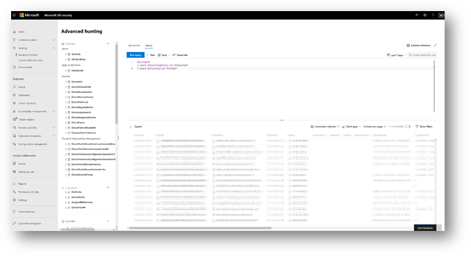

# <a name="device-discovery-overview"></a>Información general de la detección de dispositivo

[!INCLUDE [Microsoft 365 Defender rebranding](../../includes/microsoft-defender.md)]

**Se aplica a:**
- [Microsoft Defender para punto de conexión Plan 2](https://go.microsoft.com/fwlink/p/?linkid=2154037)
- [Microsoft 365 Defender](https://go.microsoft.com/fwlink/?linkid=2118804)

Proteger el entorno requiere realizar un inventario de los dispositivos que están en la red. Sin embargo, la asignación de dispositivos en una red a menudo puede ser costosa, desafiante y consume mucho tiempo.

Microsoft Defender para endpoint proporciona una funcionalidad de detección de dispositivos que te ayuda a encontrar dispositivos no administrados conectados a la red corporativa sin necesidad de dispositivos adicionales o cambios engorrosos en el proceso. La detección de dispositivos usa puntos de conexión integrados en la red para recopilar, examinar o examinar la red para detectar dispositivos no administrados. La funcionalidad de detección de dispositivos te permite descubrir:

- Enterprise de conexión (estaciones de trabajo, servidores y dispositivos móviles) que aún no están incorporados a Microsoft Defender para endpoint
- Dispositivos de red como enrutadores y conmutadores
- Dispositivos ioT como impresoras y cámaras

Los dispositivos desconocidos y no administrados presentan riesgos significativos para la red, ya sea una impresora sin abrir, dispositivos de red con configuraciones de seguridad débiles o un servidor sin controles de seguridad. Una vez detectados los dispositivos, puede:

- Incorporar puntos de conexión no administrados al servicio, lo que aumenta la visibilidad de seguridad en ellos.
- Reduzca la superficie de ataque mediante la identificación y evaluación de vulnerabilidades y la detección de vacíos de configuración.

Vea este vídeo para obtener una introducción rápida de cómo se detección de dispositivos:

> [!VIDEO https://www.microsoft.com/en-us/videoplayer/embed/RWORdQ]

Junto con esta funcionalidad, una recomendación de seguridad para incorporar dispositivos a Microsoft Defender para Endpoint está disponible como parte de la experiencia existente de administración de amenazas y vulnerabilidades.

## <a name="discovery-methods"></a>Métodos de detección

Puedes elegir el modo de detección que usarán los dispositivos integrados. El modo controla el nivel de visibilidad que puede obtener para dispositivos no administrados en la red corporativa.

Hay dos modos de detección disponibles:

- **Detección básica:** en este modo, los puntos de conexión recopilarán pasivamente eventos en la red y extraerán información del dispositivo de ellos. La detección básica usa el SenseNDR.exe binario para la recopilación de datos de red pasiva y no se iniciará tráfico de red. Los puntos de conexión simplemente extraerán datos de cada tráfico de red que ve un dispositivo incorporado. Con la detección básica, solo obtendrá una visibilidad limitada de los puntos de conexión no administrados en la red.

- **Detección estándar** (recomendada): este modo permite a los puntos de conexión encontrar activamente dispositivos en la red para enriquecer los datos recopilados y descubrir más dispositivos, lo que te ayuda a crear un inventario de dispositivos confiable y coherente. Además de los dispositivos que se observaron mediante el método pasivo, el modo estándar también aprovecha los protocolos de detección comunes que usan consultas de multidifusión en la red para encontrar aún más dispositivos. El modo estándar usa sondeos inteligentes y activos para descubrir información adicional acerca de los dispositivos observados para enriquecer la información del dispositivo existente. Cuando el modo estándar está habilitado, las herramientas de supervisión de red de la organización pueden observar la actividad de red mínima y insignificante generada por el sensor de detección.

Puedes cambiar y personalizar la configuración de detección, para obtener más información, consulta [Configurar la detección de dispositivos.](configure-device-discovery.md)

> [!IMPORTANT]
> La detección estándar es el modo predeterminado para todos los clientes a partir del 19 de julio de 2021. Puede cambiar esta configuración a básica a través de la página de configuración. Si elige el modo básico, solo obtendrá una visibilidad limitada de los puntos de conexión no administrados en la red.

> [!NOTE]
> El motor de detección distingue entre los eventos de red que se reciben en la red corporativa frente a fuera de la red corporativa. Los dispositivos que no están conectados a redes corporativas no se detectarán ni se mostrarán en el inventario de dispositivos.

## <a name="device-inventory"></a>Inventario de dispositivos

Los dispositivos que se han detectado pero aún no se han incorporado y protegidos por Microsoft Defender para endpoint aparecerán en el Inventario de dispositivos en la pestaña Puntos de conexión.

Puedes usar un filtro en la lista de inventario de dispositivos denominada Estado de incorporación, que puede tener cualquiera de los siguientes valores:

- Incorporado: el punto de conexión se incorpora a Microsoft Defender para endpoint.
- Se puede incorporar: el punto de conexión se descubrió en la red y el sistema operativo se identificó como uno compatible con Microsoft Defender para endpoint, pero no está incorporado actualmente. Recomendamos encarecidamente la incorporación de estos dispositivos.
- No compatible: el punto de conexión se ha detectado en la red, pero Microsoft Defender no admite endpoint.
- Información insuficiente: el sistema no pudo determinar la compatibilidad del dispositivo. Habilitar la detección estándar en más dispositivos de la red puede enriquecer los atributos detectados.


> [!TIP]
> Siempre puedes aplicar filtros para excluir dispositivos no administrados de la lista de inventario de dispositivos. También puede usar la columna de estado de incorporación en las consultas API para filtrar los dispositivos no administrados.

## <a name="network-device-discovery"></a>Detección de dispositivos de red

El gran número de dispositivos de red no administrados implementados en una organización crea una gran superficie de ataque y representa un riesgo importante para toda la empresa. Las capacidades de detección de red de Microsoft Defender para endpoints le ayudan a garantizar que los dispositivos de red se detectan, clasifican con precisión y se agregan al inventario de activos.

Los dispositivos de red no se administran como extremos estándar, ya que Defender for Endpoint no tiene un sensor integrado en los propios dispositivos de red. Estos tipos de dispositivos requieren un enfoque sin agente donde un examen remoto obtendrá la información necesaria de los dispositivos. Para ello, se usará un dispositivo designado de Microsoft Defender para endpoint en cada segmento de red para realizar exámenes periódicos autenticados de dispositivos de red preconfigurados. Una vez descubierto, las capacidades de Defender for Endpoint Administración de amenazas y vulnerabilidades proporcionan flujos de trabajo integrados para proteger conmutadores detectados, enrutadores, controladores WLAN, firewalls y puertas de enlace VPN.

Para obtener más información, consulte [Dispositivos de red](network-devices.md).

## <a name="device-discovery-integrations"></a>Integraciones de detección de dispositivos

Para abordar el desafío de obtener la visibilidad suficiente para localizar, identificar y proteger el inventario completo de activos de OT/IOT, Microsoft Defender para endpoint ahora admite las siguientes integraciones:

- **Corelight:** Microsoft se ha asociado con Corelight para recibir datos de los dispositivos de red de Corelight. Esto proporciona Microsoft 365 Defender mayor visibilidad de las actividades de red de dispositivos no administrados, incluida la comunicación con otros dispositivos no administrados o redes externas. Para obtener más información, vea [Enable Corelight data integration](corelight-integration.md).

- **Microsoft Defender para IoT:** esta integración combina las capacidades de detección de dispositivos de Microsoft Defender para Endpoint, con las capacidades de supervisión sin agente de Microsoft Defender para IoT, para proteger los dispositivos IoT empresariales conectados a una red de TI (por ejemplo, Protocolo de voz sobre Internet (VoIP), impresoras y televisores inteligentes). Para obtener más información, vea [Enable Microsoft Defender for IoT integration](enable-microsoft-defender-for-iot-integration.md).

## <a name="vulnerability-assessment-on-discovered-devices"></a>Evaluación de vulnerabilidad en dispositivos detectados

Las vulnerabilidades y riesgos en los dispositivos, así como otros dispositivos no administrados detectados en la red, forman parte de los flujos actuales de TVM en "Security Recomendaciones" y se representan en páginas de entidad en todo el portal.
Busque recomendaciones de seguridad relacionadas con "SSH" para buscar vulnerabilidades SSH relacionadas con dispositivos administrados y no administrados.


## <a name="use-advanced-hunting-on-discovered-devices"></a>Usar la búsqueda avanzada en dispositivos detectados

Puedes usar consultas de búsqueda avanzada para obtener visibilidad en dispositivos detectados.
Encuentre detalles sobre los puntos de conexión detectados en la tabla DeviceInfo o información relacionada con la red sobre esos dispositivos en la tabla DeviceNetworkInfo.



La detección de dispositivos aprovecha los dispositivos integrados de Microsoft Defender para endpoint como origen de datos de red para atribuir actividades a dispositivos no incorporados. Esto significa que si un dispositivo integrado de Microsoft Defender para endpoint se comunica con un dispositivo no incorporado, las actividades del dispositivo no incorporado se pueden ver en la escala de tiempo y a través de la tabla DeviceNetworkEvents de búsqueda avanzada.

Los nuevos eventos están basados en conexiones del Protocolo de control de transmisión (TCP) y se ajustarán al esquema DeviceNetworkEvents actual. Entrada tcp al dispositivo habilitado para Microsoft Defender para endpoint desde un dispositivo que no es de Microsoft Defender para endpoint habilitado.

También se han agregado los siguientes tipos de acción:

- ConnectionAttempt: un intento de establecer una conexión TCP (syn)
- ConnectionAcknowledged: confirmación de que se aceptó una conexión TCP (syn\ack)

Puede probar esta consulta de ejemplo:

```text
DeviceNetworkEvents
| where ActionType == "ConnectionAcknowledged" or ActionType == "ConnectionAttempt"
| take 10
```

## <a name="changed-behavior"></a>Comportamiento cambiado

En la siguiente sección se enumeran los cambios que observará en Microsoft Defender para endpoint y <a href="https://go.microsoft.com/fwlink/p/?linkid=2077139" target="_blank">Microsoft 365 Defender portal cuando</a> esta funcionalidad esté habilitada.

1. Se espera que los dispositivos que no están incorporados a Microsoft Defender para endpoint aparezcan en el inventario de dispositivos, la búsqueda avanzada y las consultas api. Esto puede aumentar significativamente el tamaño de los resultados de la consulta.
    1. Las tablas "DeviceInfo" y "DeviceNetworkInfo" en la búsqueda avanzada ahora mantendrán el dispositivo detectado. Puedes filtrar esos dispositivos mediante el atributo "OnboardingStatus".
    2. Se espera que los dispositivos detectados aparezcan en los resultados de consulta de la API de streaming. Puede filtrar esos dispositivos mediante el `OnboardingStatus` filtro de la consulta.
2. Los dispositivos no administrados se asignarán a grupos de dispositivos existentes según los criterios definidos.
3. En raras ocasiones, la detección estándar puede desencadenar alertas en monitores de red o herramientas de seguridad. Proporcione comentarios, si experimenta este tipo de eventos, para evitar que estos problemas se repitan. Puede excluir explícitamente destinos específicos o subredes enteras de ser sondeados activamente por la detección estándar.

## <a name="next-steps"></a>Pasos siguientes

- [Configuración de la detección de dispositivo](configure-device-discovery.md)
- [Preguntas frecuentes sobre detección de dispositivos](device-discovery-faq.md)
