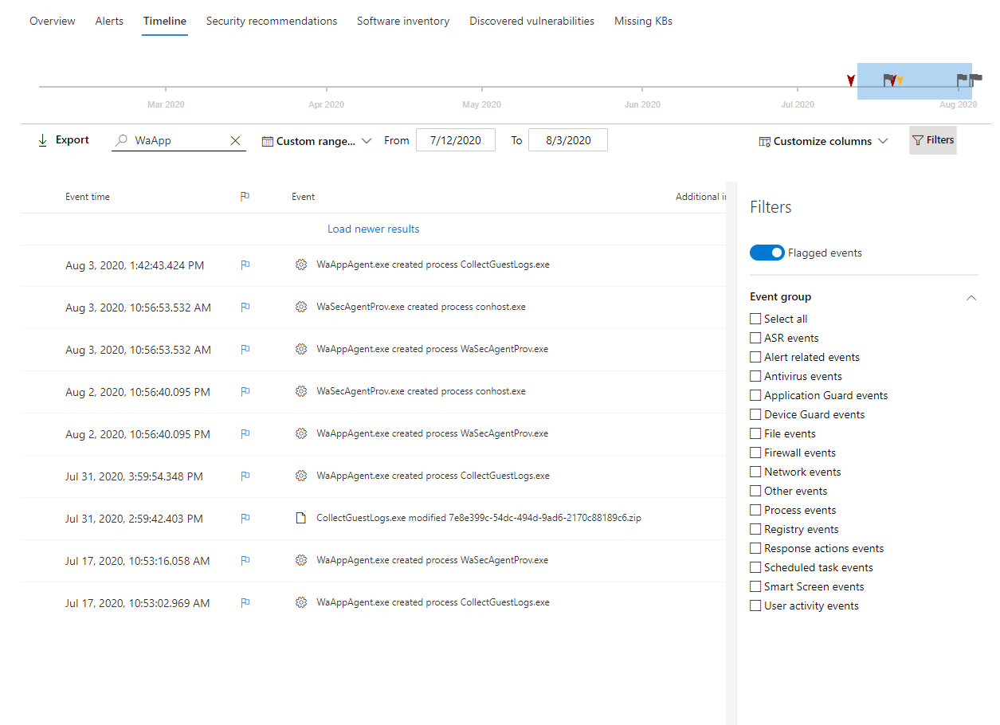

# Marcas de eventos de escala de tiempo de dispositivo de Microsoft Defender para punto de conexión

[!INCLUDE [Microsoft 365 Defender rebranding](../../includes/microsoft-defender.md)]

**Se aplica a:**
- [Microsoft Defender para punto de conexión](https://go.microsoft.com/fwlink/p/?linkid=2154037)
- [Microsoft 365 Defender](https://go.microsoft.com/fwlink/?linkid=2118804)

> ¿Desea experimentar Defender for Endpoint? [Regístrese para obtener una prueba gratuita.](https://signup.microsoft.com/create-account/signup?products=7f379fee-c4f9-4278-b0a1-e4c8c2fcdf7e&ru=https://aka.ms/MDEp2OpenTrial?ocid=docs-wdatp-assignaccess-abovefoldlink)

Las marcas de eventos en la escala de tiempo del dispositivo Defender para endpoint te ayudan a filtrar y organizar eventos específicos cuando se investigan posibles ataques.

La escala de tiempo del dispositivo Defender for Endpoint proporciona una vista cronológica de los eventos y las alertas asociadas observadas en un dispositivo. Esta lista de eventos proporciona visibilidad completa de los eventos, archivos y direcciones IP observados en el dispositivo. La lista a veces puede ser larga. Las marcas de eventos de escala de tiempo del dispositivo te ayudan a realizar un seguimiento de los eventos que podrían estar relacionados.

Después de pasar por una escala de tiempo del dispositivo, puedes ordenar, filtrar y exportar los eventos específicos marcados.

Al navegar por la escala de tiempo del dispositivo, puedes buscar y filtrar eventos específicos. Puede establecer las marcas de eventos mediante:

- Resaltar los eventos más importantes
- Marcar eventos que requieren profundizar
- Creación de una escala de tiempo de vulneración limpia

## Marcar un evento

1. Buscar el evento que desea marcar
2. Haga clic en el icono de marca de la columna Marca. 

2. Haga clic en el icono de marca de la columna Marca.

   

## Ver eventos marcados

1. En la sección **Filtros de** escala de tiempo, habilite **Eventos marcados**.
2. Haga clic en **Aplicar**. Solo se muestran los eventos marcados.
Puede aplicar filtros adicionales haciendo clic en la barra de horas. Solo se mostrarán los eventos anteriores al evento marcado.  

2. Haga clic en **Aplicar**. Solo se muestran los eventos marcados. Puede aplicar filtros adicionales haciendo clic en la barra de horas. Solo se mostrarán los eventos anteriores al evento marcado.

   
