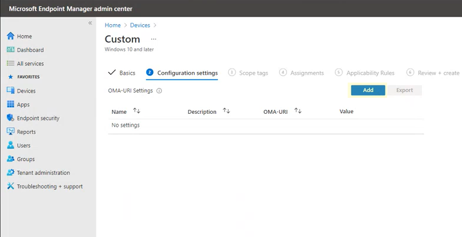
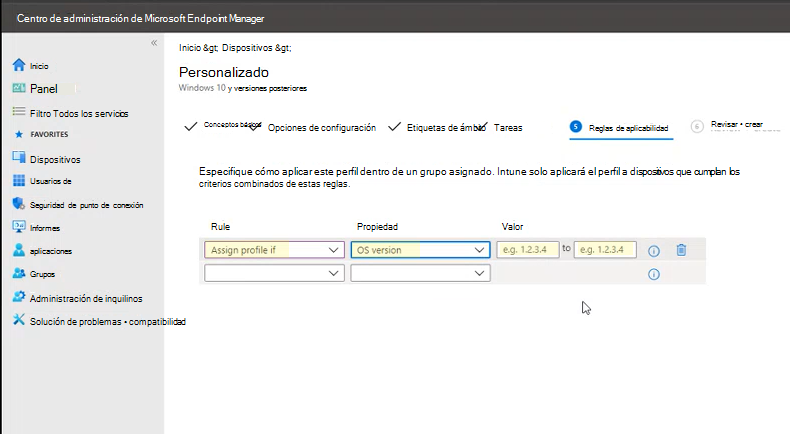

# <a name="enable-attack-surface-reduction-rules"></a>Habilitar las reglas de la reducción de superficie expuesta a ataques

**Se aplica a:**

- [Microsoft Defender para punto de conexión](https://go.microsoft.com/fwlink/p/?linkid=2154037)
- [Microsoft 365 Defender](https://go.microsoft.com/fwlink/?linkid=2118804)

> [!TIP]
> ¿Desea experimentar Defender for Endpoint? [Registrarse para obtener una versión de prueba gratuita](https://www.microsoft.com/microsoft-365/windows/microsoft-defender-atp?ocid=docs-wdatp-assignaccess-abovefoldlink).

[Las reglas de reducción de superficie de](attack-surface-reduction.md) ataque (reglas ASR) ayudan a evitar acciones que el malware suele abusar de dispositivos y redes.

## <a name="requirements"></a>Requisitos

Puedes establecer reglas de reducción de superficie de ataque para dispositivos que ejecutan cualquiera de las siguientes ediciones y versiones de Windows:

- Windows 10 Pro versión [1709](/windows/whats-new/whats-new-windows-10-version-1709) o posterior
- Windows 10 Enterprise, versión [1709](/windows/whats-new/whats-new-windows-10-version-1709) o posterior
- Windows Servidor, [versión 1803 (canal semianual)](/windows-server/get-started/whats-new-in-windows-server-1803) o posterior
- [Windows Server 2019](/windows-server/get-started-19/whats-new-19)

Aunque las reglas de reducción de superficie de ataque no requieren una licencia [Windows E5,](/windows/deployment/deploy-enterprise-licenses)si tienes Windows E5, obtienes capacidades de administración avanzadas. Estas funcionalidades disponibles solo en Windows E5 incluyen supervisión, análisis y flujos de trabajo disponibles en [Defender para](/microsoft-365/security/defender-endpoint/microsoft-defender-endpoint?view=o365-worldwide&preserve-view=true)endpoint, así como capacidades de informes y configuración en el centro de seguridad de [Microsoft 365.](/microsoft-365/security/defender/overview-security-center?view=o365-worldwide&preserve-view=true) Estas funcionalidades avanzadas no están disponibles con una licencia Windows Professional o Windows E3; sin embargo, si tienes esas licencias, puedes usar el Visor de eventos y los Antivirus de Microsoft Defender para revisar los eventos de la regla de reducción de superficie de ataque.

Cada regla ASR contiene una de cuatro opciones:

- **No configurado:** deshabilitar la regla ASR
- **Bloquear:** habilitar la regla ASR
- **Auditoría:** evaluar cómo la regla ASR afectaría a su organización si está habilitada
- **Advertencia:** habilite la regla ASR pero permita al usuario final omitir el bloque

> [!IMPORTANT]
> Actualmente, el modo de advertencia no es compatible con tres reglas ASR al configurar reglas ASR en Microsoft Endpoint Manager (MEM). Para obtener más información, vea [Casos en los que no se admite el modo de advertencia](attack-surface-reduction.md#cases-where-warn-mode-is-not-supported).

Es muy recomendable usar reglas ASR con una licencia E5 de Windows (o SKU de licencia similar) para aprovechar las capacidades avanzadas de supervisión e informes disponibles en [Microsoft Defender para](microsoft-defender-endpoint.md) endpoint (Defender para endpoint). Sin embargo, si tiene otra licencia, como Windows Professional o Windows E3 que no incluyen funciones avanzadas de supervisión e informes, puede desarrollar sus propias herramientas de supervisión e informes encima de los eventos que se generan en cada punto de conexión cuando se desencadenan reglas ASR (por ejemplo, reenvío de eventos).

> [!TIP]
> Para obtener más información sobre Windows licencias, consulte [Windows 10 Licensing y](https://www.microsoft.com/licensing/product-licensing/windows10?activetab=windows10-pivot:primaryr5) obtenga la Guía de licencias por volumen para [Windows 10](https://download.microsoft.com/download/2/D/1/2D14FE17-66C2-4D4C-AF73-E122930B60F6/Windows-10-Volume-Licensing-Guide.pdf).

Puedes habilitar las reglas de reducción de superficie de ataque mediante cualquiera de estos métodos:

- [Microsoft Intune](#intune)
- [Administración de dispositivos móviles (MDM)](#mdm)
- [Microsoft Endpoint Configuration Manager](#microsoft-endpoint-configuration-manager)
- [Directiva de grupo](#group-policy)
- [PowerShell](#powershell)

Enterprise de nivel de administración, como Intune o Microsoft Endpoint Manager se recomienda. Enterprise de nivel de usuario sobrescribirá cualquier configuración de PowerShell o directiva de grupo en conflicto al iniciarse.

## <a name="exclude-files-and-folders-from-asr-rules"></a>Excluir archivos y carpetas de reglas ASR

Puedes excluir archivos y carpetas de ser evaluados por la mayoría de las reglas de reducción de superficie de ataque. Esto significa que incluso si una regla ASR determina que el archivo o carpeta contiene un comportamiento malintencionado, no bloqueará la ejecución del archivo. Esto podría permitir que los archivos no seguros se ejecuten e infecten los dispositivos.

También puede excluir las reglas ASR para que no se desencadene en función de los hashes de certificado y archivo, ya que permite que defender especificado para los indicadores de certificado y archivo de extremo. (Vea [Administrar indicadores](manage-indicators.md).)

> [!IMPORTANT]
> Excluir archivos o carpetas puede reducir gravemente la protección proporcionada por las reglas ASR. Se permitirá la ejecución de archivos excluidos y no se registrará ningún informe o evento.
> Si las reglas ASR detectan archivos que cree que no deben detectarse, debe usar el modo de [auditoría primero para probar la regla](evaluate-attack-surface-reduction.md).

Puede especificar archivos o carpetas individuales (con rutas de carpeta o nombres de recursos completos), pero no puede especificar a qué reglas se aplican las exclusiones. Solo se aplica una exclusión cuando se inicia la aplicación o servicio excluidos. Por ejemplo, si agrega una exclusión para un servicio de actualización que ya se está ejecutando, el servicio de actualización seguirá desencadenando eventos hasta que el servicio se detenga y reinicie.

Las reglas ASR admiten variables de entorno y caracteres comodín. Para obtener información sobre el uso de caracteres comodín, vea Usar caracteres comodín en las listas de exclusión de extensión o ruta de acceso de carpeta y [nombre de archivo.](configure-extension-file-exclusions-microsoft-defender-antivirus.md#use-wildcards-in-the-file-name-and-folder-path-or-extension-exclusion-lists)

Los siguientes procedimientos para habilitar reglas ASR incluyen instrucciones sobre cómo excluir archivos y carpetas.

## <a name="intune"></a>Intune

1. Seleccione **Perfiles de configuración** de  >  **dispositivos**. Elija un perfil de protección de extremo existente o cree uno nuevo. Para crear uno nuevo, seleccione **Crear perfil** e introduzca información para este perfil. En **Tipo de perfil,** seleccione **Protección de extremo**. Si ha elegido un perfil existente, seleccione **Propiedades** y, a continuación, **seleccione Configuración**.

2. En el **panel Protección de** puntos de conexión, Windows Defender Protección contra **vulnerabilidades** de seguridad y, a continuación, **seleccione Reducción de superficie de ataque.** Seleccione la configuración deseada para cada regla ASR.

3. En **Excepciones de reducción de superficie de ataque,** escriba archivos y carpetas individuales. También puede seleccionar **Importar para** importar un archivo CSV que contenga archivos y carpetas que se excluirán de las reglas ASR. Cada línea del archivo CSV debe tener el siguiente formato:

   `C:\folder`, `%ProgramFiles%\folder\file`, `C:\path`

4. Seleccione **Aceptar en** los tres paneles de configuración. A **continuación,** seleccione Crear si está creando un nuevo archivo de protección de puntos de conexión o **Guardar** si está editando uno existente.

## <a name="mem"></a>MEM

Puede usar Microsoft Endpoint Manager (MEM) OMA-URI para configurar reglas ASR personalizadas. El siguiente procedimiento usa la regla Bloquear el uso indebido de controladores [firmados vulnerables](attack-surface-reduction.md#block-abuse-of-exploited-vulnerable-signed-drivers) explotados para el ejemplo.

1. Abra el centro Microsoft Endpoint Manager administración de Microsoft Endpoint Manager (MEM). En el **menú Inicio,** haga clic en **Dispositivos**, seleccione **Perfil de configuración** y, a continuación, haga clic en Crear **perfil.**

   > [!div class="mx-imgBorder"]
   > 

2. En **Crear un perfil**, en las dos listas desplegables siguientes, seleccione lo siguiente:

   - En **Plataforma,** **seleccione Windows 10 y versiones posteriores**
   - En **Tipo de perfil**, seleccione **Plantillas**

   Seleccione **Personalizado** y, a continuación, haga clic **en Crear**.

   > [!div class="mx-imgBorder"]
   > 

3. La herramienta Plantilla personalizada se abre en el paso **1 Conceptos básicos**. En **1 Conceptos básicos**, en **Nombre**, escriba un nombre para la plantilla y, en **Descripción,** puede escribir una descripción (opcional).

   > [!div class="mx-imgBorder"]
   > 

4. Haga clic en **Siguiente**. Paso **2 Se abren las opciones de** configuración. Para OMA-URI Configuración, haga clic en **Agregar**. Ahora aparecen dos opciones: **Agregar** y **Exportar**.

   > [!div class="mx-imgBorder"]
   > 

5. Haga clic **en Agregar** de nuevo. Se abre el Configuración agregar fila **OMA-URI.** En **Agregar fila**, haga lo siguiente:

   - En **Nombre**, escriba un nombre para la regla.
   - En **Descripción**, escriba una breve descripción.
   - En **OMA-URI,** escriba o pegue el vínculo OMA-URI específico de la regla que va a agregar.
   - En **Tipo de datos**, seleccione **Cadena**.
   - En **Value**, escriba o pegue el valor GUID, el signo y el valor State sin espacios \= (_GUID=StateValue_). Dónde: {0 : Disable (Disable the ASR rule)}, {1 : Block (Enable the ASR rule)}, {2 : Audit (Evaluate how the ASR rule would impact your organization if enabled)}, {6 : Warn (Enable the ASR rule but allow the end-user to bypass the block)}

   > [!div class="mx-imgBorder"]
   > 

6. Haga clic en **Guardar**. **Agregar cierres** de fila. En **Personalizado**, haga clic **en Siguiente**. En el paso **3 Etiquetas de ámbito,** las etiquetas de ámbito son opcionales. Realice una de las siguientes acciones:

   - Haga **clic en Seleccionar etiquetas de ámbito,** seleccione la etiqueta de ámbito (opcional) y, a continuación, haga clic en **Siguiente**.
   - O haga clic en **Siguiente**

7. En el **paso 4 Asignaciones**, en **Grupos** incluidos - para los grupos que desea que se aplique esta regla - seleccione una de las siguientes opciones:

   - **Agregar grupos**
   - **Agregar todos los usuarios**
   - **Agregar todos los dispositivos**

   > [!div class="mx-imgBorder"]
   > 

8. En **Grupos excluidos,** seleccione los grupos que desee excluir de esta regla y, a continuación, haga clic **en Siguiente**.

9. En el **paso 5 Reglas de aplicabilidad** para la siguiente configuración, haga lo siguiente:

   - En **Regla**, seleccione **Asignar perfil si**, o No asignar perfil **si**
   - En **Propiedad**, seleccione la propiedad a la que desea que se aplique esta regla
   - En **Valor**, escriba el valor o intervalo de valores aplicable

   > [!div class="mx-imgBorder"]
   > 

10. Haga clic en **Siguiente**. En el paso **6 Revisar + crear**, revise la configuración y la información que ha seleccionado y especificado y, a continuación, haga clic en **Crear**.

    > [!div class="mx-imgBorder"]
    > 

    > [!NOTE]
    > Las reglas están activas y están activas en cuestión de minutos.

>[!NOTE]
> Control de conflictos:
>
> Si asignas a un dispositivo dos directivas ASR diferentes, la forma en que se controla el conflicto son reglas a las que se asignan estados diferentes, no hay ninguna administración de conflictos en su lugar y el resultado es un error.
>
> Las reglas no conflictivas no producirán un error y la regla se aplicará correctamente. El resultado es que se aplica la primera regla y las siguientes reglas no conflictivas se combinan en la directiva.

## <a name="mdm"></a>MDM

Use el proveedor de servicios de configuración [./Vendor/MSFT/Policy/Config/Defender/AttackSurfaceReductionRules](/windows/client-management/mdm/policy-csp-defender#defender-attacksurfacereductionrules) (CSP) para habilitar y establecer individualmente el modo de cada regla.

A continuación se muestra un ejemplo de referencia mediante [valores GUID para reglas ASR.](attack-surface-reduction.md#attack-surface-reduction-rules)

`OMA-URI path: ./Vendor/MSFT/Policy/Config/Defender/AttackSurfaceReductionRules`

`Value: 75668C1F-73B5-4CF0-BB93-3ECF5CB7CC84=2|3B576869-A4EC-4529-8536-B80A7769E899=1|D4F940AB-401B-4EfC-AADC-AD5F3C50688A=2|D3E037E1-3EB8-44C8-A917-57927947596D=1|5BEB7EFE-FD9A-4556-801D-275E5FFC04CC=0|BE9BA2D9-53EA-4CDC-84E5-9B1EEEE46550=1`

Los valores para habilitar (Bloquear), deshabilitar, advertir o habilitar en modo auditoría son:

- 0 : Deshabilitar (deshabilitar la regla ASR)
- 1 : Bloquear (habilitar la regla ASR)
- 2: Auditoría (Evaluar cómo afectaría la regla ASR a su organización si está habilitada)
- 6 : Advertir (habilitar la regla ASR pero permitir que el usuario final omita el bloque). El modo de advertencia ya está disponible para la mayoría de las reglas ASR.

Use [el proveedor ./Vendor/MSFT/Policy/Config/Defender/AttackSurfaceReductionOnlyExclusions](/windows/client-management/mdm/policy-csp-defender#defender-attacksurfacereductiononlyexclusions) configuration service provider (CSP) para agregar exclusiones.

Ejemplo:

`OMA-URI path: ./Vendor/MSFT/Policy/Config/Defender/AttackSurfaceReductionOnlyExclusions`

`Value: c:\path|e:\path|c:\Exclusions.exe`

> [!NOTE]
> Asegúrese de escribir valores de OMA-URI sin espacios.

## <a name="microsoft-endpoint-configuration-manager"></a>Microsoft Endpoint Configuration Manager

1. En Microsoft Endpoint Configuration Manager, vaya a **Assets and Compliance**  >  **Endpoint Protection** Windows Defender Exploit  >  **Guard**.

2. Seleccione **Inicio Crear** directiva de protección contra  >  **vulnerabilidades** de seguridad .

3. Escribe un nombre y una descripción, selecciona **Reducción de superficie de** ataque y selecciona **Siguiente**.

4. Elija las reglas que bloquearán o auditarán las acciones y seleccione **Siguiente**.

5. Revise la configuración y seleccione **Siguiente** para crear la directiva.

6. Después de crear la directiva, **Cierre**.

## <a name="group-policy"></a>Directiva de grupo

> [!WARNING]
> Si administra los equipos y dispositivos con Intune, Configuration Manager u otra plataforma de administración de nivel empresarial, el software de administración sobrescribirá cualquier configuración de directiva de grupo en conflicto al iniciarse.

1. En el equipo de administración de directivas de grupo, abra la [Consola de administración de directivas de grupo](https://technet.microsoft.com/library/cc731212.aspx), haga clic con el botón secundario en el objeto de directiva de grupo que quiera configurar y seleccione **Editar**.

2. En el **Editor de administración de directiva de grupo**, vaya a **Configuración del equipo** y seleccione **Plantillas administrativas**.

3. Expanda el árbol para Windows **componentes Antivirus de Microsoft Defender**  >    >  **Protección contra vulnerabilidades de seguridad de Microsoft Defender**  >  **reducción de superficie de ataque**.

4. Selecciona **Configurar reglas de reducción de superficie de ataque** y selecciona **Habilitado**. A continuación, puede establecer el estado individual de cada regla en la sección de opciones.

   Seleccione **Mostrar...** y escriba el identificador de regla en la columna **Nombre** de valor y el estado elegido en la **columna** Valor de la siguiente manera:

   - 0 : Deshabilitar (deshabilitar la regla ASR)
   - 1 : Bloquear (habilitar la regla ASR)
   - 2: Auditoría (Evaluar cómo afectaría la regla ASR a su organización si está habilitada)
   - 6 : Advertir (habilitar la regla ASR pero permitir que el usuario final omita el bloque)

   :::image type="content" source="images/asr-rules-gp.png" alt-text="Reglas de ASR en la directiva de grupo":::

5. Para excluir archivos y carpetas de  las reglas ASR, seleccione la opción Excluir archivos y rutas de acceso de las reglas de reducción de superficie de ataque y establezca la opción en **Habilitado**. Seleccione **Mostrar** e introduzca cada archivo o carpeta en la **columna Nombre de** valor. Escriba **0 en** la **columna Valor** de cada elemento.

   > [!WARNING]
   > No use comillas, ya que no son compatibles con la columna **Nombre de** valor o la **columna** Valor.

## <a name="powershell"></a>PowerShell

> [!WARNING]
> Si administra los equipos y dispositivos con Intune, Configuration Manager u otra plataforma de administración de nivel empresarial, el software de administración sobrescribirá cualquier configuración de PowerShell en conflicto al iniciarse. Para permitir que los usuarios definan el valor con PowerShell, use la opción "User Defined" para la regla en la plataforma de administración.

1. Escriba **powershell** en el menú Inicio, haga clic con el botón secundario **en Windows PowerShell** y seleccione Ejecutar como **administrador**.

2. Escriba el siguiente cmdlet:

    ```PowerShell
    Set-MpPreference -AttackSurfaceReductionRules_Ids <rule ID> -AttackSurfaceReductionRules_Actions Enabled
    ```

    Para habilitar las reglas ASR en modo auditoría, use el siguiente cmdlet:

    ```PowerShell
    Add-MpPreference -AttackSurfaceReductionRules_Ids <rule ID> -AttackSurfaceReductionRules_Actions AuditMode
    ```

    Para habilitar las reglas ASR en modo de advertencia, use el siguiente cmdlet:

    ```PowerShell
    Add-MpPreference -AttackSurfaceReductionRules_Ids <rule ID> -AttackSurfaceReductionRules_Actions Warn
    ```

    Para habilitar ASR Bloquear el uso indebido de controladores firmados vulnerables explotados, use el siguiente cmdlet:

   ```PowerShell
   Add-MpPreference -AttackSurfaceReductionRules_Ids 56a863a9-875e-4185-98a7-b882c64b5ce5 -AttackSurfaceReductionRules_Actions Enabled
   ```

    Para desactivar las reglas ASR, use el siguiente cmdlet:

    ```PowerShell
    Add-MpPreference -AttackSurfaceReductionRules_Ids <rule ID> -AttackSurfaceReductionRules_Actions Disabled
    ```

    > [!IMPORTANT]
    > Debe especificar el estado individualmente para cada regla, pero puede combinar reglas y estados en una lista separada por comas.
    >
    > En el siguiente ejemplo, se habilitarán las dos primeras reglas, se deshabilitará la tercera regla y se habilitará la cuarta regla en modo auditoría:
    >
    > ```PowerShell
    > Set-MpPreference -AttackSurfaceReductionRules_Ids <rule ID 1>,<rule ID 2>,<rule ID 3>,<rule ID 4> -AttackSurfaceReductionRules_Actions Enabled, Enabled, Disabled, AuditMode
    > ```

    También puede usar el verbo `Add-MpPreference` de PowerShell para agregar nuevas reglas a la lista existente.

    > [!WARNING]
    > `Set-MpPreference` sobrescribirá siempre el conjunto de reglas existente. Si desea agregar al conjunto existente, úselo `Add-MpPreference` en su lugar.
    > Puede obtener una lista de reglas y su estado actual mediante `Get-MpPreference` .

3. Para excluir archivos y carpetas de las reglas ASR, use el siguiente cmdlet:

    ```PowerShell
    Add-MpPreference -AttackSurfaceReductionOnlyExclusions "<fully qualified path or resource>"
    ```

    Siga usando para `Add-MpPreference -AttackSurfaceReductionOnlyExclusions` agregar más archivos y carpetas a la lista.

    > [!IMPORTANT]
    > Se `Add-MpPreference` usa para anexar o agregar aplicaciones a la lista. El `Set-MpPreference` uso del cmdlet sobrescribirá la lista existente.

## <a name="related-articles"></a>Artículos relacionados

- [Reducir superficies de ataque con reglas de reducción de superficie de ataque](attack-surface-reduction.md)

- [Evaluar la reducción de superficie de ataque](evaluate-attack-surface-reduction.md)

- [Preguntas más frecuentes sobre la reducción de la superficie expuesta a ataques](attack-surface-reduction.md)
