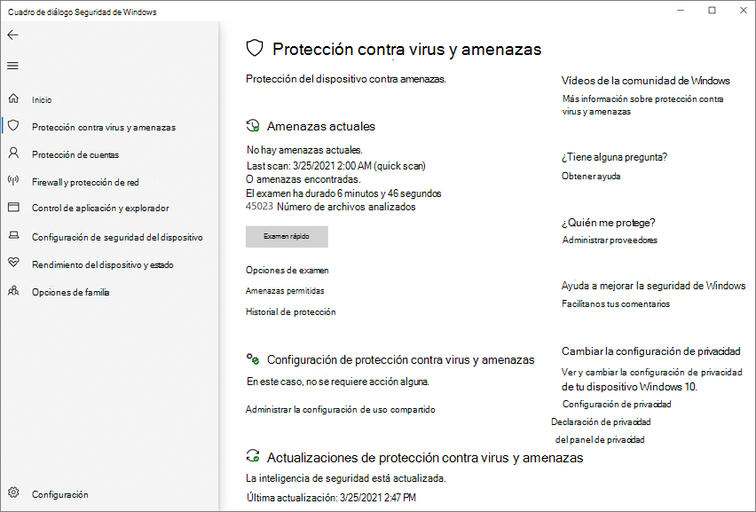

# <a name="turn-on-cloud-delivered-protection"></a><span data-ttu-id="1bd76-104">Activar la protección proporcionada en la nube</span><span class="sxs-lookup"><span data-stu-id="1bd76-104">Turn on cloud-delivered protection</span></span>

[!INCLUDE [Microsoft 365 Defender rebranding](../../includes/microsoft-defender.md)]

<span data-ttu-id="1bd76-105">**Se aplica a:**</span><span class="sxs-lookup"><span data-stu-id="1bd76-105">**Applies to:**</span></span>

- [<span data-ttu-id="1bd76-106">Microsoft Defender para punto de conexión</span><span class="sxs-lookup"><span data-stu-id="1bd76-106">Microsoft Defender for Endpoint</span></span>](/microsoft-365/security/defender-endpoint/)

> [!NOTE]
> <span data-ttu-id="1bd76-107">El Antivirus de Microsoft Defender en la nube es un mecanismo para ofrecer protección actualizada a la red y los puntos de conexión.</span><span class="sxs-lookup"><span data-stu-id="1bd76-107">The Microsoft Defender Antivirus cloud service is a mechanism for delivering updated protection to your network and endpoints.</span></span> <span data-ttu-id="1bd76-108">Aunque se denomina servicio en la nube, no es simplemente protección para los archivos almacenados en la nube; en su lugar, usa recursos distribuidos y aprendizaje automático para ofrecer protección a los puntos de conexión a una velocidad mucho más rápida que las actualizaciones de inteligencia de seguridad tradicionales.</span><span class="sxs-lookup"><span data-stu-id="1bd76-108">Although it is called a cloud service, it is not simply protection for files stored in the cloud; rather, it uses distributed resources and machine learning to deliver protection to your endpoints at a rate that is far faster than traditional Security intelligence updates.</span></span>

<span data-ttu-id="1bd76-109">Antivirus de Microsoft Defender varias tecnologías de detección y prevención para ofrecer una protección precisa, en tiempo real e inteligente.</span><span class="sxs-lookup"><span data-stu-id="1bd76-109">Microsoft Defender Antivirus uses multiple detection and prevention technologies to deliver accurate, real-time, and intelligent protection.</span></span> <span data-ttu-id="1bd76-110">[Conozca las tecnologías avanzadas en el núcleo de La](https://www.microsoft.com/security/blog/2019/06/24/inside-out-get-to-know-the-advanced-technologies-at-the-core-of-microsoft-defender-atp-next-generation-protection/)protección de última generación de Microsoft Defender para endpoint.</span><span class="sxs-lookup"><span data-stu-id="1bd76-110">[Get to know the advanced technologies at the core of Microsoft Defender for Endpoint next-generation protection](https://www.microsoft.com/security/blog/2019/06/24/inside-out-get-to-know-the-advanced-technologies-at-the-core-of-microsoft-defender-atp-next-generation-protection/).</span></span>

<span data-ttu-id="1bd76-111">Puede activar o desactivar la Antivirus de Microsoft Defender de entrega en la nube de varias maneras:</span><span class="sxs-lookup"><span data-stu-id="1bd76-111">You can turn Microsoft Defender Antivirus cloud-delivered protection on or off in several ways:</span></span>

- <span data-ttu-id="1bd76-112">Microsoft Intune</span><span class="sxs-lookup"><span data-stu-id="1bd76-112">Microsoft Intune</span></span>
- <span data-ttu-id="1bd76-113">Microsoft Endpoint Manager</span><span class="sxs-lookup"><span data-stu-id="1bd76-113">Microsoft Endpoint Manager</span></span>
- <span data-ttu-id="1bd76-114">Directiva de grupo</span><span class="sxs-lookup"><span data-stu-id="1bd76-114">Group Policy</span></span>
- <span data-ttu-id="1bd76-115">Cmdlets de PowerShell.</span><span class="sxs-lookup"><span data-stu-id="1bd76-115">PowerShell cmdlets.</span></span>

 <span data-ttu-id="1bd76-116">También puedes activarla o desactivarla en clientes individuales con la Seguridad de Windows aplicación.</span><span class="sxs-lookup"><span data-stu-id="1bd76-116">You can also turn it on or off in individual clients with the Windows Security app.</span></span>

<span data-ttu-id="1bd76-117">Consulte [Usar la protección entregada en la nube de Microsoft](cloud-protection-microsoft-defender-antivirus.md) para obtener información general Antivirus de Microsoft Defender protección entregada en la nube.</span><span class="sxs-lookup"><span data-stu-id="1bd76-117">See [Use Microsoft cloud-delivered protection](cloud-protection-microsoft-defender-antivirus.md) for an overview of Microsoft Defender Antivirus cloud-delivered protection.</span></span>

<span data-ttu-id="1bd76-118">Para obtener más información acerca de los requisitos específicos de conectividad de red para garantizar que los puntos de conexión se puedan conectar al servicio de protección entregado en la nube, vea [Configure and validate network connections](configure-network-connections-microsoft-defender-antivirus.md).</span><span class="sxs-lookup"><span data-stu-id="1bd76-118">For more information about the specific network-connectivity requirements to ensure your endpoints can connect to the cloud-delivered protection service, see [Configure and validate network connections](configure-network-connections-microsoft-defender-antivirus.md).</span></span>

> [!NOTE]
> <span data-ttu-id="1bd76-119">En Windows 10, no hay ninguna diferencia  entre  las opciones de informes básicas y avanzadas que se describen en este tema.</span><span class="sxs-lookup"><span data-stu-id="1bd76-119">In Windows 10, there is no difference between the **Basic** and **Advanced** reporting options described in this topic.</span></span> <span data-ttu-id="1bd76-120">Esta es una distinción heredada y elegir cualquiera de las dos opciones dará como resultado el mismo nivel de protección entregada en la nube.</span><span class="sxs-lookup"><span data-stu-id="1bd76-120">This is a legacy distinction and choosing either setting will result in the same level of cloud-delivered protection.</span></span> <span data-ttu-id="1bd76-121">No hay ninguna diferencia en el tipo o la cantidad de información que se comparte.</span><span class="sxs-lookup"><span data-stu-id="1bd76-121">There is no difference in the type or amount of information that is shared.</span></span> <span data-ttu-id="1bd76-122">Para obtener más información sobre lo que recopilamos, vea la [Declaración de privacidad de Microsoft](https://go.microsoft.com/fwlink/?linkid=521839).</span><span class="sxs-lookup"><span data-stu-id="1bd76-122">For more information on what we collect, see the [Microsoft Privacy Statement](https://go.microsoft.com/fwlink/?linkid=521839).</span></span>

## <a name="use-intune-to-turn-on-cloud-delivered-protection"></a><span data-ttu-id="1bd76-123">Usar Intune para activar la protección entregada en la nube</span><span class="sxs-lookup"><span data-stu-id="1bd76-123">Use Intune to turn on cloud-delivered protection</span></span>

1. <span data-ttu-id="1bd76-124">Vaya al Centro Microsoft Endpoint Manager administración ( [https://endpoint.microsoft.com](https://endpoint.microsoft.com) ) e inicie sesión.</span><span class="sxs-lookup"><span data-stu-id="1bd76-124">Go to the Microsoft Endpoint Manager admin center ([https://endpoint.microsoft.com](https://endpoint.microsoft.com)) and log in.</span></span>

2. <span data-ttu-id="1bd76-125">En el **panel Inicio,** seleccione **Configuración del dispositivo > perfiles**.</span><span class="sxs-lookup"><span data-stu-id="1bd76-125">On the **Home** pane, select **Device configuration > Profiles**.</span></span>

3. <span data-ttu-id="1bd76-126">Seleccione el **tipo de perfil Restricciones de** dispositivo que desea configurar.</span><span class="sxs-lookup"><span data-stu-id="1bd76-126">Select the **Device restrictions** profile type you want to configure.</span></span> <span data-ttu-id="1bd76-127">Si necesitas crear un nuevo tipo de perfil **de restricciones** de dispositivo, consulta Configurar la configuración de restricción de dispositivo [en Microsoft Intune](/intune/device-restrictions-configure).</span><span class="sxs-lookup"><span data-stu-id="1bd76-127">If you need to create a new **Device restrictions** profile type, see [Configure device restriction settings in Microsoft Intune](/intune/device-restrictions-configure).</span></span>

4. <span data-ttu-id="1bd76-128">Seleccionar **opciones de** configuración de  >  **propiedades: editar**  >  **Antivirus de Microsoft Defender**.</span><span class="sxs-lookup"><span data-stu-id="1bd76-128">Select **Properties** > **Configuration settings: Edit** > **Microsoft Defender Antivirus**.</span></span>

5. <span data-ttu-id="1bd76-129">En el **conmutador de protección entregado en** la nube, seleccione **Habilitar**.</span><span class="sxs-lookup"><span data-stu-id="1bd76-129">On the **Cloud-delivered protection** switch, select **Enable**.</span></span>

6. <span data-ttu-id="1bd76-130">En la lista **desplegable Preguntar a los usuarios antes** del envío de ejemplo, seleccione Enviar todos los datos **automáticamente.**</span><span class="sxs-lookup"><span data-stu-id="1bd76-130">In the **Prompt users before sample submission** dropdown, select **Send all data automatically**.</span></span>

<span data-ttu-id="1bd76-131">Para obtener más información acerca de los perfiles de dispositivo de Intune, incluido cómo crear y configurar sus opciones, consulta ¿Qué Microsoft Intune [perfiles de dispositivo?](/intune/device-profiles)</span><span class="sxs-lookup"><span data-stu-id="1bd76-131">For more information about Intune device profiles, including how to create and configure their settings, see [What are Microsoft Intune device profiles?](/intune/device-profiles)</span></span>

## <a name="use-microsoft-endpoint-manager-to-turn-on-cloud-delivered-protection"></a><span data-ttu-id="1bd76-132">Usar Microsoft Endpoint Manager para activar la protección entregada en la nube</span><span class="sxs-lookup"><span data-stu-id="1bd76-132">Use Microsoft Endpoint Manager to turn on cloud-delivered protection</span></span>

1. <span data-ttu-id="1bd76-133">Vaya al Centro Microsoft Endpoint Manager administración ( [https://endpoint.microsoft.com](https://endpoint.microsoft.com) ) e inicie sesión.</span><span class="sxs-lookup"><span data-stu-id="1bd76-133">Go to the Microsoft Endpoint Manager admin center ([https://endpoint.microsoft.com](https://endpoint.microsoft.com)) and log in.</span></span>

2. <span data-ttu-id="1bd76-134">Elija **Endpoint security**  >  **Antivirus**.</span><span class="sxs-lookup"><span data-stu-id="1bd76-134">Choose **Endpoint security** > **Antivirus**.</span></span>

3. <span data-ttu-id="1bd76-135">Seleccione un perfil antivirus.</span><span class="sxs-lookup"><span data-stu-id="1bd76-135">Select an antivirus profile.</span></span> <span data-ttu-id="1bd76-136">(Si aún no tienes uno, o si quieres crear un perfil nuevo, consulta Configurar la configuración de restricción de [dispositivos en Microsoft Intune](/intune/device-restrictions-configure).</span><span class="sxs-lookup"><span data-stu-id="1bd76-136">(If you don't have one yet, or if you want to create a new profile, see [Configure device restriction settings in Microsoft Intune](/intune/device-restrictions-configure).</span></span>

4. <span data-ttu-id="1bd76-137">Seleccione **Propiedades**.</span><span class="sxs-lookup"><span data-stu-id="1bd76-137">Select **Properties**.</span></span> <span data-ttu-id="1bd76-138">A continuación, junto **a Configuración,** elija **Editar**.</span><span class="sxs-lookup"><span data-stu-id="1bd76-138">Then, next to **Configuration settings**, choose **Edit**.</span></span>

5. <span data-ttu-id="1bd76-139">Expanda **Protección en la** nube y, a continuación, en la lista Nivel de protección entregado en **la** nube, seleccione una de las siguientes opciones:</span><span class="sxs-lookup"><span data-stu-id="1bd76-139">Expand **Cloud protection**, and then in the **Cloud-delivered protection level** list, select one of the following:</span></span>
   - <span data-ttu-id="1bd76-140">**High:** aplica un nivel de detección fuerte.</span><span class="sxs-lookup"><span data-stu-id="1bd76-140">**High**: Applies a strong level of detection.</span></span>
   - <span data-ttu-id="1bd76-141">**High plus:** usa el **nivel alto** y aplica medidas de protección adicionales (puede afectar al rendimiento del cliente).</span><span class="sxs-lookup"><span data-stu-id="1bd76-141">**High plus**: Uses the **High** level and applies additional protection measures (may impact client performance).</span></span>
   - <span data-ttu-id="1bd76-142">**Tolerancia cero:** bloquea todos los ejecutables desconocidos.</span><span class="sxs-lookup"><span data-stu-id="1bd76-142">**Zero tolerance**: Blocks all unknown executables.</span></span>

6. <span data-ttu-id="1bd76-143">Seleccione **Revisar y guardar** y, a continuación, elija **Guardar**.</span><span class="sxs-lookup"><span data-stu-id="1bd76-143">Select **Review + save**, then choose **Save**.</span></span>

<span data-ttu-id="1bd76-144">Para obtener más información sobre cómo configurar Microsoft Endpoint Configuration Manager, vea [How to create and deploy antimalware policies: Cloud-protection service](/configmgr/protect/deploy-use/endpoint-antimalware-policies#cloud-protection-service).</span><span class="sxs-lookup"><span data-stu-id="1bd76-144">For more information about configuring Microsoft Endpoint Configuration Manager, see [How to create and deploy antimalware policies: Cloud-protection service](/configmgr/protect/deploy-use/endpoint-antimalware-policies#cloud-protection-service).</span></span>

## <a name="use-group-policy-to-turn-on-cloud-delivered-protection"></a><span data-ttu-id="1bd76-145">Usar la directiva de grupo para activar la protección entregada en la nube</span><span class="sxs-lookup"><span data-stu-id="1bd76-145">Use Group Policy to turn on cloud-delivered protection</span></span>

1. <span data-ttu-id="1bd76-146">En el dispositivo de administración de directivas de grupo, abra la Consola de administración de directivas de [grupo,](/previous-versions/windows/it-pro/windows-server-2008-R2-and-2008/cc731212(v=ws.11))haga clic con el botón secundario en el objeto de directiva de grupo que desea configurar y **seleccione Editar**.</span><span class="sxs-lookup"><span data-stu-id="1bd76-146">On your Group Policy management device, open the [Group Policy Management Console](/previous-versions/windows/it-pro/windows-server-2008-R2-and-2008/cc731212(v=ws.11)), right-click the Group Policy Object you want to configure and select **Edit**.</span></span>

2. <span data-ttu-id="1bd76-147">En el **Editor de administración de directivas de** grupo, vaya a Configuración del **equipo**.</span><span class="sxs-lookup"><span data-stu-id="1bd76-147">In the **Group Policy Management Editor**, go to **Computer configuration**.</span></span>

3. <span data-ttu-id="1bd76-148">Seleccione **Plantillas administrativas**.</span><span class="sxs-lookup"><span data-stu-id="1bd76-148">Select **Administrative templates**.</span></span>

4. <span data-ttu-id="1bd76-149">Expanda el árbol para Windows **componentes > Antivirus de Microsoft Defender > MAPS**</span><span class="sxs-lookup"><span data-stu-id="1bd76-149">Expand the tree to **Windows components > Microsoft Defender Antivirus > MAPS**</span></span>

5. <span data-ttu-id="1bd76-150">Haga doble clic **en Unirse a Microsoft MAPS**.</span><span class="sxs-lookup"><span data-stu-id="1bd76-150">Double-click **Join Microsoft MAPS**.</span></span> <span data-ttu-id="1bd76-151">Asegúrese de que la opción está activada y establecida en **Mapas** básicos o **mapas avanzados**.</span><span class="sxs-lookup"><span data-stu-id="1bd76-151">Ensure the option is turned on and set to **Basic MAPS** or **Advanced MAPS**.</span></span> <span data-ttu-id="1bd76-152">Seleccione **Aceptar**.</span><span class="sxs-lookup"><span data-stu-id="1bd76-152">Select **OK**.</span></span>

6. <span data-ttu-id="1bd76-153">Haga doble clic en **Enviar ejemplos de archivos cuando sea necesario realizar un análisis adicional.**</span><span class="sxs-lookup"><span data-stu-id="1bd76-153">Double-click **Send file samples when further analysis is required**.</span></span> <span data-ttu-id="1bd76-154">Asegúrese de que la primera opción esté establecida en **Enabled** y de que las demás opciones estén establecidas en:</span><span class="sxs-lookup"><span data-stu-id="1bd76-154">Ensure that the first option is set to **Enabled** and that the other options are set to either:</span></span>

    1. <span data-ttu-id="1bd76-155">**Enviar muestras seguras** (1)</span><span class="sxs-lookup"><span data-stu-id="1bd76-155">**Send safe samples** (1)</span></span>
    2. <span data-ttu-id="1bd76-156">**Enviar todos los ejemplos** (3)</span><span class="sxs-lookup"><span data-stu-id="1bd76-156">**Send all samples** (3)</span></span>

        >[!NOTE]
        > <span data-ttu-id="1bd76-157">La **opción Enviar muestras seguras** (1) significa que la mayoría de las muestras se enviarán automáticamente.</span><span class="sxs-lookup"><span data-stu-id="1bd76-157">The **Send safe samples** (1) option means that most samples will be sent automatically.</span></span> <span data-ttu-id="1bd76-158">Los archivos que probablemente contengan información personal seguirán solicitando y necesitarán confirmación adicional.</span><span class="sxs-lookup"><span data-stu-id="1bd76-158">Files that are likely to contain personal information will still prompt and require additional confirmation.</span></span>
        > <span data-ttu-id="1bd76-159">Al establecer la opción **en Preguntar siempre** (0), se disminuirá el estado de protección del dispositivo.</span><span class="sxs-lookup"><span data-stu-id="1bd76-159">Setting the option to **Always Prompt** (0) will lower the protection state of the device.</span></span> <span data-ttu-id="1bd76-160">Establecerlo en **Nunca enviar** (2) significa que la característica Bloquear a primera [vista](configure-block-at-first-sight-microsoft-defender-antivirus.md) de Microsoft Defender para endpoint no funcionará.</span><span class="sxs-lookup"><span data-stu-id="1bd76-160">Setting it to **Never send** (2) means that the [Block at First Sight](configure-block-at-first-sight-microsoft-defender-antivirus.md) feature of Microsoft Defender for Endpoint won't work.</span></span>

7. <span data-ttu-id="1bd76-161">Seleccione **Aceptar**.</span><span class="sxs-lookup"><span data-stu-id="1bd76-161">Select **OK**.</span></span>

## <a name="use-powershell-cmdlets-to-turn-on-cloud-delivered-protection"></a><span data-ttu-id="1bd76-162">Usar cmdlets de PowerShell para activar la protección entregada en la nube</span><span class="sxs-lookup"><span data-stu-id="1bd76-162">Use PowerShell cmdlets to turn on cloud-delivered protection</span></span>

<span data-ttu-id="1bd76-163">Los cmdlets siguientes pueden activar la protección entregada en la nube:</span><span class="sxs-lookup"><span data-stu-id="1bd76-163">The following cmdlets can turn on cloud-delivered protection:</span></span>

```PowerShell
Set-MpPreference -MAPSReporting Advanced
Set-MpPreference -SubmitSamplesConsent SendAllSamples
```

<span data-ttu-id="1bd76-164">Para obtener más información sobre cómo usar PowerShell con Antivirus de Microsoft Defender, vea [Use PowerShell cmdlets to configure and run Antivirus de Microsoft Defender](use-powershell-cmdlets-microsoft-defender-antivirus.md) and Defender [cmdlets](/powershell/module/defender/).</span><span class="sxs-lookup"><span data-stu-id="1bd76-164">For more information on how to use PowerShell with Microsoft Defender Antivirus, see [Use PowerShell cmdlets to configure and run Microsoft Defender Antivirus](use-powershell-cmdlets-microsoft-defender-antivirus.md) and [Defender cmdlets](/powershell/module/defender/).</span></span> <span data-ttu-id="1bd76-165">[CSP de directiva: Defender](/windows/client-management/mdm/policy-csp-defender) también tiene más información específica sobre [-SubmitSamplesConsent](/windows/client-management/mdm/policy-csp-defender#defender-submitsamplesconsent).</span><span class="sxs-lookup"><span data-stu-id="1bd76-165">[Policy CSP - Defender](/windows/client-management/mdm/policy-csp-defender) also has more information specifically on [-SubmitSamplesConsent](/windows/client-management/mdm/policy-csp-defender#defender-submitsamplesconsent).</span></span>

>[!NOTE]
> <span data-ttu-id="1bd76-166">También puede establecer **-SubmitSamplesConsent** en `SendSafeSamples` (la configuración predeterminada), `NeverSend` o `AlwaysPrompt` .</span><span class="sxs-lookup"><span data-stu-id="1bd76-166">You can also set **-SubmitSamplesConsent** to `SendSafeSamples` (the default setting), `NeverSend`, or `AlwaysPrompt`.</span></span> <span data-ttu-id="1bd76-167">La `SendSafeSamples` configuración significa que la mayoría de las muestras se enviarán automáticamente.</span><span class="sxs-lookup"><span data-stu-id="1bd76-167">The `SendSafeSamples` setting means that most samples will be sent automatically.</span></span> <span data-ttu-id="1bd76-168">Los archivos que probablemente contengan información personal seguirán solicitando y necesitarán confirmación adicional.</span><span class="sxs-lookup"><span data-stu-id="1bd76-168">Files that are likely to contain personal information will still prompt and require additional confirmation.</span></span>

>[!WARNING]
> <span data-ttu-id="1bd76-169">Establecer **-SubmitSamplesConsent** en `NeverSend` o `AlwaysPrompt` disminuirá el nivel de protección del dispositivo.</span><span class="sxs-lookup"><span data-stu-id="1bd76-169">Setting **-SubmitSamplesConsent** to `NeverSend` or `AlwaysPrompt` will lower the protection level of the device.</span></span> <span data-ttu-id="1bd76-170">Además, establecerlo en significa que la característica Bloquear a primera vista de Microsoft Defender para endpoint `NeverSend` no funcionará. [](configure-block-at-first-sight-microsoft-defender-antivirus.md)</span><span class="sxs-lookup"><span data-stu-id="1bd76-170">In addition, setting it to `NeverSend` means that the [Block at First Sight](configure-block-at-first-sight-microsoft-defender-antivirus.md) feature of Microsoft Defender for Endpoint won't work.</span></span>

## <a name="use-windows-management-instruction-wmi-to-turn-on-cloud-delivered-protection"></a><span data-ttu-id="1bd76-171">Use Windows Management Instruction (WMI) para activar la protección entregada en la nube</span><span class="sxs-lookup"><span data-stu-id="1bd76-171">Use Windows Management Instruction (WMI) to turn on cloud-delivered protection</span></span>

<span data-ttu-id="1bd76-172">Utilice el [ **método Set** de la **clase MSFT_MpPreference**](/previous-versions/windows/desktop/defender/set-msft-mppreference) para las siguientes propiedades:</span><span class="sxs-lookup"><span data-stu-id="1bd76-172">Use the [**Set** method of the **MSFT_MpPreference**](/previous-versions/windows/desktop/defender/set-msft-mppreference) class for the following properties:</span></span>

```WMI
MAPSReporting
SubmitSamplesConsent
```

<span data-ttu-id="1bd76-173">Para obtener más información acerca de los parámetros [permitidos, vea Windows Defender API wmiv2](/previous-versions/windows/desktop/defender/windows-defender-wmiv2-apis-portal)</span><span class="sxs-lookup"><span data-stu-id="1bd76-173">For more information about allowed parameters, see [Windows Defender WMIv2 APIs](/previous-versions/windows/desktop/defender/windows-defender-wmiv2-apis-portal)</span></span>

## <a name="turn-on-cloud-delivered-protection-on-individual-clients-with-the-windows-security-app"></a><span data-ttu-id="1bd76-174">Activar la protección entregada en la nube en clientes individuales con la Seguridad de Windows aplicación</span><span class="sxs-lookup"><span data-stu-id="1bd76-174">Turn on cloud-delivered protection on individual clients with the Windows Security app</span></span>

> [!NOTE]
> <span data-ttu-id="1bd76-175">Si la opción Configurar invalidación de configuración local para informar  de la directiva de grupo de **Microsoft MAPS** está establecida en **Deshabilitado,** la configuración de protección basada en la nube en Windows Configuración estará gris y no estará disponible.</span><span class="sxs-lookup"><span data-stu-id="1bd76-175">If the **Configure local setting override for reporting Microsoft MAPS** Group Policy setting is set to **Disabled**, then the **Cloud-based protection** setting in Windows Settings will be greyed-out and unavailable.</span></span> <span data-ttu-id="1bd76-176">Los cambios realizados a través de un objeto de directiva de grupo deben implementarse en primer lugar en los extremos individuales antes de que se actualice la configuración en la configuración de Windows.</span><span class="sxs-lookup"><span data-stu-id="1bd76-176">Changes made through a Group Policy Object must first be deployed to individual endpoints before the setting will be updated in Windows Settings.</span></span>

1. <span data-ttu-id="1bd76-177">Abra la aplicación Seguridad de Windows mediante la selección del icono de escudo en la barra de tareas o mediante la búsqueda en el menú inicio de **Defender**.</span><span class="sxs-lookup"><span data-stu-id="1bd76-177">Open the Windows Security app by selecting the shield icon in the task bar, or by searching the start menu for **Defender**.</span></span>

2. <span data-ttu-id="1bd76-178">Seleccione el **icono Protección contra &** virus (o el icono de escudo de la barra de menús izquierda) y, a continuación, la etiqueta & **de** protección contra amenazas:</span><span class="sxs-lookup"><span data-stu-id="1bd76-178">Select the **Virus & threat protection** tile (or the shield icon on the left menu bar) and then the **Virus & threat protection settings** label:</span></span>

    

3. <span data-ttu-id="1bd76-180">Confirme que **la protección basada en la nube y** el **envío** automático de muestras se cambien a **On**.</span><span class="sxs-lookup"><span data-stu-id="1bd76-180">Confirm that **Cloud-based Protection** and **Automatic sample submission** are switched to **On**.</span></span>

> [!NOTE]
> <span data-ttu-id="1bd76-181">Si el envío de ejemplo automático se ha configurado con la directiva de grupo, la configuración será gris y no estará disponible.</span><span class="sxs-lookup"><span data-stu-id="1bd76-181">If automatic sample submission has been configured with Group Policy then the setting will be greyed-out and unavailable.</span></span>

## <a name="related-articles"></a><span data-ttu-id="1bd76-182">Artículos relacionados</span><span class="sxs-lookup"><span data-stu-id="1bd76-182">Related articles</span></span>

- [<span data-ttu-id="1bd76-183">Configurar el período de espera de bloqueo en la nube</span><span class="sxs-lookup"><span data-stu-id="1bd76-183">Configure the cloud block timeout period</span></span>](configure-cloud-block-timeout-period-microsoft-defender-antivirus.md)
- [<span data-ttu-id="1bd76-184">Configurar bloque a primera vista</span><span class="sxs-lookup"><span data-stu-id="1bd76-184">Configure block at first sight</span></span>](configure-block-at-first-sight-microsoft-defender-antivirus.md)
- [<span data-ttu-id="1bd76-185">Usar cmdlets PowerShell para administrar el Antivirus de Windows Defender</span><span class="sxs-lookup"><span data-stu-id="1bd76-185">Use PowerShell cmdlets to manage Microsoft Defender Antivirus</span></span>](use-powershell-cmdlets-microsoft-defender-antivirus.md)
- <span data-ttu-id="1bd76-186">[Ayudar a proteger Windows equipos con Endpoint Protection para Microsoft Intune](/intune/deploy-use/help-secure-windows-pcs-with-endpoint-protection-for-microsoft-intune)]</span><span class="sxs-lookup"><span data-stu-id="1bd76-186">[Help secure Windows PCs with Endpoint Protection for Microsoft Intune](/intune/deploy-use/help-secure-windows-pcs-with-endpoint-protection-for-microsoft-intune)]</span></span>
- [<span data-ttu-id="1bd76-187">Cmdlets de Defender</span><span class="sxs-lookup"><span data-stu-id="1bd76-187">Defender cmdlets</span></span>](/powershell/module/defender/)
- [<span data-ttu-id="1bd76-188">Usar la protección entregada en la nube de Microsoft en Antivirus de Microsoft Defender</span><span class="sxs-lookup"><span data-stu-id="1bd76-188">Use Microsoft cloud-delivered protection in Microsoft Defender Antivirus</span></span>](cloud-protection-microsoft-defender-antivirus.md)
- [<span data-ttu-id="1bd76-189">Cómo crear e implementar directivas antimalware: Servicio de protección en la nube</span><span class="sxs-lookup"><span data-stu-id="1bd76-189">How to create and deploy antimalware policies: Cloud-protection service</span></span>](/configmgr/protect/deploy-use/endpoint-antimalware-policies#cloud-protection-service)
- [<span data-ttu-id="1bd76-190">Antivirus de Microsoft Defender en Windows 10</span><span class="sxs-lookup"><span data-stu-id="1bd76-190">Microsoft Defender Antivirus in Windows 10</span></span>](microsoft-defender-antivirus-in-windows-10.md)
