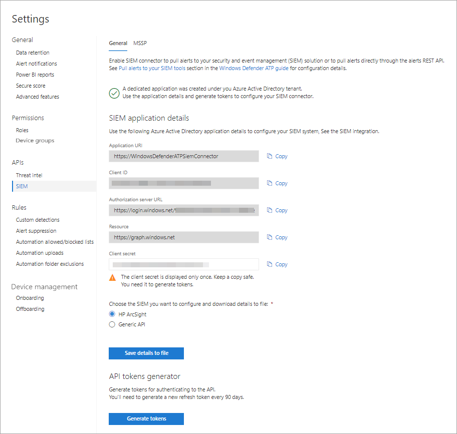

# Habilitar la integración de SIEM en Microsoft Defender para endpoint

[!INCLUDE [Microsoft 365 Defender rebranding](../../includes/microsoft-defender.md)]

**Se aplica a:**
- [Microsoft Defender para punto de conexión](https://go.microsoft.com/fwlink/?linkid=2154037)

>¿Desea experimentar Microsoft Defender para endpoint? [Regístrate para obtener una versión de prueba gratuita.](https://www.microsoft.com/microsoft-365/windows/microsoft-defender-atp?ocid=docs-wdatp-enablesiem-abovefoldlink) 

Habilita la integración de la información de seguridad y la administración de eventos (SIEM) para que puedas extraer detecciones del Centro de seguridad de Microsoft Defender. Extraer detecciones mediante la solución SIEM o mediante la conexión directa a la API de REST de detecciones.

>[!NOTE]
>- [Microsoft Defender para alerta de](alerts.md) extremo se compone de una o más detecciones.
>- [Microsoft Defender para la detección de](api-portal-mapping.md) puntos de conexión se compone del evento sospechoso que se produjo en el dispositivo y sus detalles de alerta relacionados.
>- La API de alerta de punto de conexión de Microsoft Defender es la API más reciente para el consumo de alertas y contiene una lista detallada de pruebas relacionadas para cada alerta. Para obtener más información, vea [Alert methods and properties y](alerts.md) List [alerts](get-alerts.md).

## Requisitos previos

- El usuario que activa la configuración debe tener permisos para crear una aplicación en Azure Active Directory (AAD). Se trata de alguien con los siguientes roles: 

  - Administrador de seguridad y administrador global
  - Administrador de aplicaciones en la nube
  - Administrador de la aplicación
  - Propietario de la entidad de servicio

- Durante la activación inicial, se muestra una pantalla emergente para especificar las credenciales. Asegúrese de permitir las ventanas emergentes para este sitio.

## Habilitar la integración de SIEM 
1. En el panel de navegación, seleccione **Configuración**  >  **SIEM**.

    

    >[!TIP]
    >Si se produce un error al intentar habilitar la aplicación de conector SIEM, compruebe la configuración del bloqueador de elementos emergentes del explorador. Puede que esté bloqueando la nueva ventana que se abre al habilitar la funcionalidad. 

2. Seleccione **Habilitar integración SIEM**. Esto activa la sección detalles de acceso al conector **SIEM** con valores rellenados previamente y se crea una aplicación en el inquilino de Azure Active Directory (Azure AD).

    > [!WARNING]
    >El secreto de cliente solo se muestra una vez. Asegúrese de conservar una copia de ella en un lugar seguro. 
     

    

3. Elija el tipo SIEM que use en su organización.

   > [!NOTE]
   > Si selecciona HP ArcSight, deberá guardar estos dos archivos de configuración: 
   > - WDATP-connector.jsonparser.properties
   > - WDATP-connector.properties  

   Si desea conectarse directamente a la API de REST de detecciones mediante acceso mediante programación, elija **API genérica.**

4. Copie los valores individuales o **seleccione Guardar detalles en el** archivo para descargar un archivo que contenga todos los valores.

5. Seleccione **Generar tokens** para obtener un token de acceso y actualización.
  
   > [!NOTE]
   > Tendrás que generar un nuevo token de actualización cada 90 días. 

6. Siga las instrucciones para crear un registro de aplicaciones de Azure AD para [Microsoft Defender para endpoint](https://docs.microsoft.com/microsoft-365/security/defender-endpoint/exposed-apis-create-app-webapp) y asígnele los permisos correctos para leer alertas.

Ahora puede continuar con la configuración de la solución SIEM o la conexión a la API de REST de detecciones a través del acceso mediante programación. Tendrás que usar los tokens al configurar la solución SIEM para permitir que reciba detecciones del Centro de seguridad de Microsoft Defender.

## Integrar Microsoft Defender para endpoint con IBM QRadar 
Puede configurar IBM QRadar para recopilar detecciones de Microsoft Defender para endpoint. Para obtener más información, vea [IBM Knowledge Center](https://www.ibm.com/support/knowledgecenter/SS42VS_DSM/c_dsm_guide_MS_Win_Defender_ATP_overview.html?cp=SS42VS_7.3.1).

## Ver también
- [Configurar HP ArcSight para extraer Microsoft Defender para detecciones de puntos de conexión](configure-arcsight.md)
- [Campos de Microsoft Defender para detección de puntos de conexión](api-portal-mapping.md)
- [Extraer Microsoft Defender para detecciones de puntos de conexión mediante la API de REST](pull-alerts-using-rest-api.md)
- [Solucionar problemas de integración de herramientas SIEM](troubleshoot-siem.md)
