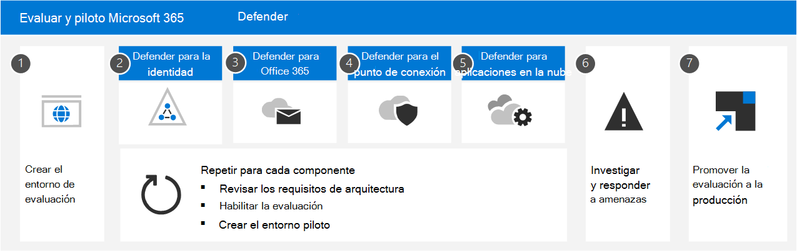

# Evaluar Microsoft 365 Defender información general del extremoEvaluate Microsoft 365 Defender for Endpoint overview

**Se aplica a:****Applies to:**

- Microsoft 365 DefenderMicrosoft 365 Defender

Las evaluaciones completas de productos de seguridad pueden ser un proceso complejo, que requiere configuraciones de dispositivos y entornos engorrosos antes de que se pueda realizar realmente una simulación de ataque de extremo a extremo.Comprehensive security product evaluations can be a complex process, requiring cumbersome environment and device configurations before an end-to-end attack simulation can actually be done. Agregar a la complejidad es el desafío de realizar un seguimiento de dónde se reflejan las actividades de simulación, las alertas y los resultados durante la evaluación.Adding to the complexity is the challenge of tracking where the simulation activities, alerts, and results are reflected during the evaluation.

El laboratorio de evaluación de Microsoft Defender para endpoints está diseñado para eliminar las complejidades de la configuración de dispositivos y entornos.The Microsoft Defender for Endpoint evaluation lab is designed to eliminate the complexities of device and environment configuration. Esto le permite:This enables you to:

- Centrarse en evaluar las capacidades de la plataformaFocus on evaluating the capabilities of the platform
- Ejecutar simulacionesRun simulations
- Vea las características de prevención, detección y corrección en acciónSee the prevention, detection, and remediation features in action
 

> [!VIDEO https://www.microsoft.com/videoplayer/embed/RE4woug]

Con la experiencia de configuración simplificada, puede centrarse en ejecutar sus propios escenarios de prueba y las simulaciones pre-realizadas para ver el rendimiento de Defender for Endpoint.Using the simplified set-up experience, you can focus on running your own test scenarios and the pre-made simulations to see how Defender for Endpoint performs.

Tendrás acceso completo a las potentes capacidades de la plataforma, como investigaciones automatizadas, búsqueda avanzada y análisis de amenazas, lo que te permite probar la pila de protección completa que ofrece Defender for Endpoint.You'll have full access to the powerful capabilities of the platform such as automated investigations, advanced hunting, and threat analytics, allowing you to test the comprehensive protection stack that Defender for Endpoint offers.

Puede agregar dispositivos Windows 10 o Windows Server 2019 que vienen preconfigurados para tener las versiones más recientes del sistema operativo y los componentes de seguridad adecuados en su lugar, así como Office 2019 Standard instalado.You can add Windows 10 or Windows Server 2019 devices that come pre-configured to have the latest OS versions and the right security components in place as well as Office 2019 Standard installed.

También puedes instalar simuladores de amenazas.You can also install threat simulators. Defender for Endpoint se ha asociado con plataformas de simulación de amenazas líderes del sector para ayudarle a probar las capacidades de Defender for Endpoint sin tener que salir del portal.Defender for Endpoint has partnered with industry leading threat simulation platforms to help you test out the Defender for Endpoint capabilities without having to leave the portal.

 Instale el simulador preferido, ejecute escenarios en el laboratorio de evaluación y, a continuación, vea al instante cómo funciona la plataforma.Install your preferred simulator, run scenarios within the evaluation lab, and then instantly see how the platform performs. Esta funcionalidad está disponible cómodamente sin costo adicional para usted.This capability is all conveniently available at no extra cost to you. También tendrás acceso conveniente a una amplia variedad de simulaciones, a las que puedes acceder y ejecutar desde el catálogo de simulaciones.You'll also have convenient access to wide array of simulations, which you can access and run from the simulations catalog.
