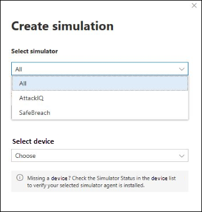

# Experiencia de Microsoft Defender para endpoint (MDE) a través de ataques simuladosExperience Microsoft Defender for Endpoint (MDE) through simulated attacks

>[!TIP]
>
>- Obtenga información sobre las mejoras más recientes en Microsoft Defender para endpoint: ¿Qué hay [de nuevo en Defender para endpoint?](https://cloudblogs.microsoft.com/microsoftsecure/2018/11/15/whats-new-in-windows-defender-atp/).Learn about the latest enhancements in Microsoft Defender for Endpoint: [What's new in Defender for Endpoint?](https://cloudblogs.microsoft.com/microsoftsecure/2018/11/15/whats-new-in-windows-defender-atp/).
>- Defender for Endpoint demostró las capacidades de detección y óptica líderes del sector en la reciente evaluación de MITRE.Defender for Endpoint demonstrated industry-leading optics and detection capabilities in the recent MITRE evaluation. Read: [Ideas from the MITRE ATT&CK-based evaluation](https://cloudblogs.microsoft.com/microsoftsecure/2018/12/03/insights-from-the-mitre-attack-based-evaluation-of-windows-defender-atp/).Read: [Insights from the MITRE ATT&CK-based evaluation](https://cloudblogs.microsoft.com/microsoftsecure/2018/12/03/insights-from-the-mitre-attack-based-evaluation-of-windows-defender-atp/).

Es posible que quieras experimentar Defender for Endpoint antes de incorporar más de unos pocos dispositivos al servicio.You might want to experience Defender for Endpoint before you onboard more than a few devices to the service. Para ello, puedes ejecutar simulaciones de ataque controlado en algunos dispositivos de prueba.To do this, you can run controlled attack simulations on a few test devices. Después de ejecutar los ataques simulados, puedes revisar cómo Defender for Endpoint muestra actividad malintencionada y explorar cómo habilita una respuesta eficaz.After running the simulated attacks, you can review how Defender for Endpoint surfaces malicious activity and explore how it enables an efficient response.

## Antes de empezarBefore you begin

Para ejecutar cualquiera de las simulaciones proporcionadas, necesita al menos [un dispositivo incorporado](onboard-configure.md).To run any of the provided simulations, you need at least [one onboarded device](onboard-configure.md).

Lea el documento del tutorial proporcionado con cada escenario de ataque.Read the walkthrough document provided with each attack scenario. Cada documento incluye requisitos de sistema operativo y aplicación, así como instrucciones detalladas específicas para un escenario de ataque.Each document includes OS and application requirements as well as detailed instructions that are specific to an attack scenario.

## Ejecutar una simulaciónRun a simulation

1. En **help**  >  **simulations & tutoriales**, seleccione cuál de los escenarios de ataque disponibles desea simular:In **Help** > **Simulations & tutorials**, select which of the available attack scenarios you would like to simulate:

   - **Escenario 1: El documento deja la puerta trasera:** simula la entrega de un documento de señuelo de ingeniería social.**Scenario 1: Document drops backdoor** - simulates delivery of a socially engineered lure document. El documento inicia una puerta trasera especialmente diseñada que proporciona control a los atacantes.The document launches a specially crafted backdoor that gives attackers control.

   - **Escenario 2: Script** de PowerShell en ataque sin archivos: simula un ataque sin archivos que se basa en PowerShell, que muestra la reducción de superficie de ataque y la detección de aprendizaje de dispositivos de actividad de memoria malintencionada.**Scenario 2: PowerShell script in fileless attack** - simulates a fileless attack that relies on PowerShell, showcasing attack surface reduction and device learning detection of malicious memory activity.

   - **Escenario 3: Respuesta** automatizada a incidentes: desencadena la investigación automatizada, que busca y corrige automáticamente artefactos de infracción para escalar la capacidad de respuesta a incidentes.**Scenario 3: Automated incident response** - triggers automated investigation, which automatically hunts for and remediates breach artifacts to scale your incident response capacity.

2. Descargue y lea el documento de tutorial correspondiente proporcionado con el escenario seleccionado.Download and read the corresponding walkthrough document provided with your selected scenario.

3. Descargue el archivo de simulación o copie el script de simulación navegando a **Help**  >  **Simulations & tutoriales**.Download the simulation file or copy the simulation script by navigating to **Help** > **Simulations & tutorials**. Puedes elegir descargar el archivo o script en el dispositivo de prueba, pero no es obligatorio.You can choose to download the file or script on the test device but it's not mandatory.

4. Ejecute el archivo de simulación o el script en el dispositivo de prueba como se indica en el documento del tutorial.Run the simulation file or script on the test device as instructed in the walkthrough document.

> [!NOTE]
> Los archivos de simulación o scripts imitan la actividad de ataque, pero en realidad son benignos y no dañan ni comprometen el dispositivo de prueba.Simulation files or scripts mimic attack activity but are actually benign and will not harm or compromise the test device.
>

## TEXTO DE TEMA ALTERNATIVOALTERNATE TOPIC TEXT

## Simular escenarios de ataqueSimulate attack scenarios

Usa los dispositivos de prueba para ejecutar tus propias simulaciones de ataque conectándose a ellos.Use the test devices to run your own attack simulations by connecting to them.

Puedes simular escenarios de ataque con:You can simulate attack scenarios using:

- Escenarios de ataque ["Do It Yourself"](https://securitycenter.windows.com/tutorials)The ["Do It Yourself" attack scenarios](https://securitycenter.windows.com/tutorials)
- Simuladores de amenazasThreat simulators

También puede usar búsqueda avanzada [para consultar](advanced-hunting-overview.md) datos y [análisis de](threat-analytics.md) amenazas para ver informes sobre amenazas emergentes.You can also use [Advanced hunting](advanced-hunting-overview.md) to query data and [Threat analytics](threat-analytics.md) to view reports about emerging threats.

### Escenarios de ataque do-it-yourselfDo-it-yourself attack scenarios

Si está buscando una simulación pre-made, puede usar nuestros escenarios de ataque ["Do It Yourself".](https://securitycenter.windows.com/tutorials)If you are looking for a pre-made simulation, you can use our ["Do It Yourself" attack scenarios](https://securitycenter.windows.com/tutorials). Estos scripts son seguros, documentados y fáciles de usar.These scripts are safe, documented, and easy to use. Estos escenarios reflejarán las capacidades de Defender for Endpoint y le ayudarán a través de la experiencia de investigación.These scenarios will reflect Defender for Endpoint capabilities and walk you through investigation experience.

>[!NOTE]
>La conexión a los dispositivos de prueba se realiza con RDP.The connection to the test devices is done using RDP. Asegúrese de que la configuración del firewall permite conexiones RDP.Make sure that your firewall settings allow RDP connections.

1. Conectar a tu dispositivo y ejecuta una simulación de ataque seleccionando **Conectar**.Connect to your device and run an attack simulation by selecting **Connect**.

    

2. Guarde el archivo RDP e inicielo seleccionando **Conectar**.Save the RDP file and launch it by selecting **Connect**.

    

    >[!NOTE]
    >Si no tienes una copia de la contraseña guardada durante la configuración inicial, puedes restablecer la contraseña seleccionando **Restablecer** contraseña en el menú: Imagen de la contraseña de If you don't have a copy of the password saved during the initial setup, you can reset the password by selecting **Reset password** from the menu: 
    >
    > El dispositivo cambiará su estado a "Ejecutar el restablecimiento de contraseña" y, a continuación, se te presentará la nueva contraseña en unos minutos.The device will change it’s state to “Executing password reset", then you’ll be presented with your new password in a few minutes.

3. Escribe la contraseña que se ha mostrado durante el paso de creación del dispositivo.Enter the password that was displayed during the device creation step.

   

4. Ejecuta simulaciones de ataques do-it-yourself en el dispositivo.Run Do-it-yourself attack simulations on the device.

### Escenarios del simulador de amenazasThreat simulator scenarios

Si optó por instalar cualquiera de los simuladores de amenazas compatibles durante la configuración del laboratorio, puede ejecutar las simulaciones integradas en los dispositivos de laboratorio de evaluación.If you chose to install any of the supported threat simulators during the lab setup, you can run the built-in simulations on the evaluation lab devices.

Ejecutar simulaciones de amenazas con plataformas de terceros es una buena manera de evaluar las capacidades de Punto de conexión de Microsoft Defender en los límites de un entorno de laboratorio.Running threat simulations using third-party platforms is a good way to evaluate Microsoft Defender for Endpoint capabilities within the confines of a lab environment.

>[!NOTE]
>
>Antes de poder ejecutar simulaciones, asegúrese de que se cumplen los siguientes requisitos:Before you can run simulations, ensure the following requirements are met:

>- Los dispositivos deben agregarse al laboratorio de evaluaciónDevices must be added to the evaluation lab
>- Los simuladores de amenazas deben instalarse en el laboratorio de evaluaciónThreat simulators must be installed in the evaluation lab

1. En el portal, seleccione **Crear simulación**.From the portal select **Create simulation**.

2. Seleccione un simulador de amenazas.Select a threat simulator.

    

3. Elija una simulación o busque en la galería de simulación para examinar las simulaciones disponibles.Choose a simulation or look through the simulation gallery to browse through the available simulations.

    Puede acceder a la galería de simulación desde:You can get to the simulation gallery from:
    - El panel de evaluación principal en el icono de información general de **Simulaciones** oThe main evaluation dashboard in the **Simulations overview** tile or
    - Al navegar desde el panel de navegación Evaluación y tutoriales De **simulación**&  >  **tutoriales** y, a continuación, seleccione **Catálogo de simulaciones**.By navigating from the navigation pane **Evaluation and tutorials** > **Simulation & tutorials**, then select **Simulations catalog**.

4. Selecciona los dispositivos en los que quieres ejecutar la simulación.Select the devices where you'd like to run the simulation on.

5. Seleccione **Crear simulación**.Select **Create simulation**.

6. Para ver el progreso de una simulación, seleccione la **pestaña Simulaciones.** Vea el estado de simulación, las alertas activas y otros detalles.View the progress of a simulation by selecting the **Simulations** tab. View the simulation state, active alerts, and other details.

    

 

Después de ejecutar las simulaciones, te animamos a recorrer la barra de progreso del laboratorio y explorar Microsoft Defender for Endpoint desencadenando una **investigación y corrección automatizadas.**After running your simulations, we encourage you to walk through the lab progress bar and explore **Microsoft Defender for Endpoint triggered an automated investigation and remediation**. Consulte las pruebas recopiladas y analizadas por la característica.Check out the evidence collected and analyzed by the feature.

Busca pruebas de ataque mediante la búsqueda avanzada mediante el lenguaje de consulta enriquecido y telemetría sin procesar y echa un vistazo a algunas amenazas de todo el mundo documentadas en análisis de amenazas.Hunt for attack evidence through advanced hunting by using the rich query language and raw telemetry and check out some world-wide threats documented in Threat analytics.
