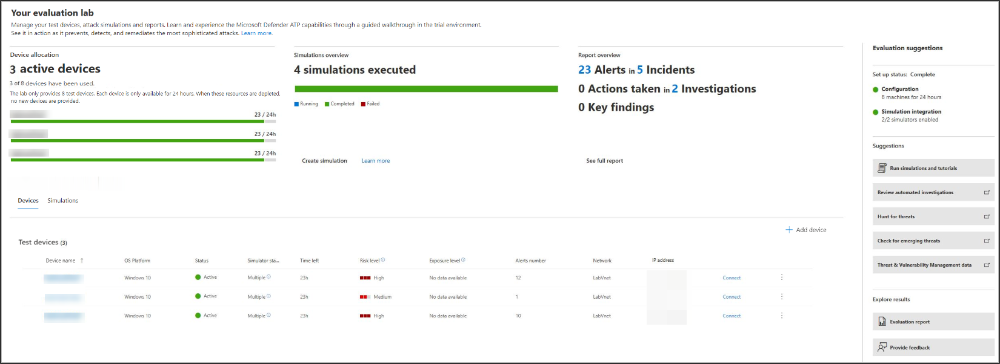

# Laboratorio de evaluación de Microsoft Defender para puntos de conexiónMicrosoft Defender for Endpoint evaluation lab

[!INCLUDE [Microsoft 365 Defender rebranding](../../includes/microsoft-defender.md)]

**Se aplica a:****Applies to:**
- [Microsoft Defender para punto de conexiónMicrosoft Defender for Endpoint](https://go.microsoft.com/fwlink/?linkid=2154037)
- [Microsoft 365 DefenderMicrosoft 365 Defender](https://go.microsoft.com/fwlink/?linkid=2118804)

>¿Desea experimentar Microsoft Defender para endpoint?Want to experience Microsoft Defender for Endpoint? [Regístrate para obtener una versión de prueba gratuita.Sign up for a free trial.](https://www.microsoft.com/microsoft-365/windows/microsoft-defender-atp?ocid=docs-wdatp-enablesiem-abovefoldlink)

La realización de una evaluación completa de productos de seguridad puede ser un proceso complejo que requiere una configuración de dispositivos y entornos engorrosos antes de poder realizar una simulación de ataque de un extremo a otro.Conducting a comprehensive security product evaluation can be a complex process requiring cumbersome environment and device configuration before an end-to-end attack simulation can actually be done. Agregar a la complejidad es el desafío de realizar un seguimiento de dónde se reflejan las actividades de simulación, las alertas y los resultados durante la evaluación.Adding to the complexity is the challenge of tracking where the simulation activities, alerts, and results are reflected during the evaluation.

El laboratorio de evaluación de Microsoft Defender para endpoints está diseñado para eliminar las complejidades de la configuración de dispositivos y entornos para que puedas centrarte en evaluar las capacidades de la plataforma, ejecutar simulaciones y ver las características de prevención, detección y corrección en acción.The Microsoft Defender for Endpoint evaluation lab is designed to eliminate the complexities of device and environment configuration so that you can  focus on evaluating the capabilities of the platform, running simulations, and seeing the prevention, detection, and remediation features in action.

> [!VIDEO https://www.microsoft.com/en-us/videoplayer/embed/RE4qLUM]

Con la experiencia de configuración simplificada, puede centrarse en ejecutar sus propios escenarios de prueba y las simulaciones pre-realizadas para ver el rendimiento de Defender for Endpoint.With the simplified set-up experience, you can focus on running your own test scenarios and the pre-made simulations to see how Defender for Endpoint performs. 

Tendrás acceso completo a las potentes capacidades de la plataforma, como investigaciones automatizadas, búsqueda avanzada y análisis de amenazas, lo que te permite probar la pila de protección completa que ofrece Defender for Endpoint.You'll have full access to the powerful capabilities of the platform such as automated investigations, advanced hunting, and threat analytics, allowing you to test the comprehensive protection stack that Defender for Endpoint offers. 

Puede agregar dispositivos windows 10 o Windows Server 2019 que vienen preconfigurados para tener instaladas las versiones más recientes del sistema operativo y los componentes de seguridad adecuados, así como Office 2019 Standard.You can add Windows 10 or Windows Server 2019 devices that come pre-configured to have the latest OS versions and the right security components in place as well as Office 2019 Standard installed.

También puedes instalar simuladores de amenazas.You can also install threat simulators. Defender for Endpoint se ha asociado con plataformas de simulación de amenazas líderes del sector para ayudarle a probar las capacidades de Defender for Endpoint sin tener que salir del portal.Defender for Endpoint has partnered with industry leading threat simulation platforms to help you test out the Defender for Endpoint capabilities without having to leave the portal.

 Instale el simulador preferido, ejecute escenarios en el laboratorio de evaluación y vea al instante el rendimiento de la plataforma, todo disponible cómodamente sin costo adicional para usted.Install your preferred simulator, run scenarios within the evaluation lab, and instantly see how the platform performs - all conveniently available at no extra cost to you. También tendrás acceso conveniente a una amplia variedad de simulaciones a las que puedes acceder y ejecutar desde el catálogo de simulaciones.You'll also have convenient access to wide array of simulations which you can access and run from the simulations catalog.
    

## Antes de empezarBefore you begin
Tendrás que cumplir los requisitos de licencia [o](minimum-requirements.md#licensing-requirements) tener acceso de prueba a Microsoft Defender para endpoint para acceder al laboratorio de evaluación.You'll need to fulfill the [licensing requirements](minimum-requirements.md#licensing-requirements) or have trial access to Microsoft Defender for Endpoint to access the evaluation lab.

Debe tener permisos **administrar la configuración de** seguridad para:You must have **Manage security settings** permissions to:
- Crear el laboratorioCreate the lab
- Crear dispositivosCreate devices
- Restablecer contraseñaReset password
- Crear simulacionesCreate simulations 
 
Si habilitó el control de acceso basado en roles (RBAC) y creó al menos un grupo de máquinas, los usuarios deben tener acceso a Todos los grupos de máquinas.If you enabled role-based access control (RBAC) and created at least a one machine group, users must have access to All machine groups.

Para obtener más información, vea [Create and manage roles](user-roles.md).For more information, see [Create and manage roles](user-roles.md).

¿Desea experimentar Microsoft Defender para endpoint?Want to experience Microsoft Defender for Endpoint? [Regístrate para obtener una versión de prueba gratuita.Sign up for a free trial.](https://www.microsoft.com/microsoft-365/windows/microsoft-defender-atp?ocid=docs-wdatp-main-abovefoldlink)

## Introducción al laboratorioGet started with the lab
Puede acceder al laboratorio desde el menú.You can access the lab from the menu. En el menú de navegación, seleccione **Evaluación y tutoriales > Laboratorio de evaluación**.In the navigation menu, select **Evaluation and tutorials > Evaluation lab**.

>[!NOTE]
>- Según el tipo de estructura del entorno que selecciones, los dispositivos estarán disponibles para el número especificado de horas desde el día de la activación.Depending the type of environment structure you select, devices will be available for the specified number of hours from the day of activation.
>- Cada entorno se aprovisiona con un conjunto limitado de dispositivos de prueba.Each environment is provisioned with a limited set of test devices. Cuando hayas usado los dispositivos aprovisionados, no se proporciona ningún dispositivo nuevo.When you've used up the provisioned devices, no new devices are provided. Un dispositivo eliminado no actualiza el recuento de dispositivos de prueba disponibles.A deleted device does not refresh the available test device count.
>- Ya no puede usar el laboratorio cuando se han usado los recursos.You can no longer use the lab when the resources have been used up. No se restablece ni se actualiza.It does not reset nor refresh.
>- Es aconsejable usar los recursos cuidadosamente. Los recursos de laboratorio son limitados.It is advisable to use the resources carefully.The lab resources are limited. No se restablecerán ni se actualizarán.They will not reset nor refresh. 

¿Ya tienes un laboratorio?Already have a lab? Asegúrate de habilitar los nuevos simuladores de amenazas y de tener dispositivos activos.Make sure to enable the new threat simulators and have active devices.

## Configurar el laboratorio de evaluaciónSetup the evaluation lab

1. En el panel de navegación, seleccione **Evaluación y tutoriales** Laboratorio de  >  **evaluación** y, a continuación, seleccione Laboratorio **de instalación.**In the navigation pane, select **Evaluation and tutorials** > **Evaluation lab**, then select **Setup lab**.

    

2. Según tus necesidades de evaluación, puedes elegir configurar un entorno con menos dispositivos durante un período más largo o más dispositivos durante un período más corto.Depending on your evaluation needs, you can choose to setup an environment with fewer devices for a longer period or more devices for a shorter period. Seleccione la configuración de laboratorio preferida y, a continuación, **seleccione Siguiente**.Select your preferred lab configuration then select **Next**.

     

3. (Opcional) Puede elegir instalar simuladores de amenazas en el laboratorio.(Optional) You can choose to install threat simulators in the lab. 

    

    >[!IMPORTANT]
    >Primero deberá aceptar y dar su consentimiento a los términos y las instrucciones de uso compartido de información.You'll first need to accept and provide consent to the terms and information sharing statements. 

4. Selecciona el agente de simulación de amenazas que quieras usar y escribe los detalles.Select the threat simulation agent you'd like to use and enter your details. También puedes elegir instalar simuladores de amenazas más adelante.You can also choose to install threat simulators at a later time. Si elige instalar agentes de simulación de amenazas durante la configuración del laboratorio, podrá disfrutar de la ventaja de que se instalen cómodamente en los dispositivos que agregue.If you choose to install threat simulation agents during the lab setup, you'll enjoy the benefit of having them conveniently installed on the devices you add.  
    
    

5.  Revise el resumen y seleccione **Laboratorio de instalación**.Review the summary and select **Setup lab**.  

Una vez completado el proceso de configuración del laboratorio, puede agregar dispositivos y ejecutar simulaciones.After the lab setup process is complete, you can add devices and run simulations. 

## Agregar dispositivosAdd devices
Cuando agregas un dispositivo a tu entorno, Defender para endpoint configura un dispositivo bien configurado con detalles de conexión.When you add a device to your environment, Defender for Endpoint sets up a well-configured device with connection details. Puedes agregar dispositivos con Windows 10 o Windows Server 2019.You can add Windows 10 or Windows Server 2019 devices.

El dispositivo se configurará con la versión más actualizada del sistema operativo y Office 2019 Standard, así como con otras aplicaciones como Java, Python y SysIntenals.The device will be configured with the most up-to-date version of the OS and Office 2019 Standard as well as other apps such as Java, Python, and SysIntenals. 

   >[!TIP]
   > ¿Necesita más dispositivos en el laboratorio?Need more devices in your lab? Envía un vale de soporte técnico para que el equipo de Defender for Endpoint revise tu solicitud.Submit a support ticket to have your request reviewed by the Defender for Endpoint team. 

Si optó por agregar un simulador de amenazas durante la configuración del laboratorio, todos los dispositivos tendrán instalado el agente del simulador de amenazas en los dispositivos que agregue.If you chose to add a threat simulator during the lab setup, all devices will have the threat simulator agent installed in the devices that you add.

El dispositivo se incorporará automáticamente al espacio empresarial con los componentes de seguridad de Windows recomendados activados y en modo auditoría, sin ningún esfuerzo de su parte.The device will automatically be onboarded to your tenant with the recommended Windows security components turned on and in audit mode - with no effort on your side. 

Los siguientes componentes de seguridad están preconfigurados en los dispositivos de prueba:The following security components are pre-configured in the test devices:

- [Reducción de la superficie expuesta a ataquesAttack surface reduction](https://docs.microsoft.com/windows/security/threat-protection/windows-defender-exploit-guard/attack-surface-reduction-exploit-guard)
- [Bloquear a primera vistaBlock at first sight](https://docs.microsoft.com/windows/security/threat-protection/microsoft-defender-antivirus/configure-block-at-first-sight-microsoft-defender-antivirus)
- [Acceso controlado a carpetasControlled folder access](https://docs.microsoft.com/windows/security/threat-protection/windows-defender-exploit-guard/controlled-folders-exploit-guard)
- [Protección contra vulnerabilidades de seguridadExploit protection](https://docs.microsoft.com/windows/security/threat-protection/windows-defender-exploit-guard/enable-exploit-protection)
- [Protección de redNetwork protection](https://docs.microsoft.com/windows/security/threat-protection/windows-defender-exploit-guard/network-protection-exploit-guard)
- [Detección de aplicaciones potencialmente no deseadasPotentially unwanted application detection](https://docs.microsoft.com/windows/security/threat-protection/microsoft-defender-antivirus/detect-block-potentially-unwanted-apps-microsoft-defender-antivirus)
- [Protección entregada en la nubeCloud-delivered protection](https://docs.microsoft.com/windows/security/threat-protection/microsoft-defender-antivirus/utilize-microsoft-cloud-protection-microsoft-defender-antivirus)
- [Microsoft Defender SmartScreenMicrosoft Defender SmartScreen](https://docs.microsoft.com/windows/security/threat-protection/windows-defender-smartscreen/windows-defender-smartscreen-overview)

>[!NOTE]
> Antivirus de Microsoft Defender estará en (no en modo auditoría).Microsoft Defender Antivirus will be on (not in audit mode). Si Antivirus de Microsoft Defender te impide ejecutar la simulación, puedes desactivar la protección en tiempo real en el dispositivo a través de Seguridad de Windows.If Microsoft Defender Antivirus blocks you from running your simulation, you can turn off real-time protection on the device through Windows Security. Para obtener más información, vea [Configure always-on protection](https://docs.microsoft.com/windows/security/threat-protection/microsoft-defender-antivirus/configure-real-time-protection-microsoft-defender-antivirus).For more information, see [Configure always-on protection](https://docs.microsoft.com/windows/security/threat-protection/microsoft-defender-antivirus/configure-real-time-protection-microsoft-defender-antivirus).

La configuración de investigación automatizada dependerá de la configuración del espacio empresarial.Automated investigation settings will be dependent on tenant settings. Se configurará para que sea semiautoautorista de forma predeterminada.It will be configured to be semi-automated by default. Para obtener más información, vea [Overview of Automated investigations](automated-investigations.md).For more information, see [Overview of Automated investigations](automated-investigations.md).

>[!NOTE]
>La conexión a los dispositivos de prueba se realiza con RDP.The connection to the test devices is done using RDP. Asegúrese de que la configuración del firewall permite conexiones RDP.Make sure that your firewall settings allow RDP connections.

1. En el panel, selecciona **Agregar dispositivo**.From the dashboard, select **Add device**. 

2. Elige el tipo de dispositivo que quieres agregar.Choose the type of device to add. Puedes elegir agregar Windows 10 o Windows Server 2019.You can choose to add Windows 10 or Windows Server 2019.

    

    >[!NOTE]
    >Si algo sale mal con el proceso de creación del dispositivo, se te notificará y tendrás que enviar una nueva solicitud.If something goes wrong with the device creation process, you'll be notified and you'll need to submit a new request. Si se produce un error en la creación del dispositivo, no se contará con la cuota total permitida.If the device creation fails, it will not be counted against the overall allowed quota. 

3. Se muestran los detalles de conexión.The connection details are displayed. Selecciona **Copiar** para guardar la contraseña del dispositivo.Select **Copy** to save the password for the device.

    >[!NOTE]
    >La contraseña solo se muestra una vez.The password is only displayed once. Asegúrese de guardarlo para su uso posterior.Be sure to save it for later use.

    

4. Se inicia la configuración del dispositivo.Device set up begins. Esto puede tardar aproximadamente 30 minutos.This can take up to approximately 30 minutes. 

5. Consulta el estado de los dispositivos de prueba, los niveles de riesgo y exposición y el estado de las instalaciones de simulador seleccionando la **pestaña Dispositivos.**See the status of test devices, the risk and exposure levels, and the status of simulator installations by selecting the **Devices** tab. 

    
    

    >[!TIP]
    >En la **columna Estado del** simulador, puede pasar el mouse sobre el icono de información para conocer el estado de instalación de un agente.In the **Simulator status** column, you can hover over the information icon to know the installation status of an agent.

## Simular escenarios de ataqueSimulate attack scenarios
Usa los dispositivos de prueba para ejecutar tus propias simulaciones de ataque conectándose a ellos.Use the test devices to run your own attack simulations by connecting to them. 

Puedes simular escenarios de ataque con:You can simulate attack scenarios using:
- Escenarios de ataque ["Do It Yourself"](https://securitycenter.windows.com/tutorials)The ["Do It Yourself" attack scenarios](https://securitycenter.windows.com/tutorials)
- Simuladores de amenazasThreat simulators

También puede usar búsqueda avanzada [para consultar](advanced-hunting-query-language.md) datos y [análisis de](threat-analytics.md) amenazas para ver informes sobre amenazas emergentes.You can also use [Advanced hunting](advanced-hunting-query-language.md) to query data and [Threat analytics](threat-analytics.md) to view reports about emerging threats.

### Escenarios de ataque do-it-yourselfDo-it-yourself attack scenarios
Si está buscando una simulación pre-made, puede usar nuestros escenarios de ataque ["Do It Yourself".](https://securitycenter.windows.com/tutorials)If you are looking for a pre-made simulation, you can use our ["Do It Yourself" attack scenarios](https://securitycenter.windows.com/tutorials). Estos scripts son seguros, documentados y fáciles de usar.These scripts are safe, documented, and easy to use. Estos escenarios reflejarán las capacidades de Defender for Endpoint y le ayudarán a través de la experiencia de investigación.These scenarios will reflect Defender for Endpoint capabilities and walk you through investigation experience.

>[!NOTE]
>La conexión a los dispositivos de prueba se realiza con RDP.The connection to the test devices is done using RDP. Asegúrese de que la configuración del firewall permite conexiones RDP.Make sure that your firewall settings allow RDP connections.

1. Conéctese al dispositivo y ejecute una simulación de ataque **seleccionando Conectar**.Connect to your device and run an attack simulation by selecting **Connect**. 

    

2. Guarde el archivo RDP e inicielo **seleccionando Conectar**.Save the RDP file and launch it by selecting **Connect**.

    

    >[!NOTE]
    >Si no tienes una copia de la contraseña guardada durante la configuración inicial, puedes restablecer la contraseña seleccionando **Restablecer** contraseña en el menú: Imagen de la contraseña de If you don't have a copy of the password saved during the initial setup, you can reset the password by selecting **Reset password** from the menu:  
    > El dispositivo cambiará su estado a "Ejecutar el restablecimiento de contraseña" y, a continuación, se te presentará la nueva contraseña en unos minutos.The device will change it’s state to “Executing password reset", then you’ll be presented with your new password in a few minutes.

3. Escribe la contraseña que se ha mostrado durante el paso de creación del dispositivo.Enter the password that was displayed during the device creation step. 

   

4. Ejecuta simulaciones de ataques do-it-yourself en el dispositivo.Run Do-it-yourself attack simulations on the device. 

### Escenarios de simulador de amenazasThreat simulator scenarios
Si optó por instalar cualquiera de los simuladores de amenazas compatibles durante la configuración del laboratorio, puede ejecutar las simulaciones integradas en los dispositivos de laboratorio de evaluación.If you chose to install any of the supported threat simulators during the lab setup, you can run the built-in simulations on the evaluation lab devices. 

Ejecutar simulaciones de amenazas con plataformas de terceros es una buena manera de evaluar las capacidades de Punto de conexión de Microsoft Defender en los límites de un entorno de laboratorio.Running threat simulations using third-party platforms is a good way to evaluate Microsoft Defender for Endpoint capabilities within the confines of a lab environment.

>[!NOTE]
>Antes de poder ejecutar simulaciones, asegúrese de que se cumplen los siguientes requisitos:Before you can run simulations, ensure the following requirements are met:
>- Los dispositivos deben agregarse al laboratorio de evaluaciónDevices must be added to the evaluation lab
>- Los simuladores de amenazas deben instalarse en el laboratorio de evaluaciónThreat simulators must be installed in the evaluation lab

1. En el portal, seleccione **Crear simulación**.From the portal select **Create simulation**.

2. Seleccione un simulador de amenazas.Select a threat simulator.

    

3. Elija una simulación o busque en la galería de simulación para examinar las simulaciones disponibles.Choose a simulation or look through the simulation gallery to browse through the available simulations. 

    Puede acceder a la galería de simulación desde:You can get to the simulation gallery from:
    - El panel de evaluación principal en el icono de información general de **Simulaciones** oThe main evaluation dashboard in the **Simulations overview** tile or
    - Al navegar desde el panel de navegación Evaluación y tutoriales De **simulación**&  >  **tutoriales** y, a continuación, seleccione **Catálogo de simulaciones**.By navigating from the navigation pane **Evaluation and tutorials** > **Simulation & tutorials**, then select **Simulations catalog**.

4. Selecciona los dispositivos en los que quieres ejecutar la simulación.Select the devices where you'd like to run the simulation on.

5. Seleccione **Crear simulación**.Select **Create simulation**.

6. Para ver el progreso de una simulación, seleccione la **pestaña Simulaciones.** Vea el estado de simulación, las alertas activas y otros detalles.View the progress of a simulation by selecting the **Simulations** tab. View the simulation state, active alerts, and other details. 

    
    
Después de ejecutar las simulaciones, te animamos a recorrer la barra de progreso del laboratorio y explorar Microsoft Defender for Endpoint desencadenando una **investigación y corrección automatizadas.**After running your simulations, we encourage you to walk through the lab progress bar and explore **Microsoft Defender for Endpoint triggered an automated investigation and remediation**. Consulte las pruebas recopiladas y analizadas por la característica.Check out the evidence collected and analyzed by the feature.

Busca pruebas de ataque mediante la búsqueda avanzada mediante el lenguaje de consulta enriquecido y telemetría sin procesar y echa un vistazo a algunas amenazas de todo el mundo documentadas en análisis de amenazas.Hunt for attack evidence through advanced hunting by using the rich query language and raw telemetry and check out some world-wide threats documented in Threat analytics.

## Galería de simulaciónSimulation gallery
Microsoft Defender para endpoint se ha asociado con varias plataformas de simulación de amenazas para ofrecerte un acceso cómodo para probar las capacidades de la plataforma desde el portal.Microsoft Defender for Endpoint has partnered with various threat simulation platforms to give you convenient access to test the capabilities of the platform right from the within the portal. 

Para ver todas las simulaciones disponibles, vaya al catálogo **Simulaciones** y tutoriales Simulaciones  >   desde el menú.View all the available simulations by going to  **Simulations and tutorials** > **Simulations catalog**  from the menu. 

Se muestra una lista de agentes de simulación de amenazas de terceros compatibles y se proporcionan tipos específicos de simulaciones junto con descripciones detalladas en el catálogo.A list of supported third-party threat simulation agents are listed, and specific types of simulations along with detailed descriptions are provided on the catalog. 

Puede ejecutar cómodamente cualquier simulación disponible directamente desde el catálogo.You can conveniently run any available simulation right from the catalog.  

Cada simulación incluye una descripción detallada del escenario de ataque y referencias como las técnicas de ataque MITRE usadas y las consultas avanzadas de búsqueda de ejemplo que se ejecutan.Each simulation comes with an in-depth description of the attack scenario and references such as the MITRE attack techniques used and sample Advanced hunting queries you run.

**Ejemplos:** 
 **Examples:**

## Informe de evaluaciónEvaluation report
Los informes de laboratorio resumen los resultados de las simulaciones realizadas en los dispositivos.The lab reports summarize the results of the simulations conducted on the devices.

De un vistazo, podrás ver rápidamente:At a glance, you'll quickly be able to see:
- Incidentes que se desencadenaronIncidents that were triggered
- Alertas generadasGenerated alerts
- Evaluaciones en el nivel de exposiciónAssessments on exposure level 
- Categorías de amenazas observadasThreat categories observed
- Orígenes de detecciónDetection sources
- Investigaciones automatizadasAutomated investigations

## Enviar comentariosProvide feedback
Sus comentarios nos ayudan a mejorar la protección del entorno frente a ataques avanzados.Your feedback helps us get better in protecting your environment from advanced attacks. Comparta la experiencia y las impresiones de las capacidades del producto y los resultados de evaluación.Share your experience and impressions from product capabilities and evaluation results.

Háganos saber lo que piensa, **seleccionando Proporcionar comentarios**.Let us know what you think, by selecting **Provide feedback**.

