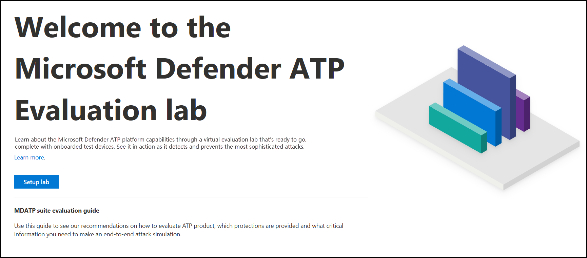
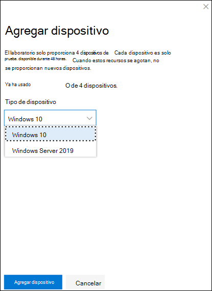
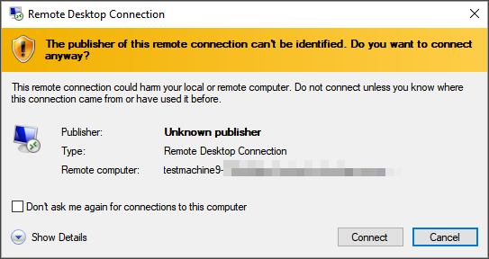
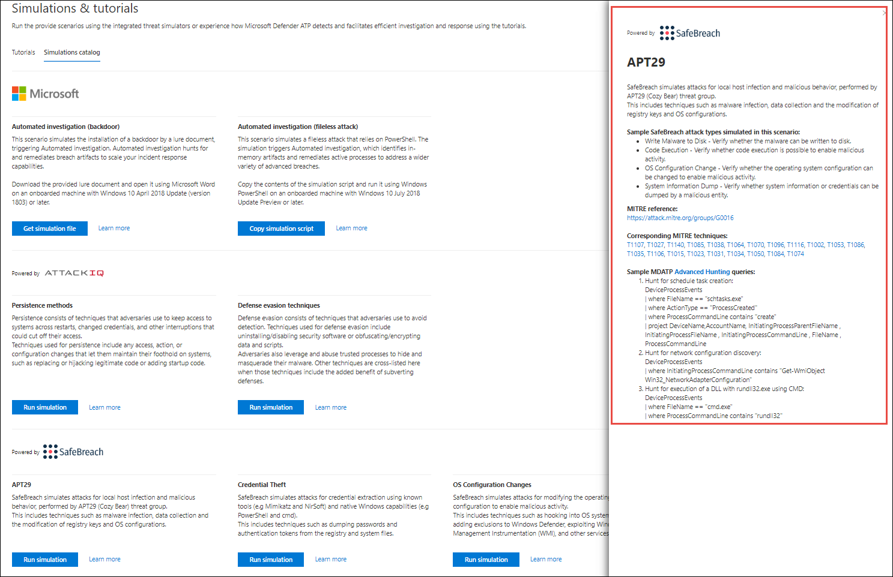

# Laboratorio de evaluación de Microsoft Defender para puntos de conexión

[!INCLUDE [Microsoft 365 Defender rebranding](../../includes/microsoft-defender.md)]

**Se aplica a:**
- [Microsoft Defender para punto de conexión](https://go.microsoft.com/fwlink/?linkid=2154037)
- [Microsoft 365 Defender](https://go.microsoft.com/fwlink/?linkid=2118804)

>¿Desea experimentar Microsoft Defender para endpoint? [Regístrate para obtener una versión de prueba gratuita.](https://www.microsoft.com/microsoft-365/windows/microsoft-defender-atp?ocid=docs-wdatp-enablesiem-abovefoldlink)

La realización de una evaluación completa de productos de seguridad puede ser un proceso complejo que requiere una configuración de dispositivos y entornos engorrosos antes de poder realizar una simulación de ataque de un extremo a otro. Agregar a la complejidad es el desafío de realizar un seguimiento de dónde se reflejan las actividades de simulación, las alertas y los resultados durante la evaluación.

El laboratorio de evaluación de Microsoft Defender para endpoints está diseñado para eliminar las complejidades de la configuración de dispositivos y entornos para que puedas centrarte en evaluar las capacidades de la plataforma, ejecutar simulaciones y ver las características de prevención, detección y corrección en acción.

> [!VIDEO https://www.microsoft.com/en-us/videoplayer/embed/RE4qLUM]

Con la experiencia de configuración simplificada, puede centrarse en ejecutar sus propios escenarios de prueba y las simulaciones pre-realizadas para ver el rendimiento de Defender for Endpoint. 

Tendrás acceso completo a las potentes capacidades de la plataforma, como investigaciones automatizadas, búsqueda avanzada y análisis de amenazas, lo que te permite probar la pila de protección completa que ofrece Defender for Endpoint. 

Puede agregar dispositivos windows 10 o Windows Server 2019 que vienen preconfigurados para tener instaladas las versiones más recientes del sistema operativo y los componentes de seguridad adecuados, así como Office 2019 Standard.

También puedes instalar simuladores de amenazas. Defender for Endpoint se ha asociado con plataformas de simulación de amenazas líderes del sector para ayudarle a probar las capacidades de Defender for Endpoint sin tener que salir del portal.

 Instale el simulador preferido, ejecute escenarios en el laboratorio de evaluación y vea al instante el rendimiento de la plataforma, todo disponible cómodamente sin costo adicional para usted. También tendrás acceso conveniente a una amplia variedad de simulaciones a las que puedes acceder y ejecutar desde el catálogo de simulaciones.
    

## Antes de empezar
Tendrás que cumplir los requisitos de licencia [o](minimum-requirements.md#licensing-requirements) tener acceso de prueba a Microsoft Defender para endpoint para acceder al laboratorio de evaluación.

Debe tener permisos **administrar la configuración de** seguridad para:
- Crear el laboratorio
- Crear dispositivos
- Restablecer contraseña
- Crear simulaciones 
 
Si habilitó el control de acceso basado en roles (RBAC) y creó al menos un grupo de máquinas, los usuarios deben tener acceso a Todos los grupos de máquinas.

Para obtener más información, vea [Create and manage roles](user-roles.md).

¿Desea experimentar Microsoft Defender para endpoint? [Regístrate para obtener una versión de prueba gratuita.](https://www.microsoft.com/microsoft-365/windows/microsoft-defender-atp?ocid=docs-wdatp-main-abovefoldlink)

## Introducción al laboratorio
Puede acceder al laboratorio desde el menú. En el menú de navegación, seleccione **Evaluación y tutoriales > Laboratorio de evaluación**.

>[!NOTE]
>- Cada entorno se aprovisiona con un conjunto limitado de dispositivos de prueba.
>- Según el tipo de estructura del entorno que selecciones, los dispositivos estarán disponibles para el número especificado de horas desde el día de la activación.
>- Cuando hayas usado los dispositivos aprovisionados, no se proporciona ningún dispositivo nuevo. Un dispositivo eliminado no actualiza el recuento de dispositivos de prueba disponibles.
>- Dados los recursos limitados, es aconsejable usar los dispositivos con cuidado.

¿Ya tienes un laboratorio? Asegúrate de habilitar los nuevos simuladores de amenazas y de tener dispositivos activos.

## Configurar el laboratorio de evaluación

1. En el panel de navegación, seleccione **Evaluación y tutoriales** Laboratorio de  >  **evaluación** y, a continuación, seleccione Laboratorio **de instalación.**

    

2. Según tus necesidades de evaluación, puedes elegir configurar un entorno con menos dispositivos durante un período más largo o más dispositivos durante un período más corto. Seleccione la configuración de laboratorio preferida y, a continuación, **seleccione Siguiente**.

     

3. (Opcional) Puede elegir instalar simuladores de amenazas en el laboratorio. 

    

    >[!IMPORTANT]
    >Primero deberá aceptar y dar su consentimiento a los términos y las instrucciones de uso compartido de información. 

4. Selecciona el agente de simulación de amenazas que quieras usar y escribe los detalles. También puedes elegir instalar simuladores de amenazas más adelante. Si elige instalar agentes de simulación de amenazas durante la configuración del laboratorio, podrá disfrutar de la ventaja de que se instalen cómodamente en los dispositivos que agregue.  
    
    

5.  Revise el resumen y seleccione **Laboratorio de instalación**.  

Una vez completado el proceso de configuración del laboratorio, puede agregar dispositivos y ejecutar simulaciones. 

## Agregar dispositivos
Cuando agregas un dispositivo a tu entorno, Defender para endpoint configura un dispositivo bien configurado con detalles de conexión. Puedes agregar dispositivos con Windows 10 o Windows Server 2019.

El dispositivo se configurará con la versión más actualizada del sistema operativo y Office 2019 Standard, así como con otras aplicaciones como Java, Python y SysIntenals. 

   >[!TIP]
   > ¿Necesita más dispositivos en el laboratorio? Envía un vale de soporte técnico para que el equipo de Defender for Endpoint revise tu solicitud. 

Si optó por agregar un simulador de amenazas durante la configuración del laboratorio, todos los dispositivos tendrán instalado el agente del simulador de amenazas en los dispositivos que agregue.

El dispositivo se incorporará automáticamente al espacio empresarial con los componentes de seguridad de Windows recomendados activados y en modo auditoría, sin ningún esfuerzo de su parte. 

Los siguientes componentes de seguridad están preconfigurados en los dispositivos de prueba:

- [Reducción de la superficie expuesta a ataques](https://docs.microsoft.com/windows/security/threat-protection/windows-defender-exploit-guard/attack-surface-reduction-exploit-guard)
- [Bloquear a primera vista](https://docs.microsoft.com/windows/security/threat-protection/microsoft-defender-antivirus/configure-block-at-first-sight-microsoft-defender-antivirus)
- [Acceso controlado a carpetas](https://docs.microsoft.com/windows/security/threat-protection/windows-defender-exploit-guard/controlled-folders-exploit-guard)
- [Protección contra vulnerabilidades](https://docs.microsoft.com/windows/security/threat-protection/windows-defender-exploit-guard/enable-exploit-protection)
- [Protección de red](https://docs.microsoft.com/windows/security/threat-protection/windows-defender-exploit-guard/network-protection-exploit-guard)
- [Detección de aplicaciones potencialmente no deseadas](https://docs.microsoft.com/windows/security/threat-protection/microsoft-defender-antivirus/detect-block-potentially-unwanted-apps-microsoft-defender-antivirus)
- [Protección entregada en la nube](https://docs.microsoft.com/windows/security/threat-protection/microsoft-defender-antivirus/utilize-microsoft-cloud-protection-microsoft-defender-antivirus)
- [Microsoft Defender SmartScreen](https://docs.microsoft.com/windows/security/threat-protection/windows-defender-smartscreen/windows-defender-smartscreen-overview)

>[!NOTE]
> Antivirus de Microsoft Defender estará en (no en modo auditoría). Si Antivirus de Microsoft Defender te impide ejecutar la simulación, puedes desactivar la protección en tiempo real en el dispositivo a través de Seguridad de Windows. Para obtener más información, vea [Configure always-on protection](https://docs.microsoft.com/windows/security/threat-protection/microsoft-defender-antivirus/configure-real-time-protection-microsoft-defender-antivirus).

La configuración de investigación automatizada dependerá de la configuración del espacio empresarial. Se configurará para que sea semiautoautorista de forma predeterminada. Para obtener más información, vea [Overview of Automated investigations](automated-investigations.md).

>[!NOTE]
>La conexión a los dispositivos de prueba se realiza con RDP. Asegúrese de que la configuración del firewall permite conexiones RDP.

1. En el panel, selecciona **Agregar dispositivo**. 

2. Elige el tipo de dispositivo que quieres agregar. Puedes elegir agregar Windows 10 o Windows Server 2019.

    

    >[!NOTE]
    >Si algo sale mal con el proceso de creación del dispositivo, se te notificará y tendrás que enviar una nueva solicitud. Si se produce un error en la creación del dispositivo, no se contará con la cuota total permitida. 

3. Se muestran los detalles de conexión. Selecciona **Copiar** para guardar la contraseña del dispositivo.

    >[!NOTE]
    >La contraseña solo se muestra una vez. Asegúrese de guardarlo para su uso posterior.

    

4. Se inicia la configuración del dispositivo. Esto puede tardar aproximadamente 30 minutos. 

5. Consulta el estado de los dispositivos de prueba, los niveles de riesgo y exposición y el estado de las instalaciones de simulador seleccionando la **pestaña Dispositivos.** 

    
    

    >[!TIP]
    >En la **columna Estado del** simulador, puede pasar el mouse sobre el icono de información para conocer el estado de instalación de un agente.

## Simular escenarios de ataque
Usa los dispositivos de prueba para ejecutar tus propias simulaciones de ataque conectándose a ellos. 

Puedes simular escenarios de ataque con:
- Escenarios de ataque ["Do It Yourself"](https://securitycenter.windows.com/tutorials)
- Simuladores de amenazas

También puede usar búsqueda avanzada [para consultar](advanced-hunting-query-language.md) datos y [análisis de](threat-analytics.md) amenazas para ver informes sobre amenazas emergentes.

### Escenarios de ataque do-it-yourself
Si está buscando una simulación pre-made, puede usar nuestros escenarios de ataque ["Do It Yourself".](https://securitycenter.windows.com/tutorials) Estos scripts son seguros, documentados y fáciles de usar. Estos escenarios reflejarán las capacidades de Defender for Endpoint y le ayudarán a través de la experiencia de investigación.

>[!NOTE]
>La conexión a los dispositivos de prueba se realiza con RDP. Asegúrese de que la configuración del firewall permite conexiones RDP.

1. Conéctese al dispositivo y ejecute una simulación de ataque **seleccionando Conectar**. 

    

2. Guarde el archivo RDP e inicielo **seleccionando Conectar**.

    

    >[!NOTE]
    >Si no tienes una copia de la contraseña guardada durante la configuración inicial, puedes restablecer la contraseña seleccionando **Restablecer** contraseña en el menú: Imagen de la contraseña de  
    > El dispositivo cambiará su estado a "Ejecutar el restablecimiento de contraseña" y, a continuación, se te presentará la nueva contraseña en unos minutos.

3. Escribe la contraseña que se ha mostrado durante el paso de creación del dispositivo. 

   

4. Ejecuta simulaciones de ataques do-it-yourself en el dispositivo. 

### Escenarios de simulador de amenazas
Si optó por instalar cualquiera de los simuladores de amenazas compatibles durante la configuración del laboratorio, puede ejecutar las simulaciones integradas en los dispositivos de laboratorio de evaluación. 

Ejecutar simulaciones de amenazas con plataformas de terceros es una buena manera de evaluar las capacidades de Punto de conexión de Microsoft Defender en los límites de un entorno de laboratorio.

>[!NOTE]
>Antes de poder ejecutar simulaciones, asegúrese de que se cumplen los siguientes requisitos:
>- Los dispositivos deben agregarse al laboratorio de evaluación
>- Los simuladores de amenazas deben instalarse en el laboratorio de evaluación

1. En el portal, seleccione **Crear simulación**.

2. Seleccione un simulador de amenazas.

    

3. Elija una simulación o busque en la galería de simulación para examinar las simulaciones disponibles. 

    Puede acceder a la galería de simulación desde:
    - El panel de evaluación principal en el icono de información general de **Simulaciones** o
    - Al navegar desde el panel de navegación Evaluación y tutoriales De **simulación**&  >  **tutoriales** y, a continuación, seleccione **Catálogo de simulaciones**.

4. Selecciona los dispositivos en los que quieres ejecutar la simulación.

5. Seleccione **Crear simulación**.

6. Para ver el progreso de una simulación, seleccione la **pestaña Simulaciones.** Vea el estado de simulación, las alertas activas y otros detalles. 

    
    
Después de ejecutar las simulaciones, te animamos a recorrer la barra de progreso del laboratorio y explorar Microsoft Defender for Endpoint desencadenando una **investigación y corrección automatizadas.** Consulte las pruebas recopiladas y analizadas por la característica.

Busca pruebas de ataque mediante la búsqueda avanzada mediante el lenguaje de consulta enriquecido y telemetría sin procesar y echa un vistazo a algunas amenazas de todo el mundo documentadas en análisis de amenazas.

## Galería de simulación
Microsoft Defender para endpoint se ha asociado con varias plataformas de simulación de amenazas para ofrecerte un acceso cómodo para probar las capacidades de la plataforma desde el portal. 

Para ver todas las simulaciones disponibles, vaya al catálogo **Simulaciones** y tutoriales Simulaciones  >   desde el menú. 

Se muestra una lista de agentes de simulación de amenazas de terceros compatibles y se proporcionan tipos específicos de simulaciones junto con descripciones detalladas en el catálogo. 

Puede ejecutar cómodamente cualquier simulación disponible directamente desde el catálogo.  

Cada simulación incluye una descripción detallada del escenario de ataque y referencias como las técnicas de ataque MITRE usadas y las consultas avanzadas de búsqueda de ejemplo que se ejecutan.

**Ejemplos:** 
 

## Informe de evaluación
Los informes de laboratorio resumen los resultados de las simulaciones realizadas en los dispositivos.

De un vistazo, podrás ver rápidamente:
- Incidentes que se desencadenaron
- Alertas generadas
- Evaluaciones en el nivel de exposición 
- Categorías de amenazas observadas
- Orígenes de detección
- Investigaciones automatizadas

## Enviar comentarios
Sus comentarios nos ayudan a mejorar la protección del entorno frente a ataques avanzados. Comparta la experiencia y las impresiones de las capacidades del producto y los resultados de evaluación.

Háganos saber lo que piensa, **seleccionando Proporcionar comentarios**.

