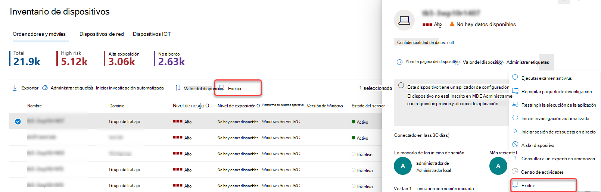
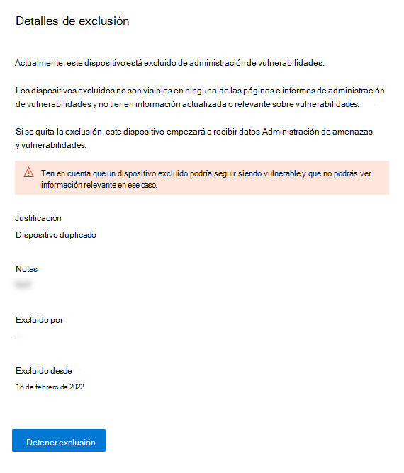

# Excluir dispositivos

[!INCLUDE [Microsoft 365 Defender rebranding](../../includes/microsoft-defender.md)]

**Se aplica a:**

- [Microsoft Defender para punto de conexión Plan 1](https://go.microsoft.com/fwlink/p/?linkid=2154037)
- [Microsoft Defender para punto de conexión Plan 2](https://go.microsoft.com/fwlink/p/?linkid=2154037)
- [Microsoft 365 Defender](https://go.microsoft.com/fwlink/?linkid=2118804)

> ¿Desea experimentar Defender for Endpoint? [Regístrese para obtener una prueba gratuita.](https://signup.microsoft.com/create-account/signup?products=7f379fee-c4f9-4278-b0a1-e4c8c2fcdf7e&ru=https://aka.ms/MDEp2OpenTrial?ocid=docs-wdatp-respondmachine-abovefoldlink)

## Excluir dispositivos de Administración de amenazas y vulnerabilidades

La exclusión de dispositivos inactivos, duplicados o fuera del ámbito permite centrarse en detectar y priorizar los riesgos en los dispositivos activos. Esta acción también puede ayudar a reflejar una puntuación de exposición Administración de amenazas y vulnerabilidades más precisa, ya que los dispositivos excluidos no estarán visibles en los Administración de amenazas y vulnerabilidades informes.

Una vez que se excluyen los dispositivos, no podrás ver información actualizada o relevante acerca de las vulnerabilidades y el software instalado en estos dispositivos. Afecta a todas las Administración de amenazas y vulnerabilidades, informes y tablas relacionadas en la búsqueda avanzada.

Aunque la característica de exclusión de dispositivos quita los datos del dispositivo de administración de vulnerabilidades páginas e informes, los dispositivos permanecen conectados a la red y aún pueden ser un riesgo para la organización. Podrás cancelar la exclusión del dispositivo en cualquier momento.

## Cómo excluir un dispositivo

Puedes optar por excluir un solo dispositivo o varios dispositivos al mismo tiempo.

### Excluir un solo dispositivo

1. Ve a la **página Inventario de dispositivos** y selecciona el dispositivo que quieres excluir.
2. Selecciona **Excluir** de la barra de acciones de la página inventario de dispositivos o del menú acciones del control desplegable del dispositivo.

 3. Seleccione una justificación:

    - Dispositivo inactivo
    - Dispositivo duplicado
    - El dispositivo no existe
    - Fuera de ámbito  
    - Otro

4. Escribe una nota y selecciona **Excluir dispositivo**.

También puedes excluir un dispositivo de su página de dispositivo.

> [!NOTE]
> No se recomienda excluir los dispositivos activos, ya que es especialmente arriesgado no tener visibilidad de su información de vulnerabilidad. Si un dispositivo está activo e intentas excluirlo, recibirás un mensaje de advertencia y una ventana emergente de confirmación que te preguntará si estás seguro de que quieres excluir un dispositivo activo.

Un dispositivo puede tardar hasta 10 horas en excluirse por completo de administración de vulnerabilidades vistas y datos.

Los dispositivos excluidos siguen estando visibles en la lista Inventario de dispositivos. Puedes administrar la vista de dispositivos excluidos mediante:

- Agregar la **columna Estado de** exclusión a la vista inventario de dispositivos.
- Usar el  **filtro de estadoExclusion**  para ver la lista relevante de dispositivos.

### Exclusión masiva de dispositivos

También puedes optar por excluir varios dispositivos al mismo tiempo:

1. Ve a la **página Inventario de dispositivos** y selecciona los dispositivos que quieres excluir.

2. En la barra de acciones, seleccione **Excluir**.

3. Elige una justificación y selecciona **Excluir dispositivo**.

Si seleccionas varios dispositivos en la lista de dispositivos con diferentes estados de exclusión, el menú desplegable excluir dispositivos seleccionados te proporcionará detalles sobre cuántos de los dispositivos seleccionados ya están excluidos. Puedes excluir los dispositivos de nuevo, pero se invalidarán la justificación y las notas.

Una vez que se excluye un dispositivo, si vas a la página del dispositivo de un dispositivo excluido, no podrás ver datos de vulnerabilidades detectadas, inventario de software o recomendaciones de seguridad. Los datos tampoco se mostrarán en administración de vulnerabilidades, las tablas de búsqueda avanzadas relacionadas y el informe de dispositivos vulnerables.

## Dejar de excluir un dispositivo

Podrás dejar de excluir un dispositivo en cualquier momento. Una vez que los dispositivos ya no se excluyen, sus datos de vulnerabilidad estarán visibles en administración de vulnerabilidades páginas, informes y en búsqueda avanzada. Los cambios pueden tardar hasta 8 horas en tener efecto.

1. Ve al Inventario de dispositivos, selecciona el dispositivo excluido para abrir el control remoto y, a continuación, selecciona **Detalles de exclusión**
2. Seleccionar **Detener exclusión**

## Vea también

- [Inventario de dispositivos](machines-view-overview.md)
