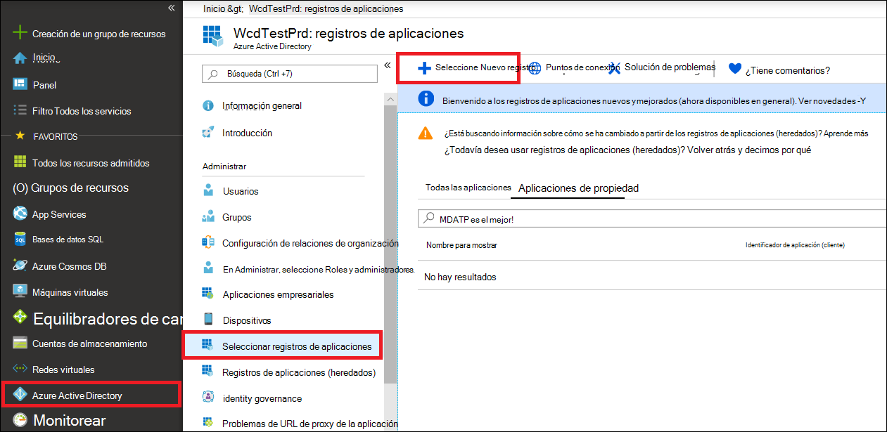
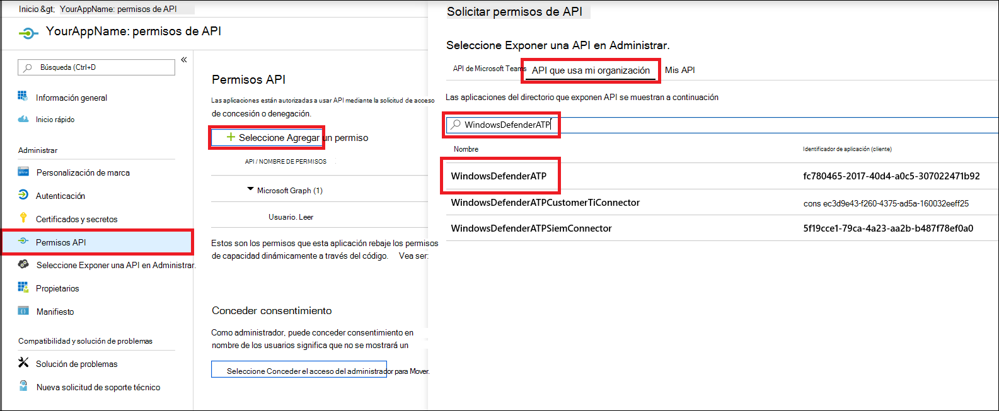
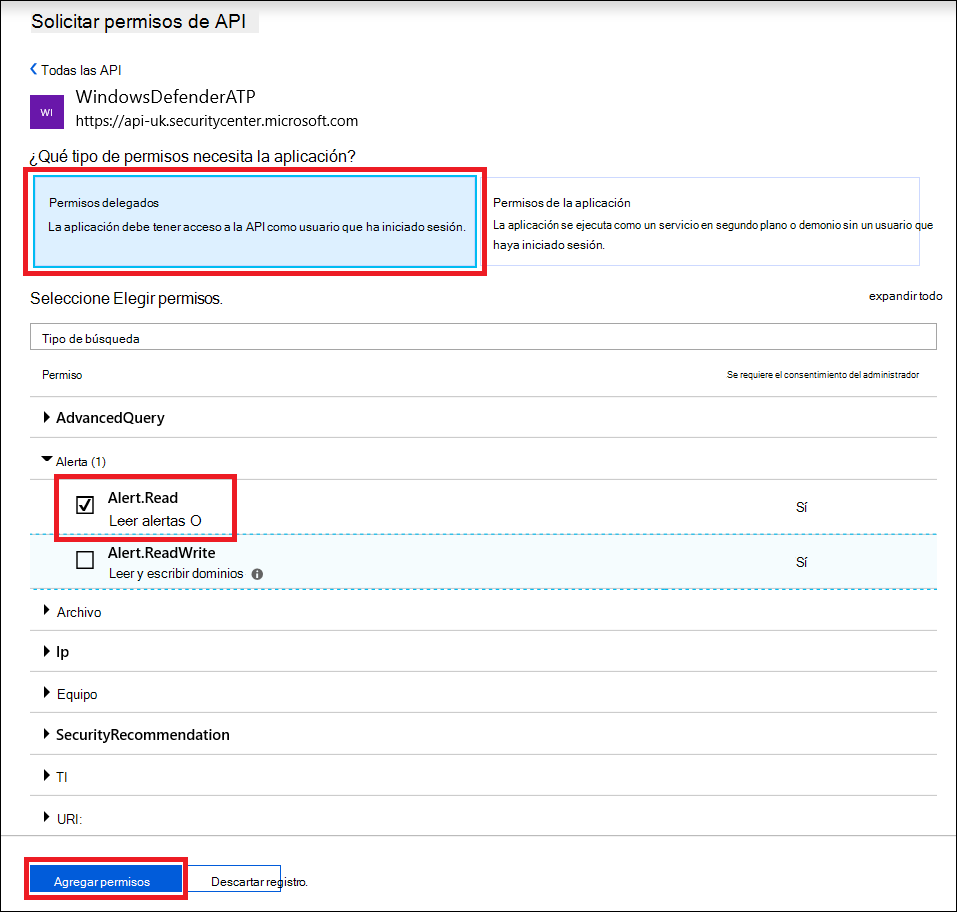
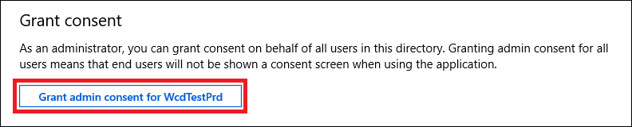

# <a name="use-microsoft-defender-for-endpoint-apis"></a>Usar Microsoft Defender para las API de punto de conexión

[!INCLUDE [Microsoft 365 Defender rebranding](../../includes/microsoft-defender.md)]


**Se aplica a:**
- [Microsoft Defender para punto de conexión](https://go.microsoft.com/fwlink/?linkid=2154037)

> ¿Desea experimentar Microsoft Defender para endpoint? [Regístrate para obtener una versión de prueba gratuita.](https://www.microsoft.com/microsoft-365/windows/microsoft-defender-atp?ocid=docs-wdatp-exposedapis-abovefoldlink)

[!include[Microsoft Defender for Endpoint API URIs for US Government](../../includes/microsoft-defender-api-usgov.md)]

[!include[Improve request performance](../../includes/improve-request-performance.md)]

En esta página se describe cómo crear una aplicación para obtener acceso mediante programación a Defender for Endpoint en nombre de un usuario.

Si necesita acceso mediante programación a Microsoft Defender para Endpoint sin un usuario, consulte [Access Microsoft Defender for Endpoint with application context](exposed-apis-create-app-webapp.md).

Si no está seguro de qué acceso necesita, lea la [página Introducción](apis-intro.md).

Microsoft Defender para endpoint expone gran parte de sus datos y acciones a través de un conjunto de API programáticas. Estas API te permitirán automatizar los flujos de trabajo e innovar en función de las capacidades de Microsoft Defender para puntos de conexión. El acceso a la API requiere autenticación de OAuth2.0. Para obtener más información, vea Código de autorización [de OAuth 2.0 Flow](https://docs.microsoft.com/azure/active-directory/develop/active-directory-v2-protocols-oauth-code).

En general, deberá seguir los pasos siguientes para usar las API:
- Crear una aplicación de AAD
- Obtener un token de acceso con esta aplicación
- Usar el token para obtener acceso a la API de Defender for Endpoint

En esta página se explica cómo crear una aplicación de AAD, obtener un token de acceso a Microsoft Defender para Endpoint y validar el token.

>[!NOTE]
> Al obtener acceso a la API de Microsoft Defender para endpoint en nombre de un usuario, necesitará el permiso de aplicación y el permiso de usuario correctos.
> Si no está familiarizado con los permisos de usuario en Microsoft Defender para endpoint, consulte [Manage portal access using role-based access control](rbac.md).

>[!TIP]
> Si tiene permiso para realizar una acción en el portal, tiene permiso para realizar la acción en la API.

## <a name="create-an-app"></a>Crear una aplicación

1. Inicie sesión en [Azure](https://portal.azure.com) con una cuenta de usuario que tenga el rol **Administrador global.**

2. Vaya a **Azure Active Directory**  >  **registros de aplicaciones** Nuevo  >  **registro**. 

   

3. Cuando aparezca la página **Registrar una aplicación**, escriba la información de registro de la aplicación:

   - **Nombre**: escriba un nombre significativo para la aplicación, que se mostrará a los usuarios de la aplicación.
   - **Tipos de cuentas compatibles**: seleccione qué cuentas desea que admita la aplicación.

       | Tipos de cuenta admitidos | Descripción |
       |-------------------------|-------------|
       | **Solo las cuentas de este directorio organizativo** | Seleccione esta opción si va a crear una aplicación de línea de negocio (LOB). Esta opción no está disponible si no va a registrar la aplicación en un directorio.<br><br>Esta opción se asigna solo a un único inquilino de Azure AD.<br><br>Esta es la opción predeterminada a menos que registre la aplicación fuera de un directorio. En los casos en los que la aplicación se registra fuera de un directorio, el valor predeterminado son las cuentas personales de Microsoft y cuentas multiinquilino de Azure AD. |
       | **Cuentas en cualquier directorio organizativo** | Seleccione esta opción si desea tener como destino todos los clientes de negocios y del sector educativo.<br><br>Esta opción se asigna a un multiinquilino de solo Azure AD.<br><br>Si ha registrado la aplicación como solo para un único inquilino de Azure AD, puede actualizarla para que sea de multiinquilino de Azure AD y que vuelva a serlo para un solo inquilino mediante la hoja **Autenticación**. |
       | **Cuentas en cualquier directorio organizativo y cuentas personales de Microsoft** | Seleccione esta opción para establecer como destino el mayor conjunto posible de clientes.<br><br>Esta opción asigna cuentas personales de Microsoft y cuentas multiinquilinos de Azure AD.<br><br>Si registró la aplicación como cuentas multiinquilino de Azure AD y cuentas personales de Microsoft, no puede cambiar esto en la interfaz de usuario. En su lugar, debe usar el editor de manifiestos de aplicación para cambiar los tipos de cuenta admitidos. |

   - **URI de redirección (opcional)**: seleccione el tipo de aplicación que se va a crear, **Web** o **Cliente público (móvil y escritorio)** y, a continuación, escriba el identificador URI de redireccionamiento (o la dirección URL de respuesta) para la aplicación.
       - Para aplicaciones web, proporcione la dirección URL base de la aplicación. Por ejemplo, `http://localhost:31544` podría ser la dirección URL de una aplicación web que se ejecuta en la máquina local. Los usuarios utilizan esta dirección URL para iniciar sesión en una aplicación cliente web.
       - Para aplicaciones cliente públicas, proporcione el identificador URI que utiliza Azure AD para devolver las respuestas de los tokens. Escriba un valor específico para la aplicación, como `myapp://auth`.

     Si desea ejemplos específicos de aplicaciones web o aplicaciones nativas, visite nuestras [guías de inicio rápido](/azure/active-directory/develop/#quickstarts).

     Cuando termine, seleccione **Registrar**.

4. Permitir que la aplicación tenga acceso a Microsoft Defender para endpoint y asignarle el permiso "Leer alertas":

    - En la página de la aplicación, seleccione Permisos de **API** Agregar API de permisos que mi organización usa  >    >   > tipo **WindowsDefenderATP** y seleccione **en WindowsDefenderATP**.

    - **Nota:** *WindowsDefenderATP* no aparece en la lista original. Comience a escribir su nombre en el cuadro de texto para verlo aparecer.

      

    - Elija **Permisos delegados**  >  **Alert.Read >** **seleccione Agregar permisos**

      

    - **Nota importante:** Seleccione los permisos relevantes. Las alertas de lectura solo son un ejemplo.

      Por ejemplo,

      - Para [ejecutar consultas avanzadas,](run-advanced-query-api.md)seleccione el permiso "Ejecutar consultas avanzadas"
      - Para [aislar un dispositivo,](isolate-machine.md)seleccione el permiso "Aislar máquina"
      - Para determinar qué permiso necesita, vea la **sección Permisos** en la API a la que está interesado llamar.

    - Seleccionar **Conceder consentimiento**

      **Nota:** Cada vez que agregue permiso, debe seleccionar conceder **el consentimiento** para que el nuevo permiso suba a efecto.

      

6. Anote el identificador de la aplicación y el identificador de inquilino:

   - En la página de la aplicación, vaya **a Información general** y copie la siguiente información:

   


## <a name="get-an-access-token"></a>Obtener un token de acceso

Para obtener más información sobre los tokens de AAD, consulte [Tutorial de Azure AD](https://docs.microsoft.com/azure/active-directory/develop/active-directory-v2-protocols-oauth-client-creds)

### <a name="using-c"></a>Uso de C #

- Copie o pegue la clase siguiente en la aplicación.
- Usa **el método AcquireUserTokenAsync** con el identificador de aplicación, el identificador de inquilino, el nombre de usuario y la contraseña para adquirir un token.

    ```csharp
    namespace WindowsDefenderATP
    {
        using System.Net.Http;
        using System.Text;
        using System.Threading.Tasks;
        using Newtonsoft.Json.Linq;

        public static class WindowsDefenderATPUtils
        {
            private const string Authority = "https://login.microsoftonline.com";

            private const string WdatpResourceId = "https://api.securitycenter.microsoft.com";

            public static async Task<string> AcquireUserTokenAsync(string username, string password, string appId, string tenantId)
            {
                using (var httpClient = new HttpClient())
                {
                    var urlEncodedBody = $"resource={WdatpResourceId}&client_id={appId}&grant_type=password&username={username}&password={password}";

                    var stringContent = new StringContent(urlEncodedBody, Encoding.UTF8, "application/x-www-form-urlencoded");

                    using (var response = await httpClient.PostAsync($"{Authority}/{tenantId}/oauth2/token", stringContent).ConfigureAwait(false))
                    {
                        response.EnsureSuccessStatusCode();

                        var json = await response.Content.ReadAsStringAsync().ConfigureAwait(false);

                        var jObject = JObject.Parse(json);

                        return jObject["access_token"].Value<string>();
                    }
                }
            }
        }
    }
    ```

## <a name="validate-the-token"></a>Validar el token

Compruebe para asegurarse de que tiene un token correcto:
- Copiar y pegar en [JWT el](https://jwt.ms) token que obtuvo en el paso anterior para descodificarlo
- Validar que obtienes una notificación "scp" con los permisos de aplicación deseados
- En la siguiente captura de pantalla, puedes ver un token descodificado adquirido desde la aplicación en el tutorial:


## <a name="use-the-token-to-access-microsoft-defender-for-endpoint-api"></a>Usar el token para obtener acceso a la API de Microsoft Defender para endpoint

- Elija la API que desea usar: Compatible [con Microsoft Defender para las API de punto de conexión](exposed-apis-list.md)
- Establezca el encabezado Authorization en la solicitud HTTP que envíe a "Bearer {token}" (El portador es el esquema de autorización)
- El tiempo de expiración del token es de 1 hora (puede enviar más de una solicitud con el mismo token)

- Ejemplo de envío de una solicitud para obtener una lista de alertas **mediante C#** 

    ```csharp
    var httpClient = new HttpClient();

    var request = new HttpRequestMessage(HttpMethod.Get, "https://api.securitycenter.microsoft.com/api/alerts");

    request.Headers.Authorization = new AuthenticationHeaderValue("Bearer", token);

    var response = httpClient.SendAsync(request).GetAwaiter().GetResult();

    // Do something useful with the response
    ```

## <a name="see-also"></a>Consulte también
- [Microsoft Defender para api de punto de conexión](exposed-apis-list.md)
- [Access Microsoft Defender for Endpoint with application context](exposed-apis-create-app-webapp.md)
