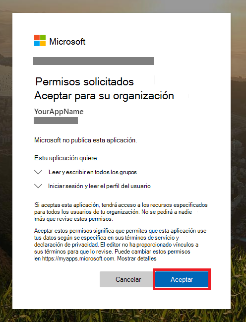
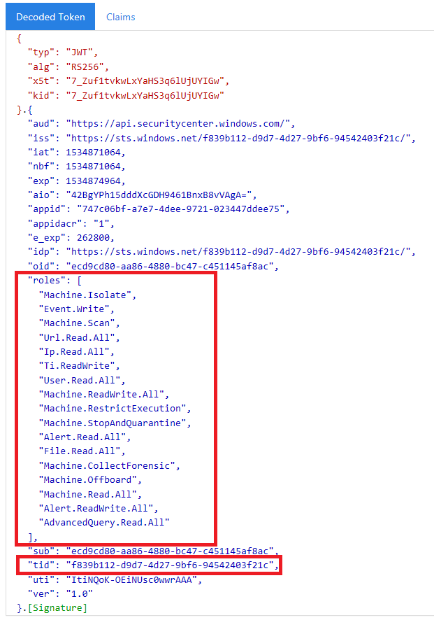

# <a name="partner-access-through-microsoft-defender-for-endpoint-apis"></a><span data-ttu-id="1f104-104">Acceso de partners a través de Microsoft Defender para api de punto de conexión</span><span class="sxs-lookup"><span data-stu-id="1f104-104">Partner access through Microsoft Defender for Endpoint APIs</span></span>

[!INCLUDE [Microsoft 365 Defender rebranding](../../includes/microsoft-defender.md)]


<span data-ttu-id="1f104-105">**Se aplica a:** [Microsoft Defender para endpoint](https://go.microsoft.com/fwlink/?linkid=2154037)</span><span class="sxs-lookup"><span data-stu-id="1f104-105">**Applies to:** [Microsoft Defender for Endpoint](https://go.microsoft.com/fwlink/?linkid=2154037)</span></span>

> <span data-ttu-id="1f104-106">¿Desea experimentar Microsoft Defender para endpoint?</span><span class="sxs-lookup"><span data-stu-id="1f104-106">Want to experience Microsoft Defender for Endpoint?</span></span> [<span data-ttu-id="1f104-107">Regístrate para obtener una versión de prueba gratuita.</span><span class="sxs-lookup"><span data-stu-id="1f104-107">Sign up for a free trial.</span></span>](https://www.microsoft.com/microsoft-365/windows/microsoft-defender-atp?ocid=docs-wdatp-exposedapis-abovefoldlink)

[!include[Microsoft Defender for Endpoint API URIs for US Government](../../includes/microsoft-defender-api-usgov.md)]

[!include[Improve request performance](../../includes/improve-request-performance.md)]

<span data-ttu-id="1f104-108">En esta página se describe cómo crear una aplicación de Azure Active Directory (Azure AD) para obtener acceso mediante programación a Microsoft Defender para endpoint en nombre de los clientes.</span><span class="sxs-lookup"><span data-stu-id="1f104-108">This page describes how to create an Azure Active Directory (Azure AD) application to get programmatic access to Microsoft Defender for Endpoint on behalf of your customers.</span></span>


<span data-ttu-id="1f104-109">Microsoft Defender para endpoint expone gran parte de sus datos y acciones a través de un conjunto de API programáticas.</span><span class="sxs-lookup"><span data-stu-id="1f104-109">Microsoft Defender for Endpoint exposes much of its data and actions through a set of programmatic APIs.</span></span> <span data-ttu-id="1f104-110">Estas API le ayudarán a automatizar los flujos de trabajo e innovar en función de las capacidades de Microsoft Defender para puntos de conexión.</span><span class="sxs-lookup"><span data-stu-id="1f104-110">Those APIs will help you automate work flows and innovate based on Microsoft Defender for Endpoint capabilities.</span></span> <span data-ttu-id="1f104-111">El acceso a la API requiere autenticación de OAuth2.0.</span><span class="sxs-lookup"><span data-stu-id="1f104-111">The API access requires OAuth2.0 authentication.</span></span> <span data-ttu-id="1f104-112">Para obtener más información, vea Flujo de código de autorización de [OAuth 2.0](https://docs.microsoft.com/azure/active-directory/develop/active-directory-v2-protocols-oauth-code).</span><span class="sxs-lookup"><span data-stu-id="1f104-112">For more information, see [OAuth 2.0 Authorization Code Flow](https://docs.microsoft.com/azure/active-directory/develop/active-directory-v2-protocols-oauth-code).</span></span>

<span data-ttu-id="1f104-113">En general, deberá seguir los pasos siguientes para usar las API:</span><span class="sxs-lookup"><span data-stu-id="1f104-113">In general, you’ll need to take the following steps to use the APIs:</span></span>
- <span data-ttu-id="1f104-114">Crear una aplicación de Azure AD **multiinquilino.**</span><span class="sxs-lookup"><span data-stu-id="1f104-114">Create a **multi-tenant** Azure AD application.</span></span>
- <span data-ttu-id="1f104-115">Obtenga autorización(consentimiento) por parte del administrador del cliente para que la aplicación obtenga acceso a Defender para los recursos de extremo que necesita.</span><span class="sxs-lookup"><span data-stu-id="1f104-115">Get authorized(consent) by your customer administrator for your application to access Defender for Endpoint resources it needs.</span></span>
- <span data-ttu-id="1f104-116">Obtener un token de acceso con esta aplicación.</span><span class="sxs-lookup"><span data-stu-id="1f104-116">Get an access token using this application.</span></span>
- <span data-ttu-id="1f104-117">Use el token para obtener acceso a Microsoft Defender para la API de punto de conexión.</span><span class="sxs-lookup"><span data-stu-id="1f104-117">Use the token to access Microsoft Defender for Endpoint API.</span></span>

<span data-ttu-id="1f104-118">Los siguientes pasos le guiarán sobre cómo crear una aplicación de Azure AD, obtener un token de acceso a Microsoft Defender para Endpoint y validar el token.</span><span class="sxs-lookup"><span data-stu-id="1f104-118">The following steps will guide you how to create an Azure AD application, get an access token to Microsoft Defender for Endpoint and validate the token.</span></span>

## <a name="create-the-multi-tenant-app"></a><span data-ttu-id="1f104-119">Crear la aplicación multiinquilino</span><span class="sxs-lookup"><span data-stu-id="1f104-119">Create the multi-tenant app</span></span>

1. <span data-ttu-id="1f104-120">Inicie sesión en el inquilino [de Azure](https://portal.azure.com) con el usuario que tenga el rol **De administrador** global.</span><span class="sxs-lookup"><span data-stu-id="1f104-120">Sign in to your [Azure tenant](https://portal.azure.com) with user that has **Global Administrator** role.</span></span>

2. <span data-ttu-id="1f104-121">Vaya a **Azure Active Directory** App  >  **registrations** New  >  **registration**.</span><span class="sxs-lookup"><span data-stu-id="1f104-121">Navigate to **Azure Active Directory** > **App registrations** > **New registration**.</span></span> 

   

3. <span data-ttu-id="1f104-123">En el formulario de registro:</span><span class="sxs-lookup"><span data-stu-id="1f104-123">In the registration form:</span></span>

    - <span data-ttu-id="1f104-124">Elija un nombre para la aplicación.</span><span class="sxs-lookup"><span data-stu-id="1f104-124">Choose a name for your application.</span></span>

    - <span data-ttu-id="1f104-125">Tipos de cuentas compatibles: cuentas en cualquier directorio de la organización.</span><span class="sxs-lookup"><span data-stu-id="1f104-125">Supported account types - accounts in any organizational directory.</span></span>

    - <span data-ttu-id="1f104-126">URI de redireccionamiento: tipo: Web, URI: https://portal.azure.com</span><span class="sxs-lookup"><span data-stu-id="1f104-126">Redirect URI - type: Web, URI: https://portal.azure.com</span></span>

    


4. <span data-ttu-id="1f104-128">Permitir que la aplicación tenga acceso a Microsoft Defender para endpoint y asignarla con el conjunto mínimo de permisos necesarios para completar la integración.</span><span class="sxs-lookup"><span data-stu-id="1f104-128">Allow your Application to access Microsoft Defender for Endpoint and assign it with the minimal set of permissions required to complete the integration.</span></span>

   - <span data-ttu-id="1f104-129">En la página de la aplicación, seleccione Permisos de **API** Agregar API de permisos que mi organización usa  >    >   > tipo **WindowsDefenderATP** y seleccione **en WindowsDefenderATP**.</span><span class="sxs-lookup"><span data-stu-id="1f104-129">On your application page, select **API Permissions** > **Add permission** > **APIs my organization uses** > type **WindowsDefenderATP** and select on **WindowsDefenderATP**.</span></span>

   - <span data-ttu-id="1f104-130">**Nota:** *WindowsDefenderATP* no aparece en la lista original.</span><span class="sxs-lookup"><span data-stu-id="1f104-130">**Note**: *WindowsDefenderATP* does not appear in the original list.</span></span> <span data-ttu-id="1f104-131">Comience a escribir su nombre en el cuadro de texto para verlo aparecer.</span><span class="sxs-lookup"><span data-stu-id="1f104-131">Start writing its name in the text box to see it appear.</span></span>

   
   
   ### <a name="request-api-permissions"></a><span data-ttu-id="1f104-133">Solicitar permisos de API</span><span class="sxs-lookup"><span data-stu-id="1f104-133">Request API permissions</span></span>

   <span data-ttu-id="1f104-134">Para determinar qué permiso necesita, revise la sección **Permisos** de la API a la que está interesado llamar.</span><span class="sxs-lookup"><span data-stu-id="1f104-134">To determine which permission you need, review the **Permissions** section in the API you are interested to call.</span></span> <span data-ttu-id="1f104-135">Por ejemplo:</span><span class="sxs-lookup"><span data-stu-id="1f104-135">For instance:</span></span>

   - <span data-ttu-id="1f104-136">Para [ejecutar consultas avanzadas,](run-advanced-query-api.md)seleccione el permiso "Ejecutar consultas avanzadas"</span><span class="sxs-lookup"><span data-stu-id="1f104-136">To [run advanced queries](run-advanced-query-api.md), select 'Run advanced queries' permission</span></span>
   
   - <span data-ttu-id="1f104-137">Para [aislar un dispositivo,](isolate-machine.md)seleccione el permiso "Aislar máquina"</span><span class="sxs-lookup"><span data-stu-id="1f104-137">To [isolate a device](isolate-machine.md), select 'Isolate machine' permission</span></span>

   <span data-ttu-id="1f104-138">En el siguiente ejemplo, usaremos el permiso **"Leer todas las** alertas":</span><span class="sxs-lookup"><span data-stu-id="1f104-138">In the following example we will use **'Read all alerts'** permission:</span></span>

   <span data-ttu-id="1f104-139">Elija **Permisos de aplicación**  >  **Alert.Read.All** > en Agregar **permisos**</span><span class="sxs-lookup"><span data-stu-id="1f104-139">Choose **Application permissions** > **Alert.Read.All** > select on **Add permissions**</span></span>

   


5. <span data-ttu-id="1f104-141">Seleccionar **Conceder consentimiento**</span><span class="sxs-lookup"><span data-stu-id="1f104-141">Select **Grant consent**</span></span>

    - <span data-ttu-id="1f104-142">**Nota:** Cada vez que agregue permiso, debe seleccionar conceder **el consentimiento** para que el nuevo permiso suba a efecto.</span><span class="sxs-lookup"><span data-stu-id="1f104-142">**Note**: Every time you add permission you must select on **Grant consent** for the new permission to take effect.</span></span>

    

6. <span data-ttu-id="1f104-144">Agregue un secreto a la aplicación.</span><span class="sxs-lookup"><span data-stu-id="1f104-144">Add a secret to the application.</span></span>

    - <span data-ttu-id="1f104-145">Seleccione **Certificados & secretos,** agregue una descripción al secreto y seleccione **Agregar**.</span><span class="sxs-lookup"><span data-stu-id="1f104-145">Select **Certificates & secrets**, add description to the secret and select **Add**.</span></span>

    <span data-ttu-id="1f104-146">**Importante:** Después de hacer clic en Agregar, **copie el valor secreto generado**.</span><span class="sxs-lookup"><span data-stu-id="1f104-146">**Important**: After click Add, **copy the generated secret value**.</span></span> <span data-ttu-id="1f104-147">No podrás recuperarlo después de salir.</span><span class="sxs-lookup"><span data-stu-id="1f104-147">You won't be able to retrieve after you leave!</span></span>

    

7. <span data-ttu-id="1f104-149">Anote el identificador de la aplicación:</span><span class="sxs-lookup"><span data-stu-id="1f104-149">Write down your application ID:</span></span>

   - <span data-ttu-id="1f104-150">En la página de la aplicación, vaya **a Información general** y copie la siguiente información:</span><span class="sxs-lookup"><span data-stu-id="1f104-150">On your application page, go to **Overview** and copy the following information:</span></span>

   

8. <span data-ttu-id="1f104-152">Agregue la aplicación al inquilino del cliente.</span><span class="sxs-lookup"><span data-stu-id="1f104-152">Add the application to your customer's tenant.</span></span>

    <span data-ttu-id="1f104-153">Necesita que la aplicación se apruebe en cada inquilino del cliente en el que tenga previsto usarlo.</span><span class="sxs-lookup"><span data-stu-id="1f104-153">You need your application to be approved in each customer tenant where you intend to use it.</span></span> <span data-ttu-id="1f104-154">Esto se debe a que la aplicación interactúa con la aplicación de Microsoft Defender para endpoint en nombre del cliente.</span><span class="sxs-lookup"><span data-stu-id="1f104-154">This is because your application interacts with Microsoft Defender for Endpoint application on behalf of your customer.</span></span>

    <span data-ttu-id="1f104-155">Un usuario con **administrador global** del inquilino del cliente debe seleccionar el vínculo de consentimiento y aprobar la aplicación.</span><span class="sxs-lookup"><span data-stu-id="1f104-155">A user with **Global Administrator** from your customer's tenant need to select the consent link and approve your application.</span></span>

    <span data-ttu-id="1f104-156">El vínculo de consentimiento es del formulario:</span><span class="sxs-lookup"><span data-stu-id="1f104-156">Consent link is of the form:</span></span>

    ```
    https://login.microsoftonline.com/common/oauth2/authorize?prompt=consent&client_id=00000000-0000-0000-0000-000000000000&response_type=code&sso_reload=true
    ```

    <span data-ttu-id="1f104-157">Donde 00000000-0000-0000-0000-000000000000000000 debe reemplazarse por su id. de aplicación</span><span class="sxs-lookup"><span data-stu-id="1f104-157">Where 00000000-0000-0000-0000-000000000000 should be replaced with your Application ID</span></span>

    <span data-ttu-id="1f104-158">Después de hacer clic en el vínculo de consentimiento, inicie sesión con el administrador global del inquilino del cliente y consiente la aplicación.</span><span class="sxs-lookup"><span data-stu-id="1f104-158">After clicking on the consent link, sign in with the Global Administrator of the customer's tenant and consent the application.</span></span>

    

    <span data-ttu-id="1f104-160">Además, deberá pedir al cliente su identificador de inquilino y guardarlo para usarlo en el futuro al adquirir el token.</span><span class="sxs-lookup"><span data-stu-id="1f104-160">In addition, you will need to ask your customer for their tenant ID and save it for future use when acquiring the token.</span></span>

- <span data-ttu-id="1f104-161">**¡Listo!**</span><span class="sxs-lookup"><span data-stu-id="1f104-161">**Done!**</span></span> <span data-ttu-id="1f104-162">Ha registrado correctamente una aplicación.</span><span class="sxs-lookup"><span data-stu-id="1f104-162">You have successfully registered an application!</span></span> 
- <span data-ttu-id="1f104-163">Vea ejemplos a continuación para la adquisición y validación de tokens.</span><span class="sxs-lookup"><span data-stu-id="1f104-163">See examples below for token acquisition and validation.</span></span>

## <a name="get-an-access-token-example"></a><span data-ttu-id="1f104-164">Obtenga un ejemplo de token de acceso:</span><span class="sxs-lookup"><span data-stu-id="1f104-164">Get an access token example:</span></span>

<span data-ttu-id="1f104-165">**Nota:** Para obtener el token de acceso en nombre de su cliente, use el identificador de inquilino del cliente en las siguientes adquisiciones de tokens.</span><span class="sxs-lookup"><span data-stu-id="1f104-165">**Note:** To get access token on behalf of your customer, use the customer's tenant ID on the following token acquisitions.</span></span>

<br><span data-ttu-id="1f104-166">Para obtener más información sobre el token de AAD, vea [tutorial de AAD](https://docs.microsoft.com/azure/active-directory/develop/active-directory-v2-protocols-oauth-client-creds)</span><span class="sxs-lookup"><span data-stu-id="1f104-166">For more information on AAD token, see [AAD tutorial](https://docs.microsoft.com/azure/active-directory/develop/active-directory-v2-protocols-oauth-client-creds)</span></span>

### <a name="using-powershell"></a><span data-ttu-id="1f104-167">Mediante PowerShell</span><span class="sxs-lookup"><span data-stu-id="1f104-167">Using PowerShell</span></span>

```
# That code gets the App Context Token and save it to a file named "Latest-token.txt" under the current directory
# Paste below your Tenant ID, App ID and App Secret (App key).

$tenantId = '' ### Paste your tenant ID here
$appId = '' ### Paste your Application ID here
$appSecret = '' ### Paste your Application key here

$resourceAppIdUri = 'https://api.securitycenter.microsoft.com'
$oAuthUri = "https://login.microsoftonline.com/$TenantId/oauth2/token"
$authBody = [Ordered] @{
    resource = "$resourceAppIdUri"
    client_id = "$appId"
    client_secret = "$appSecret"
    grant_type = 'client_credentials'
}
$authResponse = Invoke-RestMethod -Method Post -Uri $oAuthUri -Body $authBody -ErrorAction Stop
$token = $authResponse.access_token
Out-File -FilePath "./Latest-token.txt" -InputObject $token
return $token
```

### <a name="using-c"></a><span data-ttu-id="1f104-168">Usar C#:</span><span class="sxs-lookup"><span data-stu-id="1f104-168">Using C#:</span></span>

><span data-ttu-id="1f104-169">El código siguiente se ha probado con Nuget Microsoft.IdentityModel.Clients.ActiveDirectory</span><span class="sxs-lookup"><span data-stu-id="1f104-169">The below code was tested with Nuget Microsoft.IdentityModel.Clients.ActiveDirectory</span></span>

- <span data-ttu-id="1f104-170">Crear una nueva aplicación de consola</span><span class="sxs-lookup"><span data-stu-id="1f104-170">Create a new Console Application</span></span>
- <span data-ttu-id="1f104-171">Instalar NuGet [Microsoft.IdentityModel.Clients.ActiveDirectory](https://www.nuget.org/packages/Microsoft.IdentityModel.Clients.ActiveDirectory/)</span><span class="sxs-lookup"><span data-stu-id="1f104-171">Install NuGet [Microsoft.IdentityModel.Clients.ActiveDirectory](https://www.nuget.org/packages/Microsoft.IdentityModel.Clients.ActiveDirectory/)</span></span>
- <span data-ttu-id="1f104-172">Agregar el siguiente uso</span><span class="sxs-lookup"><span data-stu-id="1f104-172">Add the below using</span></span>

    ```
    using Microsoft.IdentityModel.Clients.ActiveDirectory;
    ```

- <span data-ttu-id="1f104-173">Copie o pegue el código siguiente en la aplicación (no olvide actualizar las tres variables: ```tenantId, appId, appSecret``` )</span><span class="sxs-lookup"><span data-stu-id="1f104-173">Copy/Paste the below code in your application (do not forget to update the three variables: ```tenantId, appId, appSecret```)</span></span>

    ```
    string tenantId = "00000000-0000-0000-0000-000000000000"; // Paste your own tenant ID here
    string appId = "11111111-1111-1111-1111-111111111111"; // Paste your own app ID here
    string appSecret = "22222222-2222-2222-2222-222222222222"; // Paste your own app secret here for a test, and then store it in a safe place! 

    const string authority = "https://login.microsoftonline.com";
    const string wdatpResourceId = "https://api.securitycenter.microsoft.com";

    AuthenticationContext auth = new AuthenticationContext($"{authority}/{tenantId}/");
    ClientCredential clientCredential = new ClientCredential(appId, appSecret);
    AuthenticationResult authenticationResult = auth.AcquireTokenAsync(wdatpResourceId, clientCredential).GetAwaiter().GetResult();
    string token = authenticationResult.AccessToken;
    ```


### <a name="using-python"></a><span data-ttu-id="1f104-174">Uso de Python</span><span class="sxs-lookup"><span data-stu-id="1f104-174">Using Python</span></span>

<span data-ttu-id="1f104-175">Consulte Obtener [token con Python](run-advanced-query-sample-python.md#get-token)</span><span class="sxs-lookup"><span data-stu-id="1f104-175">Refer to [Get token using Python](run-advanced-query-sample-python.md#get-token)</span></span>

### <a name="using-curl"></a><span data-ttu-id="1f104-176">Uso de Rizos</span><span class="sxs-lookup"><span data-stu-id="1f104-176">Using Curl</span></span>

> [!NOTE]
> <span data-ttu-id="1f104-177">El siguiente procedimiento supone que Curl para Windows ya está instalado en el equipo</span><span class="sxs-lookup"><span data-stu-id="1f104-177">The below procedure supposed Curl for Windows is already installed on your computer</span></span>

- <span data-ttu-id="1f104-178">Abrir una ventana de comandos</span><span class="sxs-lookup"><span data-stu-id="1f104-178">Open a command window</span></span>
- <span data-ttu-id="1f104-179">Establecer CLIENT_ID en el identificador de aplicación de Azure</span><span class="sxs-lookup"><span data-stu-id="1f104-179">Set CLIENT_ID to your Azure application ID</span></span>
- <span data-ttu-id="1f104-180">Establecer CLIENT_SECRET en el secreto de aplicación de Azure</span><span class="sxs-lookup"><span data-stu-id="1f104-180">Set CLIENT_SECRET to your Azure application secret</span></span>
- <span data-ttu-id="1f104-181">Establezca TENANT_ID el identificador de inquilino de Azure del cliente que desea usar la aplicación para obtener acceso a la aplicación de Microsoft Defender para endpoint</span><span class="sxs-lookup"><span data-stu-id="1f104-181">Set TENANT_ID to the Azure tenant ID of the customer that wants to use your application to access Microsoft Defender for Endpoint application</span></span>
- <span data-ttu-id="1f104-182">Ejecute el comando siguiente:</span><span class="sxs-lookup"><span data-stu-id="1f104-182">Run the below command:</span></span>

```
curl -i -X POST -H "Content-Type:application/x-www-form-urlencoded" -d "grant_type=client_credentials" -d "client_id=%CLIENT_ID%" -d "scope=https://securitycenter.onmicrosoft.com/windowsatpservice/.default" -d "client_secret=%CLIENT_SECRET%" "https://login.microsoftonline.com/%TENANT_ID%/oauth2/v2.0/token" -k
```

<span data-ttu-id="1f104-183">Recibirá una respuesta del formulario:</span><span class="sxs-lookup"><span data-stu-id="1f104-183">You will get an answer of the form:</span></span>

```
{"token_type":"Bearer","expires_in":3599,"ext_expires_in":0,"access_token":"eyJ0eXAiOiJKV1QiLCJhbGciOiJSUzI1NiIsIn <truncated> aWReH7P0s0tjTBX8wGWqJUdDA"}
```

## <a name="validate-the-token"></a><span data-ttu-id="1f104-184">Validar el token</span><span class="sxs-lookup"><span data-stu-id="1f104-184">Validate the token</span></span>

<span data-ttu-id="1f104-185">Comprobación de la cordura para asegurarse de que tiene un token correcto:</span><span class="sxs-lookup"><span data-stu-id="1f104-185">Sanity check to make sure you got a correct token:</span></span>
- <span data-ttu-id="1f104-186">Copiar y pegar en [JWT el](https://jwt.ms) token que obtienes en el paso anterior para descodificarlo</span><span class="sxs-lookup"><span data-stu-id="1f104-186">Copy/paste into [JWT](https://jwt.ms) the token you get in the previous step in order to decode it</span></span>
- <span data-ttu-id="1f104-187">Validar que obtiene una notificación de "roles" con los permisos deseados</span><span class="sxs-lookup"><span data-stu-id="1f104-187">Validate you get a 'roles' claim with the desired permissions</span></span>
- <span data-ttu-id="1f104-188">En la captura de pantalla siguiente, puedes ver un token descodificado adquirido de una aplicación con varios permisos para Microsoft Defender para endpoint:</span><span class="sxs-lookup"><span data-stu-id="1f104-188">In the screenshot below, you can see a decoded token acquired from an Application with multiple permissions to  Microsoft Defender for Endpoint:</span></span>
- <span data-ttu-id="1f104-189">La notificación "tid" es el identificador de inquilino al que pertenece el token.</span><span class="sxs-lookup"><span data-stu-id="1f104-189">The "tid" claim is the tenant ID the token belongs to.</span></span>



## <a name="use-the-token-to-access-microsoft-defender-for-endpoint-api"></a><span data-ttu-id="1f104-191">Usar el token para obtener acceso a la API de Microsoft Defender para endpoint</span><span class="sxs-lookup"><span data-stu-id="1f104-191">Use the token to access Microsoft Defender for Endpoint API</span></span>

- <span data-ttu-id="1f104-192">Elija la API que desea usar, para obtener más información, vea [Supported Microsoft Defender for Endpoint API](exposed-apis-list.md)</span><span class="sxs-lookup"><span data-stu-id="1f104-192">Choose the API you want to use, for more information, see [Supported Microsoft Defender for Endpoint APIs](exposed-apis-list.md)</span></span>
- <span data-ttu-id="1f104-193">Establezca el encabezado Authorization en la solicitud Http que envíe a "Bearer {token}" (El portador es el esquema de autorización)</span><span class="sxs-lookup"><span data-stu-id="1f104-193">Set the Authorization header in the Http request you send to "Bearer {token}" (Bearer is the Authorization scheme)</span></span>
- <span data-ttu-id="1f104-194">El tiempo de expiración del token es de 1 hora (puede enviar más de una solicitud con el mismo token)</span><span class="sxs-lookup"><span data-stu-id="1f104-194">The Expiration time of the token is 1 hour (you can send more than one request with the same token)</span></span>

- <span data-ttu-id="1f104-195">Ejemplo de envío de una solicitud para obtener una lista de alertas **mediante C#**</span><span class="sxs-lookup"><span data-stu-id="1f104-195">Example of sending a request to get a list of alerts **using C#**</span></span> 
    ```
    var httpClient = new HttpClient();

    var request = new HttpRequestMessage(HttpMethod.Get, "https://api.securitycenter.microsoft.com/api/alerts");

    request.Headers.Authorization = new AuthenticationHeaderValue("Bearer", token);

    var response = httpClient.SendAsync(request).GetAwaiter().GetResult();

    // Do something useful with the response
    ```

## <a name="see-also"></a><span data-ttu-id="1f104-196">Vea también</span><span class="sxs-lookup"><span data-stu-id="1f104-196">See also</span></span>
- [<span data-ttu-id="1f104-197">Compatible con Microsoft Defender para LAS API de punto de conexión</span><span class="sxs-lookup"><span data-stu-id="1f104-197">Supported Microsoft Defender for Endpoint APIs</span></span>](exposed-apis-list.md)
- [<span data-ttu-id="1f104-198">Access Microsoft Defender for Endpoint en nombre de un usuario</span><span class="sxs-lookup"><span data-stu-id="1f104-198">Access Microsoft Defender for Endpoint on behalf of a user</span></span>](exposed-apis-create-app-nativeapp.md)
