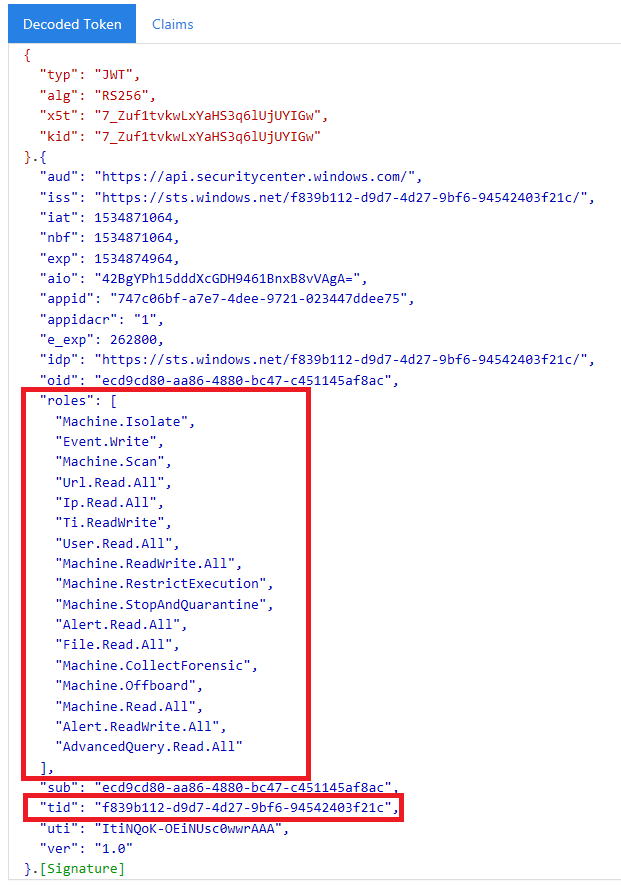

# <a name="create-an-app-to-access-microsoft-defender-for-endpoint-without-a-user"></a><span data-ttu-id="86b3d-104">Crear una aplicación para tener acceso a Microsoft Defender para endpoint sin un usuario</span><span class="sxs-lookup"><span data-stu-id="86b3d-104">Create an app to access Microsoft Defender for Endpoint without a user</span></span>

[!INCLUDE [Microsoft 365 Defender rebranding](../../includes/microsoft-defender.md)]


<span data-ttu-id="86b3d-105">**Se aplica a:** [Microsoft Defender para endpoint](https://go.microsoft.com/fwlink/?linkid=2154037)</span><span class="sxs-lookup"><span data-stu-id="86b3d-105">**Applies to:** [Microsoft Defender for Endpoint](https://go.microsoft.com/fwlink/?linkid=2154037)</span></span>

- <span data-ttu-id="86b3d-106">¿Desea experimentar Microsoft Defender para endpoint?</span><span class="sxs-lookup"><span data-stu-id="86b3d-106">Want to experience Microsoft Defender for Endpoint?</span></span> [<span data-ttu-id="86b3d-107">Regístrate para obtener una versión de prueba gratuita.</span><span class="sxs-lookup"><span data-stu-id="86b3d-107">Sign up for a free trial.</span></span>](https://www.microsoft.com/microsoft-365/windows/microsoft-defender-atp?ocid=docs-wdatp-exposedapis-abovefoldlink)

[!include[Microsoft Defender for Endpoint API URIs for US Government](../../includes/microsoft-defender-api-usgov.md)]

[!include[Improve request performance](../../includes/improve-request-performance.md)]

<span data-ttu-id="86b3d-108">En esta página se describe cómo crear una aplicación para obtener acceso mediante programación a Defender for Endpoint sin un usuario.</span><span class="sxs-lookup"><span data-stu-id="86b3d-108">This page describes how to create an application to get programmatic access to Defender for Endpoint without a user.</span></span> <span data-ttu-id="86b3d-109">Si necesita acceso mediante programación a Defender for Endpoint en nombre de un usuario, vea [Obtener acceso con contexto de usuario](exposed-apis-create-app-nativeapp.md).</span><span class="sxs-lookup"><span data-stu-id="86b3d-109">If you need programmatic access to Defender for Endpoint on behalf of a user, see [Get access with user context](exposed-apis-create-app-nativeapp.md).</span></span> <span data-ttu-id="86b3d-110">Si no está seguro de qué acceso necesita, vea [Introducción.](apis-intro.md)</span><span class="sxs-lookup"><span data-stu-id="86b3d-110">If you are not sure which access you need, see [Get started](apis-intro.md).</span></span>

<span data-ttu-id="86b3d-111">Microsoft Defender para endpoint expone gran parte de sus datos y acciones a través de un conjunto de API programáticas.</span><span class="sxs-lookup"><span data-stu-id="86b3d-111">Microsoft Defender for Endpoint exposes much of its data and actions through a set of programmatic APIs.</span></span> <span data-ttu-id="86b3d-112">Estas API le ayudarán a automatizar los flujos de trabajo e innovar en función de las capacidades de Defender para endpoints.</span><span class="sxs-lookup"><span data-stu-id="86b3d-112">Those APIs will help you automate work flows and innovate based on Defender for Endpoint capabilities.</span></span> <span data-ttu-id="86b3d-113">El acceso a la API requiere autenticación de OAuth2.0.</span><span class="sxs-lookup"><span data-stu-id="86b3d-113">The API access requires OAuth2.0 authentication.</span></span> <span data-ttu-id="86b3d-114">Para obtener más información, vea Flujo de código de autorización de [OAuth 2.0](https://docs.microsoft.com/azure/active-directory/develop/active-directory-v2-protocols-oauth-code).</span><span class="sxs-lookup"><span data-stu-id="86b3d-114">For more information, see [OAuth 2.0 Authorization Code Flow](https://docs.microsoft.com/azure/active-directory/develop/active-directory-v2-protocols-oauth-code).</span></span>

<span data-ttu-id="86b3d-115">En general, deberá seguir los pasos siguientes para usar las API:</span><span class="sxs-lookup"><span data-stu-id="86b3d-115">In general, you’ll need to take the following steps to use the APIs:</span></span>
- <span data-ttu-id="86b3d-116">Crear una aplicación de Azure Active Directory (Azure AD).</span><span class="sxs-lookup"><span data-stu-id="86b3d-116">Create an Azure Active Directory (Azure AD) application.</span></span>
- <span data-ttu-id="86b3d-117">Obtener un token de acceso con esta aplicación.</span><span class="sxs-lookup"><span data-stu-id="86b3d-117">Get an access token using this application.</span></span>
- <span data-ttu-id="86b3d-118">Use el token para obtener acceso a la API de Defender for Endpoint.</span><span class="sxs-lookup"><span data-stu-id="86b3d-118">Use the token to access Defender for Endpoint API.</span></span>

<span data-ttu-id="86b3d-119">En este artículo se explica cómo crear una aplicación de Azure AD, obtener un token de acceso a Microsoft Defender para Endpoint y validar el token.</span><span class="sxs-lookup"><span data-stu-id="86b3d-119">This article explains how to create an Azure AD application, get an access token to Microsoft Defender for Endpoint, and validate the token.</span></span>

## <a name="create-an-app"></a><span data-ttu-id="86b3d-120">Crear una aplicación</span><span class="sxs-lookup"><span data-stu-id="86b3d-120">Create an app</span></span>

1. <span data-ttu-id="86b3d-121">Inicie sesión en [Azure](https://portal.azure.com) con un usuario que tenga el rol **De administrador** global.</span><span class="sxs-lookup"><span data-stu-id="86b3d-121">Log on to [Azure](https://portal.azure.com) with a user that has the **Global Administrator** role.</span></span>

2. <span data-ttu-id="86b3d-122">Vaya a **Azure Active Directory** App  >  **registrations** New  >  **registration**.</span><span class="sxs-lookup"><span data-stu-id="86b3d-122">Navigate to **Azure Active Directory** > **App registrations** > **New registration**.</span></span> 

   

3. <span data-ttu-id="86b3d-124">En el formulario de registro, elija un nombre para la aplicación y, a continuación, **seleccione Registrar**.</span><span class="sxs-lookup"><span data-stu-id="86b3d-124">In the registration form, choose a name for your application, and then select **Register**.</span></span>

4. <span data-ttu-id="86b3d-125">Para habilitar la aplicación para tener acceso a Defender for Endpoint y asignarle el permiso **"Leer** todas las **alertas",** en la página de la aplicación, seleccione Permisos de api Agregar api de permisos que mi organización usa >, escriba WindowsDefenderATP y, a continuación,  >    >   **seleccione WindowsDefenderATP**. </span><span class="sxs-lookup"><span data-stu-id="86b3d-125">To enable your app to access Defender for Endpoint and assign it **'Read all alerts'** permission, on your application page, select **API Permissions** > **Add permission** > **APIs my organization uses** >, type **WindowsDefenderATP**, and then select **WindowsDefenderATP**.</span></span>

   > [!NOTE]
   > <span data-ttu-id="86b3d-126">*WindowsDefenderATP* no aparece en la lista original.</span><span class="sxs-lookup"><span data-stu-id="86b3d-126">*WindowsDefenderATP* does not appear in the original list.</span></span> <span data-ttu-id="86b3d-127">Comience a escribir su nombre en el cuadro de texto para verlo aparecer.</span><span class="sxs-lookup"><span data-stu-id="86b3d-127">Start writing its name in the text box to see it appear.</span></span>

   

   - <span data-ttu-id="86b3d-129">Seleccione **Permisos de aplicación**  >  **Alert.Read.All** y, a continuación, seleccione Agregar **permisos**.</span><span class="sxs-lookup"><span data-stu-id="86b3d-129">Select **Application permissions** > **Alert.Read.All**, and then select **Add permissions**.</span></span>

   

     <span data-ttu-id="86b3d-131">Debe seleccionar los permisos pertinentes.</span><span class="sxs-lookup"><span data-stu-id="86b3d-131">You need to select the relevant permissions.</span></span> <span data-ttu-id="86b3d-132">"Leer todas las alertas" es solo un ejemplo.</span><span class="sxs-lookup"><span data-stu-id="86b3d-132">'Read All Alerts' is only an example.</span></span> <span data-ttu-id="86b3d-133">Por ejemplo:</span><span class="sxs-lookup"><span data-stu-id="86b3d-133">For instance:</span></span>

     - <span data-ttu-id="86b3d-134">Para [ejecutar consultas avanzadas,](run-advanced-query-api.md)seleccione el permiso "Ejecutar consultas avanzadas".</span><span class="sxs-lookup"><span data-stu-id="86b3d-134">To [run advanced queries](run-advanced-query-api.md), select the 'Run advanced queries' permission.</span></span>
     - <span data-ttu-id="86b3d-135">Para [aislar un dispositivo,](isolate-machine.md)seleccione el permiso "Aislar máquina".</span><span class="sxs-lookup"><span data-stu-id="86b3d-135">To [isolate a device](isolate-machine.md), select the 'Isolate machine' permission.</span></span>
     - <span data-ttu-id="86b3d-136">Para determinar qué permiso necesita, consulte la sección **Permisos** de la API a la que le interesa llamar.</span><span class="sxs-lookup"><span data-stu-id="86b3d-136">To determine which permission you need, look at the **Permissions** section in the API you are interested to call.</span></span>

5. <span data-ttu-id="86b3d-137">Seleccione **Conceder consentimiento**.</span><span class="sxs-lookup"><span data-stu-id="86b3d-137">Select **Grant consent**.</span></span>

     > [!NOTE]
     > <span data-ttu-id="86b3d-138">Cada vez que agregue un permiso, debe seleccionar Conceder **consentimiento** para que el nuevo permiso suba a efecto.</span><span class="sxs-lookup"><span data-stu-id="86b3d-138">Every time you add a permission, you must select **Grant consent** for the new permission to take effect.</span></span>

    

6. <span data-ttu-id="86b3d-140">Para agregar un secreto a la aplicación, seleccione Certificados **& secretos,** agregue una descripción al secreto y, a continuación, **seleccione Agregar**.</span><span class="sxs-lookup"><span data-stu-id="86b3d-140">To add a secret to the application, select **Certificates & secrets**, add a description to the secret, and then select **Add**.</span></span>

    > [!NOTE]
    > <span data-ttu-id="86b3d-141">Después de seleccionar **Agregar**, seleccione **copiar el valor secreto generado**.</span><span class="sxs-lookup"><span data-stu-id="86b3d-141">After you select **Add**, select **copy the generated secret value**.</span></span> <span data-ttu-id="86b3d-142">No podrá recuperar este valor después de salir.</span><span class="sxs-lookup"><span data-stu-id="86b3d-142">You won't be able to retrieve this value after you leave.</span></span>

    

7. <span data-ttu-id="86b3d-144">Anote el identificador de aplicación y el identificador de inquilino.</span><span class="sxs-lookup"><span data-stu-id="86b3d-144">Write down your application ID and your tenant ID.</span></span> <span data-ttu-id="86b3d-145">En la página de la aplicación, vaya a **Información general** y copie lo siguiente.</span><span class="sxs-lookup"><span data-stu-id="86b3d-145">On your application page, go to **Overview** and copy the following.</span></span>

   

8. <span data-ttu-id="86b3d-147">**Solo para Microsoft Defender para socios de punto de conexión**.</span><span class="sxs-lookup"><span data-stu-id="86b3d-147">**For Microsoft Defender for Endpoint Partners only**.</span></span> <span data-ttu-id="86b3d-148">Establece la aplicación para que sea multiinquilino (disponible en todos los inquilinos después del consentimiento).</span><span class="sxs-lookup"><span data-stu-id="86b3d-148">Set your app to be multi-tenanted (available in all tenants after consent).</span></span> <span data-ttu-id="86b3d-149">Esto es **necesario para** aplicaciones de terceros (por ejemplo, si creas una aplicación destinada a ejecutarse en el inquilino de varios clientes).</span><span class="sxs-lookup"><span data-stu-id="86b3d-149">This is **required** for third-party apps (for example, if you create an app that is intended to run in multiple customers' tenant).</span></span> <span data-ttu-id="86b3d-150">Esto no **es** necesario si crea un servicio que desea ejecutar solo en el espacio empresarial (por ejemplo, si crea una aplicación para su propio uso que solo interactuará con sus propios datos).</span><span class="sxs-lookup"><span data-stu-id="86b3d-150">This is **not required** if you create a service that you want to run in your tenant only (for example, if you create an application for your own usage that will only interact with your own data).</span></span> <span data-ttu-id="86b3d-151">Para establecer la aplicación como multiinquilino:</span><span class="sxs-lookup"><span data-stu-id="86b3d-151">To set your app to be multi-tenanted:</span></span>

    - <span data-ttu-id="86b3d-152">Vaya a **Autenticación** y agregue `https://portal.azure.com` como uri de **redireccionamiento**.</span><span class="sxs-lookup"><span data-stu-id="86b3d-152">Go to **Authentication**, and add `https://portal.azure.com` as the **Redirect URI**.</span></span>

    - <span data-ttu-id="86b3d-153">En la parte inferior de la página, en **Tipos** de cuenta admitidos, seleccione el consentimiento **cuentas** en cualquier aplicación de directorio de la organización para la aplicación multiinquilino.</span><span class="sxs-lookup"><span data-stu-id="86b3d-153">On the bottom of the page, under **Supported account types**, select the **Accounts in any organizational directory** application consent for your multi-tenant app.</span></span>

    <span data-ttu-id="86b3d-154">Necesita que la aplicación se apruebe en cada inquilino en el que tenga previsto usarlo.</span><span class="sxs-lookup"><span data-stu-id="86b3d-154">You need your application to be approved in each tenant where you intend to use it.</span></span> <span data-ttu-id="86b3d-155">Esto se debe a que la aplicación interactúa con Defender for Endpoint en nombre del cliente.</span><span class="sxs-lookup"><span data-stu-id="86b3d-155">This is because your application interacts Defender for Endpoint on behalf of your customer.</span></span>

    <span data-ttu-id="86b3d-156">Tú (o tu cliente si estás escribiendo una aplicación de terceros) debes seleccionar el vínculo de consentimiento y aprobar la aplicación.</span><span class="sxs-lookup"><span data-stu-id="86b3d-156">You (or your customer if you are writing a third-party app) need to select the consent link and approve your app.</span></span> <span data-ttu-id="86b3d-157">El consentimiento debe realizarse con un usuario que tenga privilegios administrativos en Active Directory.</span><span class="sxs-lookup"><span data-stu-id="86b3d-157">The consent should be done with a user who has administrative privileges in Active Directory.</span></span>

    <span data-ttu-id="86b3d-158">El vínculo de consentimiento se forma de la siguiente manera:</span><span class="sxs-lookup"><span data-stu-id="86b3d-158">The consent link is formed as follows:</span></span> 

    ```
    https://login.microsoftonline.com/common/oauth2/authorize?prompt=consent&client_id=00000000-0000-0000-0000-000000000000&response_type=code&sso_reload=true
    ```

    <span data-ttu-id="86b3d-159">Donde 00000000-0000-0000-0000-0000000000000000000000000000000000000000000000000000000000000000000000000000 se reemplaza por el identificador de aplicación.</span><span class="sxs-lookup"><span data-stu-id="86b3d-159">Where 00000000-0000-0000-0000-000000000000 is replaced with your application ID.</span></span>


<span data-ttu-id="86b3d-160">**¡Listo!**</span><span class="sxs-lookup"><span data-stu-id="86b3d-160">**Done!**</span></span> <span data-ttu-id="86b3d-161">Ha registrado correctamente una aplicación.</span><span class="sxs-lookup"><span data-stu-id="86b3d-161">You have successfully registered an application!</span></span> <span data-ttu-id="86b3d-162">Vea ejemplos a continuación para la adquisición y validación de tokens.</span><span class="sxs-lookup"><span data-stu-id="86b3d-162">See examples below for token acquisition and validation.</span></span>

## <a name="get-an-access-token"></a><span data-ttu-id="86b3d-163">Obtener un token de acceso</span><span class="sxs-lookup"><span data-stu-id="86b3d-163">Get an access token</span></span>

<span data-ttu-id="86b3d-164">Para obtener más información sobre los tokens de Azure AD, consulte el [tutorial de Azure AD](https://docs.microsoft.com/azure/active-directory/develop/active-directory-v2-protocols-oauth-client-creds).</span><span class="sxs-lookup"><span data-stu-id="86b3d-164">For more information on Azure AD tokens, see the [Azure AD tutorial](https://docs.microsoft.com/azure/active-directory/develop/active-directory-v2-protocols-oauth-client-creds).</span></span>

### <a name="use-powershell"></a><span data-ttu-id="86b3d-165">Usar PowerShell</span><span class="sxs-lookup"><span data-stu-id="86b3d-165">Use PowerShell</span></span>

```powershell
# This script acquires the App Context Token and stores it in the variable $token for later use in the script.
# Paste your Tenant ID, App ID, and App Secret (App key) into the indicated quotes below.

$tenantId = '' ### Paste your tenant ID here
$appId = '' ### Paste your Application ID here
$appSecret = '' ### Paste your Application key here

$resourceAppIdUri = 'https://api.securitycenter.microsoft.com'
$oAuthUri = "https://login.microsoftonline.com/$TenantId/oauth2/token"
$authBody = [Ordered] @{
    resource = "$resourceAppIdUri"
    client_id = "$appId"
    client_secret = "$appSecret"
    grant_type = 'client_credentials'
}
$authResponse = Invoke-RestMethod -Method Post -Uri $oAuthUri -Body $authBody -ErrorAction Stop
$token = $authResponse.access_token
```

### <a name="use-c"></a><span data-ttu-id="86b3d-166">Use C#:</span><span class="sxs-lookup"><span data-stu-id="86b3d-166">Use C#:</span></span>

<span data-ttu-id="86b3d-167">El código siguiente se ha probado con NuGet Microsoft.IdentityModel.Clients.ActiveDirectory 3.19.8.</span><span class="sxs-lookup"><span data-stu-id="86b3d-167">The following code was tested with NuGet Microsoft.IdentityModel.Clients.ActiveDirectory 3.19.8.</span></span>

1. <span data-ttu-id="86b3d-168">Crear una nueva aplicación de consola.</span><span class="sxs-lookup"><span data-stu-id="86b3d-168">Create a new console application.</span></span>
1. <span data-ttu-id="86b3d-169">Instalar NuGet [Microsoft.IdentityModel.Clients.ActiveDirectory](https://www.nuget.org/packages/Microsoft.IdentityModel.Clients.ActiveDirectory/).</span><span class="sxs-lookup"><span data-stu-id="86b3d-169">Install NuGet [Microsoft.IdentityModel.Clients.ActiveDirectory](https://www.nuget.org/packages/Microsoft.IdentityModel.Clients.ActiveDirectory/).</span></span>
1. <span data-ttu-id="86b3d-170">Agregue lo siguiente:</span><span class="sxs-lookup"><span data-stu-id="86b3d-170">Add the following:</span></span>

    ```
    using Microsoft.IdentityModel.Clients.ActiveDirectory;
    ```

1. <span data-ttu-id="86b3d-171">Copie y pegue el siguiente código en la aplicación (no olvide actualizar las tres variables: ```tenantId, appId, appSecret``` ):</span><span class="sxs-lookup"><span data-stu-id="86b3d-171">Copy and paste the following code in your app (don't forget to update the three variables: ```tenantId, appId, appSecret```):</span></span>

    ```
    string tenantId = "00000000-0000-0000-0000-000000000000"; // Paste your own tenant ID here
    string appId = "11111111-1111-1111-1111-111111111111"; // Paste your own app ID here
    string appSecret = "22222222-2222-2222-2222-222222222222"; // Paste your own app secret here for a test, and then store it in a safe place! 

    const string authority = "https://login.microsoftonline.com";
    const string wdatpResourceId = "https://api.securitycenter.microsoft.com";

    AuthenticationContext auth = new AuthenticationContext($"{authority}/{tenantId}/");
    ClientCredential clientCredential = new ClientCredential(appId, appSecret);
    AuthenticationResult authenticationResult = auth.AcquireTokenAsync(wdatpResourceId, clientCredential).GetAwaiter().GetResult();
    string token = authenticationResult.AccessToken;
    ```


### <a name="use-python"></a><span data-ttu-id="86b3d-172">Usar Python</span><span class="sxs-lookup"><span data-stu-id="86b3d-172">Use Python</span></span>

<span data-ttu-id="86b3d-173">Consulta [Obtener token con Python](run-advanced-query-sample-python.md#get-token).</span><span class="sxs-lookup"><span data-stu-id="86b3d-173">See [Get token using Python](run-advanced-query-sample-python.md#get-token).</span></span>

### <a name="use-curl"></a><span data-ttu-id="86b3d-174">Usar El rizo</span><span class="sxs-lookup"><span data-stu-id="86b3d-174">Use Curl</span></span>

> [!NOTE]
> <span data-ttu-id="86b3d-175">En el siguiente procedimiento se supone que Curl para Windows ya está instalado en el equipo.</span><span class="sxs-lookup"><span data-stu-id="86b3d-175">The following procedure assumes that Curl for Windows is already installed on your computer.</span></span>

1. <span data-ttu-id="86b3d-176">Abra un símbolo del sistema y establezca CLIENT_ID en el identificador de la aplicación de Azure.</span><span class="sxs-lookup"><span data-stu-id="86b3d-176">Open a command prompt, and set CLIENT_ID to your Azure application ID.</span></span>
1. <span data-ttu-id="86b3d-177">Establece CLIENT_SECRET en el secreto de la aplicación de Azure.</span><span class="sxs-lookup"><span data-stu-id="86b3d-177">Set CLIENT_SECRET to your Azure application secret.</span></span>
1. <span data-ttu-id="86b3d-178">Establece TENANT_ID en el identificador de inquilino de Azure del cliente que desea usar la aplicación para tener acceso a Defender for Endpoint.</span><span class="sxs-lookup"><span data-stu-id="86b3d-178">Set TENANT_ID to the Azure tenant ID of the customer that wants to use your app to access Defender for Endpoint.</span></span>
1. <span data-ttu-id="86b3d-179">Ejecute el siguiente comando:</span><span class="sxs-lookup"><span data-stu-id="86b3d-179">Run the following command:</span></span>

```
curl -i -X POST -H "Content-Type:application/x-www-form-urlencoded" -d "grant_type=client_credentials" -d "client_id=%CLIENT_ID%" -d "scope=https://securitycenter.onmicrosoft.com/windowsatpservice/.default" -d "client_secret=%CLIENT_SECRET%" "https://login.microsoftonline.com/%TENANT_ID%/oauth2/v2.0/token" -k
```

<span data-ttu-id="86b3d-180">Recibirá una respuesta con el siguiente formulario:</span><span class="sxs-lookup"><span data-stu-id="86b3d-180">You will get an answer in the following form:</span></span>

```
{"token_type":"Bearer","expires_in":3599,"ext_expires_in":0,"access_token":"eyJ0eXAiOiJKV1QiLCJhbGciOiJSUzI1NiIsIn <truncated> aWReH7P0s0tjTBX8wGWqJUdDA"}
```

## <a name="validate-the-token"></a><span data-ttu-id="86b3d-181">Validar el token</span><span class="sxs-lookup"><span data-stu-id="86b3d-181">Validate the token</span></span>

<span data-ttu-id="86b3d-182">Asegúrese de que obtuvo el token correcto:</span><span class="sxs-lookup"><span data-stu-id="86b3d-182">Ensure that you got the correct token:</span></span>

1. <span data-ttu-id="86b3d-183">Copie y pegue el token que obtuvo en el paso anterior en [JWT](https://jwt.ms) para descodificarlo.</span><span class="sxs-lookup"><span data-stu-id="86b3d-183">Copy and paste the token you got in the previous step into [JWT](https://jwt.ms) in order to decode it.</span></span>
1. <span data-ttu-id="86b3d-184">Validar que obtiene una notificación de "roles" con los permisos deseados</span><span class="sxs-lookup"><span data-stu-id="86b3d-184">Validate that you get a 'roles' claim with the desired permissions</span></span>
1. <span data-ttu-id="86b3d-185">En la siguiente imagen, puedes ver un token descodificado adquirido desde una aplicación con permisos para todos los roles de Microsoft Defender para endpoint:</span><span class="sxs-lookup"><span data-stu-id="86b3d-185">In the following image, you can see a decoded token acquired from an app with permissions to all of  Microsoft Defender for Endpoint's roles:</span></span>



## <a name="use-the-token-to-access-microsoft-defender-for-endpoint-api"></a><span data-ttu-id="86b3d-187">Usar el token para obtener acceso a la API de Microsoft Defender para endpoint</span><span class="sxs-lookup"><span data-stu-id="86b3d-187">Use the token to access Microsoft Defender for Endpoint API</span></span>

1. <span data-ttu-id="86b3d-188">Elija la API que desea usar.</span><span class="sxs-lookup"><span data-stu-id="86b3d-188">Choose the API you want to use.</span></span> <span data-ttu-id="86b3d-189">Para obtener más información, vea [Supported Defender for Endpoint API](exposed-apis-list.md).</span><span class="sxs-lookup"><span data-stu-id="86b3d-189">For more information, see [Supported Defender for Endpoint APIs](exposed-apis-list.md).</span></span>
1. <span data-ttu-id="86b3d-190">Establezca el encabezado de autorización en la solicitud http que envíe a "Bearer {token}" (Bearer es el esquema de autorización).</span><span class="sxs-lookup"><span data-stu-id="86b3d-190">Set the authorization header in the http request you send to "Bearer {token}" (Bearer is the authorization scheme).</span></span>
1. <span data-ttu-id="86b3d-191">El tiempo de expiración del token es de una hora.</span><span class="sxs-lookup"><span data-stu-id="86b3d-191">The expiration time of the token is one hour.</span></span> <span data-ttu-id="86b3d-192">Puede enviar más de una solicitud con el mismo token.</span><span class="sxs-lookup"><span data-stu-id="86b3d-192">You can send more than one request with the same token.</span></span>

<span data-ttu-id="86b3d-193">A continuación se muestra un ejemplo de envío de una solicitud para obtener una lista de **alertas mediante C#**:</span><span class="sxs-lookup"><span data-stu-id="86b3d-193">The following is an example of sending a request to get a list of alerts **using C#**:</span></span> 
```
    var httpClient = new HttpClient();

    var request = new HttpRequestMessage(HttpMethod.Get, "https://api.securitycenter.microsoft.com/api/alerts");

    request.Headers.Authorization = new AuthenticationHeaderValue("Bearer", token);

    var response = httpClient.SendAsync(request).GetAwaiter().GetResult();

    // Do something useful with the response
```

## <a name="see-also"></a><span data-ttu-id="86b3d-194">Vea también</span><span class="sxs-lookup"><span data-stu-id="86b3d-194">See also</span></span>
- [<span data-ttu-id="86b3d-195">Compatible con Microsoft Defender para LAS API de punto de conexión</span><span class="sxs-lookup"><span data-stu-id="86b3d-195">Supported Microsoft Defender for Endpoint APIs</span></span>](exposed-apis-list.md)
- [<span data-ttu-id="86b3d-196">Access Microsoft Defender for Endpoint en nombre de un usuario</span><span class="sxs-lookup"><span data-stu-id="86b3d-196">Access Microsoft Defender for Endpoint on behalf of a user</span></span>](exposed-apis-create-app-nativeapp.md)
