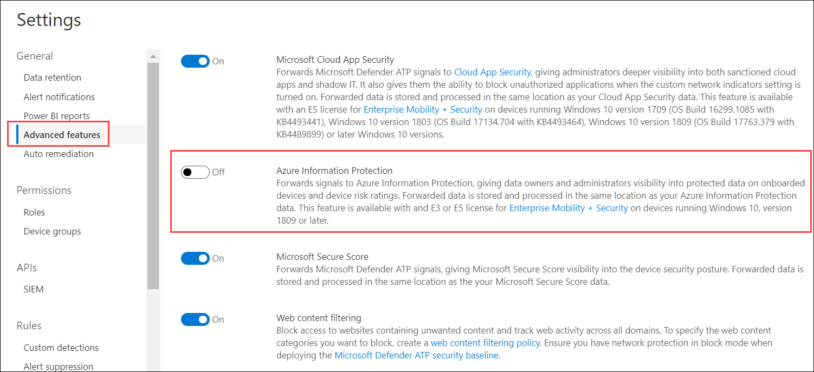

# <a name="information-protection-in-windows-overview"></a><span data-ttu-id="3e823-104">Information Protection en Introducción de Windows</span><span class="sxs-lookup"><span data-stu-id="3e823-104">Information protection in Windows overview</span></span>

[!INCLUDE [Microsoft 365 Defender rebranding](../../includes/microsoft-defender.md)]

<span data-ttu-id="3e823-105">**Se aplica a:**</span><span class="sxs-lookup"><span data-stu-id="3e823-105">**Applies to:**</span></span>

- [<span data-ttu-id="3e823-106">Microsoft Defender para punto de conexión</span><span class="sxs-lookup"><span data-stu-id="3e823-106">Microsoft Defender for Endpoint</span></span>](https://go.microsoft.com/fwlink/p/?linkid=2154037)
- [<span data-ttu-id="3e823-107">Microsoft 365 Defender</span><span class="sxs-lookup"><span data-stu-id="3e823-107">Microsoft 365 Defender</span></span>](https://go.microsoft.com/fwlink/?linkid=2118804)

> <span data-ttu-id="3e823-108">¿Desea experimentar Defender for Endpoint?</span><span class="sxs-lookup"><span data-stu-id="3e823-108">Want to experience Defender for Endpoint?</span></span> [<span data-ttu-id="3e823-109">Regístrate para obtener una versión de prueba gratuita.</span><span class="sxs-lookup"><span data-stu-id="3e823-109">Sign up for a free trial.</span></span>](https://www.microsoft.com/microsoft-365/windows/microsoft-defender-atp?ocid=docs-wdatp-exposedapis-abovefoldlink) 


[!include[Prerelease information](../../includes/prerelease.md)]

<span data-ttu-id="3e823-110">La protección de la información es una parte integral de Microsoft 365 Enterprise conjunto de aplicaciones, que proporciona protección inteligente para proteger los datos confidenciales y, al mismo tiempo, permitir la productividad en el lugar de trabajo.</span><span class="sxs-lookup"><span data-stu-id="3e823-110">Information protection is an integral part of Microsoft 365 Enterprise suite, providing intelligent protection to keep sensitive data secure while enabling productivity in the workplace.</span></span>


>[!TIP]
> <span data-ttu-id="3e823-111">Lea nuestra entrada de blog sobre cómo Microsoft Defender para Endpoint se integra con Microsoft Information Protection para detectar, proteger y supervisar datos confidenciales en [Windows dispositivos](https://cloudblogs.microsoft.com/microsoftsecure/2019/01/17/windows-defender-atp-integrates-with-microsoft-information-protection-to-discover-protect-and-monitor-sensitive-data-on-windows-devices/).</span><span class="sxs-lookup"><span data-stu-id="3e823-111">Read our blog post about how Microsoft Defender for Endpoint integrates with Microsoft Information Protection to [discover, protect, and monitor sensitive data on Windows devices](https://cloudblogs.microsoft.com/microsoftsecure/2019/01/17/windows-defender-atp-integrates-with-microsoft-information-protection-to-discover-protect-and-monitor-sensitive-data-on-windows-devices/).</span></span>

<span data-ttu-id="3e823-112">Defender for Endpoint aplica los siguientes métodos para detectar, clasificar y proteger datos:</span><span class="sxs-lookup"><span data-stu-id="3e823-112">Defender for Endpoint applies the following methods to discover, classify, and protect data:</span></span>

- <span data-ttu-id="3e823-113">**Detección de** datos: identificar datos confidenciales en Windows dispositivos en riesgo</span><span class="sxs-lookup"><span data-stu-id="3e823-113">**Data discovery** - Identify sensitive data on Windows devices at risk</span></span>
- <span data-ttu-id="3e823-114">**Clasificación de datos:** clasificar automáticamente los datos en función de las directivas comunes de Microsoft Information Protection (MIP) administradas en el Centro de Office 365 seguridad & cumplimiento.</span><span class="sxs-lookup"><span data-stu-id="3e823-114">**Data classification** - Automatically classify data based on common Microsoft Information Protection (MIP) policies managed in Office 365 Security & Compliance Center.</span></span> <span data-ttu-id="3e823-115">La clasificación automática le permite proteger datos confidenciales incluso si el usuario final no los ha clasificado manualmente.</span><span class="sxs-lookup"><span data-stu-id="3e823-115">Auto-classification allows you to protect sensitive data even if the end user hasn’t manually classified it.</span></span>


## <a name="data-discovery-and-data-classification"></a><span data-ttu-id="3e823-116">Detección de datos y clasificación de datos</span><span class="sxs-lookup"><span data-stu-id="3e823-116">Data discovery and data classification</span></span>

<span data-ttu-id="3e823-117">Defender for Endpoint detecta automáticamente archivos con etiquetas de confidencialidad y archivos que contienen tipos de información confidencial.</span><span class="sxs-lookup"><span data-stu-id="3e823-117">Defender for Endpoint automatically discovers files with sensitivity labels and files that contain sensitive information types.</span></span>

<span data-ttu-id="3e823-118">Las etiquetas de confidencialidad clasifican y ayudan a proteger el contenido confidencial.</span><span class="sxs-lookup"><span data-stu-id="3e823-118">Sensitivity labels classify and help protect sensitive content.</span></span>

<span data-ttu-id="3e823-119">Los tipos de información confidencial en la Office 365 de prevención de pérdida de datos (DLP) se en dos categorías:</span><span class="sxs-lookup"><span data-stu-id="3e823-119">Sensitive information types in the Office 365 data loss prevention (DLP) implementation fall under two categories:</span></span>

- <span data-ttu-id="3e823-120">Predeterminado</span><span class="sxs-lookup"><span data-stu-id="3e823-120">Default</span></span>
- <span data-ttu-id="3e823-121">Personalizado</span><span class="sxs-lookup"><span data-stu-id="3e823-121">Custom</span></span>

<span data-ttu-id="3e823-122">Los tipos de información confidencial predeterminados incluyen información como números de cuenta bancaria, números de seguridad social o nacionales.</span><span class="sxs-lookup"><span data-stu-id="3e823-122">Default sensitive information types include information such as bank account numbers, social security numbers, or national IDs.</span></span> <span data-ttu-id="3e823-123">Para obtener más información, vea [What the sensitive information type look for](/office365/securitycompliance/what-the-sensitive-information-types-look-for).</span><span class="sxs-lookup"><span data-stu-id="3e823-123">For more information, see [What the sensitive information type look for](/office365/securitycompliance/what-the-sensitive-information-types-look-for).</span></span>

<span data-ttu-id="3e823-124">Los tipos personalizados son los que se definen y están diseñados para proteger un tipo diferente de información confidencial (por ejemplo, los datos de los empleados o los números de proyecto).</span><span class="sxs-lookup"><span data-stu-id="3e823-124">Custom types are ones that you define and is designed to protect a different type of sensitive information (for example, employee IDs or project numbers).</span></span> <span data-ttu-id="3e823-125">Para obtener más información, [vea Create a custom sensitive information type](/office365/securitycompliance/create-a-custom-sensitive-information-type).</span><span class="sxs-lookup"><span data-stu-id="3e823-125">For more information see, [Create a custom sensitive information type](/office365/securitycompliance/create-a-custom-sensitive-information-type).</span></span>

<span data-ttu-id="3e823-126">Cuando se crea o edita un archivo en un dispositivo Windows, Defender for Endpoint examina el contenido para evaluar si contiene información confidencial.</span><span class="sxs-lookup"><span data-stu-id="3e823-126">When a file is created or edited on a  Windows device, Defender for Endpoint scans the content to evaluate if it contains sensitive information.</span></span>

<span data-ttu-id="3e823-127">Active la integración de Azure Information Protection para que, cuando Defender for Endpoint detecta un archivo que contiene información confidencial a través de etiquetas o tipos de información, se reenvía automáticamente a Azure Information Protection desde el dispositivo.</span><span class="sxs-lookup"><span data-stu-id="3e823-127">Turn on the Azure Information Protection integration so that when a file that contains sensitive information is discovered by Defender for Endpoint though labels or information types, it is automatically forwarded to Azure Information Protection from the device.</span></span>



<span data-ttu-id="3e823-129">Las señales notificadas se pueden ver en el Panel de Azure Information Protection : detección de datos.</span><span class="sxs-lookup"><span data-stu-id="3e823-129">The reported signals can be viewed on the Azure Information Protection – Data discovery dashboard.</span></span>

## <a name="azure-information-protection---data-discovery-dashboard"></a><span data-ttu-id="3e823-130">Azure Information Protection: panel de detección de datos</span><span class="sxs-lookup"><span data-stu-id="3e823-130">Azure Information Protection - Data discovery dashboard</span></span>

<span data-ttu-id="3e823-131">Este panel presenta una información resumida de detección de datos detectados por Defender para Endpoint y Azure Information Protection.</span><span class="sxs-lookup"><span data-stu-id="3e823-131">This dashboard presents a summarized discovery information of data discovered by both Defender for Endpoint and Azure Information Protection.</span></span> <span data-ttu-id="3e823-132">Los datos de Defender para endpoint se marcan con Tipo de ubicación: extremo.</span><span class="sxs-lookup"><span data-stu-id="3e823-132">Data from Defender for Endpoint is marked with Location Type - Endpoint.</span></span>


<span data-ttu-id="3e823-134">Observe la columna Riesgo de dispositivo a la derecha, este riesgo de dispositivo se deriva directamente de Defender para endpoint, lo que indica el nivel de riesgo del dispositivo de seguridad donde se detectó el archivo, en función de las amenazas de seguridad activas detectadas por Defender para endpoint.</span><span class="sxs-lookup"><span data-stu-id="3e823-134">Notice the Device Risk column on the right, this device risk is derived directly from Defender for Endpoint, indicating the risk level of the security device where the file was discovered, based on the active security threats detected by Defender for Endpoint.</span></span>

<span data-ttu-id="3e823-135">Haz clic en un dispositivo para ver una lista de archivos observados en este dispositivo, con sus etiquetas de confidencialidad y tipos de información.</span><span class="sxs-lookup"><span data-stu-id="3e823-135">Click on a device to view a list of files observed on this device, with their sensitivity labels and information types.</span></span>

>[!NOTE]
><span data-ttu-id="3e823-136">Espere entre 15 y 20 minutos aproximadamente para que la detección del panel de Azure Information Protection refleje los archivos detectados.</span><span class="sxs-lookup"><span data-stu-id="3e823-136">Please allow approximately 15-20 minutes for the Azure Information Protection Dashboard Discovery to reflect discovered files.</span></span>

## <a name="log-analytics"></a><span data-ttu-id="3e823-137">Análisis de registros</span><span class="sxs-lookup"><span data-stu-id="3e823-137">Log Analytics</span></span>

<span data-ttu-id="3e823-138">La detección de datos basada en Defender para endpoint también está disponible en [Azure Log Analytics,](/azure/log-analytics/log-analytics-overview)donde puede realizar consultas complejas sobre los datos sin procesar.</span><span class="sxs-lookup"><span data-stu-id="3e823-138">Data discovery based on Defender for Endpoint is also available in [Azure Log Analytics](/azure/log-analytics/log-analytics-overview), where you can perform complex queries over the raw data.</span></span>

<span data-ttu-id="3e823-139">Para obtener más información sobre el análisis de Azure Information Protection, vea [Central reporting for Azure Information Protection](/azure/information-protection/reports-aip).</span><span class="sxs-lookup"><span data-stu-id="3e823-139">For more information on Azure Information Protection analytics, see [Central reporting for Azure Information Protection](/azure/information-protection/reports-aip).</span></span>

<span data-ttu-id="3e823-140">Abra Azure Log Analytics en Azure Portal y abra un generador de consultas (estándar o clásico).</span><span class="sxs-lookup"><span data-stu-id="3e823-140">Open Azure Log Analytics in Azure portal and open a query builder (standard or classic).</span></span>

<span data-ttu-id="3e823-141">Para ver los datos de Defender for Endpoint, realice una consulta que contenga:</span><span class="sxs-lookup"><span data-stu-id="3e823-141">To view Defender for Endpoint data, perform a query that contains:</span></span>

```
InformationProtectionLogs_CL
| where Workload_s == "Windows Defender"
```

<span data-ttu-id="3e823-142">**Requisitos previos:**</span><span class="sxs-lookup"><span data-stu-id="3e823-142">**Prerequisites:**</span></span>

- <span data-ttu-id="3e823-143">Los clientes deben tener una suscripción a Azure Information Protection.</span><span class="sxs-lookup"><span data-stu-id="3e823-143">Customers must have a subscription for Azure Information Protection.</span></span>
- <span data-ttu-id="3e823-144">Habilitar la integración de Azure Information Protection en Centro de seguridad de Microsoft Defender:</span><span class="sxs-lookup"><span data-stu-id="3e823-144">Enable Azure Information Protection integration in Microsoft Defender Security Center:</span></span>
    - <span data-ttu-id="3e823-145">Vaya a **Configuración** en Centro de seguridad de Microsoft Defender, haga clic en **Configuración** en **General**.</span><span class="sxs-lookup"><span data-stu-id="3e823-145">Go to **Settings** in Microsoft Defender Security Center, click on **Advanced Settings** under **General**.</span></span>


