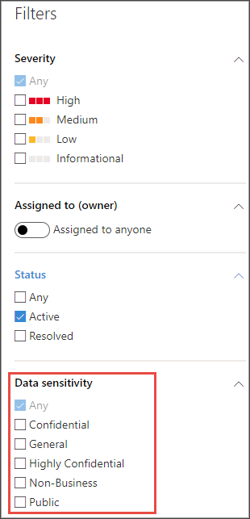
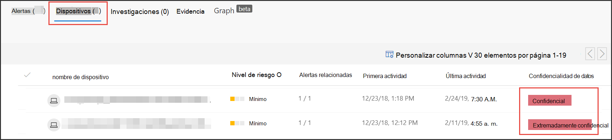

# Usar etiquetas de confidencialidad para priorizar la respuesta a incidentes  

[!INCLUDE [Microsoft 365 Defender rebranding](../../includes/microsoft-defender.md)]

**Se aplica a:**
- [Microsoft Defender para punto de conexión](https://go.microsoft.com/fwlink/p/?linkid=2146631)
- [Microsoft 365 Defender](https://go.microsoft.com/fwlink/?linkid=2118804)

> ¿Desea experimentar Defender for Endpoint? [Regístrate para obtener una versión de prueba gratuita.](https://www.microsoft.com/microsoft-365/windows/microsoft-defender-atp?ocid=docs-wdatp-exposedapis-abovefoldlink) 

Un ciclo de vida de amenazas persistentes avanzado típico implica la exfiltración de datos. En un incidente de seguridad, es importante tener la capacidad de priorizar las investigaciones en las que los archivos confidenciales pueden estar en peligro para que los datos corporativos y la información estén protegidos.

Defender for Endpoint ayuda a que la priorización de incidentes de seguridad sea mucho más sencilla con el uso de etiquetas de confidencialidad. Las etiquetas de confidencialidad identifican rápidamente incidentes que pueden implicar dispositivos con información confidencial, como información confidencial. 

## Investigar incidentes que implican datos confidenciales
Aprenda a usar etiquetas de confidencialidad de datos para priorizar la investigación de incidentes.

>[!NOTE]
>Las etiquetas se detectan para Windows 10, versión 1809 o posterior.

1. En el Centro de seguridad de Microsoft Defender, seleccione **Incidentes**. 

2. Desplácese a la derecha para ver la **columna Confidencialidad de** datos. Esta columna refleja las etiquetas de confidencialidad que se han observado en dispositivos relacionados con los incidentes, lo que indica si el incidente puede afectar a los archivos confidenciales.

    

    También puede filtrar en función de la **confidencialidad de datos** 

    

3. Abra la página de incidentes para investigar más a fondo.

    

4. Selecciona la **pestaña Dispositivos** para identificar los dispositivos que almacenan archivos con etiquetas de confidencialidad.

    
   

5. Seleccione los dispositivos que almacenan datos confidenciales y busque en la escala de tiempo para identificar los archivos que se pueden ver afectados y, a continuación, tome las medidas adecuadas para asegurarse de que los datos están protegidos. 

   Puedes restringir los eventos que se muestran en la escala de tiempo del dispositivo buscando etiquetas de confidencialidad de datos. Al hacerlo, solo se mostrarán los eventos asociados con archivos que tengan dicho nombre de etiqueta.

    

>[!TIP]
>Estos puntos de datos también se exponen a través de "DeviceFileEvents" en búsqueda avanzada, lo que permite que las consultas avanzadas y la detección de programación tomen en cuenta las etiquetas de confidencialidad y el estado de protección de archivos. 
