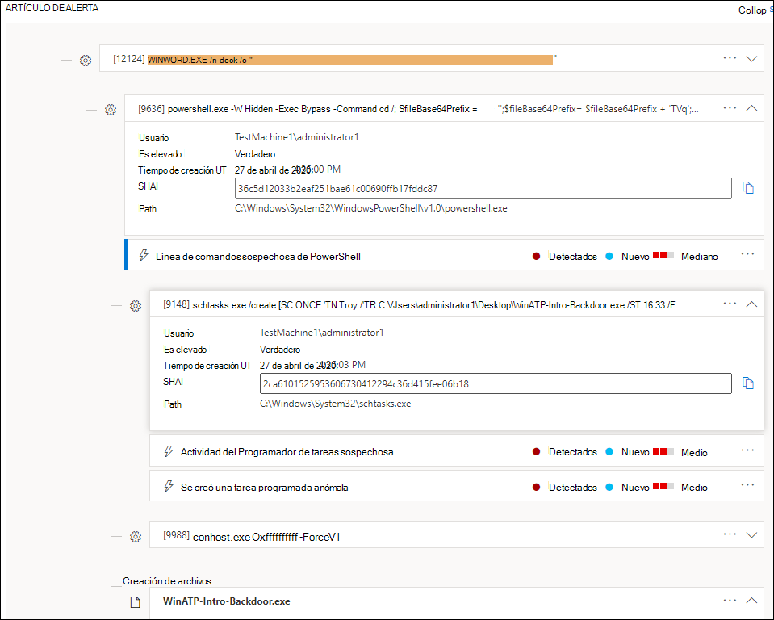
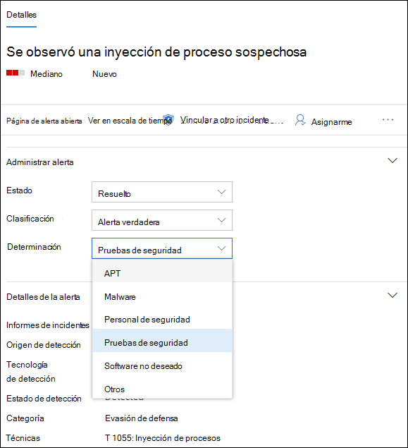
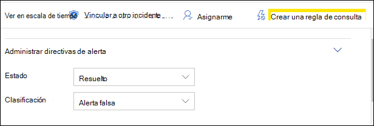

# Investigar alertas en Microsoft Defender para endpointInvestigate alerts in Microsoft Defender for Endpoint

[!INCLUDE [Microsoft 365 Defender rebranding](../../includes/microsoft-defender.md)]

**Se aplica a:****Applies to:**
- [Microsoft Defender para punto de conexiónMicrosoft Defender for Endpoint](https://go.microsoft.com/fwlink/p/?linkid=2146631)
- [Microsoft 365 DefenderMicrosoft 365 Defender](https://go.microsoft.com/fwlink/?linkid=2118804)

>¿Desea experimentar Defender for Endpoint?Want to experience Defender for Endpoint? [Regístrate para obtener una versión de prueba gratuita.Sign up for a free trial.](https://www.microsoft.com/microsoft-365/windows/microsoft-defender-atp?ocid=docs-wdatp-investigatealerts-abovefoldlink) 

Investigue las alertas que afectan a la red, comprenda lo que significan y cómo resolverlas.Investigate alerts that are affecting your network, understand what they mean, and how to resolve them.

Seleccione una alerta de la cola de alertas para ir a la página de alertas.Select an alert from the alerts queue to go to alert page. Esta vista contiene el título de alerta, los activos afectados, el panel lateral de detalles y el artículo de alerta.This view contains the alert title, the affected assets, the details side pane, and the alert story.

En la página de alertas, comience la investigación seleccionando los activos afectados o cualquiera de las entidades en la vista de árbol del artículo de alerta.From the alert page, begin your investigation by selecting the affected assets or any of the entities under the alert story tree view. El panel de detalles se rellena automáticamente con más información sobre lo que ha seleccionado.The details pane automatically populates with further information about what you selected. Para ver qué tipo de información puede ver aquí, lea [Review alerts in Microsoft Defender for Endpoint](https://docs.microsoft.com/microsoft-365/security/defender-endpoint/review-alerts).To see what kind of information you can view here, read [Review alerts in Microsoft Defender for Endpoint](https://docs.microsoft.com/microsoft-365/security/defender-endpoint/review-alerts).

## Investigar con el artículo de alertaInvestigate using the alert story

El artículo de alerta detalla por qué se desencadenó la alerta, los eventos relacionados que sucedieron antes y después, así como otras entidades relacionadas.The alert story details why the alert was triggered, related events that happened before and after, as well as other related entities.

Las entidades pueden hacer clic y todas las entidades que no son una alerta se pueden expandir mediante el icono expandir situado a la derecha de la tarjeta de esa entidad.Entities are clickable and every entity that isn't an alert is expandable using the expand icon on the right side of that entity's card. La entidad en el foco se indicará mediante una franja azul al lado izquierdo de la tarjeta de esa entidad, con la alerta en el título en el foco al principio.The entity in focus will be indicated by a blue stripe to the left side of that entity's card, with the alert in the title being in focus at first.

Expanda entidades para ver los detalles de un vistazo.Expand entities to view details at a glance. Al seleccionar una entidad, se cambia el contexto del panel de detalles a esta entidad y se le permite revisar más información, así como administrar esa entidad.Selecting an entity will switch the context of the details pane to this entity, and will allow you to review further information, as well as manage that entity. Si selecciona *...* a la derecha de la tarjeta de entidad, se mostrarán todas las acciones disponibles para esa entidad.Selecting *...* to the right of the entity card will reveal all actions available for that entity. Estas mismas acciones aparecen en el panel de detalles cuando esa entidad está en el foco.These same actions appear in the details pane when that entity is in focus.

> [!NOTE]
> La sección de artículo de alerta puede contener más de una alerta, con alertas adicionales relacionadas con el mismo árbol de ejecución que aparecen antes o después de la alerta seleccionada.The alert story section may contain more than one alert, with additional alerts related to the same execution tree appearing before or after the alert you've selected.

## Realizar acciones desde el panel de detallesTake action from the details pane

Una vez que haya seleccionado una entidad de interés, el panel de detalles cambiará para mostrar información sobre  el tipo de entidad seleccionada, información histórica cuando esté disponible y ofrecer controles para realizar acciones en esta entidad directamente desde la página de alerta.Once you've selected an entity of interest, the details pane will change to display information about the selected entity type, historic information when it's available, and offer controls to **take action** on this entity directly from the alert page.

Una vez que haya terminado de investigar, vuelva a la alerta con la que inició, marque el estado de la alerta como **Resuelto** y clasifique como **Alerta** falsa o **Alerta verdadera**.Once you're done investigating, go back to the alert you started with, mark the alert's status as **Resolved** and classify it as either **False alert** or **True alert**. Clasificar alertas ayuda a ajustar esta funcionalidad para proporcionar alertas más verdaderas y menos falsas.Classifying alerts helps tune this capability to provide more true alerts and less false alerts.

Si la clasifica como una alerta verdadera, también puede seleccionar una determinación, como se muestra en la imagen siguiente.If you classify it as a true alert, you can also select a determination, as shown in the image below.

Si experimenta una alerta falsa con una aplicación de línea de negocio, cree una regla de supresión para evitar este tipo de alerta en el futuro.If you are experiencing a false alert with a line-of-business application, create a suppression rule to avoid this type of alert in the future.

> [!TIP]
> Si tienes algún problema que no se describe anteriormente, usa el botón para proporcionar comentarios 🙂 o abrir un vale de soporte técnico.If you're experiencing any issues not described above, use the 🙂 button to provide feedback or open a support ticket.

## Temas relacionadosRelated topics
- [Ver y organizar la cola de Alertas de punto de conexión de Microsoft DefenderView and organize the Microsoft Defender for Endpoint Alerts queue](alerts-queue.md)
- [Administrar alertas de Microsoft Defender para puntos de conexiónManage Microsoft Defender for Endpoint alerts](manage-alerts.md)
- [Investigar un archivo asociado a una alerta de Defender for EndpointInvestigate a file associated with a Defender for Endpoint alert](investigate-files.md)
- [Investigar dispositivos en la lista Defender para dispositivos de punto de conexiónInvestigate devices in the Defender for Endpoint Devices list](investigate-machines.md)
- [Investigar una dirección IP asociada a una alerta de Defender for EndpointInvestigate an IP address associated with a Defender for Endpoint alert](investigate-ip.md)
- [Investigar un dominio asociado a una alerta de Defender for EndpointInvestigate a domain associated with a Defender for Endpoint alert](investigate-domain.md)
- [Investigar una cuenta de usuario en Defender for EndpointInvestigate a user account in Defender for Endpoint](investigate-user.md)

