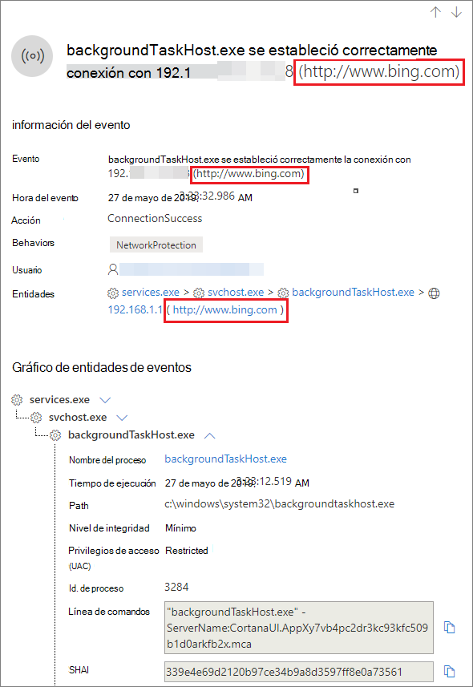

# <a name="investigate-connection-events-that-occur-behind-forward-proxies"></a>Investigar eventos de conexión que ocurren tras los servidores proxy de reenvío

[!INCLUDE [Microsoft 365 Defender rebranding](../../includes/microsoft-defender.md)]

**Se aplica a:**
- [Microsoft Defender para punto de conexión](https://go.microsoft.com/fwlink/p/?linkid=2154037)
- [Microsoft 365 Defender](https://go.microsoft.com/fwlink/?linkid=2118804)

> ¿Desea experimentar Defender for Endpoint? [Regístrate para obtener una versión de prueba gratuita.](https://www.microsoft.com/microsoft-365/windows/microsoft-defender-atp?ocid=docs-wdatp-investigatemachines-abovefoldlink)

Defender for Endpoint admite la supervisión de conexiones de red desde diferentes niveles de la pila de red. Un caso difícil es cuando la red usa un proxy de reenvío como puerta de enlace a Internet.

El proxy actúa como si fuera el extremo de destino.  En estos casos, los monitores de conexión de red simples auditarán las conexiones con el proxy, que es correcto pero que tiene un valor de investigación inferior. 

Defender for Endpoint admite la supervisión avanzada del nivel HTTP a través de la protección de red. Cuando está activado, se muestra un nuevo tipo de evento que expone los nombres de dominio de destino reales.

## <a name="use-network-protection-to-monitor-network-connection-behind-a-firewall"></a>Usar la protección de red para supervisar la conexión de red detrás de un firewall
La supervisión de la conexión de red detrás de un proxy de reenvío es posible debido a eventos de red adicionales que se originan a partir de la protección de red. Para verlos en una escala de tiempo del dispositivo, activa la protección de red (como mínimo en modo auditoría). 

La protección de red se puede controlar con los siguientes modos:

- **Bloquear** <br> Los usuarios o aplicaciones no se conectarán a dominios peligrosos. Podrás ver esta actividad en el Centro de seguridad de Microsoft Defender.
- **Auditoría** <br> Los usuarios o aplicaciones no se bloquearán para que no se conecten a dominios peligrosos. Sin embargo, seguirás teniendo esta actividad en el Centro de seguridad de Microsoft Defender.


Si desactivas la protección de red, no se bloqueará la conexión de usuarios o aplicaciones a dominios peligrosos. No verá ninguna actividad de red en el Centro de seguridad de Microsoft Defender.

Si no lo configura, el bloqueo de red se desactivará de forma predeterminada.

Para obtener más información, vea [Enable network protection](enable-network-protection.md).

## <a name="investigation-impact"></a>Impacto de la investigación
Cuando la protección de red esté activada, verás que en la escala de tiempo de un dispositivo la dirección IP seguirá representando el proxy, mientras que la dirección de destino real aparece.


Los eventos adicionales desencadenados por la capa de protección de red ahora están disponibles para superficier los nombres de dominio reales incluso detrás de un proxy.

Información del evento:




## <a name="hunt-for-connection-events-using-advanced-hunting"></a>Buscar eventos de conexión mediante la búsqueda avanzada 
Todos los nuevos eventos de conexión están disponibles para que también se desatrase de la búsqueda avanzada. Dado que estos eventos son eventos de conexión, puede encontrarlos en la tabla DeviceNetworkEvents en el tipo `ConnecionSuccess` de acción.

Con esta consulta sencilla se mostrarán todos los eventos relevantes:

```
DeviceNetworkEvents
| where ActionType == "ConnectionSuccess" 
| take 10
```


También puede filtrar los eventos relacionados con la conexión con el propio proxy. 

Use la siguiente consulta para filtrar las conexiones al proxy:

```
DeviceNetworkEvents
| where ActionType == "ConnectionSuccess" and RemoteIP != "ProxyIP"  
| take 10
```


## <a name="related-topics"></a>Temas relacionados
- [Aplicación de protección de red con GP: CSP de directiva](https://docs.microsoft.com/windows/client-management/mdm/policy-csp-defender#defender-enablenetworkprotection)
