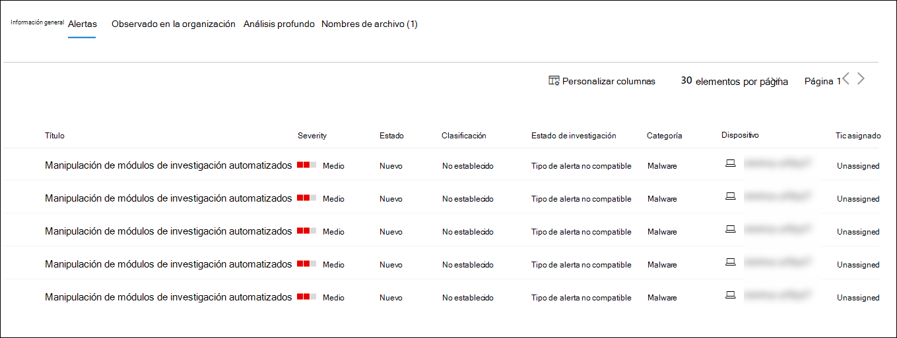
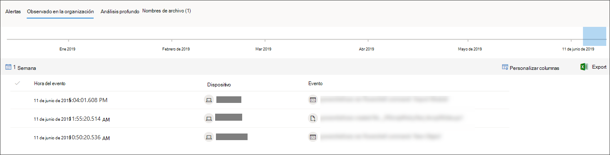

# Investigar un archivo asociado a una alerta de Microsoft Defender para punto de conexiónInvestigate a file associated with a Microsoft Defender for Endpoint alert

[!INCLUDE [Microsoft 365 Defender rebranding](../../includes/microsoft-defender.md)]

**Se aplica a:****Applies to:**
- [Microsoft Defender para punto de conexiónMicrosoft Defender for Endpoint](https://go.microsoft.com/fwlink/p/?linkid=2146631)
- [Microsoft 365 DefenderMicrosoft 365 Defender](https://go.microsoft.com/fwlink/?linkid=2118804)

>¿Desea experimentar Defender for Endpoint?Want to experience Defender for Endpoint? [Regístrate para obtener una versión de prueba gratuita.Sign up for a free trial.](https://www.microsoft.com/microsoft-365/windows/microsoft-defender-atp?ocid=docs-wdatp-investigatefiles-abovefoldlink)

Investigue los detalles de un archivo asociado a una alerta, comportamiento o evento específicos para determinar si el archivo muestra actividades malintencionadas, identificar la motivación del ataque y comprender el ámbito potencial de la infracción.Investigate the details of a file associated with a specific alert, behavior, or event to help determine if the file exhibits malicious activities, identify the attack motivation, and understand the potential scope of the breach.

Hay muchas maneras de obtener acceso a la página de perfil detallada de un archivo específico.There are many ways to access the detailed profile page of a specific file. Por ejemplo, puede usar la característica de búsqueda, hacer clic en un vínculo del árbol de proceso de **alerta,** gráfico de **incidentes,** escala de tiempo de artefactos o seleccionar un evento enumerado en la escala de tiempo **del dispositivo**.For example, you can  use the search feature, click on a link from the **Alert process tree**, **Incident graph**, **Artifact timeline**, or select an event listed in the **Device timeline**.

Una vez en la página de perfil detallada, puede cambiar entre los diseños de página nuevos y antiguos alternando la **nueva página Archivo**.Once on the detailed profile page, you can switch between the new and old page layouts by toggling **new File page**. El resto de este artículo describe el diseño de página más reciente.The rest of this article describes the newer page layout.

Puede obtener información de las siguientes secciones en la vista de archivos:You can get information from the following sections in the file view:

- Detalles del archivo, Detección de malware, Prevalencia de archivosFile details, Malware detection, File prevalence
- Análisis profundoDeep analysis
- AlertasAlerts
- Observado en la organizaciónObserved in organization
- Análisis profundoDeep analysis
- Nombres de archivoFile names

También puede realizar acciones en un archivo de esta página.You can also take action on a file from this page.

## Acciones de archivoFile actions

En la parte superior de la página de perfil, encima de las tarjetas de información del archivo.Along the top of the profile page, above the file information cards. Las acciones que puede realizar aquí incluyen:Actions you can perform here include:

- Detener y poner en cuarentenaStop and quarantine
- Indicador Agregar o editarAdd/edit indicator
- Descargar archivoDownload file
- Consultar a un experto en amenazasConsult a threat expert
- Centro de actividadesAction center

Para obtener más información sobre estas acciones, vea [Realizar acción de respuesta en un archivo](respond-file-alerts.md).For more information on these actions, see [Take response action on a file](respond-file-alerts.md).

## Detalles del archivo, detección de malware y prevalencia de archivosFile details, Malware detection, and File prevalence

Los detalles del archivo, incidentes, detección de malware y tarjetas de prevalencia de archivos muestran varios atributos sobre el archivo.The file details, incident, malware detection, and file prevalence cards display various attributes about the file.

Verá detalles como MD5 del archivo, la relación de detección total de virus y la detección de antivirus de Microsoft Defender si está disponible y la prevalencia del archivo.You'll see details such as the file’s MD5, the Virus Total detection ratio, and Microsoft Defender AV detection if available, and the file’s prevalence.

La tarjeta de prevalencia de archivos muestra dónde se ha visto el archivo en dispositivos de la organización y en todo el mundo.The file prevalence card shows where the file was seen in devices in the organization and worldwide. 

> [!NOTE] 
> Los diferentes usuarios pueden ver valores distintos en los dispositivos *de la* sección de organización de la tarjeta de prevalencia de archivos.Different users may see dissimilar values in the *devices in organization* section of the file prevalence card. Esto se debe a que la tarjeta muestra información basada en el ámbito RBAC que tiene un usuario.This is because the card displays information based on the RBAC scope that a user has. Es decir, si a un usuario se le ha concedido visibilidad en un conjunto específico de dispositivos, solo verá la prevalencia organizativa de archivos en esos dispositivos.Meaning, if a user has been granted visibility on a specific set of devices, they will only see the file organizational prevalence on those devices.

## AlertasAlerts

La **pestaña** Alertas proporciona una lista de alertas asociadas con el archivo.The **Alerts** tab provides a list of alerts that are associated with the file. Esta lista cubre gran parte de la misma información que la cola de alertas, excepto para el grupo de dispositivos, si existe, al que pertenece el dispositivo afectado.This list covers much of the same information as the Alerts queue, except for the device group, if any, the affected device belongs to. Puede elegir qué tipo de información se muestra seleccionando Personalizar columnas **de** la barra de herramientas encima de los encabezados de columna.You can choose what kind of information is shown by selecting **Customize columns** from the toolbar above the column headers.

## Observado en la organizaciónObserved in organization

La **pestaña Observed in organization** le permite especificar un intervalo de fechas para ver qué dispositivos se han observado con el archivo.The **Observed in organization** tab allows you to specify a date range to see which devices have been observed with the file.

>[!NOTE]
>Esta pestaña mostrará un número máximo de 100 dispositivos.This tab will show a maximum number of 100 devices. Para ver _todos los_ dispositivos con el archivo, exporte la pestaña a un archivo CSV **seleccionando Exportar** en el menú de acciones encima de los encabezados de columna de la pestaña.To see _all_ devices with the file, export the tab to a CSV file, by selecting **Export** from the action menu above the tab's column headers.

Use el control deslizante o el selector de intervalos para especificar rápidamente un período de tiempo que desea comprobar si hay eventos relacionados con el archivo.Use the slider or the range selector to quickly specify a time period that you want to check for events involving the file. Puede especificar una ventana de tiempo tan pequeña como un solo día.You can specify a time window as small as a single day. Esto le permitirá ver solo los archivos que se comunicaron con esa dirección IP en ese momento, lo que reduce drásticamente el desplazamiento y la búsqueda innecesarios.This will allow you to see only files that communicated with that IP Address at that time, drastically reducing unnecessary scrolling and searching.

## Análisis profundoDeep analysis

La **pestaña Análisis** profundo le permite enviar el archivo para un análisis profundo, para descubrir más detalles sobre el comportamiento del archivo, así como el efecto que está teniendo dentro de sus organizaciones. The **Deep analysis** tab allows you to [submit the file for deep analysis](respond-file-alerts.md#deep-analysis), to uncover more details about the file's behavior, as well as the effect it is having within your organizations. Después de enviar el archivo, el informe de análisis profundo aparecerá en esta pestaña una vez que estén disponibles los resultados.After you submit the file, the deep analysis report will appear in this tab once results are available. Si el análisis profundo no encontró nada, el informe estará vacío y el espacio de resultados permanecerá en blanco.If deep analysis did not find anything, the report will be empty and the results space will remain blank.

## Nombres de archivoFile names

La **pestaña Nombres de** archivo enumera todos los nombres que se ha observado que el archivo debe usar en las organizaciones.The **File names** tab lists all names the file has been observed to use, within your organizations.

## Temas relacionadosRelated topics

- [Ver y organizar la cola de Microsoft Defender para endpointView and organize the Microsoft Defender for Endpoint queue](alerts-queue.md)
- [Administrar alertas de Microsoft Defender para puntos de conexiónManage Microsoft Defender for Endpoint alerts](manage-alerts.md)
- [Investigar alertas de punto de conexión de Microsoft DefenderInvestigate Microsoft Defender for Endpoint alerts](investigate-alerts.md)
- [Investigar dispositivos en la lista Microsoft Defender para dispositivos de punto de conexiónInvestigate devices in the Microsoft Defender for Endpoint Devices list](investigate-machines.md)
- [Investigar una dirección IP asociada a una alerta de Microsoft Defender para punto de conexiónInvestigate an IP address associated with a Microsoft Defender for Endpoint alert](investigate-ip.md)
- [Investigar un dominio asociado a una alerta de Microsoft Defender para punto de conexiónInvestigate a domain associated with a Microsoft Defender for Endpoint alert](investigate-domain.md)
- [Investigar una cuenta de usuario en Microsoft Defender para endpointInvestigate a user account in Microsoft Defender for Endpoint](investigate-user.md)
- [Realizar acciones de respuesta en un archivoTake response actions on a file](respond-file-alerts.md)
