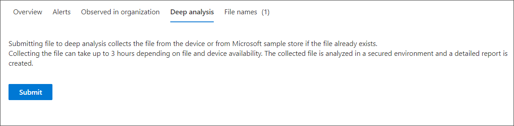

# Investigar un archivo asociado a una alerta de Microsoft Defender para punto de conexión

[!INCLUDE [Microsoft 365 Defender rebranding](../../includes/microsoft-defender.md)]

**Se aplica a:**
- [Microsoft Defender para punto de conexión](https://go.microsoft.com/fwlink/p/?linkid=2146631)
- [Microsoft 365 Defender](https://go.microsoft.com/fwlink/?linkid=2118804)

>¿Desea experimentar Defender for Endpoint? [Regístrate para obtener una versión de prueba gratuita.](https://www.microsoft.com/microsoft-365/windows/microsoft-defender-atp?ocid=docs-wdatp-investigatefiles-abovefoldlink)

Investigue los detalles de un archivo asociado a una alerta, comportamiento o evento específicos para determinar si el archivo muestra actividades malintencionadas, identificar la motivación del ataque y comprender el ámbito potencial de la infracción.

Hay muchas maneras de obtener acceso a la página de perfil detallada de un archivo específico. Por ejemplo, puede usar la característica de búsqueda, hacer clic en un vínculo del árbol de proceso de **alerta,** gráfico de **incidentes,** escala de tiempo de artefactos o seleccionar un evento enumerado en la escala de tiempo **del dispositivo**.

Una vez en la página de perfil detallada, puede cambiar entre los diseños de página nuevos y antiguos alternando la **nueva página Archivo**. El resto de este artículo describe el diseño de página más reciente.

Puede obtener información de las siguientes secciones en la vista de archivos:

- Detalles del archivo, Detección de malware, Prevalencia de archivos
- Análisis profundo
- Alertas
- Observado en la organización
- Análisis profundo
- Nombres de archivo

También puede realizar acciones en un archivo de esta página.

## Acciones de archivo

En la parte superior de la página de perfil, encima de las tarjetas de información del archivo. Las acciones que puede realizar aquí incluyen:

- Detener y poner en cuarentena
- Indicador Agregar o editar
- Descargar archivo
- Consultar a un experto en amenazas
- Centro de actividades

Para obtener más información sobre estas acciones, vea [Realizar acción de respuesta en un archivo](respond-file-alerts.md).

## Detalles del archivo, detección de malware y prevalencia de archivos

Los detalles del archivo, incidentes, detección de malware y tarjetas de prevalencia de archivos muestran varios atributos sobre el archivo.

Verá detalles como MD5 del archivo, la relación de detección total de virus y la detección de antivirus de Microsoft Defender si está disponible y la prevalencia del archivo.

La tarjeta de prevalencia de archivos muestra dónde se ha visto el archivo en dispositivos de la organización y en todo el mundo. 

> [!NOTE] 
> Los diferentes usuarios pueden ver valores distintos en los dispositivos *de la* sección de organización de la tarjeta de prevalencia de archivos. Esto se debe a que la tarjeta muestra información basada en el ámbito RBAC que tiene un usuario. Es decir, si a un usuario se le ha concedido visibilidad en un conjunto específico de dispositivos, solo verá la prevalencia organizativa de archivos en esos dispositivos.

## Alertas

La **pestaña** Alertas proporciona una lista de alertas asociadas con el archivo. Esta lista cubre gran parte de la misma información que la cola de alertas, excepto para el grupo de dispositivos, si existe, al que pertenece el dispositivo afectado. Puede elegir qué tipo de información se muestra seleccionando Personalizar columnas **de** la barra de herramientas encima de los encabezados de columna.

## Observado en la organización

La **pestaña Observed in organization** le permite especificar un intervalo de fechas para ver qué dispositivos se han observado con el archivo.

>[!NOTE]
>Esta pestaña mostrará un número máximo de 100 dispositivos. Para ver _todos los_ dispositivos con el archivo, exporte la pestaña a un archivo CSV **seleccionando Exportar** en el menú de acciones encima de los encabezados de columna de la pestaña.

Use el control deslizante o el selector de intervalos para especificar rápidamente un período de tiempo que desea comprobar si hay eventos relacionados con el archivo. Puede especificar una ventana de tiempo tan pequeña como un solo día. Esto le permitirá ver solo los archivos que se comunicaron con esa dirección IP en ese momento, lo que reduce drásticamente el desplazamiento y la búsqueda innecesarios.

## Análisis profundo

La **pestaña Análisis** profundo le permite enviar el archivo para un análisis profundo, para descubrir más detalles sobre el comportamiento del archivo, así como el efecto que está teniendo dentro de sus organizaciones.  Después de enviar el archivo, el informe de análisis profundo aparecerá en esta pestaña una vez que estén disponibles los resultados. Si el análisis profundo no encontró nada, el informe estará vacío y el espacio de resultados permanecerá en blanco.

## Nombres de archivo

La **pestaña Nombres de** archivo enumera todos los nombres que se ha observado que el archivo debe usar en las organizaciones.

## Temas relacionados

- [Ver y organizar la cola de Microsoft Defender para endpoint](alerts-queue.md)
- [Administrar alertas de Microsoft Defender para puntos de conexión](manage-alerts.md)
- [Investigar alertas de punto de conexión de Microsoft Defender](investigate-alerts.md)
- [Investigar dispositivos en la lista Microsoft Defender para dispositivos de punto de conexión](investigate-machines.md)
- [Investigar una dirección IP asociada a una alerta de Microsoft Defender para punto de conexión](investigate-ip.md)
- [Investigar un dominio asociado a una alerta de Microsoft Defender para punto de conexión](investigate-domain.md)
- [Investigar una cuenta de usuario en Microsoft Defender para endpoint](investigate-user.md)
- [Realizar acciones de respuesta en un archivo](respond-file-alerts.md)
