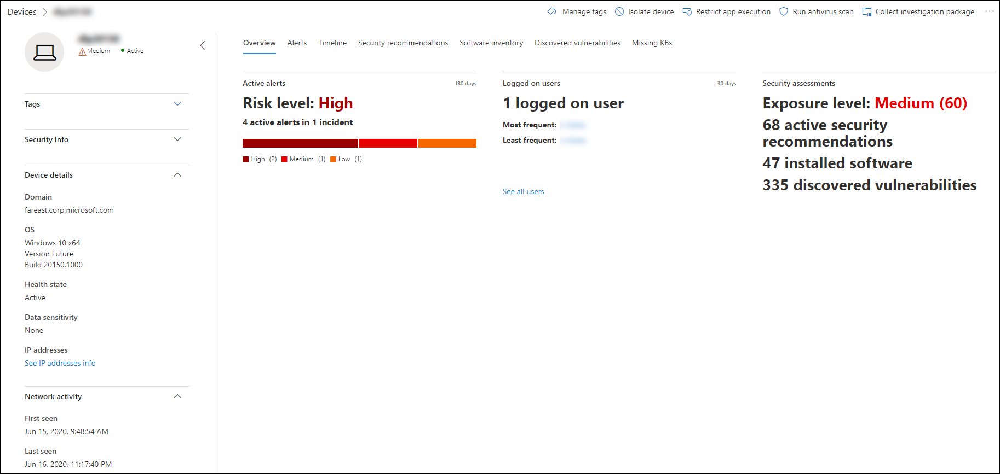

# Investigar dispositivos en la lista Microsoft Defender para dispositivos de punto de conexión

[!INCLUDE [Microsoft 365 Defender rebranding](../../includes/microsoft-defender.md)]

**Se aplica a:**
- [Microsoft Defender para punto de conexión](https://go.microsoft.com/fwlink/p/?linkid=2146631)
- [Microsoft 365 Defender](https://go.microsoft.com/fwlink/?linkid=2118804)

>¿Desea experimentar Defender for Endpoint? [Regístrate para obtener una versión de prueba gratuita.](https://www.microsoft.com/microsoft-365/windows/microsoft-defender-atp?ocid=docs-wdatp-investigatemachines-abovefoldlink)

Investigue los detalles de una alerta que se genera en un dispositivo específico para identificar otros comportamientos o eventos que puedan estar relacionados con la alerta o el ámbito potencial de la infracción.

> [!NOTE]
> Como parte del proceso de investigación o respuesta, puedes recopilar un paquete de investigación desde un dispositivo. Este es el modo: [Recopilar paquete de investigación de dispositivos](https://docs.microsoft.com/microsoft-365/security/defender-endpoint/respond-machine-alerts#collect-investigation-package-from-devices).

Puedes hacer clic en los dispositivos afectados siempre que los veas en el portal para abrir un informe detallado sobre ese dispositivo. Los dispositivos afectados se identifican en las siguientes áreas:

- [Lista de dispositivos](investigate-machines.md)
- [Cola de alertas](alerts-queue.md)
- [Panel de operaciones de seguridad](security-operations-dashboard.md)
- Cualquier alerta individual
- Cualquier vista de detalles de archivo individual
- Cualquier dirección IP o vista de detalles de dominio

Cuando investigues un dispositivo específico, verás lo siguiente:

- Detalles del dispositivo
- Acciones de respuesta
- Pestañas (información general, alertas, escala de tiempo, recomendaciones de seguridad, inventario de software, vulnerabilidades detectadas, KB ausentes)
- Tarjetas (alertas activas, usuarios que han iniciado sesión, evaluación de seguridad)

## Detalles del dispositivo

La sección detalles del dispositivo proporciona información como el dominio, el sistema operativo y el estado de mantenimiento del dispositivo. Si hay un paquete de investigación disponible en el dispositivo, verás un vínculo que te permite descargar el paquete.

## Acciones de respuesta

Las acciones de respuesta se ejecutan en la parte superior de una página de dispositivo específica e incluyen:

- Administrar etiquetas
- Aislar dispositivo
- Restringir la ejecución de aplicaciones
- Ejecutar examen antivirus
- Recopilar paquete de investigación
- Iniciar sesión de respuesta activa
- Iniciar investigación automatizada
- Consultar a un experto en amenazas
- Centro de actividades

Puedes realizar acciones de respuesta en el Centro de acciones, en una página de dispositivo específica o en una página de archivo específica.

Para obtener más información sobre cómo realizar acciones en un dispositivo, consulta [Realizar acción de respuesta en un dispositivo](respond-machine-alerts.md).

Para obtener más información, vea [Investigar entidades de usuario](investigate-user.md).

## Pestañas

Las pestañas proporcionan información de seguridad y prevención de amenazas relevante relacionada con el dispositivo. En cada pestaña, puede personalizar las columnas  que se muestran seleccionando Personalizar columnas de la barra encima de los encabezados de columna.

### Información general
La **pestaña Información** general muestra las [tarjetas para](#cards) las alertas activas, los usuarios que han iniciado sesión y la evaluación de seguridad.

### Alertas

La **pestaña** Alertas proporciona una lista de alertas asociadas con el dispositivo. Esta lista es una versión filtrada de la cola de alertas y muestra una breve descripción de la alerta, gravedad (alta, media, baja, informativo), estado de la cola (nuevo, en curso, resuelto), clasificación (no establecida, alerta falsa, alerta verdadera), estado de investigación, categoría de alerta, quién está abordando la alerta y última actividad. También puede filtrar las alertas.

Cuando se selecciona el icono de círculo situado a la izquierda de una alerta, aparece un desplegable. Desde este panel puede administrar la alerta y ver más detalles, como el número de incidente y los dispositivos relacionados. Se pueden seleccionar varias alertas a la vez.

Para ver una vista de página completa de una alerta, incluido el gráfico de incidentes y el árbol de procesos, seleccione el título de la alerta.

### Escala de tiempo

La **pestaña Escala** de tiempo proporciona una vista cronológica de los eventos y alertas asociadas que se han observado en el dispositivo. Esto puede ayudarte a correlacionar cualquier evento, archivo y direcciones IP en relación con el dispositivo.

La escala de tiempo también permite profundizar selectivamente en los eventos que se produjeron en un período de tiempo determinado. Puedes ver la secuencia temporal de eventos que se produjeron en un dispositivo durante un período de tiempo seleccionado. Para controlar aún más la vista, puede filtrar por grupos de eventos o personalizar las columnas.

>[!NOTE]
> Para que se muestren eventos de firewall, deberá habilitar la directiva de auditoría, consulte [Audit Filtering Platform connection](https://docs.microsoft.com/windows/security/threat-protection/auditing/audit-filtering-platform-connection).
>Firewall cubre los siguientes eventos
>
>- [5025:](https://docs.microsoft.com/windows/security/threat-protection/auditing/event-5025) servicio de firewall detenido
>- [5031:](https://docs.microsoft.com/windows/security/threat-protection/auditing/event-5031) aplicación bloqueada para no aceptar conexiones entrantes en la red
>- [5157:](https://docs.microsoft.com/windows/security/threat-protection/auditing/event-5157) conexión bloqueada

Algunas de las funciones incluyen:

- Buscar eventos específicos
  - Use la barra de búsqueda para buscar eventos de escala de tiempo específicos.
- Filtrar eventos de una fecha específica
  - Seleccione el icono de calendario de la parte superior izquierda de la tabla para mostrar los eventos del último día, semana, 30 días o intervalo personalizado. De forma predeterminada, la escala de tiempo del dispositivo está configurada para mostrar los eventos de los últimos 30 días.
  - Use la escala de tiempo para saltar a un momento específico en el tiempo resaltando la sección. Las flechas de la escala de tiempo localizan investigaciones automatizadas
- Exportar eventos detallados de escala de tiempo del dispositivo
  - Exporte la escala de tiempo del dispositivo para la fecha actual o un intervalo de fechas especificado hasta siete días.

En la sección Información adicional se proporcionan más detalles sobre determinados **eventos.** Estos detalles varían según el tipo de evento, por ejemplo: 

- Contenido por Application Guard: el evento del explorador web estaba restringido por un contenedor aislado
- Amenaza activa detectada: la detección de amenazas se produjo mientras se ejecutaba la amenaza
- Corrección sin éxito: se invocó un intento de corregir la amenaza detectada, pero se falló
- Corrección correcta: la amenaza detectada se detuvo y se limpió
- Advertencia omitida por el usuario: la advertencia Windows Defender SmartScreen fue descartada e invalidada por un usuario
- Script sospechoso detectado: se encontró un script potencialmente malintencionado en ejecución
- La categoría de alerta: si el evento condujo a la generación de una alerta, se proporciona la categoría de alerta ("Movimiento lateral", por ejemplo)

#### Detalles del evento
Seleccione un evento para ver los detalles relevantes sobre ese evento. Se muestra un panel para mostrar información general de eventos. Cuando se aplica y los datos están disponibles, también se muestra un gráfico que muestra las entidades relacionadas y sus relaciones.

Para inspeccionar aún más el evento y los  eventos relacionados, puede ejecutar rápidamente una consulta de búsqueda **avanzada seleccionando Hunt para eventos relacionados.** La consulta devolverá el evento seleccionado y la lista de otros eventos que se produjeron aproximadamente al mismo tiempo en el mismo extremo.

### Recomendaciones de seguridad

**Las recomendaciones de** seguridad se generan desde Microsoft Defender para la funcionalidad de administración de [& de](tvm-dashboard-insights.md) vulnerabilidades de Endpoint. Si selecciona una recomendación, se mostrará un panel en el que podrá ver detalles relevantes, como la descripción de la recomendación y los posibles riesgos asociados a no aprobarla. Consulte [Recomendación de seguridad](tvm-security-recommendation.md) para obtener más información.

### Inventario de software

La **pestaña Inventario de** software te permite ver software en el dispositivo, junto con cualquier debilidad o amenaza. Seleccionar el nombre del software le llevará a la página de detalles del software donde puede ver recomendaciones de seguridad, vulnerabilidades detectadas, dispositivos instalados y distribución de versiones. Consulta [Inventario de software](tvm-software-inventory.md) para obtener más información

### Vulnerabilidades detectadas

La **pestaña Vulnerabilidades detectadas** muestra el nombre, la gravedad y las perspectivas de amenazas de las vulnerabilidades detectadas en el dispositivo. Al seleccionar vulnerabilidades específicas, se mostrará una descripción y detalles.

### Faltan KBs
En **la pestaña KBs que** faltan se enumeran las actualizaciones de seguridad que faltan para el dispositivo.

## Tarjetas

### Alertas activas

La **tarjeta Azure Advanced Threat Protection** mostrará una descripción general de alto nivel de las alertas relacionadas con el dispositivo y su nivel de riesgo, si ha habilitado la característica de Atp de Azure y hay alertas activas. Encontrará más información en el desglose de "Alertas".

>[!NOTE]
>Tendrás que habilitar la integración en Azure ATP y Defender para endpoint para usar esta característica. En Defender para endpoint, puedes habilitar esta característica en características avanzadas. Para obtener más información sobre cómo habilitar características avanzadas, vea [Activar características avanzadas.](advanced-features.md)

### Usuarios que han iniciado sesión

La **tarjeta Usuarios que han iniciado** sesión muestra cuántos usuarios han iniciado sesión en los últimos 30 días, junto con los usuarios más y menos frecuentes. Al seleccionar el vínculo "Ver todos los usuarios", se abre el panel de detalles, que muestra información como el tipo de usuario, el tipo de inicio de sesión y el momento en que el usuario se vio por primera y última vez. Para obtener más información, vea [Investigar entidades de usuario](investigate-user.md).

### Evaluaciones de seguridad

La **tarjeta Evaluaciones de seguridad** muestra el nivel de exposición general, las recomendaciones de seguridad, el software instalado y las vulnerabilidades detectadas. El nivel de exposición de un dispositivo viene determinado por el impacto acumulado de sus recomendaciones de seguridad pendientes.

## Temas relacionados

- [Ver y organizar la cola de Alertas de punto de conexión de Microsoft Defender](alerts-queue.md)
- [Administrar alertas de Microsoft Defender para puntos de conexión](manage-alerts.md)
- [Investigar alertas de punto de conexión de Microsoft Defender](investigate-alerts.md)
- [Investigar un archivo asociado a una alerta de Defender for Endpoint](investigate-files.md)
- [Investigar una dirección IP asociada a una alerta de Defender for Endpoint](investigate-ip.md)
- [Investigar un dominio asociado a una alerta de Defender for Endpoint](investigate-domain.md)
- [Investigar una cuenta de usuario en Defender for Endpoint](investigate-user.md)
- [Recomendación de seguridad](tvm-security-recommendation.md)
- [Inventario de software](tvm-software-inventory.md)
